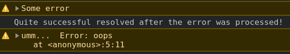

- [Promises](#promises)
- [Promise chaining](#promise-chaining)
	- [Common mistakes](#common-mistakes)
- [Error handling](#error-handling)
	- [Usual errors](#usual-errors)
	- [Async errors](#async-errors)

# Promises

Promise is a function that promises to deliver some result (successful or not) at some point in the future. 

`Executor` function is a functino that executes immediately after the `Promise` is created. It should contain **2 argumenta**: 

1. The function to be called to indicate success.
2. The function to be called to indicate failure.

At least one of them should be called inside the executor function to deliver the result further. Either result == `return`, the execution stops there.

```javascript
functioon executorFunctino(resolveCallback, rejectCallback){
	if(batman > superman){
		resolveCallback('some result')
	} else {
		rejectCallback(new Error('some error'))
	}
}

let promise = new Promise(executorFunction))	// a promise to deliver some result
```
***

There are 3 `Promise.prorotype` methods:

`Promise`|description
-|-
`.then(resCallback, rejCallback)`|Gets 1 or 2 args: resolveCallback and rejectCallback (optional), one of which will be called depending on what promise was returned on the previous step: resolved or rejected. Returns a `promise`. 
`.catch(rejCallback)`|Handles the promise rejected above. If an error is thrown or rejected promise is returned, returns **rejected promise**, otherwise - **resolved promise**.
`.finally()`|Executes in any case with no args - even after `return`. If nothing is returned explicitly, it passes the previous result through itself. If an error is thrown or rejected promise is returned, returns **rejected promise**. otherwise - **resolved promise.**

**All of them** return: 

Case|Will return
-|-
`throw new Error(result)`|`Promise.reject(result)`
already rejected promise(result)|`Promise.reject(result)`
already fulfilled promise(result)|`Promise.resolve(result)`
any value|`Promise.resolve(result)`
nothing|`Promise.resolve(undefined)` (if `finally` returns nothing, it just passes the previous result through)

If there's no fitting callback for the arrived `promise`, any of these functions pass the control further seeking for the proper handler.
***


# Promise chaining

We can call handlers (`.then`,`.catch`, `.finally`) one after another since they all return promises.

```javascript
new Promise(resolve => resolve('yes'))
.then(result => {
	console.log(result)				// yes
	return Promise.reject('no')
})
.catch(err => console.error(err))	// no
```
***

We can create our own custom object with `then` method and use it with promises' handlers.

```javascript
class Thenable {
	constructor(num){
		this.num = num
	}

	// our implementation resolves after a double timeout and returns the it
	then(resolve, reject){
		let double = this.num * 2

		setTimeout(() => {
			if(double > 5){
				console.error()
				reject(double)
			} else {
			    console.log(double)
				resolve(double)
			}
			
		}, double * 1000)
	}
}
 
new Promise(resolve => resolve(1))
.then(result => new Thenable(result))
// if the returned object has the `then` method, everything will work
.then(result => new Thenable(result))
.then(result => new Thenable(result))
.catch(err => console.error(err))
```
***


## Common mistakes

1. Forget to return a promise after some other actions during chaining.

```javascript
Promise.resolve('yes')
.then(result => console.log(result))		// yes
.then(result => console.log(result + '!'))	// undefined!

// the right way

Promise.resolve('yes')
.then(result => {
	console.log(result)						// yes
	return Promise.resolve(result)
})
.then(result => console.log(result + '!'))	// yes!
```

2. `new Promise()` instead of `return new Promise()` inside functions

```javascript
Promise.resolve('yes')
.then(result => {
	console.log(result)							// yes
	new Promise(resolve => {					// <----- here!
		setTimeout(() => resolve('yes'), 1000)
	})
})
.then(result => console.log(result + '!'))		// undefined!

// the right way

Promise.resolve('yes')
.then(result => {
	console.log(result)							// yes
	return new Promise(resolve => {				// <----- here!
		setTimeout(() => resolve('yes'), 1000)
	})
})
.then(result => console.log(result + '!'))		// yes! (in 1s)
```
***


# Error handling

## Usual errors

Synchronous errors can be processed. 

Errors in promises can be handled in two ways: 

1. The second handler in `.then(onresolved,` **`onrejected)`**
2. The `.catch()` method.

If there's an error or an exceptiion (no difference) anywhere upstream, it will be caught and processed by the first met handler. But there's a difference between the two:

```javascript
promise.then(f1).catch(f2)	// 1)

promise.then(f1, f2)		// 2)
```

1. If an error happens in f1, it will be caught and processed by `.catch`.
2. If an error happens in f1, it will **not** be caught because the two handlers are on the same level and only one of them will work. 

**NB:** As soon as the error/exception is handled, it is considered to be resolved. After this, `onresolved` handlers will work until the next error/exception.

***

Promise chaining works perfectly even after a mistake occured. If the mistake was processed by `.catch` or `.then`-s `onrejected` handler, the promise returned by this step will be resolved and the next `.then` will handle it with onResolved handler as if error never happened. 

```javascript
Promise.reject("Some error")
.catch(err => console.warn(err))
.then(() => {
    console.log('Successfully resolved after the error was processed!')
    throw new Error('oops')
    console.log('unreachable')  // will never be called because throwing new Error works like 'return' (immediate reject)
})
.catch(err => console.warn('umm... ', err))
```


***

The handler can be anywhere after the error, not exactly right after.

```javascript
Promise.reject('no')
.then(result => console.log('I will never work'))
.then(result => console.log('Me too :('))
.catch(err => console.log('And I will!'))	// And I will!
```
***

Another example:

```javascript
Promise.reject(new Error('handled'))
.then(res => { 			// won't run, no onrejected handler
	console.log(res)
	return 'nope' 
})
.then(res => { 			// the same
	console.log(res) 
	return 'still nope' 
})
.catch(err => { 		// the first met error handler
	console.log(err) 
	return 'resolved' 
})
.catch(err => { 		// won't run, the previous handler did all the job, now it's resolved
	console.log(err) 
	return 'nope'
})
.then(res => {			// the first met onresolved handler
	console.log(res)
})	
.finally(() => {		// works always
	console.log(`'Finally' works, no params`)
})
.finally(() => {		// works after the previous one
	console.log('Another finally')	
})
.then(() => { throw new Error('thrown') })
.then(
	res => res, 	// won't work
	err => {
		console.log(err.message)
		setTimeout(() => { throw new Error('newerr') }, 0)
	}
)
.catch(err => console.log("Will never run because only synchronous errors can be processed" ))	

/* Output: 
Error: handled
resolved
'Finally' works, no params
Another finally
thrown 
Uncaught Error: newerr */
```
***


## Async errors

`try..catch` and `.catch()` can only handle **synchronous** errors. Example:

```javascript
function thisThrows() {
    throw new Error("Thrown from thisThrows()");
}

try {
    thisThrows();
} catch (e) {
    console.warn(e);
} finally {
    console.log('We do cleanup here');
}
```


Works fine. Now let's make it **async**. 

```javascript
async function thisThrows() {
	// 1s delay is not even necessary, async function is async anyway and works after the sync code
	await new Promise(resolve => setTimeout(resolve, 1000))
    throw new Error("Thrown from thisThrows()");
}

try {
    thisThrows();
} catch (e) {
    console.warn(e);
} finally {
    console.log('We do cleanup here');
}
```


Didn't catch. As `thisThrows()` is **async** , so when we call it, it dispatches a promise, the code does not wait, so the finally block is executed first and then the promise executes, which then rejects. So we don’t have any code that handles this rejected promise.

To catch this async error, we should **wrap** our async function into another **async function** and `await` for the result, or add `.catch()` to the chain.

```javascript
async function thisThrows() {
	await new Promise(resolve => setTimeout(resolve, 1000))
    throw new Error("Thrown from thisThrows()");
}

const run = async () => {
	try {
		await thisThrows();
	} catch (e) {
		console.warn(e);
	} finally {
		console.log('We do cleanup here');
	}
}

run()
```

Or 

```javascript
async function thisThrows() {
	await new Promise(resolve => setTimeout(resolve, 1000))
    throw new Error("Thrown from thisThrows()");
}

thisThrows()
.catch(err => console.warn(err))
.finally(() => console.log('We do cleanup here'))
```


***

Now, a reminder about **scheduled function** (e.g. `setTimeout`). 

`try..catch` cannot catch errors in scheduled functions:

```javascript
new Promise(function (resolve, reject) {
		setTimeout(() => {
			throw new Error('Unexpected as diarrhea...')
		}, 1000);
	})
.catch(alert)
.finally(console.warn('Finally'))

// 'Finally'
// in 1 s:
// 'Uncaught Error'
```

The same as:

```javascript
try {
    new Promise(function (resolve, reject) {
		setTimeout(() => {
			throw new Error('Unexpected as diarrhea...')
		}, 1000);
	})
} catch (err) {
    console.warn('yo')
} finally {
	console.warn('Finally')
}

// 'Finally'
// in 1 s:
// 'Uncaught Error'
```

To catch errors inside the scheduled function, we should `try..catch` it **inside this function**, where the code behaves synchronously:

```javascript
new Promise(function (resolve, reject) {
	setTimeout(() => {
		try {		// <--- inside async code
			throw new Error('Unexpected as diarrhea...')
		} catch (err) {
			console.warn('Caught error')
		} finally {
			console.warn('Finally')
		}
	}, 1000)
})

// in 1 s:
// 'Caught error'
// 'Finally'
```

If we want to **fulfill** the promise and continue the chain, we can do it by `resolving` or `rejecting` the promise in the `catch` block:

```javascript
new Promise(function (resolve, reject) {
	setTimeout(() => {
		try {
			throw new Error('Unexpected as diarrhea...')
		} catch (err) {
			console.warn('Caught error')
			resolve('The app survived!')	// <--- resolve
		} finally {
			console.warn('Finally')
		}
	}, 1000)
})
.then(res => console.warn(res))

// in 1 s:
// 'Caught error'
// 'Finally'
// 'The app survived!'
```

Or just `reject` the error further to the outer `.catch()`.

```javascript
new Promise(function (resolve, reject) {
  setTimeout(() => {
    try {
        throw new Error('Unexpected as diarrhea...')
    } catch (err) {
        reject(err)			// <--- reject
    }
  }, 1000)
})
.catch(err => console.warn('Caught error'))
.finally(() => console.warn('Finally'))
.then(res => console.warn('The app survived!'))

// через 1 с:
// Caught error
// Finally
// The app survived!
```
***

The main conclusions are:
- `try..catch` for the usual sync errors
- `try..catch` and `.catch()` for promises
- `try..catch` **inside** the **scheduled** functions. 
- 
See `chapter 04` for more examples.