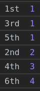

# Promise practice

- [Promise practice](#promise-practice)
  - [Scripts, delays, arrays](#scripts-delays-arrays)
    - [Execute a function after a delay.](#execute-a-function-after-a-delay)
    - [Consecutive execution of promises one after another.](#consecutive-execution-of-promises-one-after-another)
    - [Consecutive scripts loading](#consecutive-scripts-loading)
    - [Parallel scripts loading](#parallel-scripts-loading)
  - [The order of execution](#the-order-of-execution)
    - [Example 1](#example-1)
    - [Example 2](#example-2)
    - [Example 3](#example-3)
  - [Different scenarios](#different-scenarios)
    - [Resolve after resolve](#resolve-after-resolve)
    - [Reject after resolve](#reject-after-resolve)
    - [Resolve after reject](#resolve-after-reject)
    - [Reject after reject](#reject-after-reject)

## Scripts, delays, arrays

### Execute a function after a delay.

```javascript
function test(msg){
	return msg
}

/**
 * Executes the provided function after the provided delay. Basically async setTimeout that returns a promise.
 * 
 * @param {function}
 * @param {number}
 * @param {any}
 * @returns {Promise}
 */
function delay(func, ms, ...args) {
	return new Promise(resolve => {
		setTimeout(() => resolve(func(...args)), ms)
	}
}

const promise = delay(() => test('kuku'), 1000)
.then(result => console.log(result))		// kuku
.catch(err => console.error(err.message))
```
***


### Consecutive execution of promises one after another.

```javascript
const delays = [2000, 3000, 1000]

// Solution 1 - await for a delay and console.log

loopDelays(delays)

async function loopDelays(delays){
    for(const delay of delays){
        await new Promise(resolve => setTimeout(resolve, delay))
        
		console.log(delay)
    }
}


// // Solution 2 - chain of promises
// let chain = Promise.resolve()	// shart the chain
// delays.forEach(ms =>
// 	chain = chain	// chain each new promise to the one chain
// 	.then(() =>
// 		delay(() => console.log(ms), ms)
// 	)
// )


// // Solution 3 - delay function
// loopDelays(delays)

// async function loopDelays(delays){
//     for(const ms of delays){
//         await delay(
//             text => console.log(text), ms, ms)
//     }
// }

// function delay(fn, ms, ...args) {
// 	return new Promise((resolve, reject) => {
// 		setTimeout(() => {
//             resolve(fn(...args))
//         }, ms)
// 	})
// }
```
***


### Consecutive scripts loading

Load one script after another with a delay, then call their corresponding functions.

Everything should take 3 s (as the `loadScript` function has 1 s delay inside).

```javascript
const urls = ['https://learn.javascript.ru//article/promise-chaining/one.js', 'https://learn.javascript.ru//article/promise-chaining/two.js', 'https://learn.javascript.ru//article/promise-chaining/three.js']

// start a chain
let chain = Promise.resolve()

// append `.then()` to it in the loop
urls.forEach(url => 
    chain = chain.then(() => loadScript(url))
)

// add more handlers
chain
.then(() => {
    one()
    three()
    two()
})
.catch(err => console.warn(err))

function loadScript(src){
    return new Promise(async (resolve, reject) => {
        // to make delay obvious
        await new Promise(resolve => setTimeout(resolve, 1000))

        const script = document.createElement('script')
        document.head.append(script)
        script.src = src
        
        script.onload = () => resolve(script)
        script.onerror = () => reject(script)
    })
}


// Alternative solution via parsing the aquired text and assigning it to the script manually.

function loadScriptText(src){
	return new Promise((resolve, reject) => {
		fetch(src)
		.then(result => result.text())
		.then(parsed => {
			const script = document.createElement('script')
            document.head.append(script)
			script.textContent = parsed
			resolve(parsed)
		})
		.catch(err => console.warn(err))
	})
}
```
***


### Parallel scripts loading

Load scripts simultaniously and call the corresponding functions after that. 

Everything should take 1 s (the `loadScrpt` function has 1 s delay, but all the calls should start almost immediately and merge into 1 s).

```javascript
const urls = ['https://learn.javascript.ru//article/promise-chaining/one.js', 'https://learn.javascript.ru//article/promise-chaining/two.js', 'https://learn.javascript.ru//article/promise-chaining/three.js']

const promises = urls.map(src => loadScript(src))

Promise.all(promises)
.then(() => {
    one()
    three()
    two()
})
.catch(err => console.warn(err))

function loadScript(src){
    return new Promise(async (resolve, reject) => {
        // to make delay obvious
        await new Promise(resolve => setTimeout(resolve, 1000))

        const script = document.createElement('script')
        document.head.append(script)
        script.src = src
        
        script.onload = () => resolve(script)
        script.onerror = () => reject(script)
    })
}
```

`urls.map` instantly loops through the array of urls and returns an array of promises. And we remember that *executor functions* inside promises execute immediately after creation. So, all three begin to execute simultaniously. 
***


## The order of execution

### Example 1

What will be printed to the console? 

```javascript
Promise.resolve('foo')
.then(result => new Promise(resolve => 
        setTimeout(() => resolve(result += 'bar'), 1000)
    )
)
.then(result => {
    setTimeout(() => {
        result += 'baz'
        console.log('1st log ', result)
    }, 400)
    return result    
})
.then(result => {
    setTimeout(() => {
        result += 'alex'
        console.log('2nd log ', result)
    }, 200)
    return result
})
.then(result => {
    console.log('3rd log ', result)
}).catch(err => console.errror(err))
```


1. The 1st `.then` returns a `new Promise`. All the subsequent `.then` wait for it to resolve or reject. After 1 s it gets resolved with `foobar`.
2. The 2nd `.then` sets the `Timeout` but doesn't wait for it (as there is no Promise here). Returns `foobar` without changes and finishes.
3. The 3rd `.then` does the same.
4. The 4th `.then` logs immediately `foobar`.
5. After 200 ms the callback of the 3rd `.then` fires and logs to the console `foobar` + `alex` = `foobaralex`
6. After another 200 ms the callback of the 2nd `.then` fires and logs to the console `foobar` + `baz` = `foobarbaz`
***


### Example 2

Parallel then-s.

```javascript
const p = Promise.resolve(1)

p.then(value => {
    console.log('1st ', value);
    return value + 1;
}).then(value => {
    console.log('2nd ', value);
})

p.then(value => {
    console.log('3rd ', value);
    return value + 2
}).then(value => {
    console.log('4th ', value)
})

p.then(value => {
    console.log('5th ', value)
    return value + 3
}).then(value => {
    console.log('6th ', value)
}).catch(err => console.errror(err))
```



3 **synchronous** handlers (not chained to one another!) runs immediately one after another. Their corresponding **asyncchronous**`.then`-s are put into the queue one after another and get performed later. 
***


### Example 3

What will be printed to the console? 

```javascript
function resolveLater(res) {
	console.log('Resolve executor!')
    setTimeout(function () {
		res(true)
    }, 1000)
}

function rejectLater(res = null, rej) {
	console.log('Reject executor!')
    setTimeout(function () {
        rej(new Error('Error'))
    }, 1000)
}

const p1 = Promise.resolve('foo')
const p2 = p1.then(function () {
    // Return promise that will be resolved to `true` in 1 s
    return new Promise(resolveLater)
})
p2.then(function (v) {
    console.log('resolved', v)		// "resolved", true
}).catch(err => console.warn(err))

const p3 = p1.then(function () {
    // Return promise that will be rejected with 'Error' in 1 s
    return new Promise(rejectLater)
})
p3.then(function (v) {	// will not be called
    console.log('resolved', v)
}).catch(err => console.warn(err))	// "rejected", 'Error'
```


1. p1 resolves with `foo`.
2. In p2 `.then` returns a promise with the executor function `resolveLater` (which begins to execute immediately setting the timeout). 
3. The same happens in p3.
4. In 1 s both timers are done, the promises get resolved and the output is logged to the console.
5. We catch rejected promises.

**NB**: The only thing defining what function is `resolve` and what is `reject` handler is their order in the executor function (as parameters): `onresolved` is always the 1st, `onrejected` is always the 2nd. The promise will just consider the output of the 1st one to be the resolvement and the 2sn one - rejection (thrown errors are always rejections!).
***


## Different scenarios

We want to output the result to the console despite any possible errors.


### Resolve after resolve

```javascript
const original = Promise.resolve(33)
const cast = Promise.resolve(original)
.then(res => console.log(res))          // 33
```


### Reject after resolve

```javascript
const original = Promise.resolve(33)
const cast = Promise.reject(original)
.catch(err => {
	console.error('ERROR! ', err)       // ERROR!  Promise <resolved>: 33
	return err
})
.then(res => console.log(res))          // 33
```


### Resolve after reject

```javascript
const original = Promise.reject(33)
const cast = Promise.resolve(original)
.catch(err => {
	console.error('ERROR! ', err)       // ERROR!  33
	return err
})
.then(res => console.log(res))          // 33
```


### Reject after reject

```javascript
const original = Promise.reject(33)
const cast = Promise.reject(original)
.catch(err => {
	console.error('ERROR! ', err)       // ERROR!  Promise {<rejected>: 33}
	return err
})
.catch(err => console.log(err))         // 33
```
