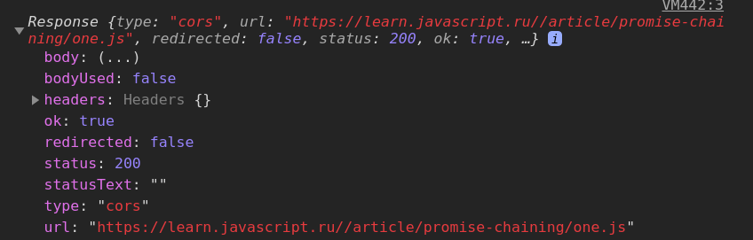
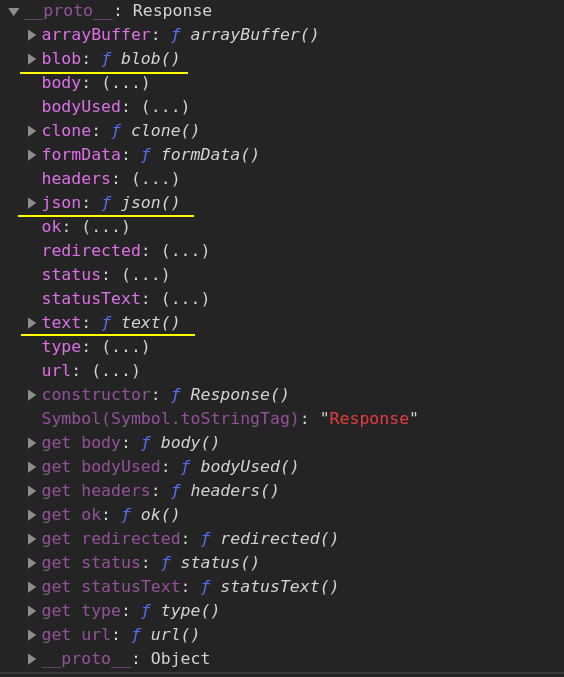
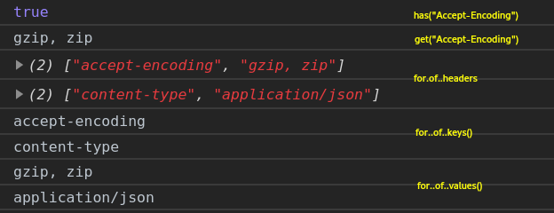

- [Fetch](#fetch)
	- [Intro](#intro)
		- [Task: Simple function to post data and process the response](#task-simple-function-to-post-data-and-process-the-response)
	- [Request](#request)
	- [Response](#response)
		- [Properties](#properties)
		- [Methods](#methods)
	- [Headers](#headers)
		- [Methods](#methods-1)
		- [Task: Get data about github users](#task-get-data-about-github-users)
	- [FormData](#formdata)

# Fetch

## Intro

`Fetch` interface is used to make network queries. It returns a `promise` that get fulfilled to the `Response` object when the **headers** are received. 

To read the `Response`, you should parse it with 
`response.text()` (plain text), 
`response.json()` (js object), 
`response.blob()` (a picture), etc. 
These methods return a `promise` that gets fulfilled when the **full response** is received.

```javascript
const promise = fetch('https://learn.javascript.ru//article/promise-chaining/one.js')	// returns a promise that will be resolved after the headers are received
.then(response => {	// Response object received, now we need to extract data from it
	console.log(response)	// Response object
	if(response.ok){		// response.status === 200
		return response.text()
	} 
	throw new Error('Not OK!')
})	
.then(parsed => {	// 'function one(){...}'
	parsed = parsed.substring(parsed.indexOf('{') + 1, parsed.lastIndexOf('}'))	// remove 'function one(){' and '}' leaving only the insides
	parsed = parsed.trim()	// remove whitespaces
	const one = new Function(parsed)
	one()
})
.catch(err => console.warn(err))
```

So, what happens here:

1. -> Request to the server. 
2. <- Return a `promise` to deliver **headers**.
3. -> Headers are received, the first promise gets resolved.
4. <- Return a `promise` to deliver **body**.
5. -> Full response is received and parsed, the second promise gets resolved.
6. Process the result. 
***

More complex request with a lot of options: 

```javascript
let promise = fetch(url, {
	method: "GET", // POST, PUT, DELETE, etc.
	headers: {
		// the content type header value is usually auto-set
		// depending on the request body
		"Content-Type": "text/plain;charset=UTF-8"
	},
	body: undefined // string, FormData, Blob, BufferSource, or URLSearchParams
	referrer: "about:client", // or "" to send no Referer header,
	// or an url from the current origin ('https://client.com/another-page')
	referrerPolicy: "no-referrer-when-downgrade", // no-referrer, origin, same-origin...
	mode: "cors", // same-origin, no-cors
	credentials: "same-origin", // omit, include
	cache: "default", // no-store, reload, no-cache, force-cache, or only-if-cached
	redirect: "follow", // manual, error
	integrity: "", // a hash, like "sha256-abcdef1234567890"
	keepalive: false, // true
	signal: undefined, // AbortController to abort request
	window: window // null
});
```
***


### Task: Simple function to post data and process the response 

```javascript
async function postData(url = '', data = {}) {
	// Default options are marked with *
	const response = await fetch(url, {
		method: 'POST', // *GET, POST, PUT, DELETE, etc.
		mode: 'cors', // no-cors, *cors, same-origin
		cache: 'no-cache', // *default, no-cache, reload, force-cache, only-if-cached
		credentials: 'same-origin', // include, *same-origin, omit
		headers: {
			'Content-Type': 'application/json'
			// 'Content-Type': 'application/x-www-form-urlencoded',
		},
		redirect: 'follow', // manual, *follow, error
		referrerPolicy: 'no-referrer', // no-referrer, *client
		body: JSON.stringify(data) // body data type must match "Content-Type" header
	});
	return await response.json() // parses JSON response into native JavaScript objects
}

postData('https://example.com/answer', { answer: 42 })
.then(data => console.log(data)) // JSON data parsed by `response.json()` call
```
***

To send data with request we use `POST` and `body` property along with `JSON.stringify` (we could also use `blob` of `FormData` object). Not how we set `Content-Type` header to `application/json` from the default `text/plain`.

```javascript
let user = {
	name: 'John',
	surname: 'Smith'
};

let response = await fetch('/article/fetch/post/user', {
	method: 'POST',
	headers: {
		'Content-Type': 'application/json;charset=utf-8'
	},
	body: JSON.stringify(user)
});

let result = await response.json();
alert(result.message);
```
***


## Request

We can pass `Request` object to the `fetch` instead of url.

```javascript
let data = {
	name: 'Max',
	age: 20
}

// optional parameter object
const init = {
	method: "POST",				// default is GET
	// headers, 				// Headers object
	body: JSON.stringify(data)					
	mode: "cors",				// access mode
	credentials: "same-origin"	
}	// and other fields

const request = new Request('https://api.github.com/users/', init)

const respone = await fetch(request)
```
***


## Response

`Response` object is returned by `fetch`. It has many useful properties and methods.


### Properties




### Methods

The main methods to parse the body of the response are marked in yellow. 


***


## Headers

We can pass `Headers` object to the `Request` constructor.

```javascript
const headers = new Headers(init)	// iterable object, can accept an object containing http-headers as a key-value pairs as a parameter

fetch(headers)
```


### Methods

```javascript
const headers = new Headers()

// append() adds a new key-value pair. If the specified header already exists, append() will change its value to the specified value. If the specified header already exists and accepts multiple values, append() will append the new value to the end of the value set.
headers.append("Content-Type", 'application/json') 
headers.append("Accept-Encoding", 'gzip') 
headers.append("Accept-Encoding", 'zip') 

// Returns a boolean
console.log(headers.has("Accept-Encoding"))	// true

// Returns a string containing values by the key, separated by comma and space
console.log(headers.get("Accept-Encoding"))	// "gzip, zip"

// The headers object is iterable and can be loop over
for(const key of headers) console.log(key)	// the same as headers.entries()
for(const key of headers.keys()) console.log(key)
for(const value of headers.values()) console.log(value)

// set() adds and new key-value pair if none exist, or hard-override the existing values
headers.set("Accept-encoding", 'gzip')	// 'zip' is now gone!

// delete() delets a key and its corresponding values
headers.delete("Accept-endocing")	// null
```

***


### Task: Get data about github users

Return `null` if the user doesn't exist. Promises shouldn't wait for each other but execute as fast as possible.

https://learn.javascript.ru/fetch#poluchite-dannye-o-polzovatelyah-github

```javascript
const users = ['mkbaranovskyi', 'kravich13', 'lkjcxvgiuewrtlj']

async function getUsers(names) {
	return Promise.all(names.map(async name => {
		await new Promise(resolve => setTimeout(resolve, 1000))

		try {
			const response = await fetch(`https://api.github.com/users/${name}`)

			if (response.ok) {
				return response.json()
			}
			return null

		} catch (err) {
			console.warn(err)
		}
	}))
}

getUsers(users)
.then(result => console.log(result))
```
***


## FormData

We can send the data from a form with our `Request` directly. It will be encoded automatically and has the header `Content-Type: form/multipart`. FormData is an iterable object and can be looped over (just as `Map` object).

```html
<form id="formElem">
  <input type="text" name="name" value="John">
  <input type="text" name="surname" value="Smith">
  <input type="submit">
</form>
```
```javascript
formElem.onsubmit = async event => {
	event.preventDefault()

	const response = await fetch('https://server.com', {
		method: POST,
		body: new FormData(formElem)
	})
	const result = await response.json()

	console.log(result)
}
```

We can change the data in `FormData` object using built-in methods.

1. `formData.append(name, value)` - add a field with the name `name` and the value `value` to the formdata.
2. `formData.append(name, blob, fileName)` - add a file like it was loaded via `<input type="file">`, the last argument is the name the file will be saved upon. 
3. `formData.set(...)` - the same as `append`, except it removes all the previous values with that name. 
4. `formData.delete(name)`
5. `formData.get(name)`
6. `fofmData.has(name)`
***

`form/multipart`encoding also allows to send files with no problem. E.g. we want to let user to upload images only:

```html
<form id="formElem">
	<input type="text" name="firstName" value="John">
	<label>Picture: <input type="file" name="picture" accept="image/*"></label>
	<input type="submit">
</form>
```

```javascript
formElem.onsubmit = async event => {
	event.prevendDefault()

	const response = await fetch('htts://server.com', {
		method: POST,
		body: new FormData(formElem)
	})

	const result = await response.json()

	console.log(result)
}
```
***

We can upload a `blob` created from `canvas` for example. This is done exactly as if file was uploaded.

```html
<canvas id="canvasElem" width="100" height="80" style="border:1px solid"></canvas>

<input type="button" value="Submit" onclick="submit()">
```
```javascript
canvasElem.onmousemove = function (e) {
	let ctx = canvasElem.getContext('2d')
	ctx.lineTo(e.clientX, e.clientY)
	ctx.stroke()
};

async function submit() {
	let imageBlob = await new Promise(resolve => canvasElem.toBlob(resolve, 'image/png'))

	let formData = new FormData()
	formData.append("firstName", "John")
	formData.append("image", imageBlob, "image.png")

	let response = await fetch('https://javascript.info/article/formdata/post/image-form', {
		method: 'POST',
		body: formData
	})
	let result = await response.json()
	alert(result.message)
}
```