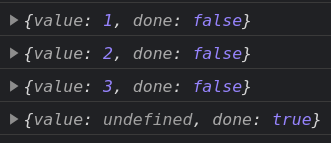
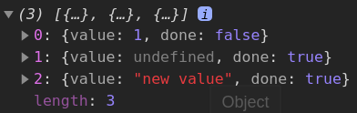

# Iterators and Generators
- [Iterators and Generators](#iterators-and-generators)
	- [Iterators](#iterators)
		- [Basics](#basics)
		- [In classes](#in-classes)
		- [Iterables and Array-likes](#iterables-and-array-likes)
	- [Generators](#generators)
		- [Intro](#intro)
		- [`next`](#next)
		- [`throw`](#throw)
		- [Looping over generators](#looping-over-generators)
		- [Implementation](#implementation)
		- [In classes](#in-classes-1)
		- [Combinators](#combinators)
			- [Task: take first n elements of an iterator](#task-take-first-n-elements-of-an-iterator)
			- [Task: looped library](#task-looped-library)
		- [Generator composition](#generator-composition)
			- [Task: an array of `/\w/` symbols](#task-an-array-of-w-symbols)
			- [Task: seeded pseudo-generator](#task-seeded-pseudo-generator)
	- [Async iterators and generators](#async-iterators-and-generators)
		- [Async iterators](#async-iterators)
			- [Task: iterator ticks one per second](#task-iterator-ticks-one-per-second)
		- [Async Generators](#async-generators)
		- [Iterables using generators](#iterables-using-generators)
			- [Task: Iterator example -> Generator solution:](#task-iterator-example---generator-solution)
			- [Task: Async iterator example -> Async Generator solution](#task-async-iterator-example---async-generator-solution)
			- [Task: Class example -> Async Generator solution](#task-class-example---async-generator-solution)


## Iterators

### Basics

To understand the iterators, we can create one. 

```javascript
const range = {
	from: 1,
	to: 5
}
```

**To make it iterable, we should add the `[Symbol.iterator]()` method to the object**. When `for..of` / `...` is performed upon the object, it calls this method once (with no arguments). 

`[Symbol.iterator]()` should return an **object with the `next()` method**. Then `for..of` or `...` only works with this returned object. When it wants to get the next value, it calls `next()`. The result should be another object: `{ done: Boolean, value: any }`. 

If an object with `{ done: true }` was returned, its value will be ignored.

```javascript
const range = {
  from: 1,
  to: 5,
  
  [Symbol.iterator]() {
    return {
      current: this.from,
      last: this.to,
      
      next() {
        if (this.current > this.last) {
          return { done: true }
        }
        return {
          done: false,
          value: this.current++
        }
      }
    }
  }
}

console.log(range)

// 1. Iteration using `...`
console.log([...range])

// 2. Iteration using a loop
for (const value of range) {
  console.log(value)
```

Again, all the key points: 

1. `for..of` / `...` calls `[Symbol.iterator]()` from the given object.
2. It returns an iterator with `next()` implemented.
3. `next()` should return an object with `done` and `value` fields.
4. `next()` is called on every iteration. The iteration stops when it returns `{ done: true }`.

***

Let's call an iterator manually (for a string) to understand better how it works. 

```javascript
const str = 'Hello'

// When we so this

for(const value of str){
  console.log(value)
}

// ... actually happens something like this

const iterator = str[Symbol.iterator]()
console.log(iterator)	// String Iterator {}

while(true){
	const result = iterator.next()	// { done: ... , value: ... }
	if(result.done) break
	console.log(result.value)				// H, e, l, l, o
}
```

***

### In classes

We can also define `[Symbol.iterator]` for classes to make their instances iterable.

```javascript
class Iter {
  constructor({ start, end, step = 1 }){
    this.start = start
    this.end = end
    this.step = step
  }
  
  [Symbol.iterator]() {		// [Symbol.iterator]: function()
    let current = this.start
    const end = this.end
    const step = this.step
    
    return {      
      next(){
        if(current > end){
          return { done : true }
        }
        
        const result = { done: false, value: current }
        current += step
        return result
      }
    }
  }
}

const iter = new Iter({ start: 3, end: 10, step: 2 })

console.log([...iter])	// [3, 5, 7, 9]
```

***

### Iterables and Array-likes

There's a difference:

1. Array-like objects contain the `length` property and indexed properties (`0: ... , 1: ... `).
2. Iterables have the `[Symbol.iterator]` method implemented. 

To create array from iterable object, we can use `[...obj]`. 

To create array from both iterables and array-likes, we should use `Array.from(obj)`.

***

## Generators

### Intro

Generator is a special `function *` capable of producing not a single value but a stream of values. 

First, Generator Function returns a Generator Object (**iterator**). Then we only interact with this object. 

When the `next()` method is called, the Generator Function is executed until `yield` is met, then its value is returned and the function execution stops until the next step is performed. 

Unlike iterators, Generators can keep using `next()` even after they have reached `done: true`. The output values will be `{ done: true, value: undefined } ` - or even with some custom value if `return(value)` is used (see below). So you should check for `done` to know when to stop asking for new values.

If Generator is closed, it cannot be reopened.

***

There're 3 methods in the Generator Object.

Method|Description
-|-
`next(arg)`|Execute code up to the next `yield` or `return`. Return an object with the result: `{ done: ... , value: ... }`. You can use the argument to pass some data inside the generator function during its execution (see below).
`return(arg)`|Returns `{ done: true, value: arg }` and closes the Generator Object. 
`throw(err)`|Throw an error into the generator. If there is no eternal loop with `yield`, then the generator will be `<closed>`.

***

```js
function* generateSequence() {
	yield 1
	yield 2
	yield 3
}

const gen = generateSequence()

console.log(gen.next())
console.log(gen.next())
console.log(gen.next())
console.log(gen.next())
```



`return` will return the passed value in any case.

```javascript
// Generator Function
function* generateSequence() {
	yield 1
	yield 2
	return 3

	yield 4 	// Unreachable after `return`
}

// Generator Object
const gen = generateSequence()

const arr = []

arr.push(gen.next())
arr.push(gen.return())
arr.push(gen.return('new value'))

console.log(arr)
```



We can use a loop to gather all values. 

```javascript
// Generator Function
function* generateSequence() {
	yield 1
	yield 2
	return 3

	yield 4		// Unreachable after `return`
}

// Generator Object
const gen = generateSequence()

const arr = []

while(true){
	const result = gen.next()
	arr.push(result.value)
	// If we didn't have `return` but only `yield`, we should have switched places the lines above and below
  if(result.done) break
} 

console.log(arr)	// [1, 2, 3]
```


***

### `next`

We can pass an argument to `next(arg)` - it will be returned by the `yield` statement **inside the Generator Function**. 

Again, the argument will **not be yielded outside** but it will be **inserted** into the function.

The 1st call to `next` can't pass an argument inside the function - it's ignored.

```js
function* gen() {
  while (true) {
    console.log(yield null)
  }
}

const g = gen()

console.log(g.next('one')) 		// `{ value: null, done: false }`
// Should be `one` but no
console.log(g.next('two')) 		// `two`
															// `{ value: null, done: false }`
console.log(g.next('three'))	// `three`
															// `{ value: null, done: false }`
```

Another example: 


***

### `throw`

```js
function * generate() {
	try {
		yield 'ku'
	} catch (err) {
		console.log(err)	// Error: inner handler
	}
}

const gen = generate()

gen.next().value
// The execution continues from `yield` - we're still inside `try`
gen.throw(new Error('inner handler'))
```

***

### Looping over generators

We can use `for..of` or `...` to get the **parsed** yielded values.

```js
function* generateSequence() {
	yield 1
	yield 2
  yield 3
}

const gen = generateSequence()

// 1. Iteration using `...`
console.log([...generateSequence()])	// 1, 2, 3

// 2. Iteration using a loop
for(const value of gen){
	console.log(value)	// 1, 2, 3
}
```

You can see that we don't need to worry about accessing `.value` property - it's done for us.

***

Though, this doesn't work as expected if `return` is present.

```js
function* generateSequence() {
	yield 1
	yield 2
  yield 3
  return 4
}

const gen = generateSequence()

// 1. Iteration using `...`
console.log([...generateSequence()])	// still 1, 2, 3

// 2. Iteration using a loop
for(const value of gen){
	console.log(value)	// still 1, 2, 3
}
```

This is because `for..of` ignores values with `done: true`. So if you want to get the `return` value as well, you'll have to the "classic" `next` way from above. Or just don't use `return` for good.

***

### Implementation

To implement generator functionality, add `*[Symbol.iterator]()` method to your object. Remember that Generator Objects are natural iterators.

```js
const range = {
  from: 1,
  to: 5,

  *[Symbol.iterator]() { // [Symbol.iterator]: function*()
    for(let i = this.from; i <= this.to; i++){
      yield i
    }
  }
}

// 1. Iteration using `...`
console.log([...range])	// [1, 2, 3, 4, 5]

// 2. Iteration using a loop
for (const value of range) {
  console.log(value)		// 1, 2, 3, 4, 5
}
```

***

### In classes

```js
class Iter {
  constructor({ start, end, step = 1 }){
    this.start = start
    this.end = end
    this.step = step
  }
  
  *[Symbol.iterator]() {		// [Symbol.iterator]: function()
    for(let i = this.start; i <= this.end; i += this.step){
      yield i
    }
  }
}

const iter = new Iter({ start: 3, end: 10, step: 2 })

console.log([...iter])	// [3, 5, 7, 9]
```

***

### Combinators

Combinators are functions that combine existing iterators to create new ones.

#### Task: take first n elements of an iterator

```js
// We would get into the infinite loop if we tried to loop over this generator without restrictions
function* endlessNumbers(start = 1) {
	let i = start

	while (true) {
		yield i++
	}
}

function* takeFirstValues(n, gen){
  let i = 0
  for(const value of gen){
    if(i < n){
      yield value
      i++
    } else {
      break
    }
  }
}

for(const value of takeFirstValues(5, endlessNumbers())){
  console.log(value)
}

// Also works for regular iterators
console.log([...takeFirstValues(2, [4,5,6])])	// [4, 5]
```

Why don't we use `next` like this?

```js
for(let i = 0; i < n; i++){
	yield iter.next().value
}
```

Because it works for generators and iterators that have `next` but doesn't work for iterable objects (like Arrays). The solution with `for..of` is more universal.

#### Task: looped library

Cycle the given iterable endlessly to get the stream of repeating values.

```js
function* endlessNumbers(start = 1) {
	let i = start

	while (true) {
		yield i++
	}
}

function* takeFirstValues(n, gen){
  let i = 0
  for(const value of gen){
    if(i < n){
      yield value
      i++
    } else {
      return
    }
  }
}

function* loopEndlessly(iter){
  // See the note below for why this array is needed
  const arr = [...iter]
  
  while(true){
    for(const value of arr){
      yield value
    }
  }
}

for(const value of takeFirstValues(10, loopEndlessly(takeFirstValues(3, endlessNumbers(1))))){
  console.log(value)
}

// for(const value of takeFirstValues(10, loopEndlessly([1,2,3]))){
//   console.log(value)
// }
```

**Note**: Why do we need an array in `loopEndlessly`? It's because we can only iterate over the iterator **once** - after that it's getting closed and **cannot be reopened**. So our external code expects 10 values from our `loopEndlessly` but the iterator it gets as an argument only returns 3, after which it closes forever. So `while` loops endlessly while `for..of` can't produce the last 7 values. That's why we need to move our values from the "one-time" iterator into an array - because array **can** be iterated over many times.

***

### Generator composition

We can embed generators into each other. We use `yield* gen` for this.

#### Task: an array of `/\w/` symbols

We want to gather digits and English letters into an array. We can solve this by gathering their **number codes** and then calling `String.fromCharCode(code)` on each of that nuumbers. 

Codes:

- digits: 48-57
- uppercase letters: 65-90
- lowercase letters: 97-122

To demonstrate the generator composition, we would make our global working generator `yield` results of another generator.

```js
function* generateNumbers(start, end){
	for(let i = start; i <= end; i++){
		yield i
	}
}

function* generatePasswordCodes(){
	yield* generateNumbers(48, 57)
	yield* generateNumbers(65, 90)
	yield* generateNumbers(97, 122)
}

const getSymbols = arr => arr.map(code => String.fromCharCode(code))

console.log(getSymbols([...generatePasswordCodes()]))	// Array (62) ["0", ... , "z"]
```

Using `yield*` is done naturally and **does not consume** any additional memory. It's **the full equivalent** of including the `generateSequence()`-s inner code directly into `generatePasswordCodes()` like this:

```js
function* generatePasswordCodes(){
	for(let i = 48; i <= 57; i++){
		yield i
	}
  for(let i = 65; i <= 90; i++){
		yield i
	}
	for(let i = 97; i <= 122; i++){
		yield i
  }
}

const getSymbols = arr => arr.map(code => String.fromCharCode(code))

console.log(getSymbols([...generatePasswordCodes()]))	// Array (62) ["0", ... , "z"]
```

Just for reference, a non-generator solution:

```js
function generateSequence(start, end){
	const arr = []
	for(let i = start; i <= end; i++){
		 arr.push(i)
	}
	return arr
}

function generatePasswordCodes(){
	const arr = []
	arr.push(...generateSequence(48, 57))
  arr.push(...generateSequence(65, 90))
  arr.push(...generateSequence(97, 122))
	return arr
}

const getSymbols = arr => arr.map(code => String.fromCharCode(code))

console.log(getSymbols(generatePasswordCodes()))	// Array (62) ["0", ... , "z"]
```

***

#### Task: seeded pseudo-generator

1. [Task](https://learn.javascript.ru/generators#psevdosluchaynyy-generator)

Formula: `next = previous * 16807 % 2147483647`

```js
function* pseudoRandom(seed){
	let previous = seed
	while(true){
		previous = previous * 16807 % 2147483647
		yield previous
	}
}

const gen1 = pseudoRandom(1)

console.log(gen1.next().value)	// 16807
console.log(gen1.next().value)	// 282475249
console.log(gen1.next().value)	// 1622650073

const gen27 = pseudoRandom(27)

console.log(gen27.next().value)	// 453789
console.log(gen27.next().value)	// 1184380782
console.log(gen27.next().value)	// 861879031
```

A non-generator solution would be exactly the same, just without asterisk `*`.

***


## Async iterators and generators

### Async iterators

Returns an object with `next()` as usual. The differences with common iterators are:

1. `[Symbol.asyncIterator]()` is used instead of `[Symbol.iterator]()`.
2. `next()` should return a **Promise**.
3. `for await` is used to loop over this iterable.

#### Task: iterator ticks one per second

```js
const range = {
  from: 1,
  to: 5,
  
  [Symbol.asyncIterator](){
    return {
      current: this.from,
      last: this.to,
      async next(){
        await new Promise(resolve => setTimeout(resolve, 1000))
        
        if(this.current > this.last){
          return { done: true }
        } else {
          return { done: false, value: this.current++ }
        }
      }
    }
  }
};	// semicolon!

(async () => {
  for await(const value of range){
    console.log(value)
  }
})();
```

**NB**: `...` operator doesn't work asynchronously as it expects `Symbol.iterator`, not `Symbol.asyncIterator`.

***

### Async Generators

We use them if we need generators that can `await` for some async actions.

```javascript
async function* generateNumbers(start, end){
	for(let i = start; i <= end; i++){
		await new Promise(resolve => setTimeout(resolve, 1000))
		yield i
	}
};

// Option 1: for..await
(async () => {	
	for await(const value of generateNumbers(1, 5)){
		console.log(value)
	}
})();

// Option 2: without `for..await`
// (async () => {
// 	const gen = generateNumbers(1, 5)
	
// 	while (true) {
// 		const result = await gen.next()
// 		if (result.done) return
// 		console.log(result.value)
// 	}
// })();
```

***

### Iterables using generators

To make an object iterable, we add `[Symbol.iterator]()` or `[Symbol.asyncIterator]()`. 

A common practice for this method is to return a **Generator** Object rather than just a plain object with `next()` implemented.

We can rewrite our previous tasks using generators.

#### Task: Iterator example -> Generator solution:

```js
const range = {
  from: 1,
  to: 5,

  *[Symbol.iterator]() {	// [Symbol.iterator]: function*()
    for (let i = this.from; i <= this.to; i++) {
      yield i
    }
  }
};	// semicolon!

for (const value of range) {
  console.log(value)
}
```

#### Task: Async iterator example -> Async Generator solution

```js
const range = {
  from: 1,
  to: 5,
  
  async *[Symbol.asyncIterator](){	// [Symbol.asyncIterator]: async function*()
    for(let i = this.from; i <= this.to; i++){
      await new Promise(resolve => setTimeout(resolve, 1000))
      yield i
    }
  }
};	// semicolon!

(async () => {
  for await(const value of range){
    console.log(value)
  }
})();
```

#### Task: Class example -> Async Generator solution

```js
class Iter {
  constructor({ start, end, step = 1, ms = 1000 }){
    this.start = start
    this.end = end
    this.step = step
    this.ms = ms
  }
  
  async *[Symbol.asyncIterator]() {
    for(let i = this.start; i <= this.end; i += this.step){
      await new Promise(resolve => setTimeout(resolve, this.ms))
      yield i
    }
  }
}

const iter = new Iter({ start: 3, end: 10, step: 2, ms: 1500 });

(async () => {
  for await(const value of iter){
    console.log(value)
  }
})();
```