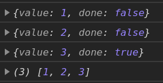
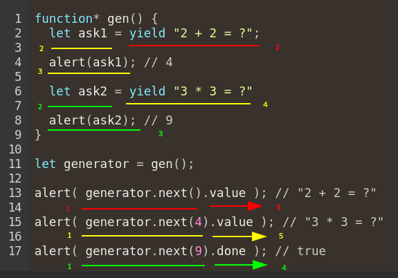

- [Generators](#generators)
	- [Intro](#intro)
	- [Next](#next)
	- [Throw](#throw)
	- [Looping over generators](#looping-over-generators)
	- [Iterable objects using generators](#iterable-objects-using-generators)
	- [In classes](#in-classes)

# Generators

## Intro

Generator is a `function*` that returns not a single value but a stream of values. 

First, we create a Generator Object (iterable) from the Generator Function. Then we work with this instance only. 

When the`next()` method is called, the function is executed until `yield` is met, then its value is returned and the function execution stops until the next step is performed. 

If the generator is closed, it cannot be reopened!

Generator-objects have 3 methods:

method|description
-|-
`next(val)`|Execute code up to the next `yield` or `return`. Return an object with the result: `{done: ... , value: ... }`. If the argument is passed, it will be used as the returned value of the `yield` inside the function (not outside!). 
`return(val)`|Finish the generator, use the provided argument (or `undefined`) as the resulting value in the returned object.
`throw(err)`|Throw an error into the generator, if `catch` is present, it will execute. If there is no eternal loop with `yield`, then the generator will be `<closed>`.
***

```javascript
function* generateSequence() { // generator-function
	yield 1
	yield 2
	return 3
	yield 4 	// will never be called
}

let gen = generateSequence()	// generator-object

let arr = []

arr.push(gen.next())
arr.push(gen.return())
arr.push(gen.return('new value'))

console.log(arr)
```


If we wanted to get all the values (including the one from `return`), we could use a loop.

```javascript
function* generateSequence() { // generator-function
	yield 1
	yield 2
	return 3
	yield 4 	// will never be called
}

let gen = generateSequence()	// generator-object (iterable!)

let arr = []
let result = {done: false}	// initialize with `false` for the first step (or we could use `do`)

while(!result.done){
	result = gen.next()
	console.log(result)
	arr.push(result.value)
} 

console.log(arr)	// [1, 2, 3]
```



***

## Next

If the value is passed to `next()`, it will be returned by the `yield` expression inside the function. The value returned by `yield` itself (outside of the function) will not change! The first time `next()` is always called without parameters. 

```javascript
function* gen() {
	while (true) {
		let value = yield null
		console.log(value)
	}
}

let g = gen()
console.log(g.next(1))	// "{ value: null, done: false }"
console.log(g.next(2))	// 2
						// "{ value: null, done: false }"
```

Again: the execution order is as follows:

1. `g.next(1)` => `let value` is declared and `null` is yielded from the function.
2. `g.next(2)` => `yield` returns `2` from the parameter to `value`. Then `console.log(value)` is executed, logging `2` to the console. Then the executions continues to the next `yield` which will again yield `null`.

Another example: 


***


## Throw

If the innver handler is present, it will be called. 

```javascript
function* generate() {
	try {
		let result = yield "2 + 2 = ?"
	} catch (err) {
		console.log(err)	// Error: Main handler
	}
}

let generator = generate()
let question = generator.next().value
// now execution will continue from `yield` - insile the `try` block
generator.throw(new Error("Main handler"))
```

If no inner handler is present - than the outer one. 

```javascript
function* generate() {
	let result = yield "2 + 2 = ?"
}

let generator = generate()
let question = generator.next().value

try {
	generator.throw(new Error("Main handler"))
} catch (e) {
	console.log("Fallback handler") // Will not be called since the inner handler did the job
}
```

If none of them - uncaught error.
***


## Looping over generators

As generators are iterable objects, we can use `for..of` or `...` to get the parsed yielded values (not objects but the values ready to be used).

```javascript
function* generateSequence() {
	yield 1
	yield 2
}

let gen = generateSequence()

for(const val of gen){
	console.log(val)	// 1, 2
}

let arr = [...generateSequence()]	// 1, 2
```

Though, this doesn't work as expected if `return` is present.

```javascript
function* generateSequence() {
	yield 1
	return 2
}

let gen = generateSequence()
for(const val of gen){
	console.log(val)	// 1
}

let arr = [...generateSequence()]	// 1
```

`for..of` ignores the values that internally return `{done: true}`, so if we are going to loop over them, we should only use `yield` (or use a regular loop to iterate over gen-object manually).
***


## Iterable objects using generators

We can re-write the [iterators task](../07.iterators.md#iterators) using generators. Remember: generator-objects are natural iterators. And what we `yield` will be returned as `value`.

```javascript
let range = {
	from: 1,
	to: 5,

	*[Symbol.iterator](){	// [Symbol.iterator]: function*()
		for(let val = this.from; val <= this.to; val++){
			yield val
		}
	}
}

console.log( [...range] )		// [1, 2, 3, 4, 5]
console.log(Array.from(range))	// [1, 2, 3, 4, 5]
for(const val of range){
	console.log(val)			// 1, 2, 3, 4, 5
}
```

So, any time we try to iterate through our object, it uses the `*[Symbol.iterator]()` method to yield the output. Benefits over regular iterators: simpler implementation.
***


## In classes

We can rewrite the [iterators in classes](../07.iterators.md#iter-classes) task using generators.

```javascript
class Gen {
	constructor(to, from = 1){
		this.to = to
		this.current = from
	}

	*[Symbol.iterator](){
		while(this.current <= this.to){
			yield this.current++
		}
	}
}

let gen = new Gen(10)
console.log([...gen])	// [1, 2, 3, 4, 5, 6, 7, 8, 9, 10]
```