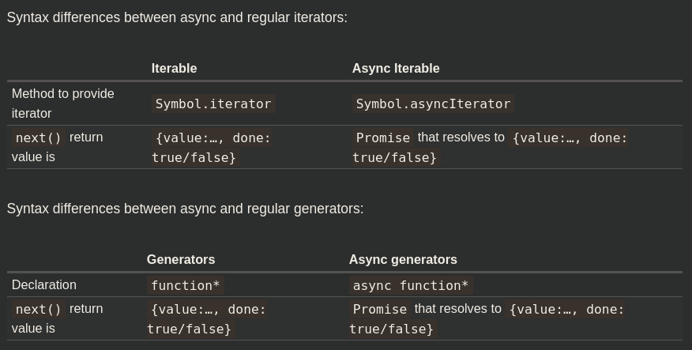

- [Async iteration](#async-iteration)
	- [Async iterators](#async-iterators)
	- [Async Generators](#async-generators)
	- [Async iterables](#async-iterables)

# Async iteration

## Async iterators

Async iterators allow to iterate asynchronously. 

The main differences with common iterators are:

1. `Symbol.asyncIterator` is used instead of `Symbol.iterator`.
2. `next()` should return `promise`.
3. `for await` is used to loop over this iterable.
***

Task: iterator ticks once per second

```javascript
const range = {
	from: 1,
	to: 5,

	[Symbol.asyncIterator]() {
		return {
			current: this.from,
			last: this.to,

			async next() {
				await new Promise(resolve => setTimeout(resolve, 1000))

				if (this.current > this.last) {
					return { done: true }
				}

				return { done: false, value: this.current++	}
			}
		}
	}
};

(async () => {
	for await (const value of range) {
		console.log(value)
	}
})()
```
***

**NB**: Regular `...` operator doesn't work asynchronously as it expects `Symbol.iterator`, not `Symbol.asyncIterator`.

```javascript
[...range]	// TypeError: range is not iterable, no [Symbol.iterator] !
```
***


## Async Generators

We use them if we need generators that can `await` for some async actions.

```javascript
async function* generateSequence(start = 1, end = 5){
	for(let i = start; i <= end; i++){
		await new Promise(resolve => setTimeout(resolve, 1000))

		yield i
	}
};

(async () => {	
	for await(const value of generateSequence(1, 5)){
		console.log(value)
	}
})();


// without `for await`
(async () => {
	let gen = generateSequence(1, 5)
	
	while (true) {
		const result = await gen.next()

		if (result.done) return

		console.log(result.value)
	}
})()
```
***


## Async iterables

To make an object iterable, we add `Symbol.iterator()` method to it (or `Symbol.asyncIterator()` for async iteration). A common practice for this method is to return a `generator` object rather than just a plain object with `next()` implemented. Let's rewrite the [first task](#"once-per-sec") of this chapter using async generators. The solution is shorter and cleaner. 

```javascript
let range = {
	from: 1, 
	to: 5,

	async *[Symbol.asyncIterator](){	// [Symbol.asyncIterator]: async function*()
		for(let i = this.from; i <= this.to; i++){
			await new Promise(resolve => setTimeout(resolve, 1000))
			yield i
		}
	}
};

(async () => {
	for await(const value of range){
		console.log(value)
	}
})()
```
Async generators are often used to implement pagination. 

