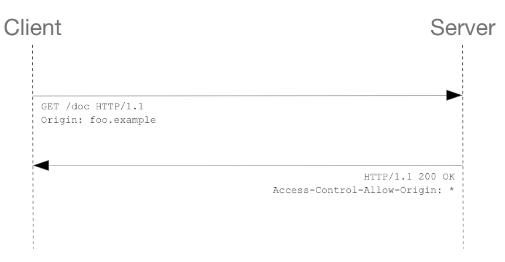
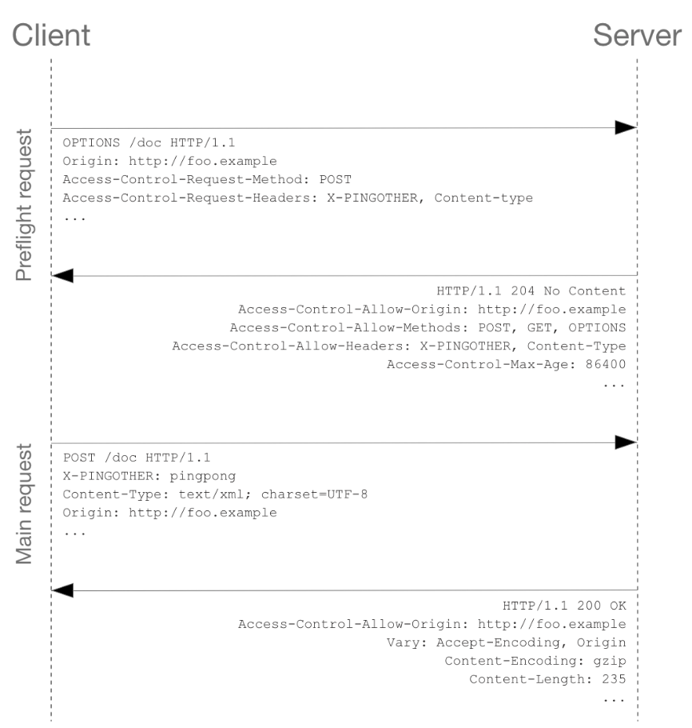
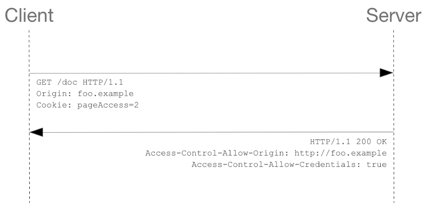

# CORS

- [CORS](#cors)
	- [Safe and Idempotent requests](#safe-and-idempotent-requests)
	- [Simple cors request](#simple-cors-request)
	- [Preflighted cors requests](#preflighted-cors-requests)
	- [Requests with credentials](#requests-with-credentials)
	- [The HTTP request headers](#the-http-request-headers)
		- [`Origin`](#origin)
		- [`Access-Control-Request-Method`](#access-control-request-method)
		- [`Access-Control-Request-Headers`](#access-control-request-headers)
	- [The HTTP response headers](#the-http-response-headers)
		- [`Access-Control-Allow-Origin`](#access-control-allow-origin)
		- [`Access-Control-Expose-Headers`](#access-control-expose-headers)
		- [`Access-Control-Max-Age`](#access-control-max-age)
		- [`Access-Control-Allow-Credentials`](#access-control-allow-credentials)
		- [`Access-Control-Allow-Methods`](#access-control-allow-methods)
		- [`Access-Control-Allow-Headers`](#access-control-allow-headers)


Cross-Origin Resource Sharing. Basically requests from one **domain**, **protocol**, **port** to another.

Say, you load **styles** or **scripts** from the CDN. This is a cross-origin request. 

***


## Safe and Idempotent requests

**Safe requests** are `GET`, `HEAD`, `OPTIONS`. They **don't alter the server**. All of safe mathods are also **idempotent**.

**Idempotent** means that **several requests** of this type in a row will leave the server in the same state **as if there was only one request**. `GET`, `HEAD`, `PUT`, `DELETE` are idempotent.

To be idempotent, only the actual back-end state of the server is considered, the status code returned by each request may differ: the first call of a `DELETE` will likely return a `200`, while successive ones will likely return a `404`.

It's up to server to correctly implement both **safe** and **idempotent**  methods handling so they would follow their definitions.

***


## Simple cors request

Some simple requests don't requite preflight requests: `GET`, `HEAD`, `POST` with some certain headers. 

Script on a domain `http://foo.example` wants to access `http://bar.other`

```js
const xhr = new XMLHttpRequest()
xhr.open('GET', 'https://bar.other/resources/public-data/')
xhr.onreadystatechange = someHandler
xhr.send()
```

This performs a simple exchange between the client and the server, using CORS headers to handle the privileges:



Client (attention to `Origin`): 

```http
GET /resources/public-data/ HTTP/1.1
Host: bar.other
User-Agent: Mozilla/5.0 (Macintosh; Intel Mac OS X 10.14; rv:71.0) Gecko/20100101 Firefox/71.0
Accept: text/html,application/xhtml+xml,application/xml;q=0.9,*/*;q=0.8
Accept-Language: en-us,en;q=0.5
Accept-Encoding: gzip,deflate
Connection: keep-alive
Origin: https://foo.example
```

Server (attention to `Access-Control-Allow-Origin`): 

```http
HTTP/1.1 200 OK
Date: Mon, 01 Dec 2008 00:23:53 GMT
Server: Apache/2
Access-Control-Allow-Origin: *
Keep-Alive: timeout=2, max=100
Connection: Keep-Alive
Transfer-Encoding: chunked
Content-Type: application/xml

[…XML Data…]
```

To allow client accessing server, the latter should send `Access-Control-Allow-Origin` with the **same value** that was sent initially by the client in the `Origin` request. Or make it accessible for everyone (`*`).

***


## Preflighted cors requests

Other requests first make so called **"preflight"** `OPTIONS` requests. This preflight request describes what the actual request is going to be: method and headers. Server responds with the **list of allowed requests and headers** for a client (and also whether you need credentials - cookies and authentitication). Then you send the **actual** request following the permissions of the server. Usually browsers send this `OPTIONS` request automatically.

```js
const xhr = new XMLHttpRequest()
xhr.open('POST', 'https://bar.other/resources/post-here/')
xhr.setRequestHeader('X-PINGOTHER', 'pingpong')
xhr.setRequestHeader('Content-Type', 'application/xml')
xhr.onreadystatechange = handler
xhr.send('<person><name>Arun</name></person>')
```



Preflight request and response (attention to `Access-Control-*`):

 ```http
OPTIONS /doc HTTP/1.1
Host: bar.other
User-Agent: Mozilla/5.0 (Macintosh; Intel Mac OS X 10.14; rv:71.0) Gecko/20100101 Firefox/71.0
Accept: text/html,application/xhtml+xml,application/xml;q=0.9,*/*;q=0.8
Accept-Language: en-us,en;q=0.5
Accept-Encoding: gzip,deflate
Connection: keep-alive
Origin: http://foo.example
Access-Control-Request-Method: POST
Access-Control-Request-Headers: X-PINGOTHER, Content-Type


HTTP/1.1 204 No Content
Date: Mon, 01 Dec 2008 01:15:39 GMT
Server: Apache/2
Access-Control-Allow-Origin: https://foo.example
Access-Control-Allow-Methods: POST, GET, OPTIONS
Access-Control-Allow-Headers: X-PINGOTHER, Content-Type
Access-Control-Max-Age: 86400
Vary: Accept-Encoding, Origin
Keep-Alive: timeout=2, max=100
Connection: Keep-Alive
```

`Access-Control-Request-Method` notifies the server that client is goint to send the `POST` request. 

`Access-Control-Request-Headers` notifies the server that client is about to set the `X-PINGOTHER` and `Content-Type` custom headers. 

The server now has an opportunity to determine whether it wishes to accept a request under these circumstances. And it gives permission (`Access-Constol-Allow-*`).

Then the actual request is performed (no `Access-Control-*` headers anymore):

```http
POST /doc HTTP/1.1
Host: bar.other
User-Agent: Mozilla/5.0 (Macintosh; Intel Mac OS X 10.14; rv:71.0) Gecko/20100101 Firefox/71.0
Accept: text/html,application/xhtml+xml,application/xml;q=0.9,*/*;q=0.8
Accept-Language: en-us,en;q=0.5
Accept-Encoding: gzip,deflate
Connection: keep-alive
X-PINGOTHER: pingpong
Content-Type: text/xml; charset=UTF-8
Referer: https://foo.example/examples/preflightInvocation.html
Content-Length: 55
Origin: https://foo.example
Pragma: no-cache
Cache-Control: no-cache

<person><name>Arun</name></person>


HTTP/1.1 200 OK
Date: Mon, 01 Dec 2008 01:15:40 GMT
Server: Apache/2
Access-Control-Allow-Origin: https://foo.example
Vary: Accept-Encoding, Origin
Content-Encoding: gzip
Content-Length: 235
Keep-Alive: timeout=2, max=99
Connection: Keep-Alive
Content-Type: text/plain

[Some XML payload]
```

***


## Requests with credentials

We have to set a flag for browser to send credentials. 

```js
const invocation = new XMLHttpRequest()
invocation.open('GET', 'http://bar.other/resources/credentialed-content/')

invocation.withCredentials = true

invocation.onreadystatechange = handler
invocation.send()
```

Since this is a simple `GET` request, it is not preflighted, but the browser will **reject** any response that does not have the `Access-Control-Allow-Credentials: true` header, and **not** make the response available to the invoking web content.



Request-response (attention to `Cookie` and `Access-Control-Allow-Credentials`):

```http
GET /resources/credentialed-content/ HTTP/1.1
Host: bar.other
User-Agent: Mozilla/5.0 (Macintosh; Intel Mac OS X 10.14; rv:71.0) Gecko/20100101 Firefox/71.0
Accept: text/html,application/xhtml+xml,application/xml;q=0.9,*/*;q=0.8
Accept-Language: en-us,en;q=0.5
Accept-Encoding: gzip,deflate
Connection: keep-alive
Referer: http://foo.example/examples/credential.html
Origin: http://foo.example
Cookie: pageAccess=2


HTTP/1.1 200 OK
Date: Mon, 01 Dec 2008 01:34:52 GMT
Server: Apache/2
Access-Control-Allow-Origin: https://foo.example
Access-Control-Allow-Credentials: true
Cache-Control: no-cache
Pragma: no-cache
Set-Cookie: pageAccess=3; expires=Wed, 31-Dec-2008 01:34:53 GMT
Vary: Accept-Encoding, Origin
Content-Encoding: gzip
Content-Length: 106
Keep-Alive: timeout=2, max=100
Connection: Keep-Alive
Content-Type: text/plain


[text/plain payload]
```

When responding to a credentialed request, the server **must** specify an origin in the value of the `Access-Control-Allow-Origin` header, instead of specifying the `"*"` wildcard. 

***


## The HTTP request headers

Note that these headers are set for you when making invocations to servers. Developers using cross-site `XMLHttpRequest` capability **do not have** to set any cross-origin sharing request headers programmatically.

### `Origin`

Indicates the origin of the cross-site access request or preflight request. It does not include any path information, but only the server name.

```http
Origin: https://example.com | null
```

***


### `Access-Control-Request-Method`

Used in a **preflight** request to let the server know what HTTP method will be used when the actual request is made.

```http
Access-Control-Request-Method: POST
```

***


### `Access-Control-Request-Headers`

Used when issuing a **preflight** request to let the server know what HTTP headers will be used when the actual request is made.

```http
Access-Control-Request-Headers: Content-Type
```

***


## The HTTP response headers

### `Access-Control-Allow-Origin`

```http
Access-Control-Allow-Origin: <origin> | *
```

`*` always goes without credentials.

E.g. to allow code the origin `https://mozilla.org` to access your server, the latter can set:

```http
Access-Control-Allow-Origin: https://mozilla.org
Vary: Origin
```

If the server specifies a single origin rather than the `"*"` wildcard, then the server should also include the `Vary: Origin` response header — to indicate to clients that server responses will differ based on the value of the `Origin` request header.

***


### `Access-Control-Expose-Headers`

Lets a server whitelist headers that browsers are allowed to access.

This would allow the 'X-My-Custom-Header' and 'X-Another-Custom-Header' headers to be exposed to the browser: 

```http
Access-Control-Expose-Headers: X-My-Custom-Header, X-Another-Custom-Header
```

***


### `Access-Control-Max-Age`

Indicates how long (in seconds) the results of a preflight request can be cached. Browsers have their own max values that take precedence (up to 2 hours in Chrome, -1 means every request should be preflighted). 

```http
Access-Control-Max-Age: 3600
```

***


### `Access-Control-Allow-Credentials`

Indicates whether or not the response to the request can be exposed.

```http
Access-Control-Allow-Credentials: true
```

When used as part of a response to a **preflight** request, this indicates whether or not the actual request can be made using credentials. 

Note that simple `GET` requests are not preflighted, and so if a request is made for a resource with credentials, if this header is not returned with the resource, the response is **ignored** by the browser and not returned to web content.

***


### `Access-Control-Allow-Methods`

Used in response to a **preflight** request. Specifies the methods allowed when accessing the resource.

```http
Access-Control-Allow-Methods: GET, POST
```

***


### `Access-Control-Allow-Headers`

Used in response to a **preflight** request to indicate which `HTTP` headers can be used when making the actual request.

```http
Access-Control-Allow-Headers: Content-Type
```

