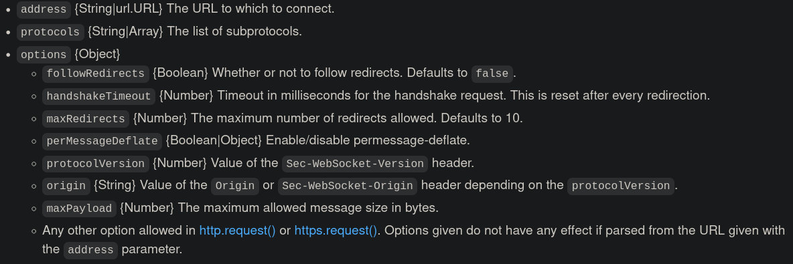
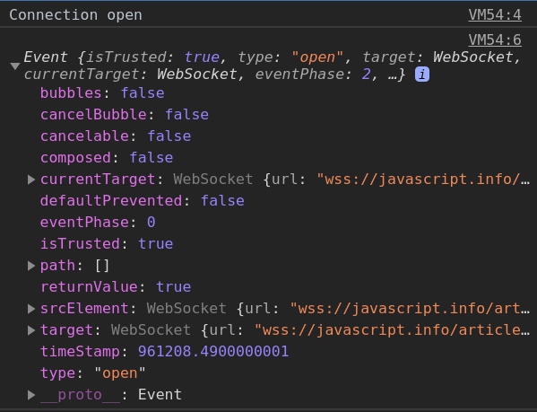
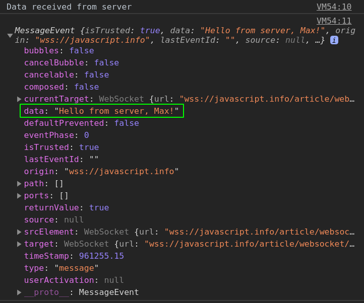
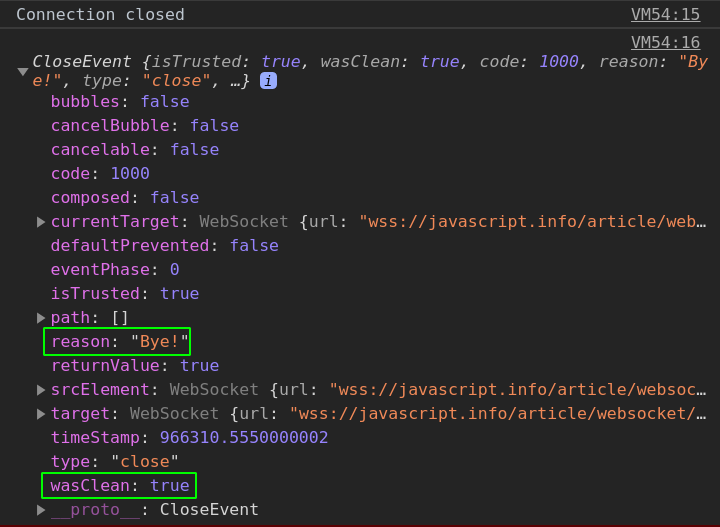
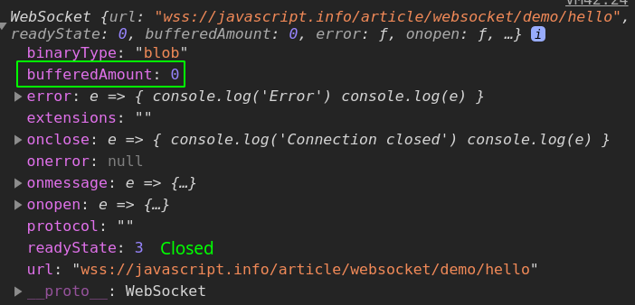
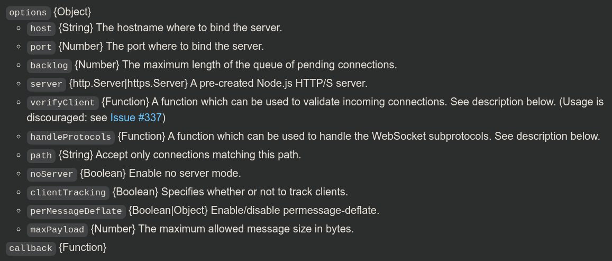
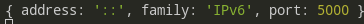
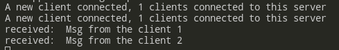

# WebSocket Client

- [WebSocket Client](#websocket-client)
	- [Intro](#intro)
		- [**`new WebSocket`**` (address, protocols)`](#new-websocket-address-protocols)
		- [Events](#events)
		- [Properties](#properties)
			- [`ws.`**`readyState`**](#wsreadystate)
			- [`ws.`**`binaryType`**](#wsbinarytype)
			- [`ws.`**`bufferedAmount`**](#wsbufferedamount)
			- [`ws.`**`extensions`**](#wsextensions)
			- [`ws.`**`url`**](#wsurl)
		- [Methods](#methods)
			- [`ws.`**`send`**` (data)`](#wssend-data)
			- [`ws.`**`close`**` ([{ params }])`](#wsclose--params-)
			- [`ws.`**`terminate ()`**](#wsterminate-)
	- [Client-server conversation](#client-server-conversation)
	- [Data transfer](#data-transfer)
	- [Practice](#practice)
		- [Basic example](#basic-example)
		- [Chat example](#chat-example)
- [WebSocket Server](#websocket-server)
	- [Class: WebSocket.Server](#class-websocketserver)
		- [`new `**`WebSocket.Server`**` (options[, callback])`](#new-websocketserver-options-callback)
		- [`WebSocket.`**`createWebSocketStream`**` (websocket[, options])`](#websocketcreatewebsocketstream-websocket-options)
		- [Events](#events-1)
			- [`wss.on (`**`'close'`**`, () => {})`](#wsson-close---)
			- [`wss.on (`**`'connection'`**`, (socket: WebSocket, request: http.IncomingMessage) => {})`](#wsson-connection-socket-websocket-request-httpincomingmessage--)
			- [`wss.on (`**`'error'`**`, err => {})`](#wsson-error-err--)
			- [`wss.on (`**`'headers'`**`, (headers: Array, request: http.IncomingMessage))`](#wsson-headers-headers-array-request-httpincomingmessage)
			- [`wss.on (`**`'listening'`**`, () => {})`](#wsson-listening---)
		- [Properties and Methods](#properties-and-methods)
			- [`wss.`**`clients`**](#wssclients)
			- [`wss.`**`address ()`**](#wssaddress-)
			- [`wss.`**`handleUpgrade`**` (request, netsocket, head, (ws) => {})`](#wsshandleupgrade-request-netsocket-head-ws--)
			- [`wss.`**`shouldHandle`**` (request)`](#wssshouldhandle-request)
		- [Multiple WebSocket Servers sharing a single HTTP server; Server Clients](#multiple-websocket-servers-sharing-a-single-http-server-server-clients)
		- [Server broadcast](#server-broadcast)


***

## Intro

WebSocket protocol provides a way to exchange data between browser and server via a persistent connection. The data can be passed in both directions as “packets”, without breaking the connection and additional HTTP-requests.

***

### **`new WebSocket`**` (address[, protocols][, options])`



```js
// unencrypted
const ws = new WebSocket("ws://javascript.info")
// encrypted - preferable
const ws = new WebSocket("wss://javascript.info")
```

***


### Events

Once the socket is created, we should **listen** for events on it:

1. `open` - connection established
2. `message` - data received
3. `error` - error
4. `close` - connection closed

***


### Properties

#### `ws.`**`readyState`**

Returns a `number`:

- `0` - “CONNECTING”: the connection has not yet been established
- `1` - “OPEN”: communicating
- `2` - “CLOSING”: the connection is closing
- `3` - “CLOSED”: the connection is closed

#### `ws.`**`binaryType`**

Returns a `string` indicating the type of the incoming binary data(default is 'blob').

#### `ws.`**`bufferedAmount`**

Returns a `number` of bytes of data that have been queued using calls to `send()` but not yet transmitted to the network.

#### `ws.`**`extensions`**

An `object` containing the negotiated extensions.

#### `ws.`**`url`**

Returns a `string` with the URL of the WebSocket Server. Server clients don't have it.

***


### Methods

#### `ws.`**`send`**` (data)` 

Sends data. 

#### `ws.`**`close`**` ([{ params }])`

Closes the connection. Optional params may include `code` and human-readable `reason` explaining why the connection was closed. 

#### `ws.`**`terminate ()`**

Forcibly close the connection.

***


## Client-server conversation

During the connection the browser (using headers) asks the server: “Do you support Websocket?” And if the server replies “yes”, then the talk continues in WebSocket protocol.

Headers:

```http
GET /chat
Host: javascript.info
Origin: https://javascript.info
Connection: Upgrade
Upgrade: websocket
Sec-WebSocket-Key: Iv8io/9s+lYFgZWcXczP8Q==
Sec-WebSocket-Version: 13
```

`Origin` - origin of the page. WebSocket is cross-origin by nature so no extra headers needed.

`Connection: Upgrade` - signals that the client would like to change the protocol.

`Upgrade: websocket` – the requested protocol is “websocket”.

`Sec-WebSocket-Key` – a random browser-generated key for security.

***

If the server agrees to switch to WebSocket, it should send code `101 (Switching protocol)` response:

```http
101 Switching Protocols
Connection: Upgrade
Upgrade: websocket
Sec-WebSocket-Accept: hsBlbuDTkk24srzEOTBUlZAlC2g=
```

Afterwards, the data is transfered using WebSocket protocol and **not HTTP**.

***


## Data transfer

WebSocket communication consists of **“frames”** – data fragments, that can be sent from either side, and can be of several kinds:

- text
- binary data (set by `socket.binaryType`, it's `Blob` by default)
- ping/pong frames (used to check the connection, sent from server)
- "connection close frame" and a few others technical ones

***


## Practice 

### Basic example

```js
const ws = new WebSocket('wss://javascript.info/article/websocket/demo/hello')

ws.onopen = e => {
	console.log('Connection open')
	console.log(e)
	ws.send('My name is Max')
}

ws.onmessage = e => {
	console.log(`Data received from server`)
	console.log(e)
}

ws.onclose = e => {
	console.log('Connection closed')
	console.log(e)
}

ws.error = e => {
	console.log('Error')
	console.log(e)
}
```







***

You might want to check the `bufferAmount` property of the **socket** before closing the connection as it indicates how much data was sent and still going over the network (**0** means no more data is expected to come).



***


### Chat example

This simple ws-server echoes sent messages.

We'll need a **form** to send messages and a **div** to display incoming messages.

Algorithms:

1. Open the connection.
2. On form submission - `socket.send(message)`.
3. On incoming messages - append them to our **div**.

```html
<form name="publish">
	<label for="msg">Enter your message: </label>
	<input type="text" name="msg" id="msg"><br>
	<button type="submit" id="sub">Submit</button>
</form>

<div id="messages"></div>

<script>
	const ws = new WebSocket('wss://javascript.info/article/websocket/chat/ws')

	document.forms.publish.onsubmit = e => {
		if(ws.readyState === 1){	// connection is open
			ws.send(msg.value)
		}
		return false
	}

	ws.onmessage = e => {
		console.log(e.data)
		const div = document.createElement('div')
		document.getElementById('messages').prepend(div)
		div.textContent = e.data
	}
</script>
```

***


# WebSocket Server

1. https://www.npmjs.com/package/ws
2. https://github.com/websockets/ws/blob/HEAD/doc/ws.md
3. https://youtu.be/wV-fDdHhGqs

```bash
npm i ws
```

Basic structure - **Server**:

```js
const express = require('express')
const app = express()
// it's important to define a server this way, not just pass `app`
const server = require('http').createServer(app)
const path = require('path')
const WebSocket = require('ws')

const PORT = process.env.PORT || 5000
// an explicitly created http server, not just express app!
const wss = new WebSocket.Server({ server })

app.use(express.static(path.join(__dirname, 'public')))

wss.on('connection', function connection(ws) {
	console.log('A new client connected')

	ws.on('message', function incoming(message) {
		console.log('received: ', message)
		// echo the client message back to him
		ws.send(message)
	})
})

server.listen(PORT, () => {
	console.log(`The app is running on port ${PORT}`)
})

```

**Client**:

```html
<form name="publish">
	<label for="msg">Enter your message: </label>
	<input type="text" name="msg" id="msg"><br>
	<button type="submit" id="sub">Submit</button>
</form>

<div id="messages"></div>

<script>
	const ws = new WebSocket('ws://localhost:5001')

	document.forms.publish.onsubmit = e => {
		ws.send(msg.value)			
		return false
	}

	ws.onmessage = e => {
		console.log(e.data)
		const div = document.createElement('div')
		document.getElementById('messages').prepend(div)
		div.textContent = e.data
	}
</script>
```

***


## Class: WebSocket.Server

### `new `**`WebSocket.Server`**` (options[, callback])`



Create a new server instance. One of `port`, `server` or `noServer` must be provided. If `port` is chosen, an http server is created automatically. 

The `"noServer"` mode allows the WebSocket server to be completly detached from the HTTP/S server. This makes it possible, for example, to share a single HTTP/S server between multiple WebSocket servers.

```js
const express = require('express')
const app = express()
const server = require('http').createServer(app)

const WebSocket = require('ws')
const wss = new WebSocket.Server({ server })	// WebSocket Server
```

***


### `WebSocket.`**`createWebSocketStream`**` (websocket[, options])`

Returns a `Duplex` stream (and accepts the Duplex options).

***


### Events

#### `wss.on (`**`'close'`**`, () => {})`

Emitted when the server closes.

#### `wss.on (`**`'connection'`**`, (socket: WebSocket, request: http.IncomingMessage) => {})`

Emitted when the handshake is complete. `request` is the http GET request sent by the client. Useful for parsing authority headers, cookie headers, and other information.

#### `wss.on (`**`'error'`**`, err => {})`

Emitted when an error occurs on the underlying server.

#### `wss.on (`**`'headers'`**`, (headers: Array, request: http.IncomingMessage))`

Emitted before the response headers are written to the socket as part of the handshake. This allows you to inspect/modify the headers before they are sent.

#### `wss.on (`**`'listening'`**`, () => {})`

Emitted when the underlying server has been bound.

***


### Properties and Methods

#### `wss.`**`clients`**

`Set` of clients (objects). Requires `clientTracking: true`.

```js
wss.on('connection', function connection(ws) {
	console.log(wss.clients.size)	// 1, 2, ...
	// ...
})
```

#### `wss.`**`address ()`**



#### `wss.`**`handleUpgrade`**` (request, netsocket, head, (ws) => {})`

Needs only to be called when `noServer` was used. In other cases used automatically to handle HTTP upgrade request. 

#### `wss.`**`shouldHandle`**` (request)`

See if a given request should be handled by this server. The return value, true or false, determines whether or not to accept the handshake.

***


### Multiple WebSocket Servers sharing a single HTTP server; Server Clients

You can connect multiple WebSocket servers to a single HTTP server. Also, you can create WS Clients right on the Server-side.

```js
// app.js
const express = require('express')
const app = express()
const server = require('http').createServer(app)
const path = require('path')
const url = require('url')
const WebSocket = require('ws')

const PORT = process.env.PORT || 5000

app.use(express.static(path.join(__dirname, 'public')))

// two ws servers
const wss1 = new WebSocket.Server({ noServer: true })
const wss2 = new WebSocket.Server({ noServer: true })

server.on('upgrade', function upgrade(request, socket, head) {
	const pathname = request.url

	if (pathname === '/foo') {
		wss1.handleUpgrade(request, socket, head, function done(ws) {
			wss1.emit('connection', ws, request)
		})
	} else if (pathname === '/bar') {
		wss2.handleUpgrade(request, socket, head, function done(ws) {
			wss2.emit('connection', ws, request)
		})
	} else {
		socket.destroy()
	}
})

wss1.on('connection', (ws) => onConnection.call(wss1, ws))
wss2.on('connection', (ws) => onConnection.call(wss2, ws))

function onConnection(ws){
	console.log(`A new client connected, ${this.clients.size} clients connected to this server`)
	
	ws.on('message', function incoming(message) {
		console.log('received: ', message)
		ws.send(message)
	})
}

// two ws server clients connectiong to different wss
const ws1 = new WebSocket('ws://localhost:5000/foo')
const ws2 = new WebSocket('ws://localhost:5000/bar')

ws1.on('open', (e) => ws1.send('Msg from the client 1'))
ws2.on('open', (e) => ws2.send('Msg from the client 2'))

server.listen(PORT, () => {
	console.log(`The app is running on port ${PORT}`)
})
```



***


### Server broadcast

WSS stores a `Set` of all the connected clients. Iterate over them and send them data (including or excluding itself).

```js
wss.on('connection', ws => {
  ws.on('message', data => {
    wss.clients.forEach(client => {
      if (client.readyState === WebSocket.OPEN/* && client !== ws*/) {
        client.send(data)
      }
    })
  })
})
```