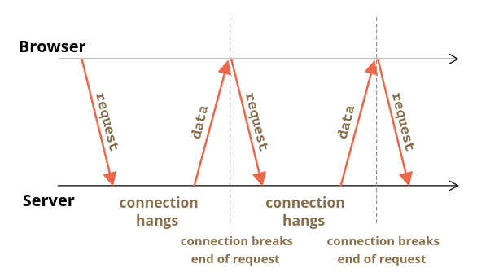

# Long Polling

- [Long Polling](#long-polling)
	- [Sources](#sources)
	- [Regular Polling](#regular-polling)
	- [Long polling](#long-polling-1)

***

## Sources

1. https://javascript.info/long-polling
2. 

***

## Regular Polling

The simplest way to get new information from the server. Basically regular requests to the server: "Do you have anything for mer?" Now server knows that the client is online and can send a response with any accumulated info up to this time.

Downsides:

- Messages are passed with a delay (between requests)
- Server needs to repeatedly answer to a huge amount of requests (from all users!), even if there's nothing to respond with

***

## Long polling

A much better way to poll the server.

Algorithm:

1. A **client sends request** to the server.
2. The **server doesn't respond** immediately but **waits** for something to respond with.
3. When there are something to send to the client, the server finally **responds**.
4. The **client gets the response** and sends the **new request immediately**.

The situation when the browser sent a request and has a pending connection with the server, is standard for this method. Only when a message is delivered, the connection is reestablished.

If the **connection is lost**, because of, say, a network error, the browser **immediately** sends a new request.

