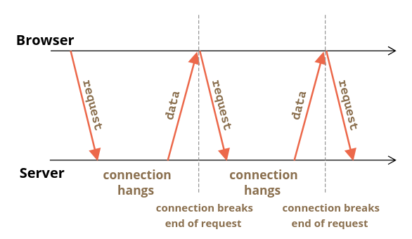
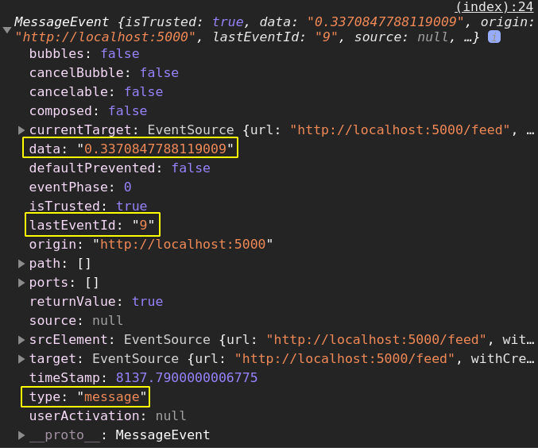

# Client-Server Interaction

- [Client-Server Interaction](#client-server-interaction)
	- [Sources](#sources)
	- [Intro](#intro)
	- [Polling](#polling)
		- [Regular polling](#regular-polling)
		- [Long polling](#long-polling)
		- [Full example](#full-example)
	- [Server sent events: `EventSource`](#server-sent-events-eventsource)
		- [Constructor](#constructor)
			- [`new EventSource (url, [{ withCredentials = false }])`](#new-eventsource-url--withcredentials--false-)
		- [Properties](#properties)
			- [`readyState`](#readystate)
			- [`url`](#url)
			- [`withCredentials`](#withcredentials)
			- [`lastEventId`](#lasteventid)
		- [Events](#events)
			- [`message`](#message)
			- [`open`](#open)
			- [`error`](#error)
		- [Methods](#methods)
			- [`close ()`](#close-)
		- [Server Responses](#server-responses)
		- [Response fields](#response-fields)
			- [`event:`](#event)
			- [`data:`](#data)
			- [`retry:`](#retry)
			- [`id:`](#id)
		- [Reconnection](#reconnection)
		- [Message id](#message-id)
		- [Full example](#full-example-1)

---

## Sources

1. https://javascript.info/long-polling
2. https://javascript.info/server-sent-events

***

## Intro

There are multiple ways of establishing a client-server connection:

- Regular polling
- Long polling
- WebSocket
- EventSource

Here we'll learn polling and EventSource. WebSockets are in their respective chaper. 

***


## Polling

### Regular polling

The simplest way to get new information from the server. Interval requests to the server: "Do you have anything for me?" 

When receiving a request, the server knows that the client is online. Later it can send a response with any accumulated info up to this time.

Pros:

- easy to implement

Cons:

- Messages are passed with a delay (between requests).
- Server needs to repeatedly answer to a huge amount of requests (from all users!), even if there's nothing to respond with.

***


### Long polling

A better way to poll the server in many situations.

Pros:

- works good if messages are rare

Cons:

- works not very good if messages are frequent (as every request-response is supplied with headers and other metadata making them "heavy")

Algorithm:

1. A **client sends request** to the server.
2. The **server doesn't respond** immediately but **waits** for something to respond with.
3. When there are something to send to the client, the server finally **responds**.
4. The **client gets the response** and sends the **new request immediately**.

The situation when the browser sent a request and has a pending connection with the server, is standard for this method. Only when a message is delivered, the connection is reestablished.



If the **connection is lost**, because of, say, a network error, the browser **immediately** sends a new request.

```js
async function run(){
	const response = fetch('...')
	if(response.status ...){}

	await run()
}
```

**NB**: this code doesn't run into _recursion_ because this is basically a chain of `Promises`, one handler is executed when the previous is finished.

***


### Full example

Client:

```html
<!DOCTYPE html>

All visitors of this page will see messages of each other.

<form name="publish">
	<input type="text" name="message" />
	<input type="submit" value="Send" />
</form>

<div id="subscribe"></div>

<script>
	subscribePane(
		document.getElementById('subscribe'),
		`subscribe?random=${Math.random()}`
	)
	publishForm(document.forms.publish, 'publish')

	async function subscribePane(elem, url) {
		subscribe()

		async function subscribe() {
			try {
				const response = await fetch(url)

				// connection timeout - reconnect immediately
				if (response.status === 502) {
					console.log(502)
					return subscribe()

					// other error - wait 1 s and reconnect
				} else if (response.status !== 200) {
					showMessage(response.statusText)
					await new Promise((resolve) => setTimeout(resolve, 1000))
					return subscribe()
					// no errors
				} else {
					const message = await response.text()
					showMessage(message)
					return subscribe()
				}
			} catch (err) {
				console.error(err)
				await new Promise((resolve) => setTimeout(resolve, 1000))
				return subscribe()
			}
		}

		function showMessage(message) {
			const article = document.createElement('article')
			elem.append(article)
			article.textContent = message
		}
	}

	function publishForm(form, url) {
		form.addEventListener('submit', (e) => {
			e.preventDefault(e)
			const message = form.message.value

			if (message) {
				form.message.value = ''
				publish(message)
			}
		})

		function publish(message) {
			try {
				fetch(url, {
					method: 'POST',
					headers: {
						'Content-Type': 'application/json'
					},
					body: JSON.stringify({ message })
				})
			} catch (err) {
				console.error(err)
			}
		}
	}
</script>
```

Server:

```js
const http = require('http')
const express = require('express')

const app = express()
const server = http.createServer(app)
const PORT = process.env.PORT || 5000

const responseTokens = new Set()

app.use(express.json())
app.use(express.urlencoded({ extended: false }))
app.use(express.static(__dirname + '/public'))

app.get('/subscribe', (req, res, next) => {
	responseTokens.add(res)
	req.on('close', () => responseTokens.delete(res))
})

app.post('/publish', (req, res, next) => {
	publish(req.body.message)
	res.send('ok')
})

function publish(message) {
	for (const res of responseTokens) {
		res.send(message)
		responseTokens.delete(res)
	}
}

server.listen(PORT, () => console.log(`The app is running on port `, PORT))
```

***


## Server sent events: `EventSource`

Persistent connection with the server. Basically the simpler version of WebSocket. Good at sending stream of messages back to the client.

Useful approach for handling things like social media status updates, news feeds, or delivering data into a client-side storage mechanism like IndexedDB or web storage.

Features:

- One-directional: **only server** sends data
- Can send only **text**
- Protocol: regular **HTTP**
- Supports **cross-origin** requests

Upon creation, `new EventSource` connects to the server, and if the connection is broken – **reconnects** in a few seconds.

***


### Constructor

#### `new EventSource (url, [{ withCredentials = false }])`

```js
eventSource = new EventSource(url)
```

The browser will connect to `url` upon creation and keep the connection open, waiting for events. If the connection fails, it will repeatedly try to **reconnect** 

***


### Properties

#### `readyState`

- `0` — connecting
- `1` — open
- `2` — closed

#### `url`

Returns url.

#### `withCredentials`

Returns boolean.

#### `lastEventId`

The last received `id`. Upon reconnection the browser sends it in the header `Last-Event-ID`.

***


### Events

#### `message`

When new message arrives.

#### `open`

When a connection to an event source is opened.

#### `error`

When a connection failed to open.

***

Also server may specify another (custom) type of event. 

```json
event: join
data: Bob

data: Hello

event: leave
data: Bob
```

Then simply listen to these events:

```js
eventSource.addEventListener('join', event => {
  	console.log(`Joined ${event.data}`)
})
```

***


### Methods

Inherits from `EventTarget` (addEveltListener, etc.). 

#### `close ()`

Closes the connection and sets `readyState = 2`

***


### Server Responses

The remote server will get the `Origin` header and must respond with `Access-Control-Allow-Origin` to proceed.

The server should respond with `status 200` and the header `Content-Type: text/event-stream`, then keep the connection and write messages **as simple strings** in the special format, like this:

```json
data: Message 1
retry: 15000
id: 1

data: Message 2
id: 2

data: Message 3
data: of two lines
id: 3
```

Messages are delimeted by `\n\n`. 

Or encoded in **JSON**

```json
data: {"user":"John","message":"First line\n Second line"}
```

***

This is a typical response from the server:



***


### Response fields

A message can have the following fields:

#### `event:`

Event name, must precede `data:`. In the response object will be called `type`.

#### `data:`

Message body, a sequence of multiple data is interpreted as a single message, with \n between the parts.

#### `retry:`

Recommends a retry delay for reconnections in ms (which browser will respect).

#### `id:`

Renews `lastEventId`, sent in `Last-Event-ID` on reconnect.

***


### Reconnection

The server can set the delay (before reconnection) using `retry:` in response (in ms). The browser will respect that recommendation. 

May be included with other data or be a standalone message.

```json
retry: 15000
data: Hello, I set the reconnection delay to 15 seconds
```

If the server wants the browser to **stop reconnecting**, it responds with `status 204`.

Also, there will be no reconnection if the response status differs from `301`, `307`, `200` or `204`. In such case an **error** will be emitted. 

There's **no way to reopen** a closed connection. You'll have to open the new one. 

***


### Message id

When a connection breaks due to network problems, either side can’t be sure which messages were received, and which weren’t.

To correctly resume the connection, each message should have an `id` field.

```json
data: Message 1
id: 1

data: Message 2
id: 2

data: Message 3
data: of two lines
id: 3
```

When a message with `id:` is received, the browser:

1. Sets `eventSource.lastEventId` to its value.
2. Upon reconnection sends the header `Last-Event-ID` with that `id`, so that the server may re-send following messages.

Put `id:` **after** `data:` to ensure its update **after** the message is actually received.

***


### Full example

Client

```html
<!DOCTYPE html>

Open the console

<script>
	const eventSource = new EventSource('feed')

	eventSource.addEventListener('open', (e) => {
		console.log('Open')
	})
	eventSource.addEventListener('error', (e) => {
		// E.g. the server is not running
		console.log(
			`Error. Waiting the amount of time specified with the last received 'retry' before trying to reconnect.`
		)
		/* After it fires, `eventSource` will:
		1) wait for amount of time specified in `retry` (or a few seconds by default)
		2) try to reconnect (`open`) */
	})

	eventSource.addEventListener('message', (e) => {
		console.log(`Event: '${e.type}'; lastEventId: '${e.lastEventId}'`)
		console.log(`Data: '${e.data}'`)
	})

	eventSource.addEventListener('bye', (e) => {
		console.log(`Event: '${e.type}'; lastEventId: '${e.lastEventId}'`)
		console.log(`Data: '${e.data}'`)

		// Uncomment this to prevent furter attempts to reconnect
		// eventSource.close()
	})
</script>
```

Server

```js
const http = require('http')
const express = require('express')
const { runInContext } = require('vm')

const app = express()
const server = http.createServer(app)
const PORT = process.env.PORT || 5000

app.use(express.json())
app.use(express.urlencoded({ extended: false }))
app.use(express.static(__dirname + '/public'))

app.get('/feed', (req, res, next) => {
	res.writeHead(200, {
		'Content-Type': 'text/event-stream; charset=utf-8',
		'Cache-Control': 'no-cache'
	})
	sendNumbers(res)
})

async function sendNumbers(res) {
	let i = 1
	while (true) {
		if (i > 10) {
			res.write(prepareMessage({ 
				event: 'bye', 
				data: 'bye-bye' 
			}))
			res.end()
			break
		}

		res.write(prepareMessage({ 
			data: Math.random(), 
			id: i++, 
			retry: 10000 
		}))

		await new Promise((resolve) => setTimeout(resolve, 1000))
	}
}

function prepareMessage(options) {
	const { data, event, id, retry } = options
	let result = ``

	if (event) {
		result += `event: ${event}\n`
	}
	if (data) {
		result += `data: ${data}\n`
	}
	if (retry) {
		result += `retry: ${retry}\n`
	}
	if (id) {
		result += `id: ${id}\n`
	}

	return result + `\n`
}

server.listen(PORT, () => console.log(`The app is running on port `, PORT))
```