# CSS

- [CSS](#css)
	- [Sources](#sources)
	- [Formatting](#formatting)
	- [Specificity](#specificity)
	- [Selectors](#selectors)
		- [Relations](#relations)
		- [Attribute selectors](#attribute-selectors)
		- [Pseudo-classes](#pseudo-classes)
		- [Pseudo-elements](#pseudo-elements)
	- [CSS Units](#css-units)
	- [Box-model](#box-model)
		- [`margin`](#margin)
	- [Positioning](#positioning)
		- [`display`](#display)
		- [`float`](#float)
		- [`clear`](#clear)
		- [`left`, `right`, `top`, `bottom`, `z-index`](#left-right-top-bottom-z-index)
		- [`position`](#position)
	- [Flex](#flex)
		- [Container properties](#container-properties)
			- [`display`](#display-1)
			- [`flex-flow`](#flex-flow)
				- [`flex-direction`](#flex-direction)
				- [`flex-wrap`](#flex-wrap)
			- [`justify-content`](#justify-content)
			- [`align-items`](#align-items)
		- [`align-content`](#align-content)
		- [Children properties](#children-properties)
			- [`align-self`](#align-self)
			- [`flex`](#flex-1)
				- [`flex-grow`](#flex-grow)
				- [`flex-shrink`](#flex-shrink)
				- [`flex-basis`](#flex-basis)
			- [`order`](#order)
	- [Grid](#grid)
		- [Container properties](#container-properties-1)
			- [`display`](#display-2)
			- [`grid-template-columns`](#grid-template-columns)
			- [`grid-template-rows`](#grid-template-rows)
			- [`justify-content`](#justify-content-1)
			- [`align-content`](#align-content-1)
		- [Children properties](#children-properties-1)
			- [`grid-column`](#grid-column)
			- [`grid-row`](#grid-row)
			- [`grid-area`](#grid-area)
	- [Aligning](#aligning)
		- [Horizontal](#horizontal)
			- [Inline](#inline)
			- [Block](#block)
		- [Vertical](#vertical)
			- [Inline](#inline-1)
			- [Block](#block-1)
	- [Miscellaneous](#miscellaneous)
		- [`outline`](#outline)
		- [`overflow`](#overflow)
		- [`height`](#height)
	- [Practice](#practice)
		- [Gallery](#gallery)
			- [`float` solution](#float-solution)
			- [`inline-block` solution](#inline-block-solution)
		- [Two blocks with the same height on one line regardless of the content size](#two-blocks-with-the-same-height-on-one-line-regardless-of-the-content-size)
			- [Flex solution](#flex-solution)
		- [Grid solution](#grid-solution)
		- [Form](#form)

---

## Sources

1. https://learn.javascript.ru/css-for-js - "learn" tutorial
2. https://youtu.be/1Rs2ND1ryYc - big tutorial
3. https://css-tricks.com/almanac/properties/ - properties almanac on CSS-Tricks

---

## Formatting

1. Each selector and each property on its own line.
2. More important properties come first:
   1. Positioning: `position`, `left/right/top/bottom`, `float`, `clear`, `z-index`
   2. Offsets and borders: `width`, `height`, `margin`, `padding`, `border`, `outline`
   3. Other styling: `list-style`, `overflow`, `background`, `color`, `font` ...
3. Non-prefixed properties come **after** profixed ones.

```css
#snapshot-box h2,
#profile-box h2,
#order-box h2 {
	position: relative;
	left: 0;
	top: 5px;
	margin: 10px 20px;
	padding: 0 0 6px 0;
	border: 1px solid orange;
	overflow: auto;
	background: #333 url('img.jpg') center center no-repeat;
	font-weight: bold;
	-webkit-box-shadow: 0 0 100px 20px #000;
	box-shadow: 0 0 100px 20px #000;
}
```

---

## Specificity

The more specific selectors get precedence in desiding what styles will be applied. In the **ascending** order:

1. Elements
2. Classes and attributes
3. IDs
4. Inline styles
5. `!important`

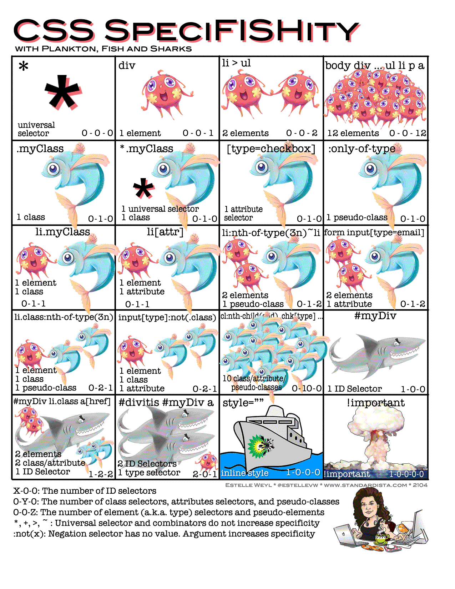

---

## Selectors

### Relations

| Relations | Notes                                                         |
| --------- | ------------------------------------------------------------- |
| `div p`   | All `<p>` that are descendents of `<div>`                     |
| `div > p` | All `<p>` that are direct children of `<div>`                 |
| `div ~ p` | All `<p>` to the right of `<div>` within the same parent      |
| `div + p` | A single `<p>` to the right of `<div>` within the same parent |

```html
<!DOCTYPE html>

<link rel="stylesheet" href="css/normalize.css" />

<style>
	* {
		box-sizing: border-box;
	}

	section + p {
		color: red;
	}
</style>

<section>
	<div>
		<p>Paragraph 1 inside div</p>
		<p>Paragraph 2 inside div</p>
	</div>

	<p>Paragraph 1 inside section</p>
	<p>Paragraph 2 inside section</p>
</section>

<p>Outer paragraph 1</p>
<p>Outer paragraph 2</p>
```

---

### Attribute selectors

| Attribute selectors | Notes                                                                                                                                  |
| ------------------- | -------------------------------------------------------------------------------------------------------------------------------------- |
| `[type]`            | Attribute "type" is present                                                                                                            |
| `[type="radio"]`    | Attribute value is "radio"                                                                                                             |
| `[type^="rad"]`     | Value starts with "rad"                                                                                                                |
| `[type*="ad"]`      | Value has a substring "ad"                                                                                                             |
| `[class~="delete"]` | Attribute has a "delete" value as one of the values in the list (e.g. `class="container delete upper"` but **not** `class="undelete"`) |
| `[type$="io"]`      | Value ends with "io"                                                                                                                   |

---

### [Pseudo-classes](https://developer.mozilla.org/en-US/docs/Web/CSS/Pseudo-classes)

| Pseudoclasses        | Notes                                           |
| -------------------- | ----------------------------------------------- |
| `:first-child`       | Any 1st child of its parent                     |
| `:last-child`        | Any last child of its parent                    |
| `:only-child`        | Any single child of its parent                  |
| `:nth-child(2n - 1)` | Children 1, 3, 5, ... of its parent of any type |

**Note**: when you do `p:nth-child...`, it will count **any** elements and **after that** will apply the `p` filter to them. So the result might be counterintuitive.

```html
<!DOCTYPE html>

<link rel="stylesheet" href="css/normalize.css" />

<style>
	* {
		box-sizing: border-box;
	}

	body {
		margin: 10px;
		border: 2px solid black;
	}

	section {
		margin-left: 20px;
		border: 2px solid red;
	}

	div {
		margin-left: 20px;
		border: 2px solid blue;
	}

	p {
		margin-left: 20px;
	}

	p:nth-child(2n + 1) {
		color: blue;
	}
</style>

BODY
<section>
	SECTION
	<div>
		DIV
		<p>P1 inside DIV</p>
		<p>P2 inside DIV</p>
	</div>

	<p>P1 inside SECTION</p>
	<p>P2 inside SECTION</p>
</section>

<p>Outer P1</p>
<p>Outer P2</p>
<p>Outer P3</p>
<p>Outer P4</p>
<p>Outer P5</p>
<p>Outer P6</p>
```

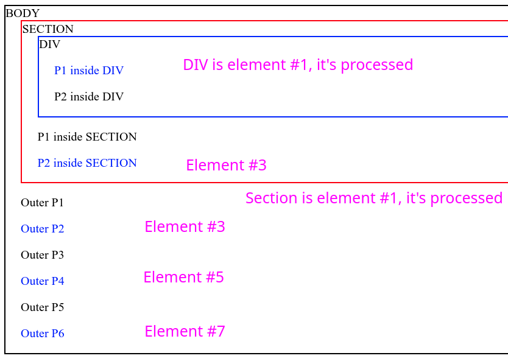

If you want to count **spicifically** some elements, you should use these:

| Pseudoclasses          | Notes                                        |
| ---------------------- | -------------------------------------------- |
| `:first-of-type`       | 1st child of its parent of a specific type   |
| `:last-of-type`        | last child of its parent of a specific type  |
| `:only-of-type`        | Specific single child of its parent          |
| `:nth-of-type(2n - 1)` | Specific children 1, 3, 5, ... of its parent |

Note: `p:nth-of-type...` will county **only** `p`.

```html
<!DOCTYPE html>

<link rel="stylesheet" href="css/normalize.css" />

<style>
	* {
		box-sizing: border-box;
	}

	body {
		margin: 10px;
		border: 2px solid black;
	}

	section {
		margin-left: 20px;
		border: 2px solid red;
	}

	div {
		margin-left: 20px;
		border: 2px solid blue;
	}

	p {
		margin-left: 20px;
	}

	p:nth-of-type(2n - 1) {
		color: blue;
	}
</style>

BODY
<section>
	SECTION
	<div>
		DIV
		<p>P1 inside DIV</p>
		<p>P2 inside DIV</p>
	</div>

	<p>P1 inside SECTION</p>
	<p>P2 inside SECTION</p>
</section>

<p>Outer P1</p>
<p>Outer P2</p>
<p>Outer P3</p>
<p>Outer P4</p>
<p>Outer P5</p>
<p>Outer P6</p>
```

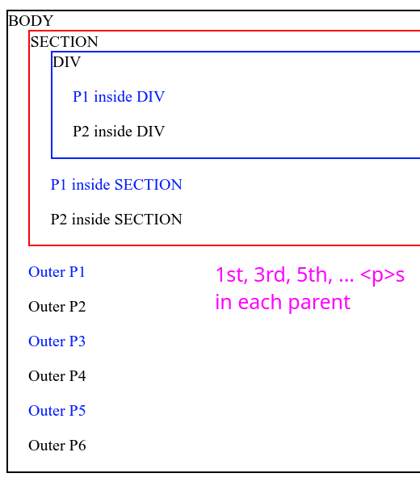

---

| Other pseudoclasses                 | Notes                                                                                                                                                                                      |
| ----------------------------------- | ------------------------------------------------------------------------------------------------------------------------------------------------------------------------------------------ |
| `:not(selector)`                    | Anything except this selector                                                                                                                                                              |
| `:focus`                            | Focused element                                                                                                                                                                            |
| `:hover`                            | Hovered element                                                                                                                                                                            |
| `:empty`                            | Without child nodes (even text)                                                                                                                                                            |
| `:checked`, `:disabled`, `:enabled` | States of `<input>`                                                                                                                                                                        |
| `:link`                             | Not visited links                                                                                                                                                                          |
| `:visited`                          | Visited links                                                                                                                                                                              |
| `:any-link`                         | Any links                                                                                                                                                                                  |
| `:local-link`                       | Links which URL is the same as the current URL                                                                                                                                             |
| `:target`                           | Element which `id` matches the current `#` anchor in the current URL. E.g. if the current URL is `https://site.com/content#intro`, then `:target` will match the element with `id="intro"` |
| `:playing`                          | Media element capable of playing that is currently playing                                                                                                                                 |
| `:paused`                           | Media element capable of playing that is currently paused                                                                                                                                  |

---

### [Pseudo-elements](https://developer.mozilla.org/en-US/docs/Web/CSS/Pseudo-elements)

Pseudo-elements are helper elements that browser adds to the document.

| Pseudo-elements | Notes                                                                                                            |
| --------------- | ---------------------------------------------------------------------------------------------------------------- |
| `::before`      | Creates a pseudo-element before the first child of the selected element, often used with the `content` property. |
| `::after`       | The same for the last element                                                                                    |

Example 1:

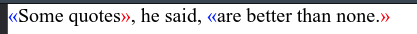

```html
<!DOCTYPE html>

<link rel="stylesheet" href="css/normalize.css" />

<style>
	* {
		box-sizing: border-box;
	}

	q::before {
		content: '«';
		color: blue;
	}

	q::after {
		content: '»';
		color: red;
	}
</style>

<q>Some quotes</q>, he said, <q>are better than none.</q>
```

Example 2:

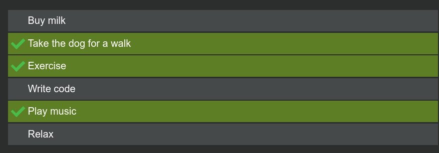

```html
<!DOCTYPE html>

<link rel="stylesheet" href="css/normalize.css" />

<style>
	* {
		box-sizing: border-box;
	}

	body {
		background: #2c2e2e;
	}

	li {
		list-style-type: none;
		position: relative;
		margin: 2px;
		padding: 0.5em 0.5em 0.5em 2em;
		color: #fefefe;
		background: #46494a;
		font-family: sans-serif;
	}

	li.done {
		background: #5b7f1e;
	}

	li.done::before {
		content: '';
		position: absolute;
		border-color: #3fbe46;
		border-style: solid;
		border-width: 0 0.3em 0.25em 0;
		height: 1em;
		top: 1.3em;
		left: 0.6em;
		margin-top: -1em;
		transform: rotate(45deg);
		width: 0.5em;
	}
</style>

<ul>
	<li>Buy milk</li>
	<li>Take the dog for a walk</li>
	<li>Exercise</li>
	<li>Write code</li>
	<li>Play music</li>
	<li>Relax</li>
</ul>

<script>
	const list = document.querySelector('ul')
	list.addEventListener('click', (e) => {
		const target = e.target.closest('li')
		if (target) {
			target.classList.toggle('done')
		}
	})
</script>
```

---

## CSS Units

All units can be fractional - browser will round them up itself.

| Units          | Notes                                                                                                                               |
| -------------- | ----------------------------------------------------------------------------------------------------------------------------------- |
| `px`           | absolute units                                                                                                                      |
| `em`           | relative to the current font size                                                                                                   |
| `%`            | percentage is taken from different values: parent property, document size, window size, etc.                                        |
| `rem`          | a mix of `px` and `em`, relative to the font size of `<html>`. Useful for increasing the text size without scaling everything else. |
| `vw`, `vh`     | 1% of the screen width/height.                                                                                                      |
| `vmin`, `vmax` | min/max of the pair above                                                                                                           |

---

## Box-model

### `margin`

Vertical margins **collapse**, horizontal ones - don't.

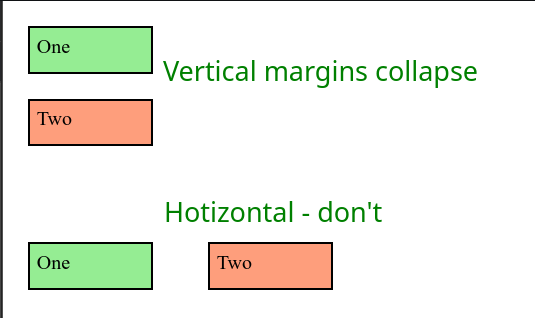

```html
<!DOCTYPE html>

<link rel="stylesheet" href="css/normalize.css" />

<style>
	* {
		box-sizing: border-box;
	}

	div {
		width: 100px;
		height: 38px;

		margin: 20px;
		border: 2px solid black;
		padding: 5px;
	}
</style>

<div style="background-color: lightgreen;">One</div>
<div style="background-color: lightsalmon;">Two</div>

<br /><br />

<div style="background-color: lightgreen; display: inline-block;">One</div>
<div style="background-color: lightsalmon; display: inline-block;">Two</div>
```

---

We can use either `margin-left/top` or `position: relative` to move some elements a bit. The difference is:

- **negative** `margin-left/top` moves the element and makes other elements take up the freed space
- **negative** `margin-right/bottom` makes other elements think our element has **shortened**
- `positon: relative` moves our element and other elements don't react to this in any way

Negative margin-top:

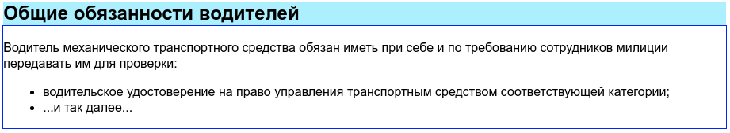

```css
h2 {
	margin-top: -1.3em;
}
```

Negative margin-bottom:

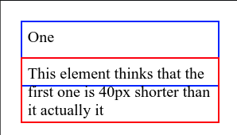

```html
<!DOCTYPE html>

<link rel="stylesheet" href="css/normalize.css" />

<style>
	* {
		box-sizing: border-box;
	}

	div {
		width: 200px;
		height: 66px;

		margin: 20px;
		border: 2px solid black;
		padding: 5px;
	}
</style>

<div style="border: 2px solid blue; margin-bottom: -49px">One</div>
<div style="border: 2px solid red; margin-bottom: -40px">
	This element thinks that the first one is 40px shorter than it actually it
</div>
```

`position: relative`:

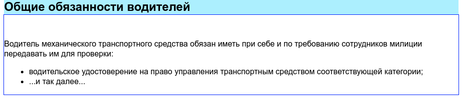

```css
h2 {
	position: relative;
	top: -1.3em;
}
```

---

## Positioning

Positioning refers to how elements are positioned in the document relative to it and each other. They can be positioned and moved in many ways.

---

### `display`

`display: table | table-row | table-cell | ...` are useful for making elements standing as a table next to each other.

**This is an actual table. And they are relevant**. Can be nicely used for forms:

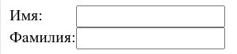

`<table>, <tr>, <td>, ...` - are just elements with pre-defined `display` properties:

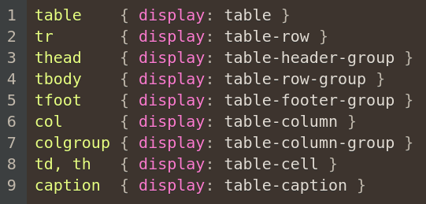

---

### `float`

https://learn.javascript.ru/float

`float: left | right | none`

Places an element on the left or right side **of either its container or another floated element**, until it touches the edge.

Text and inline elements wrap it around.

The element is removed from the normal flow of the page, though still remaining a part of the flow.

The element with `float` gets `display: block` but its width and height are still defined by default by its content.

Vertical margins of the floated blocks don't collapse with neighbors as usual.

Prerequisits:

```html
<div class="parent-top">
	<span>Span text 1</span>
	<div class="child1">height: 100 px;</div>
	<span
		>Span text 2 2 2 2 2 2 2 2 2 2 2 2 2 2 2 2 2 2 2 2 2 2 2 2 2 2 2 2 2 2 2 2 2
		2 2 2 2 2 2 2 2 2 2 2 2 2 2 2 2 2 2 2 2 2 2 2 2 2 2 2 2 2 2 2 2 2 2 2 2 2 2
		2 2 2 2 2 2 2 2 2 2 2 2 2 2 2 2 2 2 2 2 2 2 2 2 2 2 2 2 2 2 2 2 2 2 2 2 2 2
		2 2 2 2 2 2 2
	</span>
	<div class="child2">^_^</div>
	<span
		>Span text 3 3 3 3 3 3 3 3 3 3 3 3 3 3 3 3 3 3 3 3 3 3 3 3 3 3 3 3 3 3 3 3 3
		3 3 3 3 3 3 3 3 3 3 3 3 3 3 3 3 3 3 3 3 3 3 3 3 3 3 3 3 3 3 3 3 3 3 3 3 3 3
		3 3 3 3 3 3 3 3 3 3 3 3 3 3 3 3 3 3 3 3 3 3 3 3 3 3 3 3 3 3 3 3 3 3 3 3 3 3
		3 3 3 3 3 3 3
	</span>
	<div class="child3">height: 200 px;</div>
	<span>Span text 4</span>
</div>
```

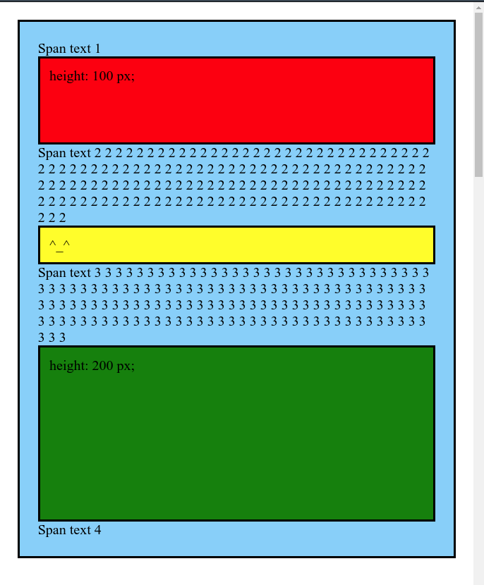

Now we add `float`

```scss
.child2 {
	background-color: yellow;
	top: 0px;

	float: right;
}
```

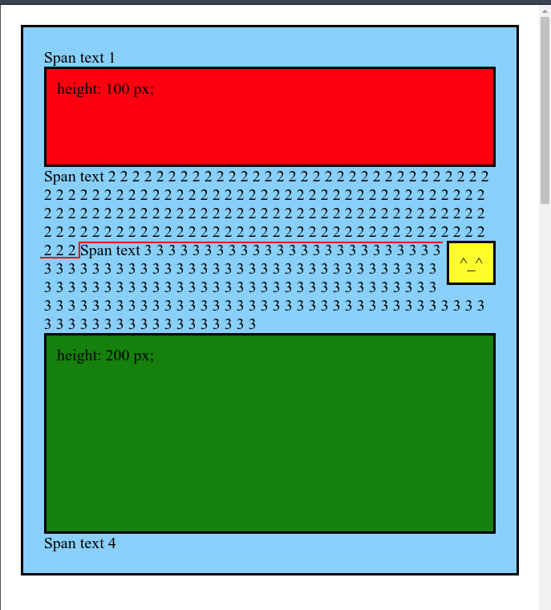

We can see that the yellow block now sticks to the right side of the parent element right after the "Span text 2" element - just as in our HTML. But the further **inline** elements ("Span text 3") and text took the free space around it.

But how will **block** elements behave? They will try to fit in (if something other isn't set explicitly):

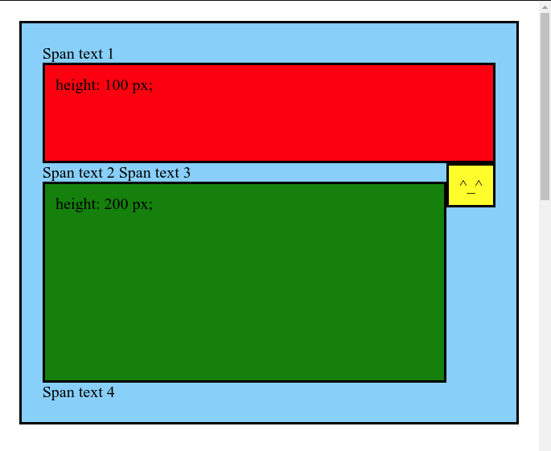

---

Parents don't allocate space for the floated children:

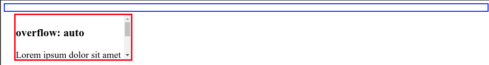

But we can set `overflow: auto | hidden` to force it allocate space (just uncomment `overflow`):

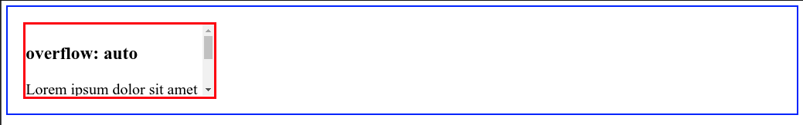

```html
<!DOCTYPE html>

<link rel="stylesheet" href="css/normalize.css" />

<style>
	* {
		box-sizing: border-box;
	}

	.parent {
		border: 2px solid blue;
		margin: 5px;
		padding: 5px;

		/* overflow: auto; */
	}

	.child {
		float: left;

		overflow: auto;
		margin: 10px;
		width: 200px;
		height: 80px;
		border: 3px solid red;
	}
</style>

<div class="parent">
	<div class="child">
		<h3>overflow: auto</h3>
		Lorem ipsum dolor sit amet consectetur adipisicing elit. Tempora cum aperiam
		aut perspiciatis repellendus ipsam dignissimos mollitia rem iusto autem,
		sint dolore rerum ipsum, minus aspernatur doloremque omnis, animi est!
	</div>
</div>
```

---

### `clear`

`clear: none | left | right | both`

Sets whether an element must be moved below floating elements that precede it. Besically forbids wrapping the floating elements nearby.

It moves the `border-top` edge of the element below the `margin-bottom` of the floating elements above.

```scss
.child3 {
	background-color: green;
	height: 200px;

	clear: both;
}
```

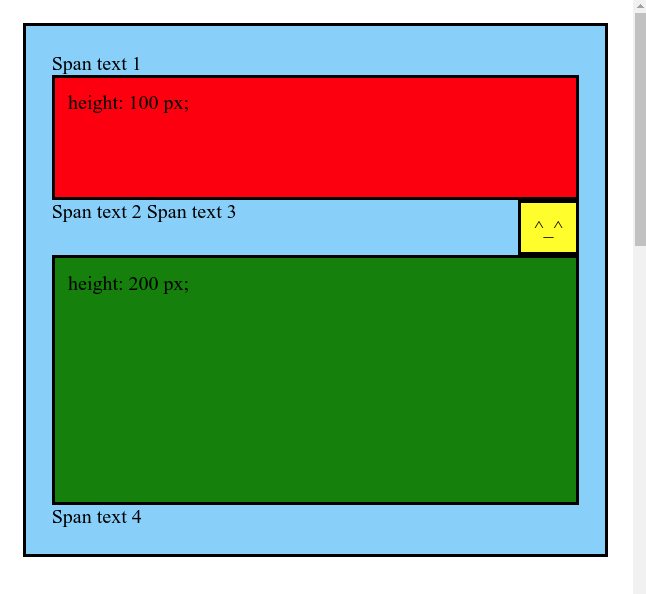

But what if we had `margin-top` for our green block? It wouldn't work because of the algorithm described above:

```scss
.child3 {
	background-color: green;
	height: 200px;

	margin-top: 20px;

	clear: both;
}
```

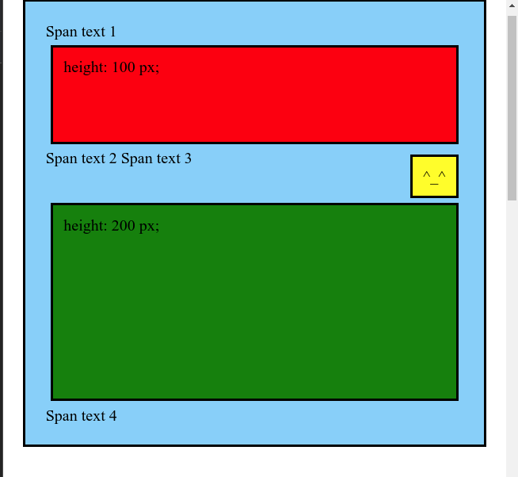

To fix this, we can insert an empty block with `clear: both` between our elements. And we remove `clear: both` from our green block.

```html
<section class="parent-top">
	<span>Span text 1</span>
	<section class="child1">height: 100 px;</section>

	<span>Span text 2 </span>
	<section class="child2">^_^</section>
	<span>Span text 3 </span>

	<div style="clear:both; "></div>
	<!-- here -->

	<section class="child3">height: 200 px;</section>
	<span>Span text 4</span>
</section>
```

Sometimes the floated element can pop out of the parent element since the parent doesn't allocat space for it. In this case, add this `clearfix` class to the parent - it will lengthen the parent to contain the floated block fully.

```scss
.clearfix:after {
	content: '.';
	display: block;
	clear: both;
	visibility: hidden;
	height: 0;
}
```

---

### `left`, `right`, `top`, `bottom`, `z-index`

These properties set the **offset from s cetrain edge of the document**.

But they only affect elements that are **not** `position: static`.

Negative values are allowed.

Using both `left` and `right` (or `top` and `bottom`) doesn't work for `relative` but works for `absolute` and `fixed`.

```scss
.element {
	position: relative;
	left: -20px;
	top: 5px;
}
```

---

### `position`

```html
<!DOCTYPE html>

<link rel="stylesheet" href="css/style.css" />

<style>
	* {
		box-sizing: border-box;
	}

	body {
		margin: 0;
		padding: 0;
		height: 3000px;
	}

	section {
		padding: 10px;
		border: 3px solid black;
		overflow: hidden;
	}

	.parent-top {
		background-color: lightskyblue;
		margin: 20px;
		padding: 20px;
	}

	.child1 {
		background-color: red;
		height: 100px;
	}

	.child2 {
		background-color: yellow;
	}

	.child3 {
		background-color: green;
		height: 200px;
	}
</style>

<section class="parent-top">
	<section class="child1">height: 100 px;</section>
	<section class="child2">^_^</section>
	<section class="child3">height: 200 px;</section>
</section>
```

| Value      | Normal flow | Positioned relative to                                                   | Notes                                                                                                                                                                                                                                                                                       |
| ---------- | ----------- | ------------------------------------------------------------------------ | ------------------------------------------------------------------------------------------------------------------------------------------------------------------------------------------------------------------------------------------------------------------------------------------- |
| `static`   | Yes         | Parent                                                                   | **Default**. Elements **cannot** be moved in this mode.                                                                                                                                                                                                                                     |
| `relative` | Yes         | Parent                                                                   | `left`, `right`, `top`, `bottom,` `z-index` work now. Other elements behave as if our element didn't move anywhere.                                                                                                                                                                         |
| `absolute` | No          | Closest **positioned** (not `static`) ancestor . If none - the document. | The elements stays on the same spot visually but **is removed from the normal flow** (it means that other elements will now behave as if it doesn't exist). As soon as we apply `left`, `right`, `top`, `bottom`, `z-index` - our elements becomes positioned **relative to the document**. |
| `fixed`    | No          | Window                                                                   | The same as `absolute` but the element "sticks" to the screen **relative to the window**. It's **unaffected** by scrolling.                                                                                                                                                                 |
| `sticky`   | Yes         | Parent                                                                   | The element is positioned as "fixed" or "relative" depending on how it appears in the viewport. As a result the element is "stuck" when necessary while scrolling. You should specify where should it stick (most often `top: 0`).                                                          |

**Static**:

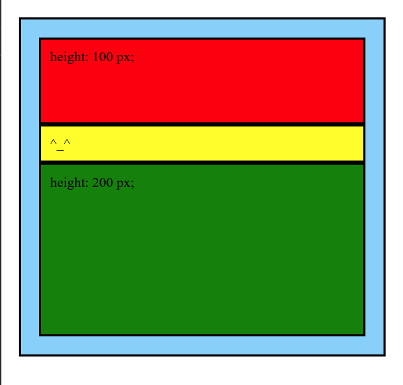

---

Now let's add **absolute** (yellow): it shrinks to the size needed by its content. It stays on the same spot. Other elements ignore it now.

```scss
.child2 {
	background-color: yellow;
	position: absolute;
}
```

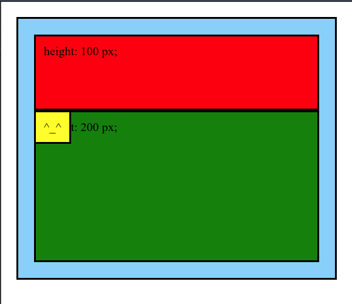

Now let's try to move our element - it's immediately re-positioned **relative to the document**.

```scss
.child2 {
	background-color: yellow;
	position: absolute;
	right: 15px;
	top: 5px;
}
```


We can also use both `left` and `right`, as well as `top` and `bottom` together. Just remember that it works bad with scrolls - you need other solutions in this case.

```scss
.child2 {
	background-color: yellow;
	position: absolute;
	right: 15px;
	left: 10px;
	top: 5px;
	bottom: 20px;
}
```

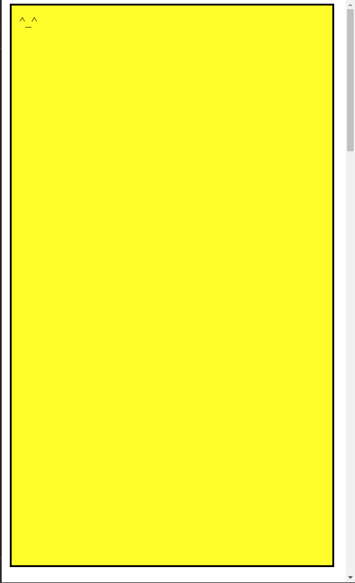

---

**Relative**: the element is moved where it was said but other elements act as if nothing changed:

```scss
.child2 {
	background-color: yellow;
	position: relative;
	right: 15px;
	top: 5px;
}
```

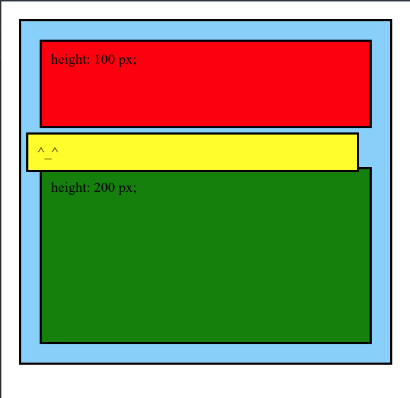

You **can't** use `right` and `left` together here (as well as `top` and `bottom`).

---

**Fixed** works well for modal windows.

---

**Sticky**: it may not work inside some containers - some **magic** is involved here. If it doesn't work, try adding more children to the container or the opposite - taking the element out of the container.

I couldn't made a child element sticky so I made the whole parent this way:

```scss
.parent-top {
	background-color: lightskyblue;
	margin: 20px;
	padding: 20px;
	position: sticky;
	top: 0;
}
```

---

## Flex

Sources:

1. https://tproger.ru/translations/how-css-flexbox-works/ - tutorial
2. https://flexboxfroggy.com/#ru - froggy
3. https://css-tricks.com/snippets/css/a-guide-to-flexbox/ - tutorial

Testing mockup:

```html
<!DOCTYPE html>

<link rel="stylesheet" href="css/style.css" />

<style>
	* {
		box-sizing: border-box;
	}

	body {
		margin: 0;
		padding: 0;
	}

	div {
		padding: 10px;
		border: 3px solid black;
		overflow: auto;
	}

	.container {
		display: flex;
		margin: 20px;
		padding: 20px;
		resize: both;
		background-color: #c7deeb;
	}

	.child1 {
		height: 100px;
		width: 80px;
		background-color: #3ae173;
	}

	.child2 {
		height: 80px;
		width: 100px;
		background-color: #ebc914;
	}

	.child3 {
		height: 100px;
		width: 100px;
		background-color: #d5363d;
	}

	.child4 {
		height: 100px;
		width: 150px;
		background-color: #3e9ed4;
	}

	.child {
		/* height: auto; */
	}
</style>

<section class="container">
	<div class="child1 child">1</div>
	<div class="child2 child">^_^</div>
	<div class="child3 child">3</div>
	<div class="child4 child">4</div>
</section>
```

---

### Container properties

#### `display`

`flex` - takes the full document width

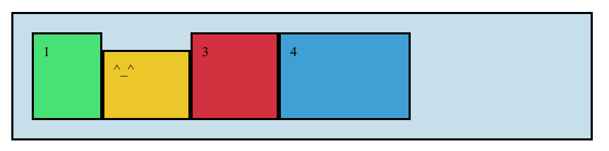

`inline-flex` - takes as much width as needed for the content (possibly with a scroll)

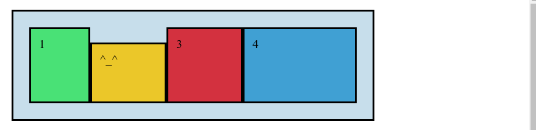

---

#### `flex-flow`

A shorthand property for `flex-direction` and `flex-wrap`

##### `flex-direction`

Sets the direction of the **main axis** of the container.

`row` - default


`row-reverse`

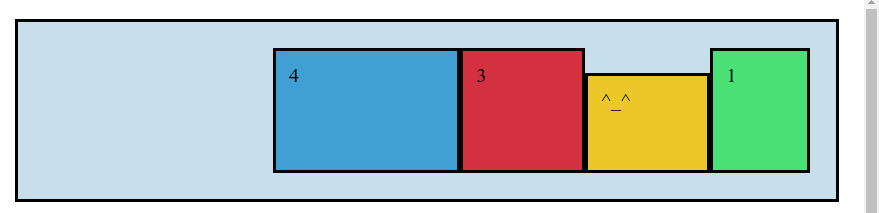

`column`

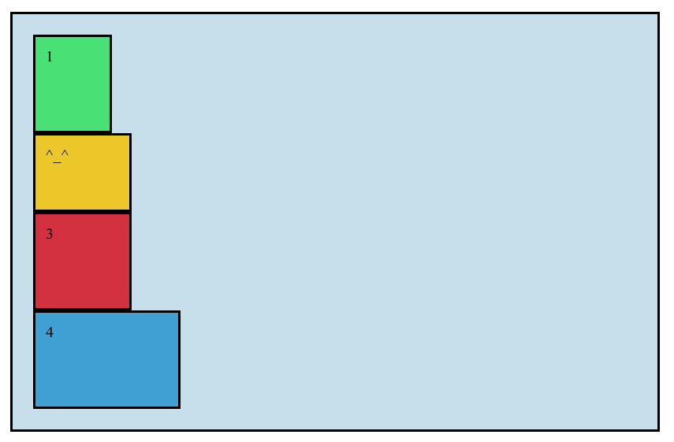

`column-reverse`

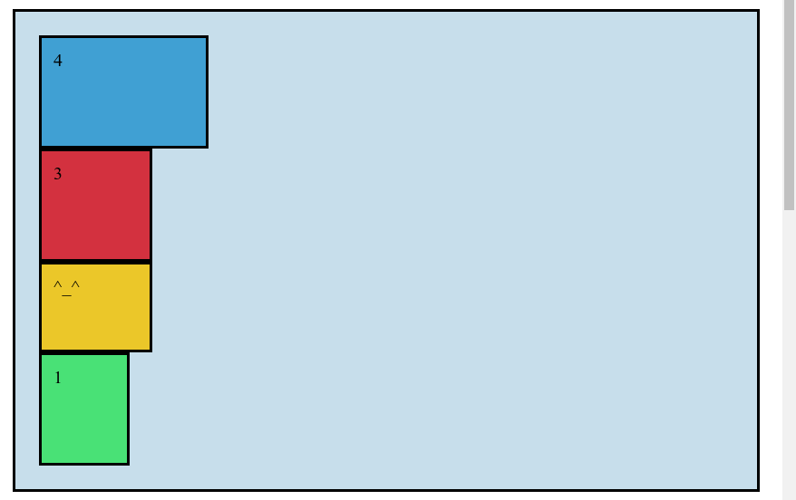

---

##### `flex-wrap`

Sets whether flex items are forced onto one line or can wrap onto multiple lines. Values: `nowrap | wrap | wrap-reverse`


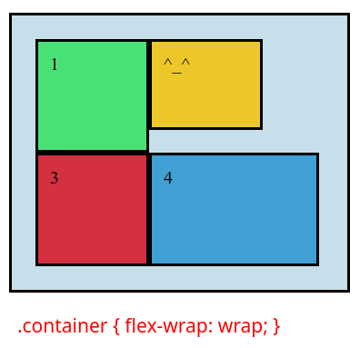

---

#### `justify-content`

Aligns flex items along the **main axis** of the container.

`flex-start` - default


`flex-end`

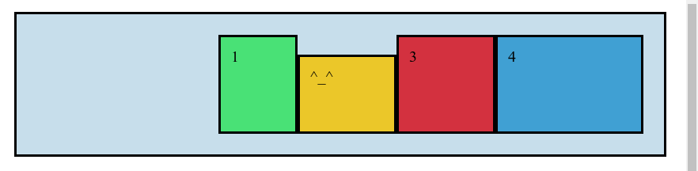

`center`

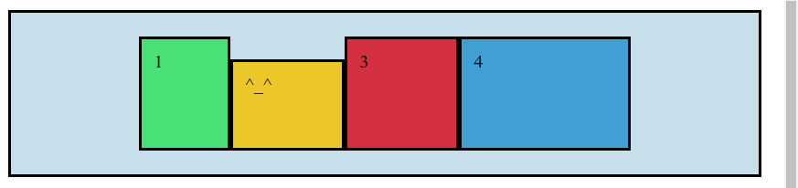

`space-between`

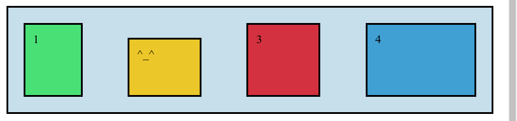

`space-around`

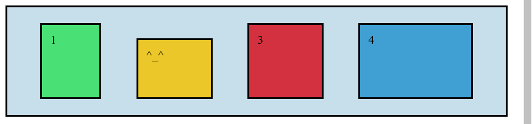

`space-evenly`

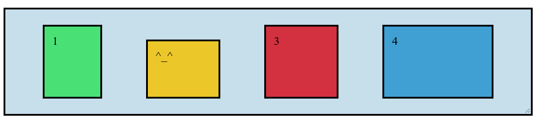

---

#### `align-items`

Aligns flex items along the **secondary axis** of the container, **perpendicular** to the main one.

`flex-start` - default (we added `height: 300px` in our example)

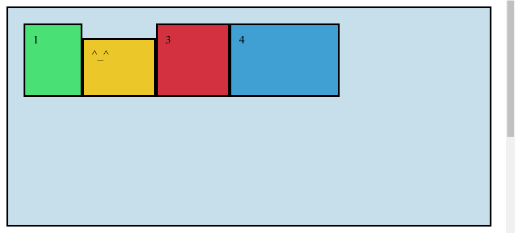

`flex-end`

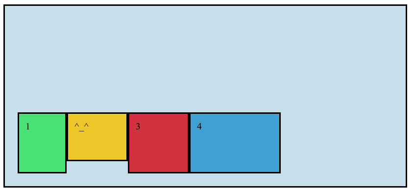

`center`

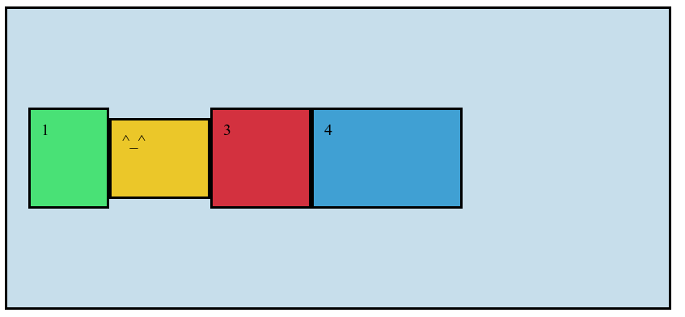

`stretch` (requires `height: auto` for the children to work)

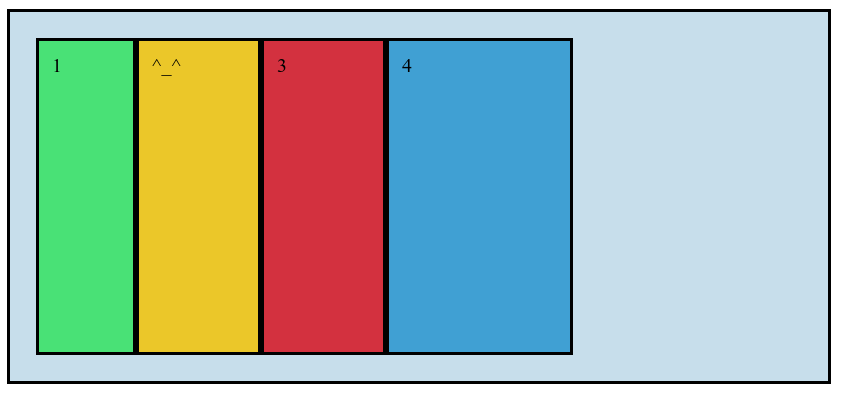

`baseline` - only noticeable when font-size is different for different blocks

---

### `align-content`

Sets the distribution of space between and around content items **on different lines**.

Values: `flex-start | flex-end | center | space-between | space-around | space-evenly`

For non-flex containers use `start | end` instead of `flex-start | flex-end`.

**Has no effect** on single line containers!

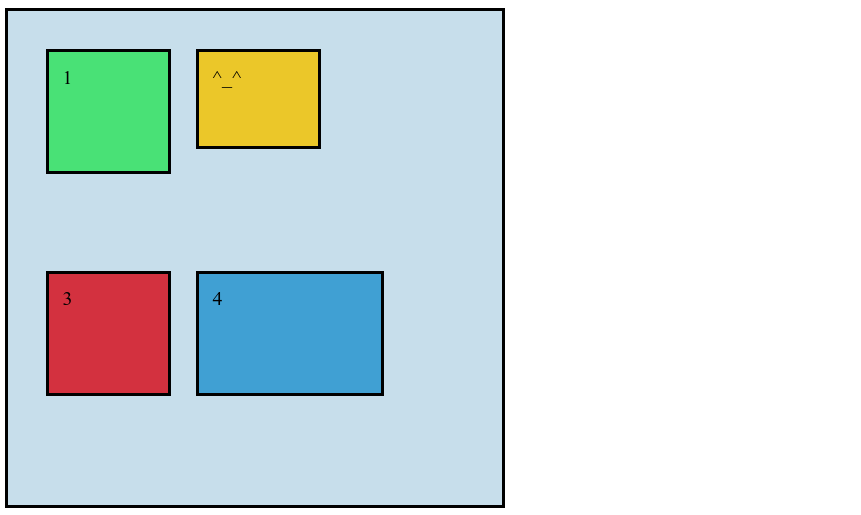


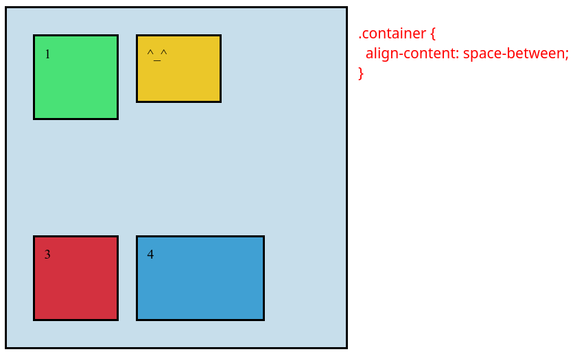

---

### Children properties

#### `align-self`

The same as `align-items` but for selected child elements.

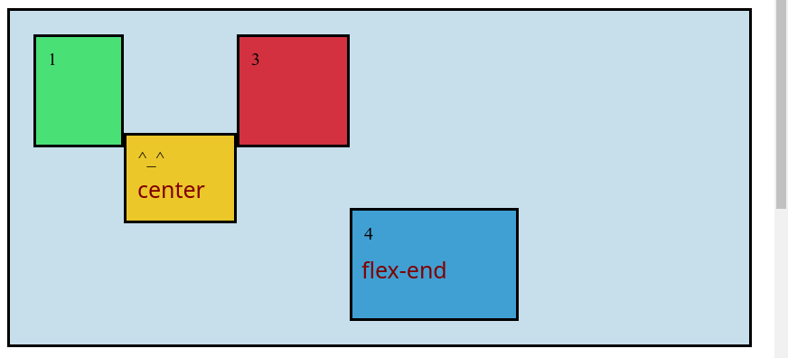

---

#### `flex`

##### `flex-grow`

##### `flex-shrink`

##### `flex-basis`

A shorthand property for `flex-grow`, `flex-shrink` and `flex-basis` combined. Default values are: `flex: 0 1 auto;`

- `flex-grow` resizes an element relative to other elements. `0` means it's forbidden to grow, positive numbers represent the bigger share of space taken compared to the neighbors with the lower values.
- `flex-shrink` is the same as `flex-grow` but decides how quickly the element will shrink compared to its neighbors when there isn't enough space. The bigger number - the faster shrinking.
- `flex-basis` sets the initial size of a flex item **along the main axis**.

Element can have a high `grow` and `shrink` values at the same time: it will be times bigger initially but will also shrink times quicker when there isn't enough space.

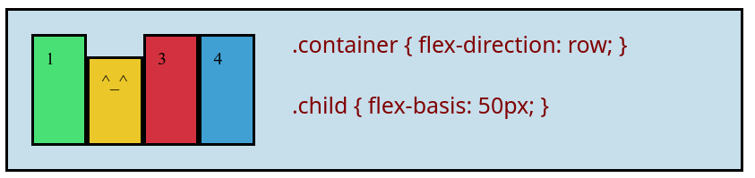

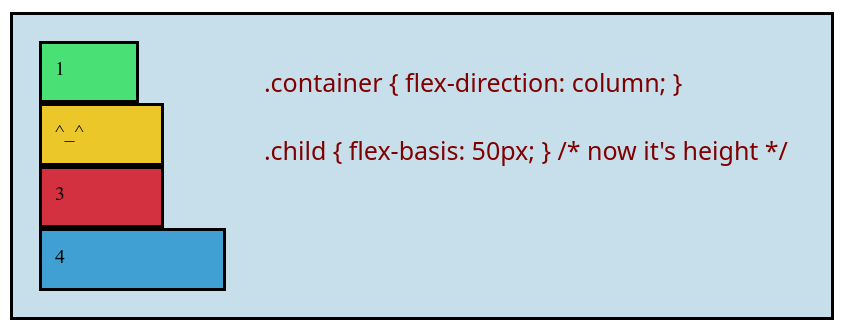

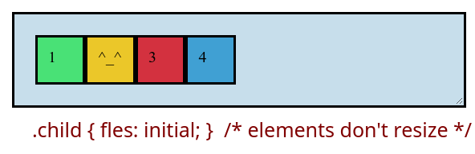

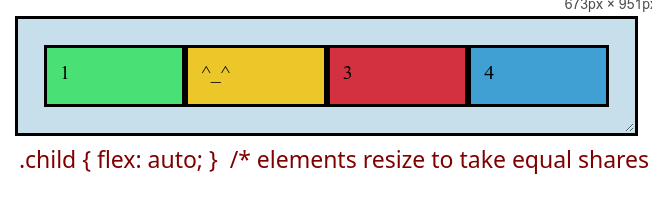

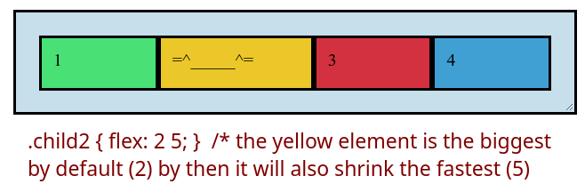

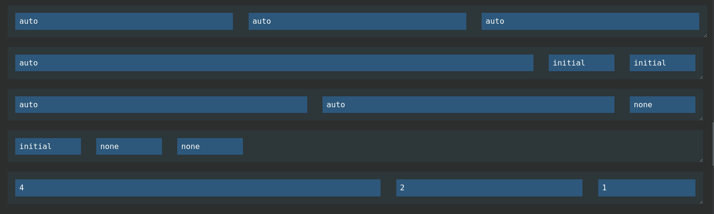

You can set `min-height` and `min-width` to forbid elements shrink below their content size.

---

#### `order`

Sets the order to lay out an item **visually** (without changing the actual HTML order) in a flex or grid container.

Items in a container are sorted:

1. by **ASC** `order` value (**negative** values will be the first one)
2. and then by their HTML order.

```css
.container {
	display: flex;
}

.child {
	order: 3;
}
```

---

## Grid

Sources:

1. https://tproger.ru/translations/css-flexbox-grid/
2. https://codepip.com/games/grid-garden/ - game

The CSS Grid Layout Module offers a grid-based layout system, with rows and columns, making it easier to design web pages without having to use floats and positioning.

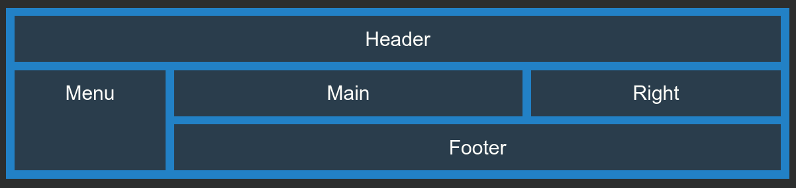

---

### Container properties

#### `display`

- `grid` - takes the full width of the document
- `inline-grid` - takes as much width as needed for the content

---

#### `grid-template-columns`

#### `grid-template-rows`

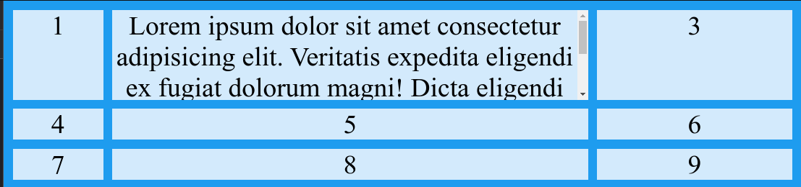

Defines the number of columns/rows and their width/height in your grid layout.

The value is a **space-separated-list** of values for the columns/rows:

- `auto`
- `50px`
- `40%`
- `max-content` - as much as needed for the content to be in one line
- `min-content` - as little as possible for the content to fit (the width of the longest word)
- a lot of other values

```html
<!DOCTYPE html>

<link rel="stylesheet" href="css/normalize.css" />

<style>
	* {
		box-sizing: border-box;
	}

	body {
		margin: 0;
		padding: 0;
	}

	.grid-container {
		display: grid;
		grid-template-columns: auto auto auto;
		grid-gap: 10px;
		padding: 10px;
		background-color: #1f99f1;
	}

	.grid-item {
		background-color: #d3eafc;
		text-align: center;
		font-size: 30px;
	}
</style>

<body>
	<div class="grid-container">
		<div class="grid-item">1</div>
		<div class="grid-item">2</div>
		<div class="grid-item">3</div>
		<div class="grid-item">4</div>
		<div class="grid-item">5</div>
		<div class="grid-item">6</div>
		<div class="grid-item">7</div>
		<div class="grid-item">8</div>
		<div class="grid-item">9</div>
	</div>
</body>
```

---

#### `justify-content`

Aligns the whole grid inside the container.

**NB**: The grid's total width has to be less than the container's width for this to work. This means the total sum of your columns should be less than 100%, e.g. `20% 20% 20%`

The values are the same: `start | end | center | space-around | space-between | space-evenly` and others.

---

#### `align-content`

Aligns the grid **vertically** inside the container.

**NB**: The grid's total height has to be less than the container's height for this to work. This means `height` of the container should be greater than the sum of its rows.

The values are the same: `start | end | center | space-around | space-between | space-evenly` and others.

```css
.grid-container {
	display: grid;
	grid-template-columns: 25% 25% 25%;
	justify-content: space-evenly;
	align-content: space-evenly;
	height: 200px;
	grid-gap: 10px;
	padding: 10px;
	background-color: #1f99f1;
}
```

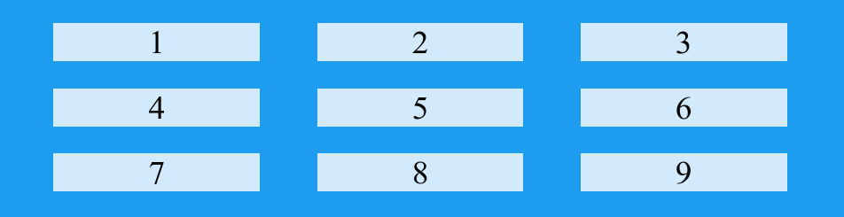

---

### Children properties

By default, a container has one grid item for each column, in each row. We can change that.

#### `grid-column`

A shorthand property for `grid-column-start` and `grid-column-end`.

Defines where the item will start, and where the item will end:

```css
/* The element #2 starts from column 2 and finishes before column 4 */
.grid-item:nth-child(2) {
	grid-column: 2 / 4;
}

/* The element #2 starts is prolonged for 3 columns */
.grid-item:nth-child(2) {
	grid-column: span 3;
}

/* The element #2 starts from column 3 and is getting prolonged for 2 columns */
.grid-item:nth-child(2) {
	grid-column: 3 / span 2;
}
```

The rest of the cells **reposition forward**.

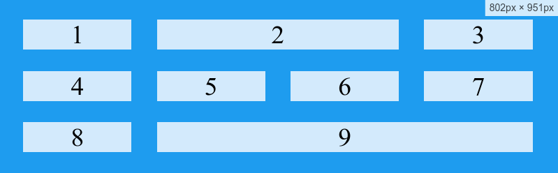

```html
<!DOCTYPE html>

<link rel="stylesheet" href="css/normalize.css" />

<style>
	* {
		box-sizing: border-box;
	}

	body {
		margin: 0;
		padding: 0;
	}

	.grid-container {
		display: grid;
		padding: 10px;
		grid-template-columns: 20% 20% 20% 20%;
		justify-content: space-evenly;
		align-content: space-evenly;
		height: 200px;
		grid-gap: 10px;
		background-color: #1f99f1;
	}

	.grid-item {
		background-color: #d3eafc;
		text-align: center;
		font-size: 30px;
	}

	.grid-item:nth-child(2) {
		grid-column: 2 / 4;
	}

	.grid-item:nth-child(9) {
		grid-column: span 3;
	}
</style>

<body>
	<div class="grid-container">
		<div class="grid-item">1</div>
		<div class="grid-item">2</div>
		<div class="grid-item">3</div>
		<div class="grid-item">4</div>
		<div class="grid-item">5</div>
		<div class="grid-item">6</div>
		<div class="grid-item">7</div>
		<div class="grid-item">8</div>
		<div class="grid-item">9</div>
	</div>
</body>
```

---

#### `grid-row`

A shorthand property for the `grid-row-start` and the `grid-row-end` properties.

Defines on which row to place an item.

Everything is the same as for `grid-column`.

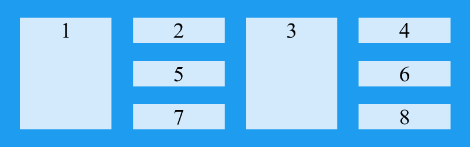

```html
<!DOCTYPE html>

<link rel="stylesheet" href="css/normalize.css" />

<style>
	* {
		box-sizing: border-box;
	}

	body {
		margin: 0;
		padding: 0;
	}

	.grid-container {
		display: grid;
		padding: 10px;
		grid-template-columns: 20% 20% 20% 20%;
		justify-content: space-evenly;
		align-content: space-evenly;
		height: 200px;
		grid-gap: 10px;
		background-color: #1f99f1;
	}

	.grid-item {
		background-color: #d3eafc;
		text-align: center;
		font-size: 30px;
	}

	.grid-item:nth-child(1) {
		grid-row: 1 / span 3;
	}

	.grid-item:nth-child(3) {
		grid-row: span 3;
	}
</style>

<body>
	<div class="grid-container">
		<div class="grid-item">1</div>
		<div class="grid-item">2</div>
		<div class="grid-item">3</div>
		<div class="grid-item">4</div>
		<div class="grid-item">5</div>
		<div class="grid-item">6</div>
		<div class="grid-item">7</div>
		<div class="grid-item">8</div>
	</div>
</body>
```

---

#### `grid-area`

Creates large areas of merged cells and works as a shorthand property for all the previous ones:

1. `grid-row-start`
2. `grid-column-start`
3. `grid-row-end`
4. `grid-column-end`


```html
<!DOCTYPE html>

<link rel="stylesheet" href="css/normalize.css" />

<style>
	* {
		box-sizing: border-box;
	}

	body {
		margin: 0;
		padding: 0;
	}

	.grid-container {
		display: grid;
		padding: 10px;
		grid-template-columns: 20% 20% 20% 20%;
		justify-content: space-evenly;
		align-content: space-evenly;
		height: 200px;
		grid-gap: 10px;
		background-color: #1f99f1;
	}

	.grid-item {
		background-color: #d3eafc;
		text-align: center;
		font-size: 30px;
	}

	.grid-item:nth-child(2) {
		grid-area: 1 / 2 / span 2 / span 2;
	}
</style>

<body>
	<div class="grid-container">
		<div class="grid-item">1</div>
		<div class="grid-item">2</div>
		<div class="grid-item">3</div>
		<div class="grid-item">4</div>
		<div class="grid-item">5</div>
	</div>
</body>
```

We can re-position items any way we want setting explicitly the item's positions.

This (from the example above):

```css
.grid-item:nth-child(2) {
	grid-area: 1 / 2 / span 2 / span 2;
}
```

to this:

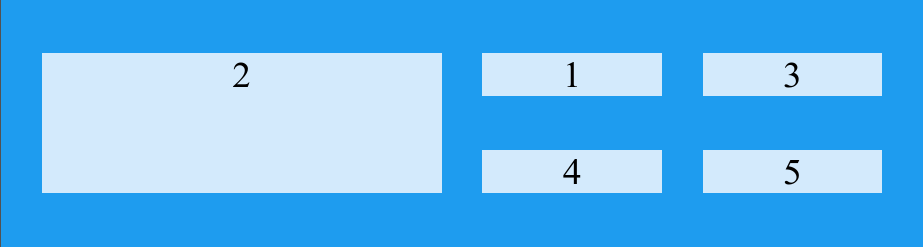

```css
.grid-item:nth-child(2) {
	grid-area: 1 / 1 / 3 / span 2;
}
```

---

It can also be used to **name** your grid items:


```css
.item1 {
	grid-area: myArea;
}
.grid-container {
	grid-template-areas: 'myArea myArea . . .' 'myArea myArea . . .';
}
```

**Full example**:

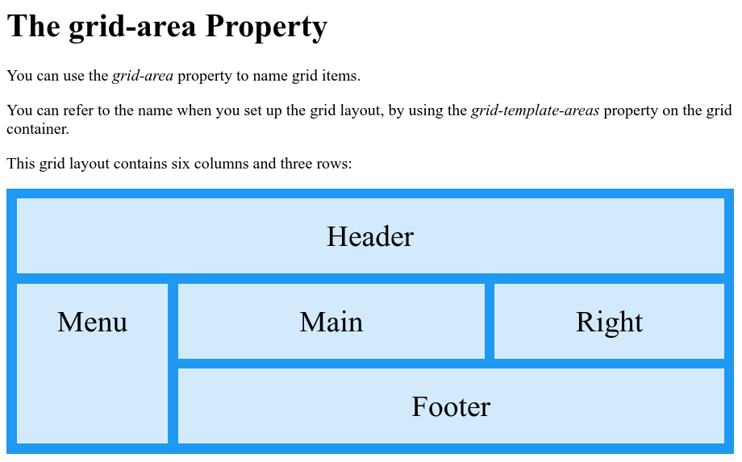

```html
<!DOCTYPE html>
<html>
	<head>
		<style>
			.item1 {
				grid-area: header;
			}
			.item2 {
				grid-area: menu;
			}
			.item3 {
				grid-area: main;
			}
			.item4 {
				grid-area: right;
			}
			.item5 {
				grid-area: footer;
			}

			.grid-container {
				display: grid;
				grid-template-areas:
					'header header header header header header'
					'menu main main main right right'
					'menu footer footer footer footer footer';
				grid-gap: 10px;
				background-color: #2196f3;
				padding: 10px;
			}

			.grid-container > div {
				background-color: rgba(255, 255, 255, 0.8);
				text-align: center;
				padding: 20px 0;
				font-size: 30px;
			}
		</style>
	</head>

	<body>
		<h1>The grid-area Property</h1>

		<p>You can use the <em>grid-area</em> property to name grid items.</p>

		<p>
			You can refer to the name when you set up the grid layout, by using the
			<em>grid-template-areas</em> property on the grid container.
		</p>

		<p>This grid layout contains six columns and three rows:</p>

		<div class="grid-container">
			<div class="item1">Header</div>
			<div class="item2">Menu</div>
			<div class="item3">Main</div>
			<div class="item4">Right</div>
			<div class="item5">Footer</div>
		</div>
	</body>
</html>
```

---

## Aligning

### Horizontal

#### Inline

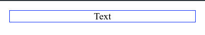

- `text-align: center | left | right | justify`
- `flex`

```html
<!DOCTYPE html>

<style>
	* {
		box-sizing: border-box;
	}

	body {
		margin: 0;
		padding: 0;
	}

	.outer {
		border: 1px solid blue;
		margin: 15px;

		text-align: center;
	}
</style>

<div class="outer">Text</div>
```

---

#### Block

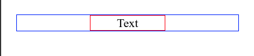

1. `margin: 0 auto`
2. `flex`

Example:

```html
<!DOCTYPE html>

<style>
	* {
		box-sizing: border-box;
	}

	body {
		margin: 0;
		padding: 0;
	}

	div {
		margin: 20px;
	}

	.outer {
		border: 1px solid blue;
		text-align: center;
		position: relative;
	}

	.inner {
		width: 100px;
		border: 1px solid red;

		margin: 0 auto;
	}
</style>

<div class="outer">
	<div class="inner">Text</div>
</div>
```

---

### Vertical

#### Inline

1. `flex`

---

#### Block

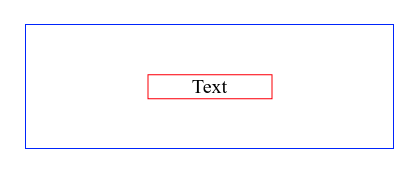

1. `position: absolute`:

```css
.center {
	position: absolute;
	top: 50%;
	left: 50%;
	/* margin-right: -50%; */
	transform: translate(-50%, -50%);
}
```

Example:

```html
<!DOCTYPE html>

<style>
	* {
		box-sizing: border-box;
	}

	body {
		margin: 0;
		padding: 0;
	}

	div {
		margin: 20px;
	}

	.outer {
		border: 1px solid blue;
		height: 100px;

		text-align: center;
		position: relative;
	}

	.inner {
		width: 100px;
		border: 1px solid red;

		margin: 0 auto;

		position: absolute;
		top: 50%;
		left: 50%;
		transform: translate(-50%, -50%);
	}
</style>

<div class="outer">
	<div class="inner">Text</div>
</div>
```

2. `flex`

Example:

```html

```

3. `inline-block` helper element:

```html
<!DOCTYPE html>

<style>
	* {
		box-sizing: border-box;
	}

	body {
		margin: 0;
		padding: 0;
	}

	div {
		margin: 20px;
	}

	.outer {
		border: 1px solid blue;
		height: 100px;

		text-align: center;
	}

	.before {
		display: inline-block;
		height: 100%;
		vertical-align: middle;
	}

	.inner {
		width: 100px;
		border: 1px solid red;
		display: inline-block;
		vertical-align: middle;
	}
</style>

<div class="outer">
	<span class="before"></span>
	<!-- Helper element -->
	<span class="inner"> Text </span>
</div>
```

---

## Miscellaneous

### `outline`

Adds additional frame around the element, **outside of its borders**.

It works for all 4 sides, you don't have control over them separately.

Outlines don't take space so they can overlap with other elements. Can be used to emphasize elements without moving them for example, on hover.

`outline-offset` sets up the offset from the border.

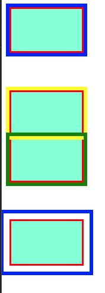

```html
<!DOCTYPE html>

<style>
	* {
		box-sizing: border-box;
	}

	body {
		margin: 0;
		padding: 0;
	}

	div {
		margin: 10px 10px 50px;
		border: 3px solid red;
		padding: 5px;
		background-color: aquamarine;
		width: 100px;
		height: 62px;
	}
</style>

<div style="outline: 5px solid blue;"></div>

<div style="outline: 5px solid yellow; margin: 0 10px 0;"></div>
<div style="outline: 5px solid green; margin: 0 10px 0;"></div>

<div
	style="outline: 5px solid blue; outline-offset: .5rem; margin-top: 50px;"
></div>
```

---

### `overflow`

- `overflow: visible | hidden | scroll | auto`
- `overflow-x` - same for `x` only
- `overflow-y` - same for `y` only

Default:

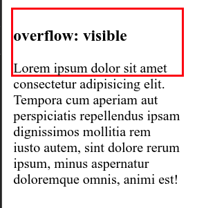

Hidden content isn't available:

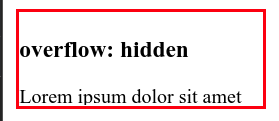

Scroll always:

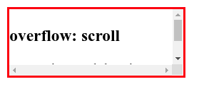

Scroll if needed:

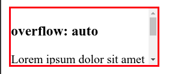

---

### `height`

Setting `height: 100%` only works for the element if its parent element has a strict height.

If the parent's height is defined by its content, setting `height: 100%` on the child **won't work**. It will automatically change to `height: auto` - the same as its parent.

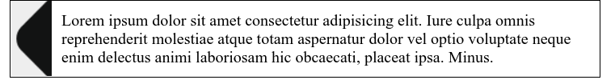

```html
<!DOCTYPE html>

<link rel="stylesheet" href="css/normalize.css" />

<style>
	* {
		box-sizing: border-box;
	}

	.container {
		position: relative;
		margin: auto;
		border: 1px solid black;
		padding: 10px 5px;
		max-width: 80%;
	}

	.toggler {
		position: absolute;
		left: 0;
		top: 0;
		float: left;
		height: 100%;
		width: 40px;

		cursor: pointer;
		background: #eee
			url(https://icons-for-free.com/iconfiles/png/512/arrows+double+arrow+doublechevronleft+left+icon-1320185729725994033.png)
			center center no-repeat;
	}

	.content {
		margin-left: 45px;
	}
</style>

<div class="container">
	<div class="toggler"></div>
	<div class="content">
		Lorem ipsum dolor sit amet consectetur adipisicing elit. Iure culpa omnis
		reprehenderit molestiae atque totam aspernatur dolor vel optio voluptate
		neque enim delectus animi laboriosam hic obcaecati, placeat ipsa. Minus.
	</div>
</div>
```

If you **parent** has `min-height`, you should also set `height: 1px` for the child element to take 100% height:

```css
.parent {
	min-height: 300px;
	height: 1px; /* <--- */
}

.child {
	height: 100%;
}
```

---

## Practice

### Gallery

https://learn.javascript.ru/float#raznitsa-inline-block-i-float

#### `float` solution

```html
<!DOCTYPE html>
<html lang="en">
	<head>
		<meta charset="UTF-8" />
		<meta name="viewport" content="width=device-width, initial-scale=1.0" />
		<title>CSS</title>
		<link rel="stylesheet" href="css/style.css" />
	</head>

	<body>
		<ul class="gallery clearfix">
			<li>
				
				<div>Картинка 1</div>
			</li>

			<li>
				
				<div>Картинка 2</div>
			</li>

			<li>
				
				<div>Картинка 3</div>
			</li>

			<li>
				
				<div>Картинка 4</div>
			</li>

			<li>
				
				<div>Картинка 5</div>
			</li>

			<li>
				
				<div>Картинка 6</div>
			</li>

			<li>
				
				<div>Картинка 7</div>
			</li>

			<li>
				
				<div>Картинка 8</div>
			</li>

			<li>
				
				<div>Картинка 9</div>
			</li>
		</ul>
	</body>
</html>
```

```scss
* {
	box-sizing: border-box;
}

body {
	margin: 0;
	padding: 0;
	height: 3000px;
}

.clearfix:after {
	content: '.';
	display: block;
	clear: both;
	visibility: hidden;
	height: 0;
}

.gallery {
	list-style: none;
	border: 3px solid brown;
	margin: 10px;

	li {
		float: left;
		margin: 5px;
		text-align: center;
		border: 1px solid black;
	}
}
```

That's how it would look **without** a `clearfix` in the parent element (`<ul>`):

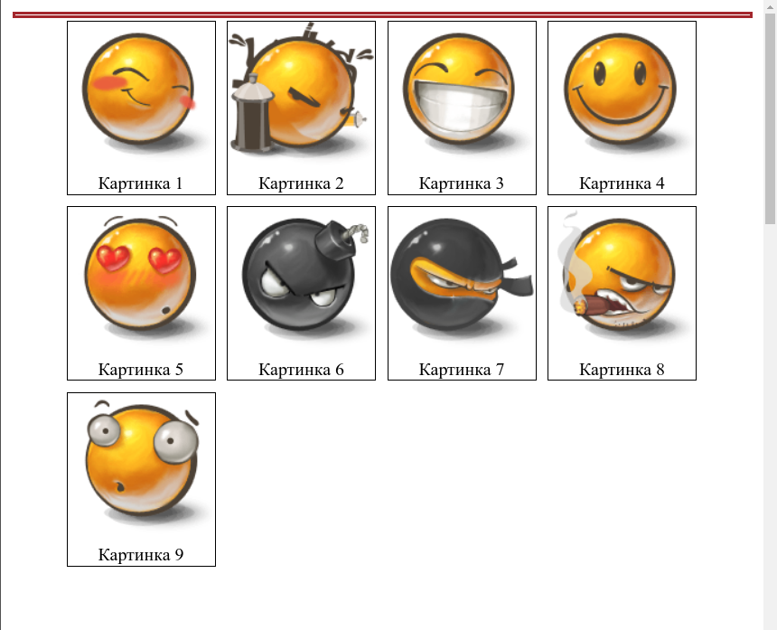

And here's the final result with it:

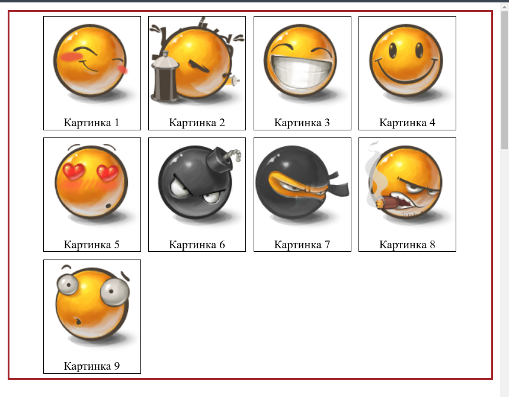

What if the elements are different in size? We might encounter such a problem:

```scss
li {
	float: left;
	margin: 5px;
	text-align: center;
	border: 1px solid black;

	&:nth-child(3n) {
		height: 15rem;
	}
}
```

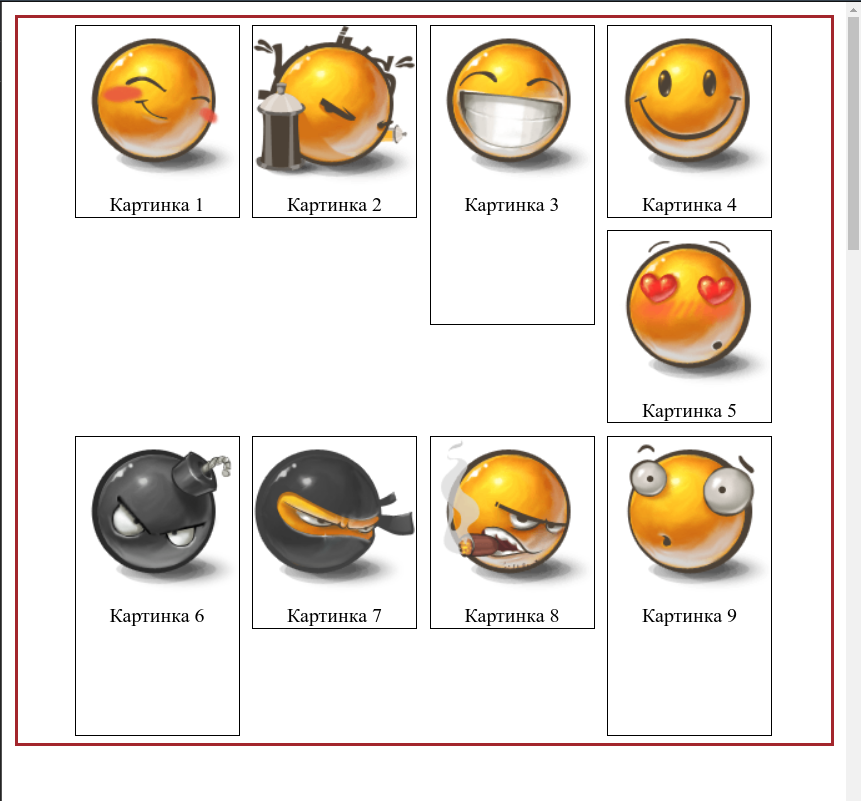

We also need to add `clearfix` to our container. Otherwise, the lower elements can sit right on our container ignoring the space it takes.

---

#### `inline-block` solution

Much easier and cleaner. We don't need `clearfix` and also we have more freedom adjusting our elements: e.g. we can `vertical-align: middle` on them.

```scss
.gallery {
	list-style: none;
	border: 3px solid brown;
	margin: 10px;

	li {
		display: inline-block;
		margin: 5px;
		text-align: center;
		border: 1px solid black;

		/* vertical-align: middle; */

		&:nth-child(3n) {
			height: 15rem;
		}
	}
}
```

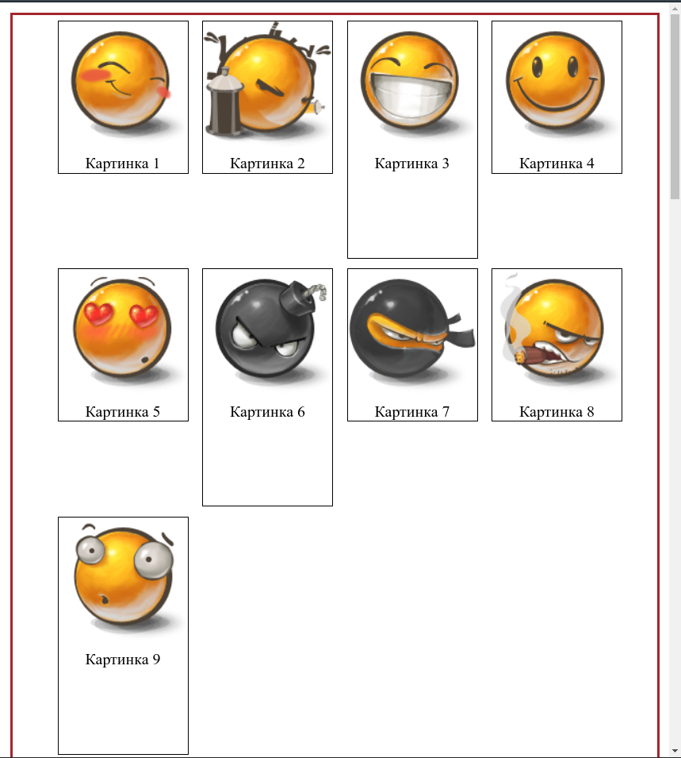

---

### Two blocks with the same height on one line regardless of the content size

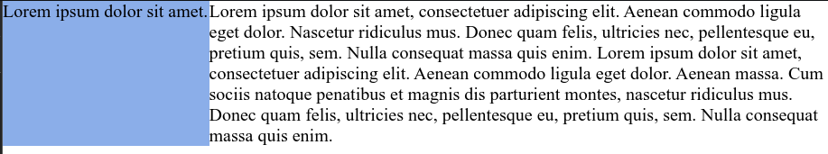

#### Flex solution

Simply set the parent container of the elements (e.g. `<body>` to `display: flex`.

```css
body {
	display: flex;
	margin: 0;
	padding: 0;
}

aside {
	width: 25%;
	background-color: #8cacea;
}

main {
	width: 75%;
}
```

---

### Grid solution

```css
body {
	display: grid;
	grid-template-columns: 25% 75%;
	margin: 0;
	padding: 0;
}

aside {
	background-color: #8cacea;
}
```

---

### Form


```html
<!DOCTYPE html>

<link rel="stylesheet" href="normalize.css" />
<link rel="stylesheet" href="style.css" />

<form class="form1" action="">
	<label for="firstName" class="first-name">First Name</label>
	<input id="firstName" type="text" />

	<label for="lastName" class="last-name">Last Name</label>
	<input id="lastName" type="text" />

	<label for="job">Job</label>
	<input id="job" type="text" />

	<label for="age">Age</label>
	<input id="age" type="text" />

	<label for="email">Email</label>
	<input id="email" type="email" />

	<button type="submit">Submit</button>
</form>
```

```css
`* {
	box-sizing: border-box;
}

form {
	padding: 1em;
	background: #303233;
	color: #fff;
	border: 1px solid #c1c1c1;
	margin-top: 2rem;
	max-width: 600px;
	margin-left: auto;
	margin-right: auto;
	padding: 1em;
}
form input {
	margin-bottom: 1rem;
	background: #fff;
	border: 1px solid #9c9c9c;
}
form input[type='text'],
form input[type='email'] {
	background: #2c2e2e;
}
form button {
	background: #474a4b;
	color: #fff;
	padding: 0.7em;
	border: 0;
}
form button:hover {
	background: gold;
}

label {
	display: block;
	text-align: right;
	padding: 0.5em 1.5em 0.5em 0;
}

input {
	width: 100%;
	padding: 0.7em;
	margin-bottom: 0.5rem;
}
input:focus {
	outline: 3px solid gold;
}

@media (min-width: 400px) {
	form {
		overflow: hidden;
	}

	label {
		float: left;
		width: 200px;
	}

	input {
		float: left;
		width: calc(100% - 200px);
	}

	button {
		float: right;
		width: calc(100% - 200px);
	}
```
