# CSS

- [CSS](#css)
	- [Sources](#sources)
	- [Intro](#intro)
	- [Specificity](#specificity)
	- [Selectors](#selectors)
		- [Relations](#relations)
		- [Attribute selectors](#attribute-selectors)
		- [Pseudo-classes](#pseudo-classes)
		- [Pseudo-elements](#pseudo-elements)
	- [CSS Units](#css-units)
	- [Box-model](#box-model)
		- [`margin`](#margin)
	- [Positioning](#positioning)
		- [`display`](#display)
		- [`float`](#float)
		- [`clear`](#clear)
		- [`left`, `right`, `top`, `bottom`, `z-index`](#left-right-top-bottom-z-index)
		- [`position`](#position)
	- [Aligning](#aligning)
		- [Horizontal](#horizontal)
			- [Inline](#inline)
			- [Block](#block)
		- [Vertical](#vertical)
			- [Inline](#inline-1)
			- [Block](#block-1)
	- [Miscellaneous](#miscellaneous)
		- [`outline`](#outline)
		- [`overflow`](#overflow)
		- [`height`](#height)
	- [Practice](#practice)
		- [Gallery](#gallery)
			- [`float` solution](#float-solution)
			- [`inline-block` solution](#inline-block-solution)
		- [Pagination](#pagination)

***


## Sources

1. https://learn.javascript.ru/css-for-js - "learn" tutorial
2. https://youtu.be/1Rs2ND1ryYc - big tutorial
3. https://css-tricks.com/almanac/properties/ - properties almanac on CSS-Tricks

***


## Intro

In this lesson, CSS may be mixed with SCSS - it's ok.

***


## Specificity

The more specific selectors get precedence in desiding what styles will be applied. In the **ascending** order:

1. Elements
2. Classes and attributes
3. IDs
4. Inline styles
5. `!important`

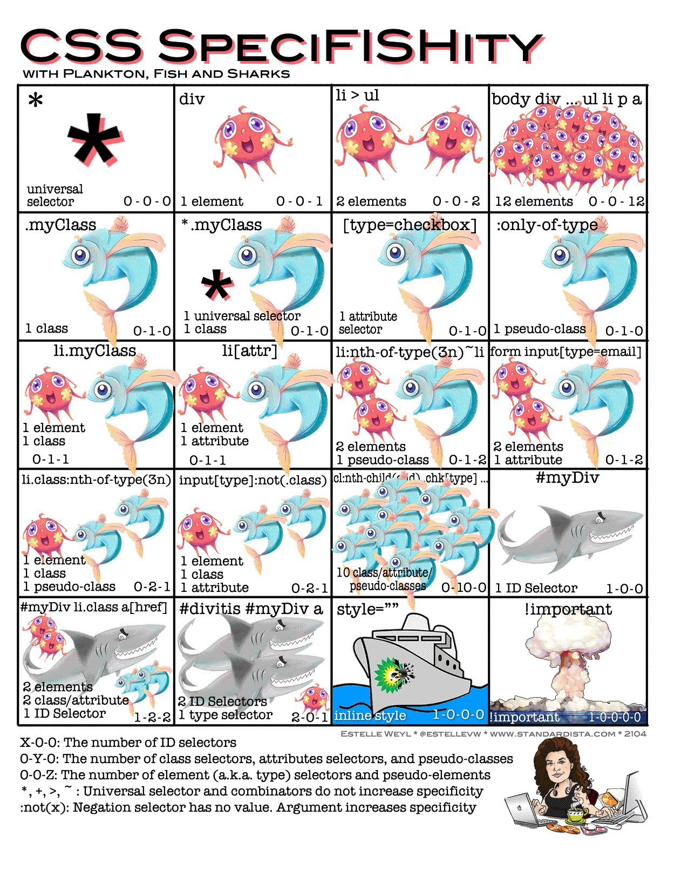

***


## Selectors

### Relations

Relations|Notes
-|-
`div p`|All `<p>` that are descendents of `<div>`
`div > p`|All `<p>` that are direct children of `<div>`
`div ~ p`|All `<p>` to the right of `<div>` within the same parent
`div + p`|A single `<p>` to the right of `<div>` within the same parent

```html
<!DOCTYPE html>

<link rel="stylesheet" href="css/normalize.css">

<style>
	* {
		box-sizing: border-box;
	}

	section + p {
		color: red;
	}
</style>

<section>
  <div>
		<p>Paragraph 1 inside div</p>
		<p>Paragraph 2 inside div</p>
  </div>

	<p>Paragraph 1 inside section</p>
	<p>Paragraph 2 inside section</p>
</section>

<p>Outer paragraph 1</p>
<p>Outer paragraph 2</p>
```

***

### Attribute selectors

Attribute selectors|Notes
-|-
`[type]`|Attribute "type" is present
`[type="radio"]`|Attribute value is "radio"
`[type^="rad"]`|Value starts with "rad"
`[type*="ad"]`|Value has a substring "ad"
`[class~="delete"]`|Attribute has a "delete" value as one of the values in the list (e.g. `class="container delete upper"` but **not** `class="undelete"`)
`[type$="io"]`|Value ends with "io"

***

### [Pseudo-classes](https://developer.mozilla.org/en-US/docs/Web/CSS/Pseudo-classes)

Pseudoclasses|Notes
-|-
`:first-child`|Any 1st child of its parent
`:last-child`|Any last child of its parent
`:only-child`|Any single child of its parent
`:nth-child(2n - 1)`|Children 1, 3, 5, ... of its parent of any type

**Note**: when you do `p:nth-child...`, it will count **any** elements and **after that** will apply the `p` filter to them. So the result might be counterintuitive.

```html
<!DOCTYPE html>

<link rel="stylesheet" href="css/normalize.css">

<style>
	* {
		box-sizing: border-box;
	}

	body {
		margin: 10px;
		border: 2px solid black;
	}

	section {
		margin-left: 20px;
		border: 2px solid red;
	}

	div {
		margin-left: 20px;
		border: 2px solid blue;
	}

	p {
		margin-left: 20px;
	}

	p:nth-child(2n + 1){
		color: blue;
	}
</style>

BODY
<section>SECTION
  <div>DIV
		<p>P1 inside DIV</p>
		<p>P2 inside DIV</p>
  </div>

	<p>P1 inside SECTION</p>
	<p>P2 inside SECTION</p>
</section>

<p>Outer P1</p>
<p>Outer P2</p>
<p>Outer P3</p>
<p>Outer P4</p>
<p>Outer P5</p>
<p>Outer P6</p>
```

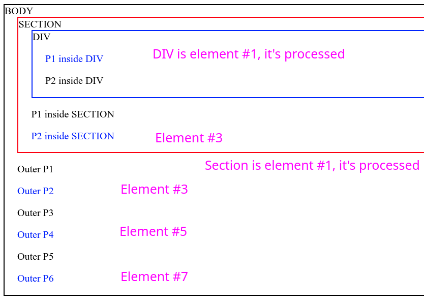

If you want to count **spicifically** some elements, you should use these:

Pseudoclasses|Notes
-|-
`:first-of-type`|1st child of its parent of a specific type
`:last-of-type`|last child of its parent of a specific type
`:only-of-type`|Specific single child of its parent
`:nth-of-type(2n - 1)`|Specific children 1, 3, 5, ... of its parent

Note: `p:nth-of-type...` will county **only** `p`.

```html
<!DOCTYPE html>

<link rel="stylesheet" href="css/normalize.css">

<style>
	* {
		box-sizing: border-box;
	}

	body {
		margin: 10px;
		border: 2px solid black;
	}

	section {
		margin-left: 20px;
		border: 2px solid red;
	}

	div {
		margin-left: 20px;
		border: 2px solid blue;
	}

	p {
		margin-left: 20px;
	}

	p:nth-of-type(2n - 1){
		color: blue;
	}
</style>

BODY
<section>SECTION
  <div>DIV
		<p>P1 inside DIV</p>
		<p>P2 inside DIV</p>
  </div>

	<p>P1 inside SECTION</p>
	<p>P2 inside SECTION</p>
</section>

<p>Outer P1</p>
<p>Outer P2</p>
<p>Outer P3</p>
<p>Outer P4</p>
<p>Outer P5</p>
<p>Outer P6</p>
```

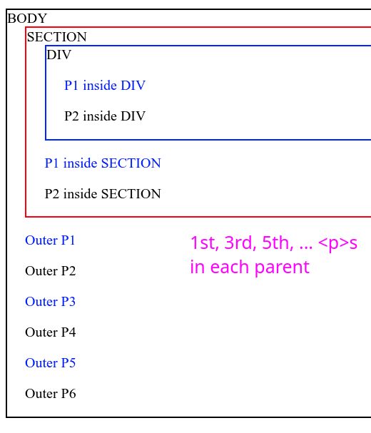

***

Other pseudoclasses|Notes
-|-
`:not(selector)`|Anything except this selector
`:focus`|Focused element
`:hover`|Hovered element
`:empty`|Without child nodes (even text)
`:checked`, `:disabled`, `:enabled`|States of `<input>`
`:link`|Not visited links
`:visited`|Visited links
`:any-link`|Any links
`:local-link`|Links which URL is the same as the current URL
`:target`|Element which `id` matches the current `#` anchor in the current URL. E.g. if the current URL is `https://site.com/content#intro`, then `:target` will match the element with `id="intro"`
`:playing`|Media element capable of playing that is currently playing
`:paused`|Media element capable of playing that is currently paused

***

### [Pseudo-elements](https://developer.mozilla.org/en-US/docs/Web/CSS/Pseudo-elements)

Pseudo-elements are helper elements that browser adds to the document. 

Pseudo-elements|Notes
-|-
`::before`|Creates a pseudo-element before the first child of the selected element, often used with the `content` property.
`::after`|The same for the last element

Example 1:

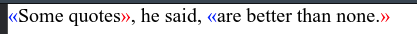

```html
<!DOCTYPE html>

<link rel="stylesheet" href="css/normalize.css">

<style>
	* {
		box-sizing: border-box;
	}

	q::before {
		content: "«";
		color: blue;
	}

	q::after {
		content: "»";
		color: red;
	}
</style>

<q>Some quotes</q>, he said, <q>are better than none.</q>
```

Example 2:

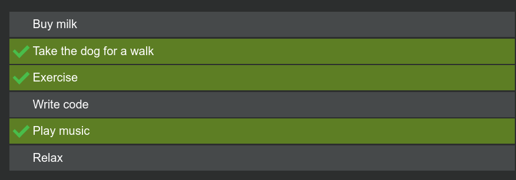

```html
<!DOCTYPE html>

<link rel="stylesheet" href="css/normalize.css">

<style>
	* {
		box-sizing: border-box;
	}

	body {
		background: #2c2e2e;
	}

	li {
		list-style-type: none;
		position: relative;
		margin: 2px;
		padding: 0.5em 0.5em 0.5em 2em;
		color: #fefefe;
		background: #46494a;
		font-family: sans-serif;
	}

	li.done {
		background: #5b7f1e;
	}

	li.done::before {
		content: '';
		position: absolute;
		border-color: #3fbe46;
		border-style: solid;
		border-width: 0 0.3em 0.25em 0;
		height: 1em;
		top: 1.3em;
		left: 0.6em;
		margin-top: -1em;
		transform: rotate(45deg);
		width: 0.5em;
	}
</style>

<ul>
  <li>Buy milk</li>
  <li>Take the dog for a walk</li>
  <li>Exercise</li>
  <li>Write code</li>
  <li>Play music</li>
  <li>Relax</li>
</ul>

<script>
	const list = document.querySelector('ul');
	list.addEventListener('click', (e) => {
		const target = e.target.closest('li')
		if (target) {
			target.classList.toggle('done')
		}
	})
</script>
```

***


## CSS Units

All units can be fractional - browser will round them up itself.

Units|Notes
-|-
`px`|absolute units
`em`|relative to the current font size
`%`|percentage is taken from different values: parent property, document size, window size, etc.
`rem`|a mix of `px` and `em`, relative to the font size of `<html>`. Useful for increasing the text size without scaling everything else.
`vw`, `vh`|1% of the screen width/height. 
`vmin`, `vmax`|min/max of the pair above

***


## Box-model

### `margin`

Vertical margins **collapse**, horizontal ones - don't. 

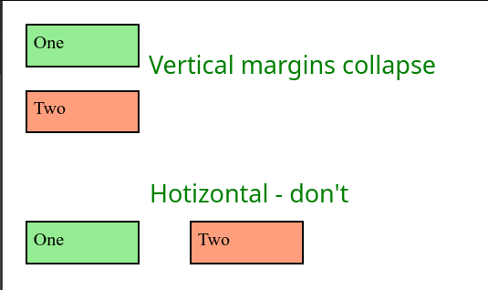

```html
<!DOCTYPE html>

<link rel="stylesheet" href="css/normalize.css">

<style>
	* {
		box-sizing: border-box;
	}

	div {
		width: 100px;
		height: 38px;

		margin: 20px;
		border: 2px solid black;
		padding: 5px;
	}

</style>

<div style="background-color: lightgreen;">One</div>
<div style="background-color: lightsalmon;">Two</div>

<br><br>

<div style="background-color: lightgreen; display: inline-block;">One</div>
<div style="background-color: lightsalmon; display: inline-block;">Two</div>
```

***

We can use either `margin-left/top` or `position: relative` to move some elements a bit. The difference is:

- **negative** `margin-left/top` moves the element and makes other elements take up the freed space
- **negative** `margin-right/bottom` makes other elements think our element has **shortened**
- `positon: relative` moves our element and other elements don't react to this in any way

Negative margin-top:

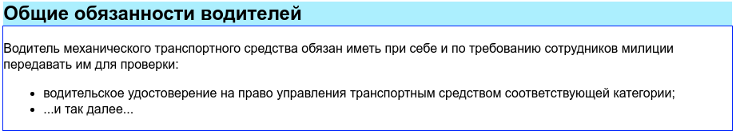

```css
h2 {
  margin-top: -1.3em;
}
```

Negative margin-bottom:

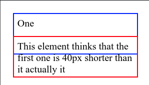

```html
<!DOCTYPE html>

<link rel="stylesheet" href="css/normalize.css">

<style>
	* {
		box-sizing: border-box;
	}

	div {
		width: 200px;
		height: 66px;

		margin: 20px;
		border: 2px solid black;
		padding: 5px;
	}

</style>

<div style="border: 2px solid blue; margin-bottom: -49px">One</div>
<div style="border: 2px solid red; margin-bottom: -40px">This element thinks that the first one is 40px shorter than it actually it</div>
```

`position: relative`: 

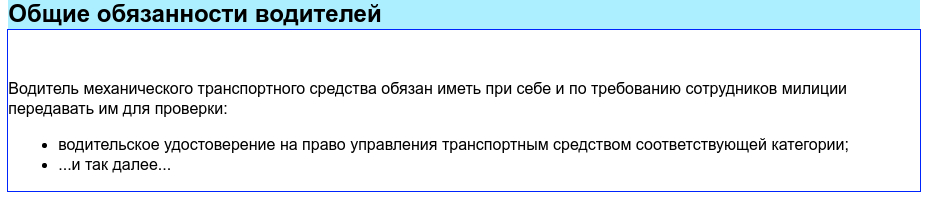

```css
h2 {
  position: relative;
  top: -1.3em;
}
```

***


## Positioning

Positioning refers to how elements are positioned in the document relative to it and each other. They can be positioned and moved in many ways.

***

### `display`

`display: table | table-row | table-cell | ...` are useful for making elements standing as a table next to each other. 

**This is an actual table. And they are relevant**. Can be nicely used for forms:

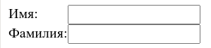

`<table>, <tr>, <td>, ...` - are just elements with pre-defined `display` properties:

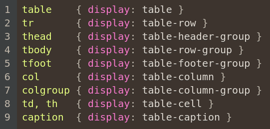

***

### `float`

https://learn.javascript.ru/float

`float: left | right | none`

Places an element on the left or right side **of either its container or another floated element**, until it touches the edge. 

Text and inline elements wrap it around. 

The element is removed from the normal flow of the page, though still remaining a part of the flow.

The element with `float` gets `display: block` but its width and height are still defined by default by its content. 

Vertical margins of the floated blocks don't collapse with neighbors as usual.

Prerequisits:

```html
<div class="parent-top">
	<span>Span text 1</span>
	<div class="child1"> height: 100 px;</div>
	<span>Span text 2 2 2 2 2 2 2 2 2 2 2 2 2 2 2 2 2 2 2 2 2 2 2 2 2 2 2 2 2 2 2 2 2 2 2 2 2 2 2 2 2 2 2 2 2 2 2 2 2 2 2 2 2 2 2 2 2 2 2 2 2 2 2 2 2 2 2 2 2 2 2 2 2 2 2 2 2 2 2 2 2 2 2 2 2 2 2 2 2 2 2 2 2 2 2 2 2 2 2 2 2 2 2 2 2 2 2 2 2 2 2 2 2 2 2 2 </span>
	<div class="child2"> ^_^ </div>
	<span>Span text 3 3 3 3 3 3 3 3 3 3 3 3 3 3 3 3 3 3 3 3 3 3 3 3 3 3 3 3 3 3 3 3 3 3 3 3 3 3 3 3 3 3 3 3 3 3 3 3 3 3 3 3 3 3 3 3 3 3 3 3 3 3 3 3 3 3 3 3 3 3 3 3 3 3 3 3 3 3 3 3 3 3 3 3 3 3 3 3 3 3 3 3 3 3 3 3 3 3 3 3 3 3 3 3 3 3 3 3 3 3 3 3 3 3 3 3 </span>
	<div class="child3"> height: 200 px; </div>
	<span>Span text 4</span>
</div>
```

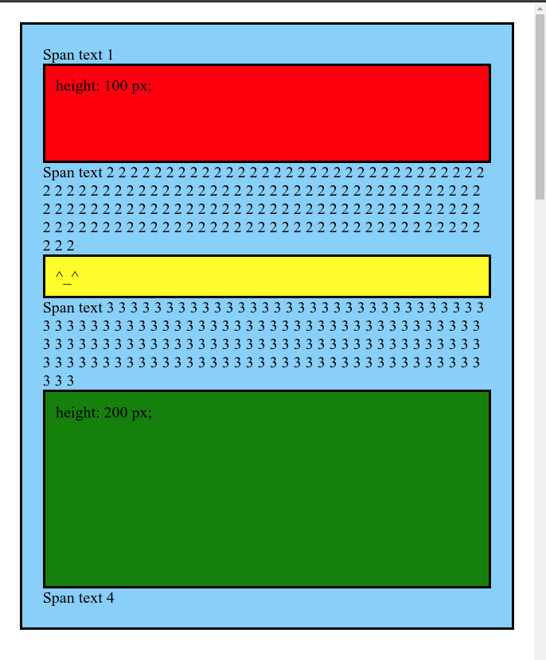

Now we add `float`

```scss
.child2 {
	background-color: yellow;
	top: 0px;

	float: right;
}
```

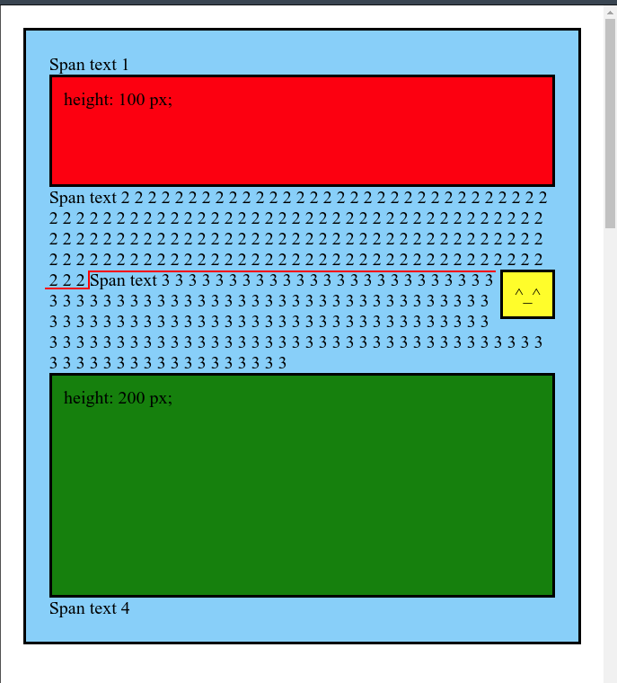

We can see that the yellow block now sticks to the right side of the parent element right after the "Span text 2" element - just as in our HTML. But the further **inline** elements ("Span text 3") and text took the free space around it. 

But how will **block** elements behave? They will try to fit in (if something other isn't set explicitly):

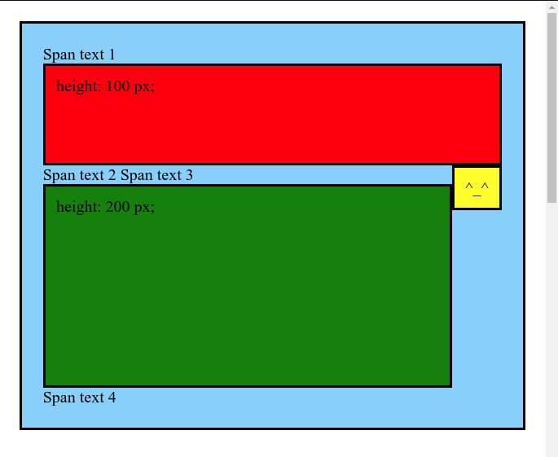

***

Parents don't allocate space for the floated children:

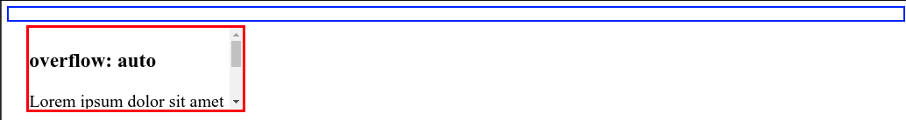

But we can set `overflow: auto | hidden` to force it allocate space (just uncomment `overflow`):

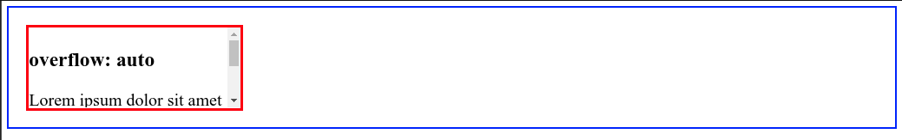

```html
<!DOCTYPE html>

<link rel="stylesheet" href="css/normalize.css">

<style>
	* {
		box-sizing: border-box;
	}

	.parent {
		border: 2px solid blue;
		margin: 5px;
		padding: 5px;

		/* overflow: auto; */
	}

  .child {
		float: left;

		overflow: auto;
		margin: 10px;
    width: 200px;
    height: 80px;
    border: 3px solid red;
  }
</style>

<div class="parent">
	<div class="child">
		<h3>overflow: auto</h3>Lorem ipsum dolor sit amet consectetur adipisicing elit. Tempora cum aperiam aut perspiciatis repellendus ipsam dignissimos mollitia rem iusto autem, sint dolore rerum ipsum, minus aspernatur doloremque omnis, animi est!
	</div>
</div>
```

***

### `clear`

`clear: none | left | right | both`

Sets whether an element must be moved below floating elements that precede it. Besically forbids wrapping the floating elements nearby.

It moves the `border-top` edge of the element below the `margin-bottom` of the floating elements above.

```scss
.child3 {
	background-color: green;
	height: 200px;
	
	clear: both;
}
```

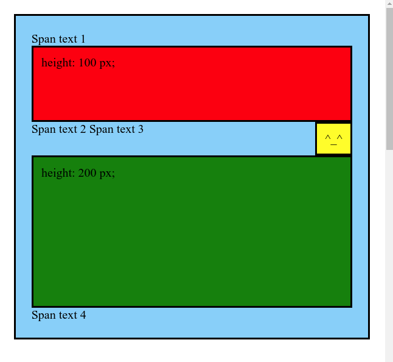

But what if we had `margin-top` for our green block? It wouldn't work because of the algorithm described above:

```scss
.child3 {
	background-color: green;
	height: 200px;

	margin-top: 20px;

	clear: both;
}
```

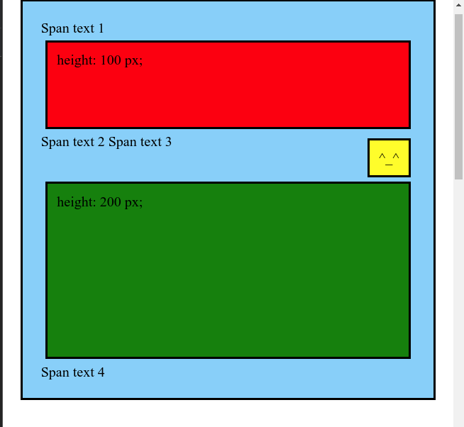

To fix this, we can insert an empty block with `clear: both` between our elements. And we remove `clear: both` from our green block.

```html
<section class="parent-top">
		<span>Span text 1</span>
		<section class="child1"> height: 100 px;</section>

		<span>Span text 2 </span>
		<section class="child2"> ^_^ </section>
		<span>Span text 3 </span>
		
		<div style="clear:both; "></div>	<!-- here -->

		<section class="child3"> height: 200 px; </section>
		<span>Span text 4</span>
	</section>
```

Sometimes the floated element can pop out of the parent element since the parent doesn't allocat space for it. In this case, add this `clearfix` class to the parent - it will lengthen the parent to contain the floated block fully.

```scss
.clearfix:after {
  content: ".";
  display: block;
  clear: both;
  visibility: hidden;
  height: 0;
}
```

***

### `left`, `right`, `top`, `bottom`, `z-index`

These properties set the **offset from s cetrain edge of the document**. 

But they only affect elements that are **not** `position: static`.

Negative values are allowed. 

Using both `left` and `right` (or `top` and `bottom`) doesn't work for `relative` but works for `absolute` and `fixed`.

```scss
.element {
	position: relative;
	left: -20px;
	top: 5px;
}
```

***

### `position`

```html
<!DOCTYPE html>
	
<link rel="stylesheet" href="css/style.css">

<section class="parent-top">
	<section class="child1"> height: 100 px;</section>
	<section class="child2"> ^_^ </section>
	<section class="child3"> height: 200 px; </section>
</section>
```

```scss
* {
	box-sizing: border-box;
}

body {
	margin: 0;
	padding: 0;
	height: 3000px;
}

section {
	padding: 10px;
	border: 3px solid black;
	overflow: hidden;
}

.parent-top {
	background-color: lightskyblue;
	margin: 20px;
	padding: 20px;
}

.child1 {
	background-color: red;
	height: 100px;
}

.child2 {
	background-color: yellow;
}

.child3 {
	background-color: green;
	height: 200px;
}
```

Value|Normal flow|Positioned relative to|Notes
-|-|-|-
`static`|Yes|Parent|**Default**. Elements **cannot** be moved in this mode.
`relative`|Yes|Parent|`left`, `right`, `top`, `bottom,` `z-index` work now. Other elements behave as if our element didn't move anywhere. 
`absolute`|No|Closest **positioned** (not `static`) ancestor . If none - the document.|The elements stays on the same spot visually but **is removed from the normal flow** (it means that other elements will now behave as if it doesn't exist). As soon as we apply `left`, `right`, `top`, `bottom`, `z-index` - our elements becomes positioned **relative to the document**.
`fixed`|No|Window|The same as `absolute` but the element "sticks" to the screen **relative to the window**. It's **unaffected** by scrolling.
`sticky`|Yes|Parent|The element is positioned as "fixed" or "relative" depending on how it appears in the viewport. As a result the element is "stuck" when necessary while scrolling. You should specify where should it stick (most often `top: 0`).

**Static**: 

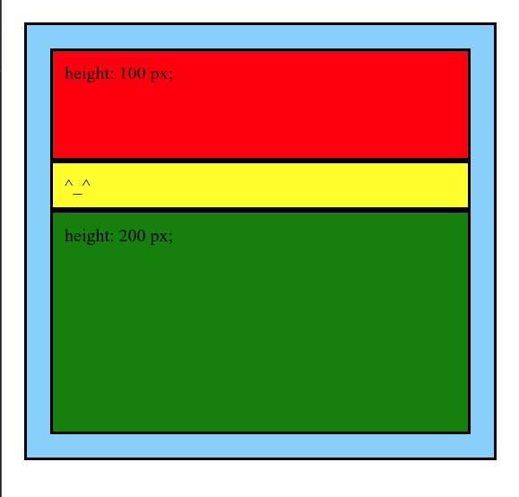

***

Now let's add **absolute** (yellow): it shrinks to the size needed by its content. It stays on the same spot. Other elements ignore it now.

```scss
.child2{
	background-color: yellow;
	position: absolute;
}
```


Now let's try to move our element - it's immediately re-positioned **relative to the document**.

```scss
.child2{
	background-color: yellow;
	position: absolute;
	right: 15px;
	top: 5px;
}
```


We can also use both `left` and `right`, as well as `top` and `bottom` together. Just remember that it works bad with scrolls - you need other solutions in this case.

```scss
.child2 {
	background-color: yellow;
	position: absolute;
	right: 15px;
	left: 10px;
	top: 5px;
	bottom: 20px;
}
```

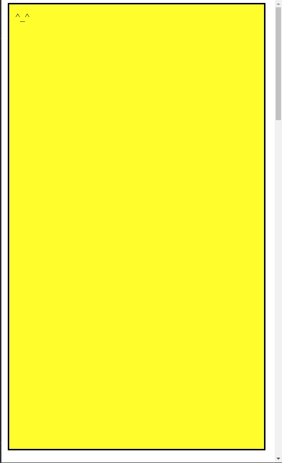

***

**Relative**: the element is moved where it was said but other elements act as if nothing changed:

```scss
.child2 {
	background-color: yellow;
	position: relative;
	right: 15px;
	top: 5px;
}
```

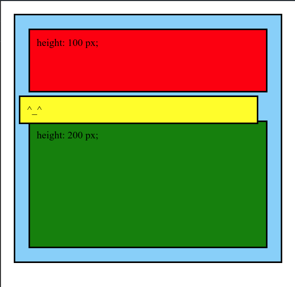

You **can't** use `right` and `left` together here (as well as `top` and `bottom`).

***

**Fixed** works well for modal windows. 

***

**Sticky**: it may not work inside some containers - some **magic** is involved here. If it doesn't work, try adding more children to the container or the opposite - taking the element out of the container. 

I couldn't made a child element sticky so I made the whole parent this way:

```scss
.parent-top {
	background-color: lightskyblue;
	margin: 20px;
	padding: 20px;
	position: sticky;
	top: 0;
}
```

***


## Aligning

### Horizontal

#### Inline


- `text-align: center | left | right | justify`
- `flex`

```html
<!DOCTYPE html>

<style>
	* {
		box-sizing: border-box;
	}

	body {
		margin: 0;
		padding: 0;
	}

	.outer {
		border: 1px solid blue;
		margin: 15px;

		text-align: center;
	}
</style>
	
<div class="outer">
	Text
</div>
```

***

#### Block

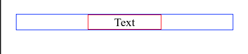

1. `margin: 0 auto`
2. `flex`

Example:

```html
<!DOCTYPE html>

<style>
	* {
		box-sizing: border-box;
	}

	body {
		margin: 0;
		padding: 0;
	}

	div {
		margin: 20px;
	}

	.outer {
		border: 1px solid blue;
		text-align: center;
		position: relative;
	}

	.inner {
    width: 100px;
    border: 1px solid red;
		
		margin: 0 auto;
  }
</style>
	
<div class="outer">
	<div class="inner">
		Text
	</div>
</div>
```

***

### Vertical

#### Inline

1. `flex`

***

#### Block

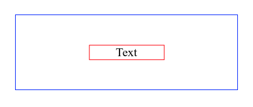

1. `position: absolute`:

```css
.center {
	position: absolute;
	top: 50%;
	left: 50%;
	/* margin-right: -50%; */
	transform: translate(-50%,-50%)
}
```

Example:

```html
<!DOCTYPE html>

<style>
	* {
		box-sizing: border-box;
	}

	body {
		margin: 0;
		padding: 0;
	}

	div {
		margin: 20px;
	}

	.outer {
		border: 1px solid blue;
		height: 100px;

		text-align: center;
		position: relative;
	}

	.inner {
    width: 100px;
    border: 1px solid red;
		
		margin: 0 auto;
		
		position: absolute;
		top: 50%;
		left: 50%;
		transform: translate(-50%,-50%) 
  }
</style>
	
<div class="outer">
	<div class="inner">
		Text
	</div>
</div>
```

2. `flex`

Example:

```html

```

3. `inline-block` helper element: 

```html
<!DOCTYPE html>

<style>
	* {
		box-sizing: border-box;
	}

	body {
		margin: 0;
		padding: 0;
	}

	div {
		margin: 20px;
	}

	.outer {
		border: 1px solid blue;
		height: 100px;

		text-align: center;
	}

	.before {
		display: inline-block;
		height: 100%;
		vertical-align: middle;
	}

	.inner {
		width: 100px;
    border: 1px solid red;
		display: inline-block;
		vertical-align: middle;
	}
</style>
	
<div class="outer">
	<span class="before"></span>	<!-- Helper element -->
	<span class="inner"> Text </span>
</div>
```

***


## Miscellaneous

### `outline`

Adds additional frame around the element, **outside of its borders**. 

It works for all 4 sides, you don't have control over them separately.

Outlines don't take space so they can overlap with other elements. Can be used to emphasize elements without moving them for example, on hover.

`outline-offset` sets up the offset from the border.

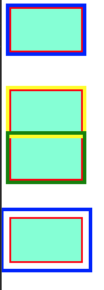

```html
<!DOCTYPE html>

<style>
	* {
		box-sizing: border-box;
	}

	body {
		margin: 0;
		padding: 0;
	}

	div {
		margin: 10px 10px 50px;
		border: 3px solid red;
		padding: 5px;
		background-color: aquamarine; 
		width: 100px;
		height: 62px;
	}
</style>

<div style="outline: 5px solid blue;"></div>
	
<div style="outline: 5px solid yellow; margin: 0 10px 0;"></div>
<div style="outline: 5px solid green; margin: 0 10px 0;"></div>

<div style="outline: 5px solid blue; outline-offset: .5rem; margin-top: 50px;"></div>
```

***

### `overflow`

- `overflow: visible | hidden | scroll | auto`
- `overflow-x` - same for `x` only
- `overflow-y` - same for `y` only

Default:


Hidden content isn't available: 

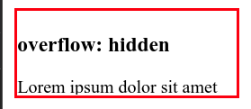

Scroll always: 

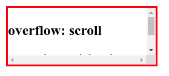

Scroll if needed:

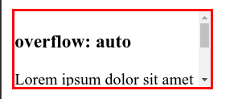

***

### `height`

Setting `height: 100%` only works for the element if its parent element has a strict height. 

If the parent's height is defined by its content, setting `height: 100%` on the child **won't work**. It will automatically change to `height: auto` - the same as its parent. 

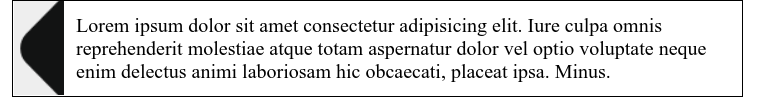

```html
<!DOCTYPE html>

<link rel="stylesheet" href="css/normalize.css">

<style>
	* {
		box-sizing: border-box;
	}

	.container {
		position: relative;
		margin: auto;
		border: 1px solid black;
		padding: 10px 5px;
		max-width: 80%;

	}

	.toggler {
		position: absolute;
		left: 0;
		top: 0;
		float: left;
		height: 100%;
		width: 40px;

		cursor: pointer;
		background: #eee url(https://icons-for-free.com/iconfiles/png/512/arrows+double+arrow+doublechevronleft+left+icon-1320185729725994033.png) center center no-repeat;
	}

	.content {
		margin-left: 45px;
	}
</style>

<div class="container">
  <div class="toggler"> </div>
  <div class="content">
    Lorem ipsum dolor sit amet consectetur adipisicing elit. Iure culpa omnis reprehenderit molestiae atque totam aspernatur dolor vel optio voluptate neque enim delectus animi laboriosam hic obcaecati, placeat ipsa. Minus.
  </div>
</div>
```

If you **parent** has `min-height`, you should also set `height: 1px` for the child element to take 100% height:

```css
.parent {
    min-height: 300px;
    height: 1px; /* <--- */
}

.child {
    height: 100%;
}
```


***


## Practice

### Gallery

https://learn.javascript.ru/float#raznitsa-inline-block-i-float

#### `float` solution

```html
<!DOCTYPE html>
<html lang="en">
	
<head>
	<meta charset="UTF-8">
	<meta name="viewport" content="width=device-width, initial-scale=1.0">
	<title>CSS</title>
	<link rel="stylesheet" href="css/style.css">
</head>

<body>
	
	<ul class="gallery clearfix">
    <li>
      
      <div>Картинка 1</div>
    </li>

    <li>
      
      <div>Картинка 2</div>
    </li>

    <li>
      
      <div>Картинка 3</div>
    </li>

    <li>
      
      <div>Картинка 4</div>
    </li>

    <li>
      
      <div>Картинка 5</div>
    </li>

    <li>
      
      <div>Картинка 6</div>
    </li>

    <li>
      
      <div>Картинка 7</div>
    </li>

    <li>
      
      <div>Картинка 8</div>
    </li>

    <li>
      
      <div>Картинка 9</div>
    </li>
  </ul>

</body>
</html>
```

```scss
* {
	box-sizing: border-box;
}

body {
	margin: 0;
	padding: 0;
	height: 3000px;
}

.clearfix:after {
	content: '.';
	display: block;
	clear: both;
	visibility: hidden;
	height: 0;
}

.gallery {
	list-style: none;
	border: 3px solid brown;
	margin: 10px;

	li {
		float: left;
		margin: 5px;
		text-align: center;
		border: 1px solid black;
	}
}
```

That's how it would look **without** a `clearfix` in the parent element (`<ul>`):

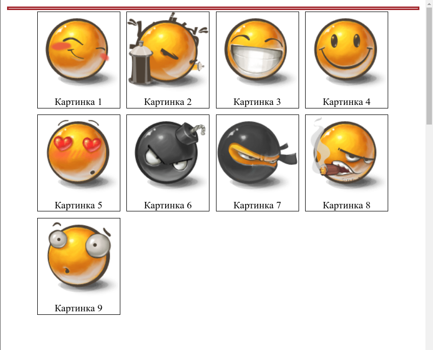

And here's the final result with it:

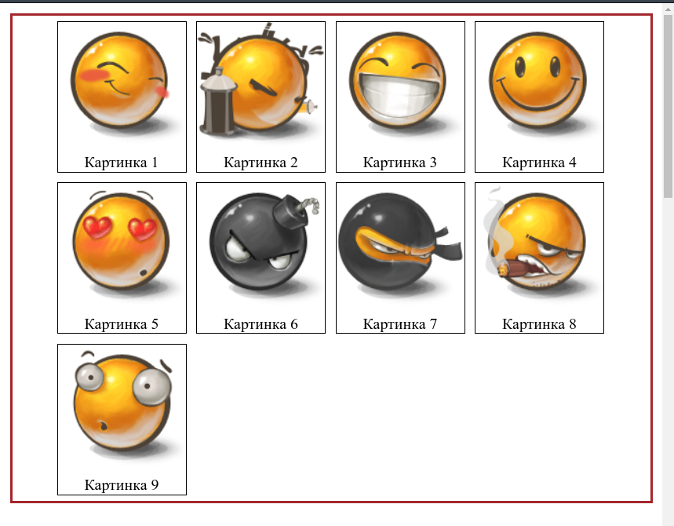

What if the elements are different in size? We might encounter such a problem:

```scss
li {
		float: left;
		margin: 5px;
		text-align: center;
		border: 1px solid black;

		&:nth-child(3n) {
			height: 15rem;
		}
	}
```

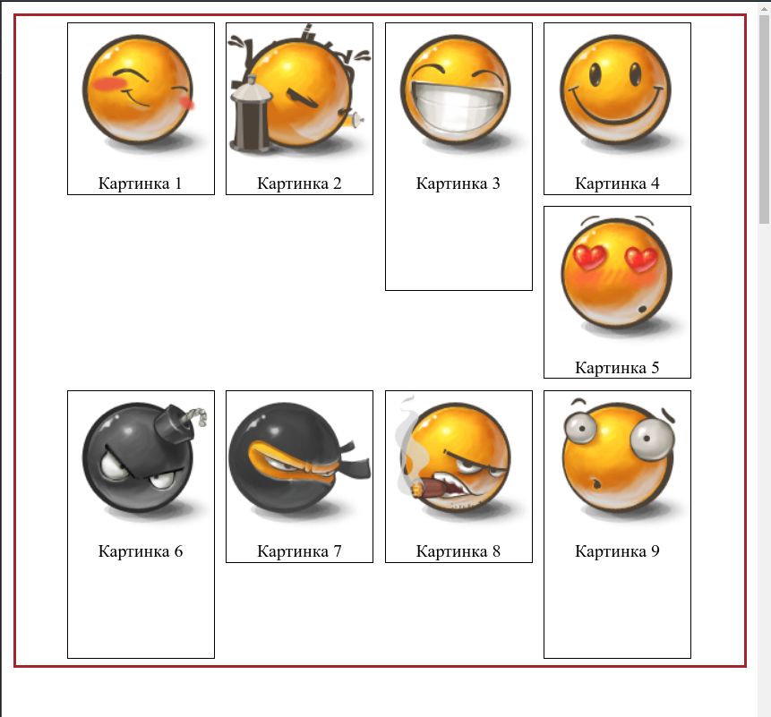

We also need to add `clearfix` to our container. Otherwise, the lower elements can sit right on our container ignoring the space it takes.

***

#### `inline-block` solution

Much easier and cleaner. We don't need `clearfix` and also we have more freedom adjusting our elements: e.g. we can `vertical-align: middle` on them.

```scss
.gallery {
	list-style: none;
	border: 3px solid brown;
	margin: 10px;

	li {
		display: inline-block;
		margin: 5px;
		text-align: center;
		border: 1px solid black;

		/* vertical-align: middle; */

		&:nth-child(3n) {
			height: 15rem;
		}
	}
}
```

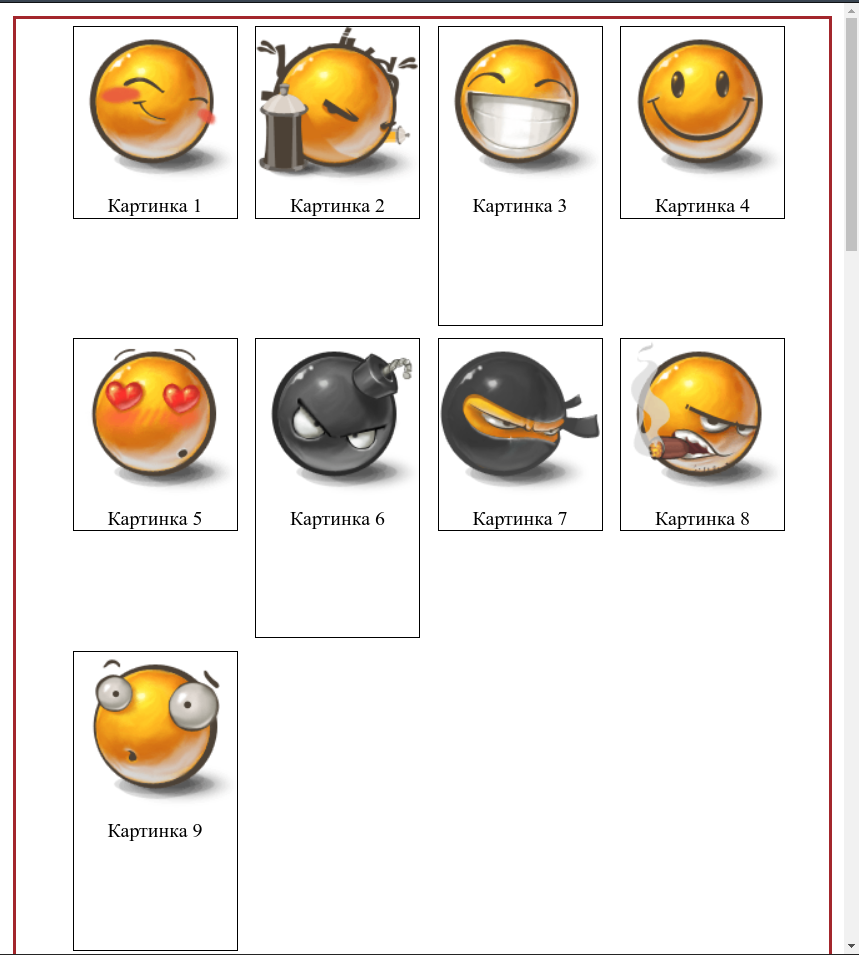

***

### Pagination

https://learn.javascript.ru/float#postranichnaya-navigatsiya-css

```html
<body>

  Текст Сверху

  <div class="nav">
    

    <ul class="pages">
      <li>1</li>
      <li>2</li>
      <li>3</li>
      <li>4</li>
      <li>5</li>
      <li>6</li>
      <li>7</li>
      <li>8</li>
      <li>9</li>
    </ul>

    
  </div>
  Текст Снизу

</body>
```

```scss

```