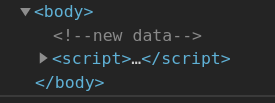
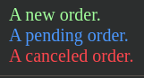

# [Node properties: type, tag and contents](<a name="node-props">)

### tagName and nodeName

For elements are the same but for the other node types `tagName` doesn't exist while `nodeName` shows the correct answer.

```javascript
console.log(document.body.tagName)	// BODY
console.log(document.body.nodeName)	// BODY
```

```html
<body><!-- comment -->

  <script>
    // for comment
    alert( document.body.firstChild.tagName ); // undefined (not an element)
    alert( document.body.firstChild.nodeName ); // #comment

    // for document
    alert( document.tagName ); // undefined (not an element)
    alert( document.nodeName ); // #document
  </script>
</body>
```

### outerHtml

All the `innerHTML` plus the element itself.

```html
<div id="elem">Hello <b>World</b></div>

<script>
  alert(elem.outerHTML); // <div id="elem">Hello <b>World</b></div>
</script>
```

Unlike innerHTML, writing to outerHTML does not change the element. Instead, it replaces it in the DOM. It means that changin the `outerHTML` changes the element in the DOM but doesn't change the element assigned to a variable that referenced it (the variable still references the old variable that is already outside of the DOM). 
***

### nodeValue, data, textContent

Are nearly the same for the text nodes.

```html
<body>
	<!-- Some comment -->
	<script>
		let comment = document.body.childNodes[1]	// because [0] is the new line character
		console.log(comment.nodeName)	// #comment
		console.log(comment.nodeType)	// 8
		console.log(comment.data)		// Some comment
		console.log(comment.nodeValue)	// Some comment
		
		comment.data = 'new data'
		console.log(comment.data)		// new data
		console.log(document.body)

	</script>
</body>
```



`textContent` is the safest way to write down pure text without any trouble. 

To read data we need both `innerText` and `textContent`. The difference between the two is that `textContent` returns the whole content transformed to the string, including all the subtags' content (e.g. for `ul` it will return the text content of all the nested elements at once). And the `innerText` only returns the immediate text inside the current element, excluding the nested elements.

### hidden

The `hidden` attribute, technically the same as `display: none`.
The blinking element:

```javascript
setInterval(() => elem.hidden = !elem.hidden, 1000)
```
***


# [Attributes and properties](<a name="attributes-and-properties">)

DOM-properties are created for all standard attributes. Non-standard attributes don't create properties.

```html
<!-- `type` is non-standard for `body`-->
<body id="body" type="...">
  <input id="input" type="text">
  <script>
    alert(input.type); // text
    alert(body.type); // undefined: DOM property not created, because it's non-standard
  </script>
</body>
```

Non-standard attributes are accessible via these `Element`-s methods and props:

Method|What for
-|-
`elem.hadAttribute(name)`|Checks for existence
`elem.getAttribute(name)`|Gets the value
`elem.setAttribute(name, value)`|Sets the value
`elem.removeAttribute(name)`|Removes the attribute
`elem.attributes`|An iterable collection of `Attr`-class objects with `name` and `value` (`nodeValue`, `textContent`) props.

The keys of the HTML-attributes are **case-insensitive** (`id` == `ID`) and their **values** are always **strings**. 

```html
<div id="blink">Blink</div>
<script>
	blink.setAttribute('gloryTo', 'theEmprah')
	for(const attr of blink.attributes){
		console.dir(`attr.name = ${attr.name}\nattr.value = ${attr.value}`)
	}
</script>
```
***


### Attributes -> properties and vice versa

Usually attributes and properties get updated automatically after one of them changed.

```html
<input>

<script>
	let input = document.querySelector('input');

	// attribute => property
	input.setAttribute('id', 'id');
	alert(input.id); // id (updated)

	// property => attribute
	input.id = 'newId';
	alert(input.getAttribute('id')); // newId (updated)
</script>
```

But there are exlusions. For instance, `input.value` only synchronized from the attribute, not the vice versa.

```html
<input>

<script>
	let input = document.querySelector('input');

	// attribute => property
	input.setAttribute('value', 'text');
	alert(input.value); // text

	// NOT property => attribute
	input.value = 'newValue';
	alert(input.getAttribute('value')); // text (not updated!)
</script>
```

If user changed the value of an input, we can still recover the original value from the attribute.
***


### DOM properties are typed

DOM properties are not always strings. For example, `input.checked` is a boolean.

```html
<input id="input" type="checkbox" checked> checkbox

<script>
	alert(input.getAttribute('checked')); // the attribute value is: empty string
	alert(input.checked); // the property value is: true
</script>
```

The `style` **attribute** is a string, but the `style` **property** is an object:

```html
<div id="div" style="color:red;font-size:120%">Hello</div>

<script>
	// string
	alert(div.getAttribute('style')); // color:red;font-size:120%

	// object
	alert(div.style); // [object CSSStyleDeclaration]
	alert(div.style.color); // red
</script>
```

The href DOM property is always a full URL, even if the attribute contains a relative URL or just a #hash.

```html
<a id="a" href="#hello">link</a>
<script>
	// attribute
	alert(a.getAttribute('href')); // #hello

	// property
	alert(a.href ); // full URL in the form http://site.com/page#hello
</script>
```

If we need the value of href or any other attribute exactly as written in the HTML, we can use `getAttribute`.
***


## Non-standard attributes, dataset

Sometimes non-standard attributes are used to pass custom data from HTML to JavaScript, or to “mark” HTML-elements for JavaScript.

```html
<!-- mark the div to show "name" here -->
<div show-info="name"></div>
<!-- and age here -->
<div show-info="age"></div>

<script>
	// the code finds an element with the mark and shows what's requested
	let user = {
		name: "Pete",
		age: 25
	};

	for(let div of document.querySelectorAll('[show-info]')) {
		// insert the corresponding info into the field
		let field = div.getAttribute('show-info');
		div.innerHTML = user[field]; // first Pete into "name", then 25 into "age"
	}
</script>
```

Also they can be used to style an element.

```html
<style>
	/* styles rely on the custom attribute "order-state" */
	.order[order-state="new"] {
		color: green;
	}

	.order[order-state="pending"] {
		color: blue;
	}

	.order[order-state="canceled"] {
		color: red;
	}
</style>

<div class="order" order-state="new">
  A new order.
</div>

<div class="order" order-state="pending">
  A pending order.
</div>

<div class="order" order-state="canceled">
  A canceled order.
</div>
```



Using such attributes instead of classes (like `order-state-cancelled`) might be better because the state of the order can change and we can easily change the attribute w/o the need to remove the old class and add the new one.

```javascript
// a bit simpler than removing old/adding a new class
div.setAttribute('order-state', 'canceled');
```

But to avoid conflicts (non-standard properties may become the standard ones and break our code) we should use `data-*` attributes which are specifically reserved for programmers' use. They are available in the `dataset` property. For instance, if an elem has an attribute `data-about`, it’s available as `elem.dataset.about`.

```html
<body data-about="Elephants">
<script>
  	alert(document.body.dataset.about); // Elephants
</script>
```

Multiword attributes like `data-order-state` become camelCased: `dataset.orderState`. So our example with **orders** will use `data-order-state` attributes. And we can freely modify `data-*` properties, CSS will update the view accordingly. 

Example: select the element with `data-widget-name` attribute.

```html
<div data-widget-name="menu">Choose the genre</div>

<script>
    // getting it
    let elem = document.querySelector('[data-widget-name]');

    // reading the value
    alert(elem.dataset.widgetName);
    // or
    alert(elem.getAttribute('data-widget-name'));
</script>
```
***

### Task

https://javascript.info/dom-attributes-and-properties#make-external-links-orange

```html

  <a name="list">The list:</a>
  <ul>
    <li><a href="http://google.com">http://google.com</a></li>
    <li><a href="/tutorial">/tutorial.html</a></li>
    <li><a href="local/path">local/path</a></li>
    <li><a href="ftp://ftp.com/my.zip">ftp://ftp.com/my.zip</a></li>
    <li><a href="http://nodejs.org">http://nodejs.org</a></li>
    <li><a href="http://internal.com/test">http://internal.com/test</a></li>
  </ul>

  <script>
      let collection = document.querySelectorAll('li a')

      	collection.forEach(a => {
			if(a.getAttribute('href').includes('://') && !a.getAttribute('href').startsWith('http://internal.com')){
				a.style.color = 'orange' 
    	}})
  </script>

```

**NB**: we use `getAttribute()` as we specifically interested in the data written in the `href` attribute, not ever changing properties of the related DOM objects.