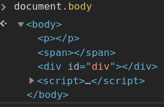
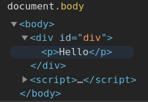
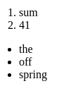

# Modifying the document

- [Modifying the document](#modifying-the-document)
	- [Insertion and deletion methods](#insertion-and-deletion-methods)
		- [childNode.before()](#childnodebefore)
		- [childNode.after()](#childnodeafter)
		- [childNode.replaceWith()](#childnodereplacewith)
		- [insertAdjacentHTML](#insertadjacenthtml)
		- [Node.remove()](#noderemove)
		- [Node.removeChild(child)](#noderemovechildchild)
	- [Cloning nodes](#cloning-nodes)
	- [DocumentFragment](#documentfragment)
	- [Practice ](#practice-)
		- [Create a tree from an object](#create-a-tree-from-an-object)
		- [Show descendants in a tree](#show-descendants-in-a-tree)
		- [Create a calendar](#create-a-calendar)
		- [Colored clock with setInterval](#colored-clock-with-setinterval)
		- [Sort the table](#sort-the-table)

***


https://javascript.info/modifying-document

## Insertion and deletion methods

### childNode.before()

Inserts a set of nodes in the children list of this childNode's parent, just before the childNode.

```html
<div id="div"></div></div>

<script>
	let p = document.createElement('p')
	let span = document.createElement('span')
	div.before(p, span)
	// <p></p><span></span><div></div>
</script>
```



***


### childNode.after()

The same, just inserts after the childNode.

***


### childNode.replaceWith()

Replaces the current childNode in the children list of its parent with another nodes.

```javascript
var parent = document.createElement("div");
var child = document.createElement("p");
parent.append(child);
var span = document.createElement("span");

child.replaceWith(span, '<p>Hello</p>');

console.log(parent.outerHTML);
// "<div><span></span>&lt;p&gt;Hello&lt;/p&gt</div>"
```

As we can see, these methods insert text nodes the safe way: the text does not transform into html. What if we wanted exactly that - to insert html? 

***


### insertAdjacentHTML

`elem.insertAdjacentHTML(where, html)`

The first param must be one of the following:

Where|Description 
-|-
`"beforebegin"`|insert html immediately before elem
`"afterbegin"`|insert html into elem, at the beginning
`"beforeend"`|insert html into elem, at the end
`"afterend"`|insert html immediately after elem

The second parameter is an HTML string, that is inserted “as HTML”.

```html
<div id="div"></div></div>

<script>
	div.insertAdjacentHTML('afterbegin', '<p>Hello</p>')
	// <div><p>Hello</p></div>
</script>
```



***


### Node.remove()

`node.remove()` removes a node from the tree it belongs to.

***


### Node.removeChild(child)

```javascript
parent.removeChild(child)
```

***

**NB**: If we want to move an element to another place – there’s no need to remove it from the old one. All insertion methods automatically remove the node from the old place.

```html
<div id="first">First</div>
<div id="second">Second</div>
<script>
  	// no need to call remove
  	second.after(first); // take #second and after it insert #first
</script>
```

***


## Cloning nodes

*Don't omit the argument, different browsers behave differently by default!*

`elem.cloneNode(true)` creates a deep clone with all attributes and subelements.
`elem.clodeNode(false)` creates a shallow clone w/o child elements (and w/o the text inside since it's a `Text` node).

Doesn't copy the `eventListener`s (except the inline ones).

**Warning:** `cloneNode()` may lead to duplicate `id` in a document. You should change the copied `id` to something unique. You may also need to change the `name` attribute.

***


## DocumentFragment

This is a special DOM node that wraps other elements. When we insert this node somwhere, its inner elements are the ones get inserted. 

Example: create 3 `li` elements and insert them into `ol`.

```html
<ol></ol>
<ul></ul>

<script>
	function createLi(n, content){
		if(!Array.isArray(content) || content.length != n) {
			throw new Error('"Content" should be an array of the same length as the "n" argument')
		}

		let list = new DocumentFragment()
		
		for(let i = 0; i < n; i++){
			let li = document.createElement('li')
			li.append(content[i])
			list.append(li)
		}

		return list
	}

	document.getElementsByTagName('ul')[0].append(createLi(3, ['the', 'off', 'spring']))
	document.getElementsByTagName('ol')[0].append(createLi(2, ['sum', '41']))
</script>
```



Thus, we can create a universal function to deliver `li`-s of any kind for any lists. We could have just returned an array of `li`-s, though, and later `ul.append(...arrayLi)`.
***


## [Practice ](<a name="practice">)

### Create a tree from an object

https://javascript.info/modifying-document#create-a-tree-from-the-object

```javascript
let data = {
	"Fish": {
		"trout": {},
		"salmon": {}
	},

	"Tree": {
		"Huge": {
			"sequoia": {},
			"oak": {}
		},
		"Flowering": {
			"apple tree": {},
			"magnolia": {}
		}
	}
}

createTree(document.getElementById('tree'), data)

function createTree(container, data) {
	const list = document.createElement('ul')
	container.append(list)

	for (let key in data) {
		const li = document.createElement('li')
		list.append(li)

		li.textContent = key

		if (Object.keys(data[key]).length) {
			createTree(li, data[key])
		}
	}
}
```
***


### Show descendants in a tree

https://javascript.info/modifying-document#show-descendants-in-a-tree

```javascript
const lis = document.getElementsByTagName('li')
    
	/**	
	* The idea is to get the list of all `li`, loop over them and check if THEIR list of inner `li` is empty. It it's not, then we draw that number next to that `li`. If it is - nothing. 
	* 
	* param {HTMLUListElement} lis - the array-like of `li`-s
	*/
    
    function addNumbersToLis(lis){
      for(const li of lis){
        const nestedLiCount = li.getElementsByTagName('li').length
        if(nestedLiCount){
          li.firstChild.after(` [${nestedLiCount}]`)
        }
      }
    }
    
    addNumbersToLis(lis)
```
***


### Create a calendar

https://javascript.info/modifying-document#create-a-calendar

```html
<!DOCTYPE HTML>
<style>
  table {
    border-collapse: collapse;
  }

  td,
  th {
    border: 1px solid black;
    padding: 3px;
    text-align: center;
  }

  th {
    font-weight: bold;
    background-color: #E6E6E6;
  }
</style>
<body>
  <div id="calendar"></div>

  <script>
	createCalendar(calendar, 1997, 8)
	  
	function createCalendar(elem, year, month) {
		const table = document.createElement('table')
		elem.append(table)

		let firstDay = new Date(year, month - 1, 1)
		firstDay = (firstDay.getDay() + 6) % 7 // 5 ('SA')

		let lastDate = new Date(year, month, 0).getDate() // 30 (Sep)

		const daysOfWeek = ['MO', 'TU', 'WE', 'TH', 'FR', 'SA', 'SU']

		let tr = document.createElement('tr')
		for (let i = 0; i < 7; i++) {
			const th = document.createElement('th')
			th.textContent = daysOfWeek[i]
			tr.append(th)
		}
		table.append(tr)

		for (let i = 0, currentDate = 1; currentDate <= lastDate; i++) { // while currentDate <= lastDate
			const tr = document.createElement('tr')
			table.append(tr)

			for (let j = 0; j < 7; j++) {
				const td = document.createElement('td')
				tr.append(td)

				// leave empty cells at the beginning and the end
				if ((!i && j < firstDay) || currentDate > lastDate) { 
					continue
				}

				td.textContent = currentDate++
			}
		}
	}
  </script>
</body>
```
***


### Colored clock with setInterval

https://javascript.info/modifying-document#colored-clock-with-setinterval

```html
<!DOCTYPE HTML>
<html>

<head>
	<style>
		.hours {
			color: #E54A4A;
		}

		.minutes {
			color: #61E54A;
		}

		.seconds {
			color: #3755DB;
		}
	</style>
</head>

<body>
	<div id="clock">
		<!-- A weird bug: if spans surrounding `:` are on different lines, then the extra space symbol appears -->
		<span class="hours">
		</span>:<span class="minutes">
		</span>:<span class="seconds"></span>
	</div>

	<input type="button" onclick="clockStart()" value="Start">
	<input type="button" onclick="clockStop()" value="Stop">

	<script>
		let intervalId
		const hoursElement = document.getElementsByClassName('hours')[0]
		const minutesElement = document.getElementsByClassName('minutes')[0]
		const secondsElement = document.getElementsByClassName('seconds')[0]

		function getTime() {
			const time = new Date()

			let hours = time.getHours()
			if (hours < 10) {
				hours = '0' + hours
			}
			hoursElement.textContent = hours

			let minutes = time.getMinutes()
			if (minutes < 10) {
				minutes = '0' + minutes
			}
			minutesElement.textContent = minutes

			let seconds = time.getSeconds()
			if (seconds < 10) {
				seconds = '0' + seconds
			}
			secondsElement.textContent = seconds
		}

		function clockStart() {
			getTime()
			intervalId = setInterval(getTime, 1000)
		}

		function clockStop() {
			clearInterval(intervalId)
		}

		document.body.onload = () => clockStart()
	</script>
</body>

</html>
```
***

### Sort the table 

https://javascript.info/modifying-document#sort-the-table

```html
<!DOCTYPE html>
<style>
  th {
	  cursor: pointer
  }
</style>

<table id="table">
<thead>
  <tr>
    <th>Name</th><th>Surname</th><th>Age</th>
  </tr>
</thead>
<tbody>
  <tr>
    <td>John</td><td>Smith</td><td>10</td>
  </tr>
  <tr>
    <td>Pete</td><td>Brown</td><td>15</td>
  </tr>
  <tr>
    <td>Ann</td><td>Lee</td><td>5</td>
  </tr>
</tbody>
</table>

<script>
  Array.from(table.rows[0].children).forEach(th => {		// addEventListeners on every `th`
  	th.addEventListener('click', event => sortByColumn(event.target))
  })
  
  /**
  * The idea is to sort not the strings in the clicked column but the `tr`-s themselves by the given field
  * param {object HTMLTableCellElement} target - event.target
  */
  function sortByColumn(target) {
  	target.asc = !target.asc			// switch the ascending/descending order on every click
  
  	const sortedRows = Array.from(table.tBodies[0].rows)
  	.sort((trA, trB) => {
  		const result = trA.cells[target.cellIndex].textContent.localeCompare(trB.cells[target.cellIndex].textContent, 'en', {
  			numeric: true		// to sort the numbers correctly
  		})
  
  		if (!target.asc) {
  			return -result		// sort in the opposite order if `asc == false`
  		}
  
  		return result
  	})

  	sortedRows.forEach(tr => table.tBodies[0].append(tr))	// insert the sorted `tr`-s (no need to delete them, they will be moved automatically)
  }
</script>
```
