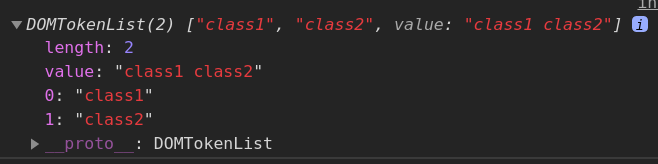

# Styles and classes

- [Styles and classes](#styles-and-classes)
	- [Classes](#classes)
		- [`elem.className`](#elemclassname)
		- [`elem.classList`](#elemclasslist)
		- [`style.cssText`](#stylecsstext)
		- [`getComputedStyle(element, pseudo)`](#getcomputedstyleelement-pseudo)
	- [Element size and scrolling](#element-size-and-scrolling)
		- [`offsetParent`](#offsetparent)
		- [`offsetWidth/Height`](#offsetwidthheight)
		- [`chilentTop/Left`](#chilenttopleft)
		- [`clientWidth/Height`](#clientwidthheight)
		- [`scrollWidth/Height`](#scrollwidthheight)
		- [`scrollLeft/Top`](#scrolllefttop)
		- [`window.pageXOffset/pageYOffset` and `window.scrollX/scrollY`](#windowpagexoffsetpageyoffset-and-windowscrollxscrolly)
		- [Full example](#full-example)
	- [Window sizes and scrolling](#window-sizes-and-scrolling)
		- [`document.documentElement.clientWidth/Height`](#documentdocumentelementclientwidthheight)
		- [`scroll()` and `scrollBy()`](#scroll-and-scrollby)

***

## Classes

### `elem.className`

A prop with a string representing a space-divided class list. We can add new classes by simply appending them to the `className` property (with a space at the beginning). 

```html
<div id="div" class="class1 class2">Test text</div>

<script>
	console.log(div.className)		// "class1 class2"
	div.className += " class3"		// add a new class to the list
	console.log(div.className)		// "class1 class2 class3"
</script>
```

The prop is good for setting a list of classes at once.

***


### `elem.classList`

A read-only property that returns a live collection of the class attributes of the element. The returned object has several methods:

Method|Description
-|-
`item(i)`|Get the item by the index.
`contains(token)`|Return `boolean`.
`add(token1, token2, ...)`|Add new class (classes) to the element
`remove(token1, token2, ...)`|Remove the classes.
`replace(oldToken, newToken)`|Replaces the old class with the new one.
`supports(token)`|Return `boolean`.
`toggle(token, force)`|Adds or removes the given token from the `classList` and returns `boolean` indicating if the token is present in the element after the operation. The optional second parameter is makes it one-way-ticket: `true` will only add but not remove, `false` - only remove but not add.
`entries()`|Return an `iterator` with `[0, 'class1']` values.
`keys()`|Return an `iterator`.
`values()`|Return an `iterator`. The same as iterate over `classList` itself.
`forEach(callback)`|Calls a callback function for every token in the list, just like `forEach` for arrays.


```html
<div id="div" class="class1 class2">Test text</div>

<script>
	console.log(div.classList)		// DOMTokenList
</script>
```



***

```html
<span class="a b">classList is 'a b'</span>

<script>
	let span = document.querySelector("span");
	let classes = span.classList;

	span.addEventListener('click', function () {
		let result = classes.toggle("c");

		if (result) {
			span.textContent = `'c' added; classList is now "${classes}".`;
		} else {
			span.textContent = `'c' removed; classList is now "${classes}".`;
		}
	})
</script>
```

The prop is good for working with individual classes.

***


### `style.cssText`

We can assign not just one CSS prop but a list of properties at once. The only restriction id: it removes all existing styles. But it's ok to use for new elements. 

```html
<div id="div">Button</div>

<script>
  // we can set special style flags like "important" here
  div.style.cssText=`color: red !important;
    background-color: yellow;
    width: 100px;
    text-align: center;
  `;

  alert(div.style.cssText);
</script>
```

**NB**: Don't lose units (`px`)!

The same can be done using `div.setAttribute('style', 'color: red...')`
***


### `getComputedStyle(element, pseudo)`

Lets us to know the current value of certain CSS properties.

```html
<head>
	<style> body { color: teal; margin: 5px } </style>
</head>
<body>
	<script>
		let computedStyle = getComputedStyle(document.body)	// live CSSStyleDeclaration collection
		console.log(computedStyle.marginTop ) 	// 5px
		console.log(computedStyle.color ) 		// rgb(0, 128, 128)
	</script>
</body>
```

We should only use full property names, such as `marginTop`, because the shorcuts like `margin` are not guaranteed to display the correct answer. 
***


## Element size and scrolling

https://javascript.info/size-and-scroll

Geometry properties are zero/null for elements that are not displayed!


### `offsetParent`

The left top corner of the nearest ancestor that the browser uses for calculating coordinates during rendering. With `position` == anything other than `static` or being `table, td, th` or being `body`. 

Properties `offsetLeft`/`offsetTop` provide x/y coordinates relative to offsetParent upper-left corner. 
***

### `offsetWidth/Height`

The outer width/height of the element, including `paddings`, `borders` and scroll. 
***

### `chilentTop/Left`

`Border` width (+ possible right scroll for some languages). The distance between the inner side and the outer side.
***

### `clientWidth/Height`

The `content` width/height + `paddings` but without scrollbar width. 

This makes possible to do `offsetWidth - clientWidth` for the blocks with `border = 0; padding = 0` to calculate the scroll width (since it's counter in `offsetWidth` but not in `clientWidth`).
***

### `scrollWidth/Height`

The full length/width of the content without any scrolls (as if they don't exist).
***

### `scrollLeft/Top`

The part hidden by the scroll. These props can be modified to scroll the needed direction (`0` and `Infinity` are the opposite sides).
***

### `window.pageXOffset/pageYOffset` and `window.scrollX/scrollY`

Read-only props of the current `window` scroll position. `window.scrollX/scrollY` are the same but `pageXOffset/pageYOffset` is compatible with IE.
***

**Don’t take width/height from CSS!**

1. CSS width/height depend on another property: `box-sizing` - this can screw everything. 

2. CSS width/height may be auto.

Also, a scrollbar that isn't counted in CSS. The real width available for the content is less than CSS width. And clientWidth/clientHeight take that into account.

***

### Full example

```html
<style>
	#example {
		position: absolute; 
		left: 180px; 
		top: 90px;
		border: 10px solid brown;
		padding: 20px;
	}
</style>
<body>
	<main style="position: relative" id="main">
		<article>
			<div id="example">Lorem ipsum dolor sit amet consectetur adipisicing elit. Cupiditate dicta sed vel quidem vitae odio saepe, accusantium dolor officia accusamus exercitationem, possimus rerum itaque error quae? Quis delectus aperiam alias.</div>
		</article>
	</main>
	<script>
		console.log(example.offsetParent) 	// main -> not `article` since it's `position: static`

		console.log(example.offsetLeft) 	// 100 -> note: a number, not a string "180px"
		console.log(example.offsetHeight)	// 210 -> content 150 + padding 20 * 2 + border 10 * 2

		console.log(example.clientWidth)	// 175 -> content 150 + padding 20 * 2 - scrollbar 15
		console.log(example.clientHeight)	// 190 -> content 150 + padding 20 * 2

		console.log(example.scrollWidth)	// 175 -> the same as `clientWidth` since no horizontal scroll
		console.log(example.scrollHeight)	// 274 -> the shown text + scrolled out text

		// set the height to remove the scroll
		// example.style.height = example.scrollHeight + 'px'

		console.log(example.scrollLeft)		// 0 -> default
		console.log(example.scrollTop)		// 0 -> default
		example.scroll(20, 20)				// scroll 20 px on both directions
		console.log(example.scrollLeft)		// 0 -> didn't change anything since there's not horizontal scroll
		console.log(example.scrollTop)		// 20 -> worked 

		
	</script>
</body>
```
***


## Window sizes and scrolling

### `document.documentElement.clientWidth/Height`

Return the actual width/height of the document (excluding scrollbals, unlike `window.innerWidth/Height`).

**But!** Because of browser differences, the most reliable method of determining the full height of the document is this:

```javascript
let scrollHeight = Math.max(
  document.body.scrollHeight, document.documentElement.scrollHeight,
  document.body.offsetHeight, document.documentElement.offsetHeight,
  document.body.clientHeight, document.documentElement.clientHeight
)
```
***


### `scroll()` and `scrollBy()`

`scroll(x, y)` scrolls **to** the particular `x` and `y` points of the document. 

`scrollBy(x, y)` scrolls **by** `x` and `y` pixels, relative to the current position.

All scroll methods can also use a special options-object as a parameter:

```javascript
scrollBy({
	top: 100,
	left: 100,
	behavior: 'smooth' /*auto*/
})
```
***

Forbid scrolling the element (not only the page):

```javascript
elem.style.overflow = 'hidden'		// freeze the scroll
elem.style.overflow = ''			// unfreeze 
```

Though, it can break the markup by removing the scroll and adding the extra pixels where it was. We can fix this by adding the `padding` the size of the scroll.


