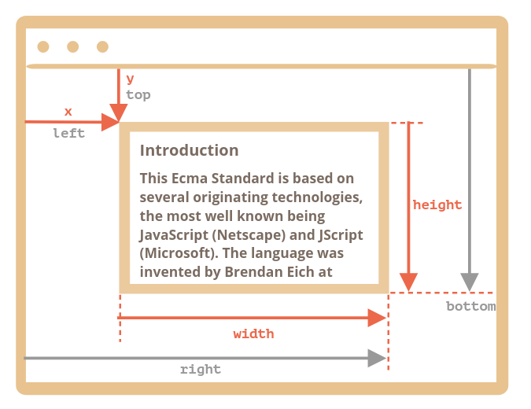
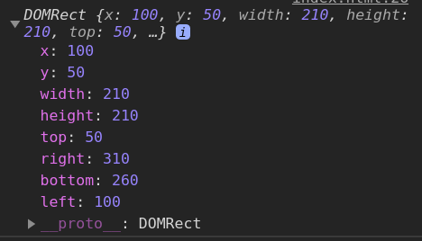

# [Coordinates](<name="coordinates">)

- [Coordinates](#coordinates)
    - [`elem.getBoundingClientRect()`](#elemgetboundingclientrect)
    - [`document.elementFromPoint(x, y)`](#documentelementfrompointx-y)
  - [Practice](#practice)
    - [Message relative to the anchor](#message-relative-to-the-anchor)

***


https://javascript.info/coordinates

### `elem.getBoundingClientRect()` 



Returns window coordinates for a minimal rectangle that encloses elem as an object of built-in `DOMRect` class - relative to the window. To find coordinates relative to the document, we should also take into account the current scroll.


***


### `document.elementFromPoint(x, y)`

Returns the topmost element by the coordinates.

```javascript
let centerX = document.documentElement.clientWidth / 2
let centerY = document.documentElement.clientHeight / 2

console.log(document.elementFromPoint(centerX, centerY))
```

The coordinates should be positive and inside the visible area. 


## Practice

### Message relative to the anchor

```html
<!DOCTYPE HTML>
<html>

<head>
  <meta charset="utf-8">
  <link rel="stylesheet" href="index.css">
</head>

<body>

  <p>Lorem ipsum dolor sit amet, consectetur adipisicing elit. Reprehenderit sint atque dolorum fuga ad incidunt voluptatum error fugiat animi amet! Odio temporibus nulla id unde quaerat dignissimos enim nisi rem provident molestias sit tempore omnis recusandae
    esse sequi officia sapiente.</p>

  <blockquote>
    Teacher: Why are you late?
    Student: There was a man who lost a hundred dollar bill.
    Teacher: That's nice. Were you helping him look for it?
    Student: No. I was standing on it.
  </blockquote>

  <p>Lorem ipsum dolor sit amet, consectetur adipisicing elit. Reprehenderit sint atque dolorum fuga ad incidunt voluptatum error fugiat animi amet! Odio temporibus nulla id unde quaerat dignissimos enim nisi rem provident molestias sit tempore omnis recusandae
    esse sequi officia sapiente.</p>


  <script>
    /**
     * Positions elem relative to anchor as said in position.
     *
     * @param {Node} anchor     Anchor element for positioning
     * @param {string} position One of: top/right/bottom
     * @param {Node} elem       Element to position
     *
     * Both elements: elem and anchor must be in the document
     */
    function positionAt(anchor, position, elem) {
      let anchorCoords = anchor.getBoundingClientRect()
      switch (position) {
        case 'top-out':
          console.log(anchorCoords)
          elem.style.left = anchorCoords.left + 'px'
          elem.style.top = anchorCoords.top - elem.offsetHeight+ 'px'
          break

        case 'right-out':
          elem.style.left = anchorCoords.right + 'px'
          elem.style.top = anchorCoords.top + 'px'
          break

        case 'bottom-out':
          elem.style.left = anchorCoords.left + 'px'
          elem.style.top = anchorCoords.bottom + 'px'
          break
          
        case 'top-in':
          elem.style.left = anchorCoords.left + 'px'
          elem.style.top = anchorCoords.top + 'px'
          break
          
        case 'right-in':
          elem.style.left = anchorCoords.right - elem.offsetWidth + 'px'
          elem.style.top = anchorCoords.top + 'px'
          break
          
        case 'bottom-in':
          elem.style.left = anchorCoords.left + 'px'
          elem.style.top = anchorCoords.bottom - elem.offsetHeight + 'px'
          break
      }
    }

    /**
     * Shows a note with the given html at the given position
     * relative to the anchor element.
     */
    function showNote(anchor, position, html) {

      let note = document.createElement('div');
      note.className = "note";
      note.innerHTML = html;
      document.body.append(note);

      positionAt(anchor, position, note);
    }

    // test it
    let blockquote = document.querySelector('blockquote');

    showNote(blockquote, "top-out", "top-out");
    showNote(blockquote, "right-out", "right-out");
    showNote(blockquote, "bottom-out", "bottom-out");
    showNote(blockquote, "top-in", "top-in");
    showNote(blockquote, "right-in", "right-in");
    showNote(blockquote, "bottom-in", "bottom-in");
  </script>


</body>
</html>
```

```css
.note {
  position: absolute;
  z-index: 1000;
  padding: 5px;
  border: 1px solid black;
  background: white;
  text-align: center;
  font: italic 14px serif;
}

blockquote {
  background: #f9f9f9;
  border-left: 10px solid #ccc;
  margin: 0 0 0 100px;
  padding: .5em 10px;
  quotes: "\201C""\201D""\2018""\2019";
  display: inline-block;
  white-space: pre;
}

blockquote:before {
  color: #ccc;
  content: open-quote;
  font-size: 4em;
  line-height: .1em;
  margin-right: .25em;
  vertical-align: -.4em;
}

body {
  height: 2000px;
}
```


