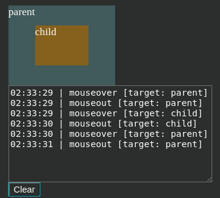

# Mouse Events

- [Mouse Events](#mouse-events)
	- [Clicks](#clicks)
		- [`which`](#which)
		- [`Modifiers`](#modifiers)
		- [Mouse coordinates `clientX/Y` and `pageX/Y`](#mouse-coordinates-clientxy-and-pagexy)
		- [Task: Selectable list](#task-selectable-list)
	- [Moves](#moves)
		- [`mouseover` and `mouseout`](#mouseover-and-mouseout)
		- [`mouseenter` and `mouseleave`](#mouseenter-and-mouseleave)
		- [Task: Improved tooltip behavior](#task-improved-tooltip-behavior)
		- [Task: "Smart" tooltip](#task-%22smart%22-tooltip)
	- [Drag & Drop](#drag--drop)

## [Clicks](<a name="clicks">)

### `which`

`MouseEvent.which` === 1 - left button, 2 - middle, 3 - right. 
***


### `Modifiers`

Booleans.

* shiftKey: Shift
* altKey: Alt (or Opt for Mac)
* ctrlKey: Ctrl
* metaKey: Cmd for Mac

```html
<button id="button">Alt + Shift + Click me!</button>

<script>
button.onclick = e => {
	if(e.shiftKey && e.ctrlKey || e.metaKey) console.log('yo')	// || metaKey is for the Mac users that use this key instead of ctrl
}
</script>
```
***


### Mouse coordinates `clientX/Y` and `pageX/Y`

* `window`-related: `clientX` and `clientY`.
* `document`-related: `pageX` and `pagrY`.

```html
<!DOCTYPE HTML>
<body style="height: 2000px">
	<script>
		document.onclick = e => {
			// scroll to the bottom and click
			console.log(`e.clientY: ${e.clientY}`)	// 100 -> window-related
			  
			console.log(`window.scrollY: ${window.scrollY}`)	// 1062 -> how much of the page was scrolled down

		  	console.log(`e.pageY: ${e.pageY}`)		// 1162 -> document-related, the sum of the two above		  	
		}
	</script>
</body>
```
***

### Task: Selectable list

https://javascript.info/mouse-events-basics#selectable-list

```html
<!DOCTYPE HTML>

<style>
	.selected {
		background: #83C8CD;
	}

	li {
		cursor: pointer;
	}
</style>

<body>

	Click on a list item to select it.
	<br>

	<ul id="ul">
		<li>Christopher Robin</li>
		<li>Winnie-the-Pooh</li>
		<li>Tigger</li>
		<li>Kanga</li>
		<li>Rabbit. Just rabbit.</li>
	</ul>

	<script>
		ul.querySelector('li').setAttribute('active', '')

		ul.addEventListener('mousedown', e => {
			e.preventDefault()
			const target = e.target.closest('li')
			if (!target) return

			const lis = Array.from(target.parentElement.querySelectorAll('li'))

			// index of the current element
			const currentTargetIndex = lis.indexOf(target)

			// index of the last element
			let lastTargetIndex
			for (const li of lis) {
				if (li.hasAttribute('active')) {
					lastTargetIndex = lis.indexOf(li)
					break
				}
			}

			// ctrl
			if (e.ctrlKey || e.metaKey) {
				target.classList.toggle('selected')

			} else {
				// shift
				if (e.shiftKey) {
					for (let i = Math.min(currentTargetIndex, lastTargetIndex); i <= Math.max(currentTargetIndex,
							lastTargetIndex); i++) {
						lis[i].classList.add('selected')
					}

					// nothing
				} else {
					lis.forEach(li => li.classList.remove('selected'))
					target.classList.add('selected')
				}
			}

			// set lastActive = currentActive for the next iteration
			for (const li of lis) {
				li.removeAttribute('active')
			}
			lis[currentTargetIndex].setAttribute('active', '')

		})

		ul.addEventListener('contextmenu', e => {
			console.log('contextmenu')
		})
	</script>

</body>
```
***


## [Moves](<a name="moves">)

### `mouseover` and `mouseout`

There is an additional property for mouse moves - `relatedTarget`.

For `mouseover`:

* `event.target` - destination point.
* `event.relatedTarget` - from where the mouse came from.

For `mouseout` is the opposite:

* `event.target` - from where.
* `event.relatedTarget` - destination point.

`relatedTarget` can be `null` if the mouse came from out of the window (or left the window). Accessing `event.relatedTarget.tagName` will throw an `Error` in this case. 

If there was `mouseover` then upon leaving the element there will always be `mouseout`. Even if some intermediate elements/events are skipped. 

**NB**: When the element `mouseover` the nested child (or with more z-index) element, it `mouseout` the parent element. If we don't want the usual `mouseout` actions on the parent to be triggered, we might just check `relatedTarget` - if the destination point is the child element, `return`. 


***


### `mouseenter` and `mouseleave`

The two are similar to the previous but more simple:

1. Transitions inside the element, to/from descendants, are not counted.
2. They don't not bubble.

When the pointer enters an element – `mouseenter` triggers. **The exact location of the pointer inside the element or its descendants doesn’t matter**. When the pointer leaves an element – `mouseleave` triggers. Transitions between descendants are ignored.


***


### Task: Improved tooltip behavior 

https://javascript.info/mousemove-mouseover-mouseout-mouseenter-mouseleave#improved-tooltip-behavior

```html
<!DOCTYPE html>

<meta charset="utf-8" />
<style>
	body {
		height: 2000px;
		/* the tooltip should work after page scroll too */
	}

	.tooltip {
		position: fixed;
		z-index: 100;

		padding: 10px 20px;

		border: 1px solid #b3c9ce;
		border-radius: 4px;
		text-align: center;
		font: italic 14px/1.3 sans-serif;
		color: #333;
		background: #fff;
		box-shadow: 3px 3px 3px rgba(0, 0, 0, 0.3);
	}

	#house {
		margin-top: 50px;
		width: 400px;
		border: 1px solid brown;
	}

	#roof {
		width: 0;
		height: 0;
		border-left: 200px solid transparent;
		border-right: 200px solid transparent;
		border-bottom: 20px solid brown;
		margin-top: -20px;
	}

	p {
		text-align: justify;
		margin: 10px 3px;
	}
</style>

<body>
	<div data-tooltip="Here is the house interior" id="house">
		<div data-tooltip="Here is the roof" id="roof"></div>

		<p>
			Once upon a time there was a mother pig who had three little pigs.
		</p>

		<p>
			The three little pigs grew so big that their mother said to them, "You
			are too big to live here any longer. You must go and build houses for
			yourselves. But take care that the wolf does not catch you."
		</p>

		<p>
			The three little pigs set off. "We will take care that the wolf does not
			catch us," they said.
		</p>

		<p>
			Soon they met a man.
			<a href="https://en.wikipedia.org/wiki/The_Three_Little_Pigs" data-tooltip="Read on…">Hover over me</a>
		</p>
	</div>

	<script>
		'use strict'

		let activeTooltipElement
		let activeTooltip

		document.addEventListener('mouseover', e => {
			const elem = e.target.closest('[data-tooltip]')
			if (!elem) return

			if (elem === activeTooltipElement) return

			if (activeTooltip) {
				activeTooltip.remove()
				activeTooltip = null
				activeTooltipElement = null
			}

			const tooltip = document.createElement('div')
			document.body.append(tooltip)

			tooltip.textContent = elem.dataset.tooltip
			tooltip.classList.add('tooltip')

			activeTooltipElement = elem
			activeTooltip = tooltip


			// mouseout

			elem.addEventListener('mouseout', e => {
				// reltedTarget here shows where we move to. If we move to a descendent, no need to delete the tooltip right now - maybe descendent doesn't have another tooltip, then we should keep this one.
				if (elem.contains(e.relatedTarget)) return

				// if we move outside - delete for sure
				activeTooltip.remove()
				activeTooltipElement = null
			})


			// styling

			const elementCoords = elem.getBoundingClientRect()
			
			let top = elementCoords.top - tooltip.offsetHeight - 5
			if(top < 0){
				top = elementCoords.bottom + 5
			}

			let left = elementCoords.left + (elem.offsetWidth - tooltip.offsetWidth) / 2
			if(left < 0){
				left = 0
			}

			tooltip.style.top = top + 'px'
			tooltip.style.left = left + 'px'
		})
	</script>
</body>
```
***


### Task: "Smart" tooltip

https://javascript.info/mousemove-mouseover-mouseout-mouseenter-mouseleave#smart-tooltip

Only show a tooltip if the user moves mouse to an element, not through it (means the cursor stays long enough on the element for tooltip to appear).

My solution: 

```html
<!doctype html>
<meta charset="UTF-8">
<style>
	.hours {
		color: red;
	}

	body {
		margin: 0;
	}

	.minutes {
		color: green;
	}

	.seconds {
		color: blue;
	}

	.clock {
		border: 1px dashed black;
		padding: 5px;
		display: inline-block;
		background: yellow;
		position: absolute;
		left: 0;
		top: 0;
	}

	#tooltip {
		position: absolute;
		padding: 10px 20px;
		border: 1px solid #b3c9ce;
		border-radius: 4px;
		text-align: center;
		font: italic 14px/1.3 sans-serif;
		color: #333;
		background: #fff;
		z-index: 100000;
		box-shadow: 3px 3px 3px rgba(0, 0, 0, .3);
	}
</style>
	<!-- <link rel="stylesheet" href="style.css">
  <script src="hoverIntent.js"></script>
  <script src="https://en.js.cx/test/libs.js"></script>
  <script src="test.js"></script> -->

<body>
	<div id="elem" class="clock">
		<span class="hours">12</span> :
		<span class="minutes">30</span> :
		<span class="seconds">00</span>
	</div>

	<div id="tooltip" hidden>Tooltip</div>

	<script>
		let timer = 0

		elem.addEventListener('mouseenter', e => {
			timer = setTimeout(() => {
				tooltip.hidden = false
			}, 200)
		})

		elem.addEventListener('mouseleave', e => {
			clearTimeout(timer)
			tooltip.hidden = true
		})

		const elemCoords = elem.getBoundingClientRect()
		console.log(elemCoords)
		tooltip.style.top = elemCoords.bottom + 5 + 'px'
	</script>
</body>
```
***


## [Drag & Drop](<a name="drag">)

To get the item we can use regular `mousedown`, `mousemove` and `mouseup` events. To prevent the default creation of a clone of the draggable element, use `dragstart` - `preventDefault()`. To move the element above the target elements use `elementFromPoint()` to track the current element we are above now. 


```html
<!doctype html>
<meta charset="UTF-8">
<style>
	#container {
		width: 400px;
		height: 200px;
		background:darkgray;
	}

	body {
		height: 2000px;
	}

	#ball {
		cursor: pointer;
	}
</style>

<body>
	
	<div id="container" class="droppable">	</div>

	<script>
		ball.addEventListener('mousedown', e => {
			e.target.style.position = 'absolute'
			e.target.style.zIndex = 1000
			// append to body to position relative to it
			document.body.prepend(e.target)	// if you append, its default coordinates will be much lower, under anything else, which will cause problems during positioning further
			

			const ballCoords = ball.getBoundingClientRect()
			// distance from the cursor to the top left corner of the img
			const leftOffset = e.clientX - ballCoords.left	// both window-related
			const topOffset = e.clientY - ballCoords.top

			// remember the current object we're flying over for droppable comparison
			let lastDroppable = null


			document.addEventListener('mousemove', onMouseMove)	// Not the ball but the document!

			e.target.addEventListener('mouseup', e => {
				document.removeEventListener('mousemove', onMouseMove)
			})

			// Important! Prevents browser's default drug&drop for images (and some other elements) conflicting with ours
			e.target.addEventListener('dragstart', e => {
				e.preventDefault();
			})


			function onMouseMove(e) {
				// document-related to position absolute correctly after scrolling
				positionAt(ball, e.pageX - leftOffset, e.pageY - topOffset)	

				// we hide the ball for a moment to get the coordinates of the topmost element, then show the ball again
				ball.hidden = true
				const elemBelow = document.elementFromPoint(e.clientX, e.clientY)
				ball.hidden = false
				
				if(!elemBelow) return	// `elementFromPoint` returns `null` if out of the window area

				const currentDroppable = elemBelow.closest('.droppable')

				/* They are equal when:
				1. both are `null` (we were not above the droppable before and we aren't now),
				2. both are the same element.
				In both cases we don't do anything. The first time it triggers when we enter the suited element with class="droppable" */
				if(lastDroppable === currentDroppable) return

				// the first time it goes through when `currentDroppable` changes from the first suitable element to something else
				if(lastDroppable){
					leaveDroppable(lastDroppable)
				}

				lastDroppable = currentDroppable

				// the first time it executes when we entered the suitable element, after that it will only be called when the new element we're above right now is suitable (class="droppable")
				if(lastDroppable){
					enterDroppable(currentDroppable)
				}
			}

			function positionAt(elem, left, top){
				elem.style.left = left + 'px'
				elem.style.top = top + 'px'
			}

			function enterDroppable(droppable){
				droppable.style.backgroundColor = 'lightblue'
			}

			function leaveDroppable(droppable){
				droppable.style.backgroundColor = ''
			}
		})	
	</script>
</body>
```