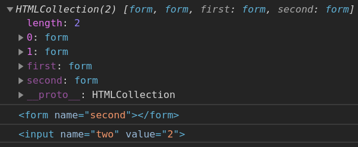

# Forms

- [Forms](#forms)
	- [Intro](#intro)
		- [`document.forms` and `document.elements`](#documentforms-and-documentelements)
		- [Input and textarea](#input-and-textarea)
		- [Select and option](#select-and-option)
- [Focus events](#focus-events)
	- [Task: Edit TD on click](#task-edit-td-on-click)

## Intro

### `document.forms` and `document.elements`

Named collection, we can use both the name or the number in the document to get the form. Any form element is accessible via the `elements` prop. 

```html
<!doctype html>
<body>
	<form name="first">
		<input name="one" value="1">
		<input name="two" value="2">
	</form>

	<form name="second"></form>

	<script>
		console.log(document.forms)			// named collection
		console.log(document.forms[1])		// second
		console.log(document.forms.first.elements.two)	// first
	</script>
</body>
```



In case of multiple elements with the same name they become a collection. Also, every element has a reference to its parent form in `element.form`.

```html
<form>
  <input type="radio" name="age" value="10">
  <input type="radio" name="age" value="20">
</form>

<script>
	let form = document.forms[0];

	let ageElems = form.elements.age;

	console.log(ageElems[0])		// input (10)
	console.log(ageElems[0].form)	// form element
</script>
```

### Input and textarea

Use `input.value` and `input.checked` props for `input`-s and `textarea`-s. We should use these props to get the data, not `innerHTML` (because it stores the data that was initially on the page, not the current value).

### Select and option

* `select.options` - the collection of `option` subelements.
* `select.value` - the value of the currently selected `option`.
* `select.selectedIndex` - the index of the currently selected `option`.

They provide three different ways of setting a value for a `select`:

* Find the corresponding `option` element and set `option.selected = true`.
* Set `select.value` to the `value`.
* Set `select.selectedIndex` to the number of the option.

```html
<select id="select">
  <option value="apple">Apple</option>
  <option value="pear">Pear</option>
  <option value="banana">Banana</option>
</select>

<script>
  // all three lines do the same thing
  select.options[2].selected = true;
  select.selectedIndex = 2;
  select.value = 'banana';
</script>
```

Also, there's a special syntax exists for creating new options: `new Option(text, value, defaultSelected, selected)`. 
***


# Focus events

`focus` and `blur` are the events we need. Also there're methods `focus()` and `blor()` to set and unset focus on the element. They don't bubble. We can use `focusin` and `focusout` events instead - they do bubble.

Focus events always exist for the elements a user can interact with: `input`, `button`, `select`, etc.

And they never exist for the elements intended to format something: `div`, `span`, `table`. `Focur` and `blur` events never trigger on them. 

This can be changed using html-attribute `tabindex`. The element becomes focusable, the value of the attribute is the order number when `tab` is used to switch between them. The order is: `1`, `2`, ... , then all elements without `tabindex`. `0` means that the element becomes focusable but maintains the default focus priority. A negative value (usually tabindex="`-1`") means that the element is not reachable via `tab`, but could be focused with Javascript or visually. We can achieve the same effect using JS-prop `elem.tabIndex`.
***


## Task: Edit TD on click

https://javascript.info/focus-blur#edit-td-on-click

```html
<!DOCTYPE HTML>
<style>
	/* common styles for the table, no need to modify these */

	th {
		text-align: center;
		font-weight: bold;
	}

	td {
		width: 150px;
		white-space: nowrap;
		text-align: center;
		vertical-align: middle;
		padding: 10px;
	}

	.nw {
		background-color: #999;
	}

	.n {
		background-color: #03f;
		color: #fff;
	}

	.ne {
		background-color: #ff6;
	}

	.w {
		background-color: #ff0;
	}

	.c {
		background-color: #60c;
		color: #fff;
	}

	.e {
		background-color: #09f;
		color: #fff;
	}

	.sw {
		background-color: #963;
		color: #fff;
	}

	.s {
		background-color: #f60;
		color: #fff;
	}

	.se {
		background-color: #0c3;
		color: #fff;
	}
</style>

<style>
	* {
		box-sizing: border-box;
	}

	.edit-button {
		position: absolute;
	}
</style>

<body>

	<p>Click on a table cell to edit it. Press OK or CANCEL when you finish.</p>

	<table id="bagua-table">
		<tr>
			<th colspan="3"><em>Bagua</em> Chart: Direction, Element, Color, Meaning</th>
		</tr>
		<tr>
			<td class="nw"><strong>Northwest</strong>
				<br>Metal
				<br>Silver
				<br>Elders
			</td>
			<td class="n"><strong>North</strong>
				<br>Water
				<br>Blue
				<br>Change
			</td>
			<td class="ne"><strong>Northeast</strong>
				<br>Earth
				<br>Yellow
				<br>Direction
			</td>
		</tr>
		<tr>
			<td class="w"><strong>West</strong>
				<br>Metal
				<br>Gold
				<br>Youth
			</td>
			<td class="c"><strong>Center</strong>
				<br>All
				<br>Purple
				<br>Harmony
			</td>
			<td class="e"><strong>East</strong>
				<br>Wood
				<br>Blue
				<br>Future
			</td>
		</tr>
		<tr>
			<td class="sw"><strong>Southwest</strong>
				<br>Earth
				<br>Brown
				<br>Tranquility
			</td>
			<td class="s"><strong>South</strong>
				<br>Fire
				<br>Orange
				<br>Fame
			</td>
			<td class="se"><strong>Southeast</strong>
				<br>Wood
				<br>Green
				<br>Romance
			</td>
		</tr>

	</table>

	<script>

		let table = document.getElementById('bagua-table')
		let editingInProcess = false	// to prevent multiple editing

		table.addEventListener('click', e => {
			const target = e.target.closest('td')
			if (!target) return
			
			if(editingInProcess) return
			editingInProcess = true


			// save for the future since target will become 0
			const width = target.offsetWidth
			const height = target.offsetHeight

			const editDiv = document.createElement('div')
			target.replaceWith(editDiv)

			const area = document.createElement('textarea')
			editDiv.append(area)
			area.value = target.innerHTML

			area.style.width = width + 'px'
			area.style.height = height + 'px'
			area.focus()


			editDiv.insertAdjacentHTML(
    'beforeEnd',
    '<div class="edit-button"><button class="edit-ok">OK</button><button class="edit-cancel">CANCEL</button></div>')

			const ok = document.querySelector('.edit-ok')
			const cancel = document.querySelector('.edit-cancel')


			ok.addEventListener('click', e => finishEdit(ok))
			cancel.addEventListener('click', e => finishEdit(cancel))

			editDiv.addEventListener('keydown', e => {	// `keypress` doesn't woek with `Esc`
				if(e.code === 'Enter'){
					finishEdit(ok)
				} else if(e.code === "Escape"){
					finishEdit(cancel)
				}
			})


			function finishEdit(action){
				if(action === ok){
					target.innerHTML = area.value
				}
				editDiv.replaceWith(target)
				editingInProcess = false
			}
		})
	</script>
</body>
```
