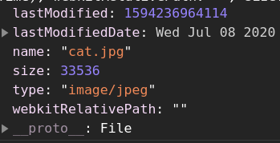

# Data updates and form submission

- [Data updates and form submission](#data-updates-and-form-submission)
	- [Sources](#sources)
	- [Events](#events)
		- [`change`](#change)
		- [`input`](#input)
	- [`ClipboardEvent`](#clipboardevent)
	- [`submit`](#submit)
		- [Task: Modal form](#task-modal-form)
	- [File](#file)
	- [FileReader](#filereader)
		- [Events](#events-1)
		- [Properties](#properties)
			- [`readyState`](#readystate)
			- [`result`](#result)
			- [`error`](#error)
		- [Methods](#methods)
			- [**`abort`**`()`](#abort)
			- [**`readAsArrayBuffer`**`(blob)`](#readasarraybufferblob)
			- [**`readAsText`**`(blob[, encoding])`](#readastextblob-encoding)
			- [**`readAsDataURL`**`(blob)`](#readasdataurlblob)
	- [Resumable File Upload](#resumable-file-upload)

***

## Sources

1. https://developer.mozilla.org/en-US/docs/Web/API/FileReader/FileReader - FileReader docs
2. https://www.youtube.com/watch?v=-AR-6X_98rM - FileReader vid

***


## Events

### `change`

Triggers when the element has **finished** changing.

For text inputs that means that the event occurs when it loses focus. For other elements: `select`, `input type=checkbox/radio` it triggers right after the selection changes.

***

### `input`

Triggers every time after a value is modified by the user. It occurs **after** the value is modified, so we can't `preventDefault()` it.

***


## `ClipboardEvent`

This class manages `cut`, `copy` and `paste` events. The `event.clipboardData` property gives read/write access to the clipboard.

***


## `submit`

Clicking the `submit` button and pressing `enter` triggers the `submit` event. We can check the data and `preventDefault()` before sending the data to the server.

**NB**: pressing `enter` triggers the `click` event on the `submit` button.

There's the `form.submit()` method to manually send a form. In this case `submit` event is not generated (assuming we did all we need).

```javascript
const form = document.createElement('form')
form.action = 'https://youtube.com/search?q='

form.innerHTML = '<input name="q" value="test">'

document.body.append(form) // the form must be in the document to submit it

form.submit()
```

***


### Task: Modal form

https://javascript.info/forms-submit#modal-form

```html
<!DOCTYPE html>

<head>
	<style>
		html,
		body {
			width: 100%;
			height: 100%;
			padding: 0;
			margin: 0;
		}

		#prompt-form {
			display: inline-block;
			padding: 5px 5px 5px 70px;
			width: 200px;
			border: 1px solid black;
			background: white url(https://en.js.cx/clipart/prompt.png) no-repeat left
				5px;
			vertical-align: middle;
		}

		#prompt-form-container {
			display: none;
			position: fixed;
			top: 0;
			left: 0;
			z-index: 9999;
			width: 100%;
			height: 100%;
			text-align: center;
		}

		#prompt-form-container:before {
			display: inline-block;
			height: 100%;
			content: '';
			vertical-align: middle;
		}

		#prompt-form input[name='text'] {
			display: block;
			margin: 5px;
			width: 180px;
		}

		.cover-block {
			display: none;
			position: fixed;
			z-index: 9000;
			top: 0;
			left: 0;
			width: 100%;
			height: 100%;
			opacity: 0.8;
			background-color: lightgrey;
		}
	</style>
</head>

<body>
	<h1>Click the button below</h1>

	<button id="start">Click to show the form</button>

	<div id="prompt-form-container">
		<form id="prompt-form">
			<div id="prompt-message">Enter something... <br />Please..</div>
			<input name="text" type="text" name="text" />
			<input type="submit" value="Ok" name="ok" />
			<input type="button" value="Cancel" name="cancel" />
		</form>
	</div>

	<script>
		'use strict'

		const container = document.getElementById('prompt-form-container')
		const form = document.getElementById('prompt-form')

		start.addEventListener('click', (e) => {
			showPrompt('Enter something<br>...smart :)', function (value) {
				alert(value)
			})
		})

		function showPrompt(text, callback) {
			// grey background
			const coverBlock = document.createElement('div')
			coverBlock.className = 'cover-block'
			coverBlock.style.display = 'block'
			document.body.append(coverBlock)

			// show the form and forbid scrolling
			container.style.display = 'block'
			document.body.style.overflow = 'hidden'
			form.text.focus()

			document.getElementById('prompt-message').innerHTML = text

			form.onsubmit = (e) => {
				e.preventDefault()
				finish(form.text.value)
			}

			form.cancel.onclick = () => {
				finish(null)
			}

			form.onkeydown = (e) => {
				if (e.code === 'Escape') {
					finish(null)
				}
			}

			// loop `tab` inside the form
			form.elements.cancel.onkeydown = (e) => {
				if (e.code === 'Tab' && !e.shiftKey) {
					form.elements.text.focus()
					return false
				}
			}

			form.elements.text.onkeydown = (e) => {
				if (e.code === 'Tab' && e.shiftKey) {
					form.elements.cancel.focus()
					return false
				}
			}

			function finish(value) {
				callback(value)
				form.text.value = ''
				coverBlock.style.display = ''
				container.style.display = ''
			}
		}
	</script>
</body>
```

***


## File

When we use `<input type="file">`, we can access the user selected files before sending them to the server. We use `File` and `FileReader` interfaces for this.

`File` inherits from `Blob` and has its props plus new ones:

- `name` - a file name
- `lastModified` - a timestamp of the last modification

We can get a file in 2 ways:

1. Create is explicitly via the constructor: 

```js
new File(fileParts, fileName, { lastModified: timestamp })
```
		
`fileParts` can be Blob, BufferSource, string. The last param is optional.

2. Receive a file from `input` or drag-n-drop. In this case the OS serves us the file. 

***

Example: 

```html
<!DOCTYPE html>

<input type="file" onchange="showFile(this)">

<script>
	function showFile(input) {
		// 1-st file of the input
		const file = input.files[0]
		console.log(file)
	}
</script>
```



***


## FileReader

An object with the sole purpose of reading data from `Blob` (and hence `File` too) objects.

It delivers the data using **events**, as reading from disk may take time.

```js
const reader = new FileReader()	// no args
```

***


### Events

The main events to listen to:

- `load` - the reading operation is successfully completed.
- `loadstart`/`loadend` - the reading started / finished (successfully or not)
- `progress` - called periodically with information
- `abort` - the reading operation is aborted
- `error` - the reading operatioin encouter an error

***


### Properties

These are the properties of the FileReader **instance** (`reader` from the example above).

#### `readyState`

State|Code|Description
-|-|-
`EMPTY`|`0`|No data has been loaded yet.
`LOADING`|`1`|Data is currently being loaded.
`DONE`|`2`|The entire read request has been completed.

#### `result`

The file's contents. This property is only valid after the read operation is complete (`readyState === 2`).

The format of the data depends on which of the methods was used to initiate the read operation.

#### `error`

A `DOMException` representing the error that occurred while reading the file.

***


### Methods

There are methods to read data in different formats and a method to abort the reading. 

When the read operation is finished, the `readyState === DONE`, and the `loadend` is triggered. At that time, the `result` attribute contains the file's data in the chosen format.

#### **`abort`**`()`

Aborts the read operation. Upon return, `readyState === DONE`.

#### **`readAsArrayBuffer`**`(blob)`

Use Promise-bases syntax instead:

```js
const buffer = await blob.arrayBuffer()
```

#### **`readAsText`**`(blob[, encoding])`

Use Promise-bases syntax instead:

```js
const text = await blob.text()
// always uses utf-8
```

#### **`readAsDataURL`**`(blob)`

The `result` contains the data as a `data: URL` representing the file's data as a `base64` encoded string. It can be inserted directly into files via `src`

```html
<!DOCTYPE html>

<input id="browse" type="file" onchange="previewFiles()" multiple>
<div id="preview"></div>

<script>
	function previewFiles() {

		const preview = document.querySelector('#preview')
		const files = document.querySelector('input[type=file]').files

		if (files) {
			[].forEach.call(files, readAndPreview)
		}

		function readAndPreview(file) {
			if (/\.(jpe?g|png|gif)$/i.test(file.name)) {
				const reader = new FileReader()

				reader.addEventListener("load", function () {
					const image = new Image()
					preview.append(image)
					image.src = this.result
					image.title = file.name
					image.height = 200
				})

				reader.readAsDataURL(file)
			}
		}
	}
</script>
```

***

In many cases though, we **don’t have to read the file** contents. Just as we did with blobs, we can create a short url with `URL.createObjectURL(file)` and assign it to `<a>` or ``. This way the file can be downloaded or shown up as an image, as a part of canvas etc.

Gives the same result as above:

```html
<!DOCTYPE html>

<input id="browse" type="file" onchange="previewFiles()" multiple>
<div id="preview"></div>

<script>
	function previewFiles() {

		const preview = document.querySelector('#preview')
		const files = document.querySelector('input[type=file]').files

		if (files) {
			[].forEach.call(files, readAndPreview)
		}

		function readAndPreview(file) {
			if (/\.(jpe?g|png|gif)$/i.test(file.name)) {
				const image = new Image()
				preview.append(image)
				image.src = URL.createObjectURL(file)
				image.title = file.name
				image.height = 200
			}
		}
	}
</script>
```

***


## Resumable File Upload

No built-in solutioin exists but we can implement it ourselves.

Resumable uploads should come with **upload progress indication**, as we expect big files (if we may need to resume). So, as `fetch` doesn’t allow to track upload progress, we’ll use `XMLHttpRequest`.

To resume upload, we need to know exactly the number of bytes **received** by the server, not just what we **sent**. 

Algorithm:

1. Create a file id, to uniquely identify the file we’re going to upload. 

```js
const fileId = `${file.name}-${file.size}-${file.lastModified}`
```

2. Send a (GET) request to the server, asking how many bytes it already has. This should be implemented on the server. 

```js
const response = await fetch('status', {
  headers: {
    'X-File-Id': fileId
  }
})

// The server has that many bytes
const startByte = +await response.text()
```

3. `slice` our `blob` from the `startByte` we received on the previous step and send our sliced file to the server (POST).

```js
xhr.open('POST', 'upload')
// File id, so that the server knows which file we upload
xhr.setRequestHeader('X-File-Id', fileId)

// The byte we're resuming from, so the server knows we're resuming
xhr.setRequestHeader('X-Start-Byte', startByte)

xhr.upload.onprogress = (e) => {
  console.log(`Uploaded ${startByte + e.loaded} of ${startByte + e.total}`)
}

// file can be from input.files[0] or another source
xhr.send(file.slice(startByte))
```

Here we send the server both file **id** as `X-File-Id`, so it knows which file we’re uploading, and the starting byte as `X-Start-Byte`, so it knows we’re not uploading it initially, but resuming.

The server should check its records, and if there was an upload of that file, and the current uploaded size is exactly `X-Start-Byte`, then append the data to it.

4. Repeat steps 2-3 every time we resume the upload. 

