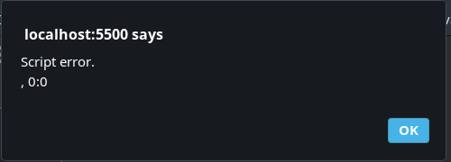
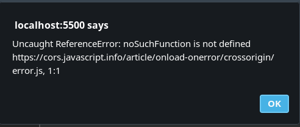

- [Document loading](#document-loading)
  - [DOMContentLoaded](#domcontentloaded)
  - [`window.onunload`](#windowonunload)
  - [Crossorigin policy](#crossorigin-policy)
  - [Task: preload images](#task-preload-images)

# Document loading

The lifecycle of an HTML page has 3 important events:

Event|Description
-|-
`DOMContentLoaded`|The browser fully loaded HTML, and the DOM tree is built, but external resources like pictures  and stylesheets may be not yet loaded. The handler can lookup DOM nodes, initialize the interface.
`load`|Full loaded, including external resources, **styles** are applied, **image** sizes are known etc.
`beforeunload`|The user is leaving. We can check if the user saved the changes and ask them whether they really want to leave.
`unload`|The user has left, but we still can initiate some operations, such as sending out statistics.
***

## DOMContentLoaded 

Styles don't affect DOM, so DOMContentLoaded usually don't wait for them. But there's an exception: if a `script` goes after a `style`, then the script must wait for the `style` to load (since it may want ot use coordinates, image sizes, etc.). **As DOMContentLoaded waits for scripts, it now waits for styles before them as well.**  

**Autofill** in forms also usually happens after `DOMContentLoaded`.
***


## `window.onunload`

`navigator.sendBeacon(url, data)` can be used to send analytics. 

```javascript
let analyticsData = { /* object with gathered data */ };

window.addEventListener("unload", function() {
  navigator.sendBeacon("/analytics", JSON.stringify(analyticsData));
};
```

* The request is sent as POST.
* We can send not only a string, but also forms and other formats, as described in the chapter Fetch, but usually it’s a stringified object.
* The data is limited by 64kb.
***

We can use `onbeforeunload`: `preventDefault()` to show additional confirmation window before user is gone. 
***

We can check `document.readyState` the learn if the the document is fully loaded:

* `loading` – the document is loading.
* `interactive` – the document was fully read.
* `complete` – the document was fully read and all resources (like images) are loaded too.

```javascript
function work() { /*...*/ }

if (document.readyState == 'loading') {
  // loading yet, wait for the event
  document.addEventListener('DOMContentLoaded', work);
} else {
  // DOM is ready!
  work();
}
```

Also we can ues `readyStateChange`: 

```javascript
document.addEventListener('readystatechange', () => console.log(document.readyState));
```
***


## Crossorigin policy

Scripts from one site can’t access contents of the other site. So, e.g. a script at https://facebook.com can’t read the user’s mailbox at https://gmail.com.

Or, to be more precise, one origin (domain/port/protocol triplet) can’t access the content from another one. So even if we have a subdomain, or just another port, these are different origins with no access to each other.

To allow cross-origin access, the `<script>` tag needs to have the `crossorigin` attribute, plus the remote server must provide special headers.

```html
<script>
window.onerror = function(message, url, line, col, errorObj) {
  alert(`${message}\n${url}, ${line}:${col}`);
};
</script>
<script src="https://cors.javascript.info/article/onload-onerror/crossorigin/error.js"></script>
```



There are three levels of cross-origin access:

* **No** `crossorigin` attribute – access prohibited.
* `crossorigin="anonymous"` – access allowed if the server responds with the header `Access-Control-Allow-Origin` **with `*` or our origin**. Browser does not send authorization information and cookies to remote server.
* `crossorigin="use-credentials"` – access allowed if the server sends back the header `Access-Control-Allow-Origin` **with our origin and `Access-Control-Allow-Credentials: true`.** Browser sends authorization information and cookies to remote server.

Let's add the attribute. If we don’t care about cookies, then `"anonymous"` is the way to go:

```html
<script>
window.onerror = function(message, url, line, col, errorObj) {
  alert(`${message}\n${url}, ${line}:${col}`);
};
</script>
<script src="https://cors.javascript.info/article/onload-onerror/crossorigin/error.js" crossorigin="anonymous"></script>
```

Now, assuming that the server provides an `Access-Control-Allow-Origin` header, everything’s fine. 




## Task: preload images

https://javascript.info/onload-onerror#load-images-with-a-callback

```html
<!DOCTYPE HTML>
<body>
  <script>
    function preloadImages(sources, callback) {
	  Promise.allSettled(sources.map(src => 
	  new Promise((resolve, reject) => {
		  const img = document.createElement('img')
		  img.src = src

		  img.onload = resolve
		  img.onerror = reject
	  })))
	  .then(() => callback())
    }

    // ---------- The test ----------

    let sources = [
      "https://en.js.cx/images-load/1.jpg",
      "https://en.js.cx/images-load/2.jpg",
      "https://en.js.cx/images-load/3.jpg"
    ];

    // add random characters to prevent browser caching
    for (let i = 0; i < sources.length; i++) {
      sources[i] += '?' + Math.random();
    }

    // for each image,
    // let's create another img with the same src and check that we have its width immediately
    function testLoaded() {
      let widthSum = 0;
      for (let i = 0; i < sources.length; i++) {
        let img = document.createElement('img');
        img.src = sources[i];
        widthSum += img.width;
      }
      alert(widthSum);
    }

    // every image is 100x100, the total width should be 300
    preloadImages(sources, testLoaded);
  </script>
</body>
```