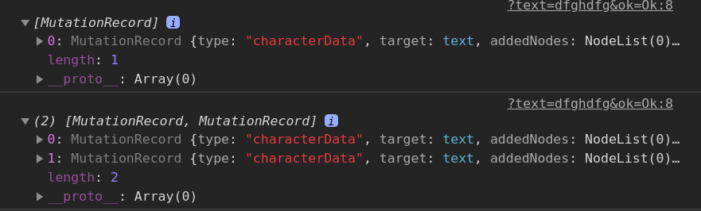
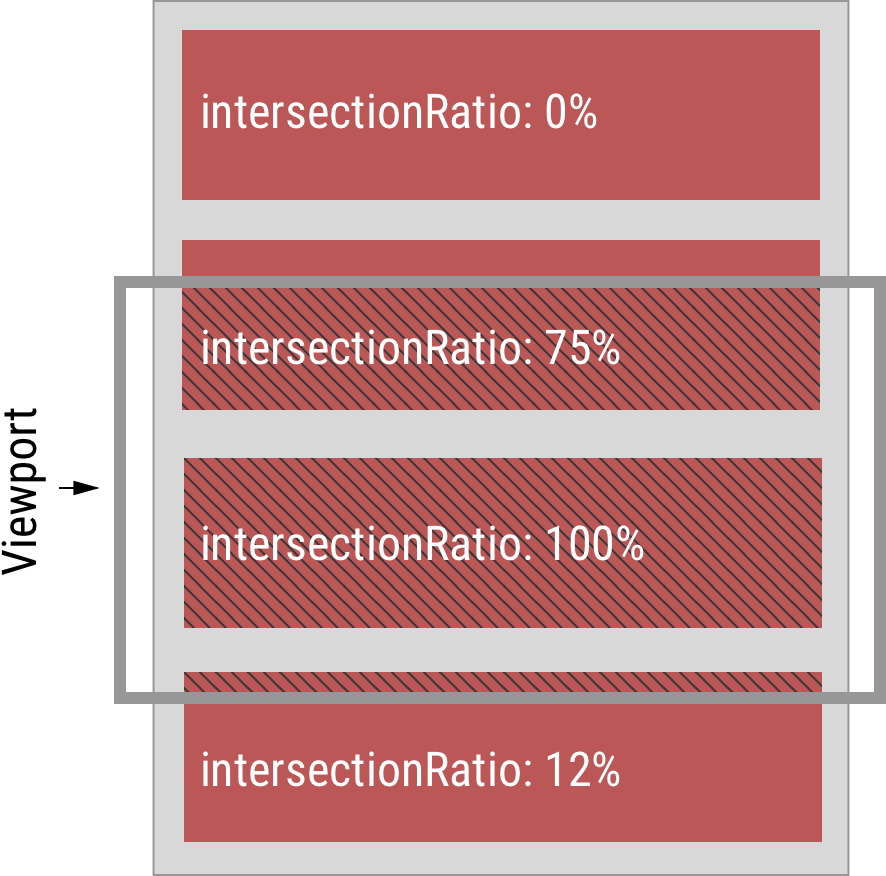

- [Observers](#observers)
	- [Mutation Observer](#mutation-observer)
		- [Garbage collection interaction](#garbage-collection-interaction)
		- [Task: use `MutationObserver` to track the appear of unwanted ads and remove it.](#task-use-mutationobserver-to-track-the-appear-of-unwanted-ads-and-remove-it)
	- [Intersection Observer](#intersection-observer)
		- [Options](#options)
		- [Callback](#callback)
		- [Example: Opacity = intersectionRatio](#example-opacity--intersectionratio)
		- [Example: Endless scroll](#example-endless-scroll)

# Observers

## Mutation Observer

The built-in object that observes a DOM element and fires a callback in case of changes.

```javascript
const observer = new MutationObserver(callback)

// an objeft with boolean option what to observe
const config = {
	childList: true, 	// changes in the direct children of `node`
	subtree: true,		// in all descendents
	attributes: true,	// attributes
	attributeFilter: arr,	// an array of the selected attribute names to observe
	characterData: true,	// observe `node.data` (textContent)
	characterDataOldValue: true	// pass old value
	// also other options
}	

observer.observe(node, config)

// ... some code, then optionally ...

observer.disconnect()	// stops the observing

observer.takeRecords()	// gets a list of unprocessed mutation records, those that happened, but the callback did not handle them
```

Then after any changes, the `callback` is executed: changes are passed in the first argument **as an array** of `MutationRecord` objects, every one of which contains full info about the change made, and the observer itself as the second argument.

`callback` receives up to 2 arguments: 
1. An array of `MutationRecord` objects (showing the changes were made).
2. `MutationObserver` which invoked the callback. 

```html
<div id="div" class="test" contenteditable> Lorem ipsum </div>

<script>
	const observer = new MutationObserver(records => {
		console.log(records)
	})

	observer.observe(div, {
		childList: true,
		subtree: true,
		characterDataOldValue: true		// pass old value
	})
</script>
```



(changed 1 letter, deleted the word)
***

### Garbage collection interaction

Observers use **weak** references to nodes internally. That is: if a node is removed from DOM, and becomes unreachable, then it becomes garbage collected.

The mere fact that a DOM node is observed **doesn’t prevent the garbage collection**.


### Task: use `MutationObserver` to track the appear of unwanted ads and remove it.

```javascript
window.onload = async function() {

	// create an observer
	const observer = new MutationObserver(async records => {
		console.log(records)
		await new Promise(resolve => setTimeout(resolve, 1000))

		// loop over the records and check their `addedNodes` prop, then check each added node against the ads filter and remove it if `true`
		records.forEach(record => 
			record.addedNodes.forEach(newNode => {
				if(newNode.classList.contains('ads')){
					newNode.remove()
				}
			})
		)
	})

	// dispatch an observer
	observer.observe(document.body, {
		childList: true,
		subtree: true
	})
	
	// wait 2 s
	await new Promise(resolve => setTimeout(resolve, 2000))

	// add ads
	const ads = document.createElement('div')
	ads.className = 'ads'
	ads.textContent = 'Ads Block'
	document.body.prepend(ads)
}
```

***


## Intersection Observer

The Intersection Observer API provides a way to asynchronously observe changes in the intersection of a target element with an ancestor element or with a top-level document's viewport.

```javascript
const options = {
	root: null,	
	rootMargin: '0px',
	threshold: 0
}

const observer = new IntersectionObserver(callback, options)

function callback(arrayOfEntries){
	console.log(arrayOfEntries)
}

observer.observe(elem)
```
***


### Options

There're 3 options available for the observer object:

Option|Description
-|-
`root`|The element we track relative to, defaults to `null` being the browser viewpoint
`rootMargin`|Makes possible to resize the rectangle before calculations, defaults to `0px` of `0%`.
`threshold`|Fraction of the tracked element became visible in the range of `0` - `1.0`; `0` means 'at least 1 px', `1.0` means 'all the pxs'. Defaults to `0`. Can be an array of values, e.g. `[0, 0.5, 1.0]`  means that all these values will be thresholds and will trigger the callback once passed through. 
***


### Callback

Callback receives an array of `IntersectionObserverEntry` objects describing the thresholds that were crossed. Each of them has several props:

Props|Description
-|-
`isIntersecting`|Whether the target element has transitioned into a state of intersection (true) or out of a state of intersection (false).
`intersectionRatio`|How much of the target element is currently visible within the root's intersection ratio, as a value between 0.0 and 1.0.
`target`|Which Element previously targeted by calling IntersectionObserver.observe() experienced a change in intersection with the root.
`time`|The time at which the target element experienced the intersection change described by the IntersectionObserverEntry. The time is specified in milliseconds since the creation of the containing document.
***



***


### Example: Opacity = intersectionRatio

```html
<!DOCTYPE html>
<style>
	#block {
		width: 500px;
		height: 1000px;
		background-color: purple;
	}
</style>

<body>
	<div style="height: 1000px;"></div>

	<div id="block">Sentinel</div>

	<div style="height: 1000px;"></div>


	<script>
		const thresholds = []
		for(let i = 0; i < 100; i++){
			thresholds.push(i / 100)
		}

		const options = {
			threshold: thresholds
		}

		const intersectionObserver = new IntersectionObserver(entries => {
			entries.forEach(entry => entry.target.style.opacity = entry.intersectionRatio)
		}, options)

		intersectionObserver.observe(block)
	</script>
</body>
```


### Example: Endless scroll

```html
<!DOCTYPE html>
<style>
	.item {
		background: #FFF;
		border: 1px solid #666;
		height: 100px;
		display: flex;
		align-items: center;
		justify-content: center;
	}

	#sentinel {
		width: 1px;
		height: 1px;
	}

	#scroller {
		height: 400px;
		overflow-y: scroll;
		border: 1px solid yellow;
	}
</style>

<body>
	<div id="scroller">

		<!-- an element we track, as soon as it appears visible, call the callback -->
		<div id="sentinel"></div>

	</div>

	<script>
		const scroller = document.getElementById('scroller')
		const sentinel = document.getElementById('sentinel')
		let counter = 1

		const intersectionObserver = new IntersectionObserver(callback)

		// we track `sentinel` with the given options, as soon as it intersects `root` for > 0 `intersectionRation`, the callback is executed
		intersectionObserver.observe(sentinel)


		function callback(entries) {
			if (entries.some(entry => entry.intersectionRatio > 0)) {
				// load 10 more blocks
				loadItems(10)

				// move `sentinel` to the end
				scroller.append(sentinel)

				// load 5 more blocks
				loadItems(5)
				// When the `sentinel` is hit, there're 5 more blocks behind it, but the callback is already adding 10 more, so 5 + 10 = 15 blocks until the next `sentinel` hit. 
			}
		}

		function loadItems(n) {
			for (let i = 0; i < n; i++) {
				const newItem = document.createElement('div')
				newItem.classList.add('item')
				newItem.textContent = 'Item ' + counter++
				scroller.append(newItem)
			}
		}
	</script>
</body>
```