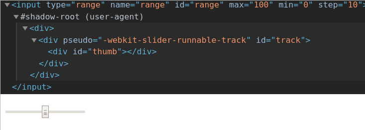

# Custom HTML elements and Shadow DOM

**Warning!** This chapter is a little messed up. You might have to learn all the parts of it at the same time (moving up and down multiple times during studying) instead of just moving top down as usual.

- [Custom HTML elements and Shadow DOM](#custom-html-elements-and-shadow-dom)
	- [Custom HTML elements](#custom-html-elements)
		- [`window.customElements`](#windowcustomelements)
	- [Shadow DOM](#shadow-dom)
		- [Theory](#theory)
		- [Lifecycle callbacks](#lifecycle-callbacks)
		- [Encapsulation](#encapsulation)
		- [Practice](#practice)
			- [A custom element with a static message](#a-custom-element-with-a-static-message)
			- [A custom element with a dynamic message from the attribute](#a-custom-element-with-a-dynamic-message-from-the-attribute)
			- [Full example: squares with lifecycle callbacks](#full-example-squares-with-lifecycle-callbacks)

***


## Custom HTML elements

To make a custom element, you just straight use it in HTML, and **after that** you define it in JS. 

There are 2 types of custom elements:

1. **Autonomous**: extend the basic `HTMLElement`.
2. **Customized built-in** elements: extend the existing HTML elements: `HTMLDivElement`, `HTMLParagraphElement`, etc. (which in turn extend `HTMLElement`). Need to be created with the `is` attribute stating the original extended element. 

***


### `window.customElements` 

Returns a reference to the `CustomElementsRegistry` object which can be used to register new custom elements.

`window.customElements.define(name, constructor, options)` registers a new custom element. 

Custom elements' name **must contain a hyphen `-`**

**Options** currently contain only one option: `extends: string` - the name of a built-in element to extend (e.g. `div`).

```html
<custom-element is="p">Text</custom-element>

<script>
	// a basic inline element, it doesn't do anything yet, just stands
	class CustomElement extends HTMLParagraphElement {}

	window.customElements.define('custom-element', CustomElement, { extends: 'p'})
</script>
```

To create more advanced custom elements, we need to use `Shadow DOM`. 

***


## Shadow DOM

### Theory

Used for **encapsulation**. It makes the component (usually widgets, extensions and custom elements) to have its own **unique style** that **will not be overwritten by the page styles**. 

`Shadow DOM` is separeted from regular `light DOM` and hidden by default. To be able to see it, enable the corresponding options in your browser DevTools (`Show user agent shadow DOM` in Chrome). 

A regular `input:range` with Shadow DOM enabled: 



The elements inside `#shadow-root` is the Shadow DOM.

***

Each DOM-element can have 2 trees:

- a regular `light tree` containing HTML-descendents
- a hidden `shadow tree`

If the element has both trees, only the `shadow` one gets rendered. We need to use `slots` to make a composition of both. 

Element can only have **one** `shadow tree`. 

Not every element can have a `shadow tree`, only standard block elements, span or CustomElements. 

Shadow tree can be used for **custom elements**. In this case you'll have to attach them to the `shadow tree` instead of the usual attacking to `document.body`.

***


### Lifecycle callbacks

You can define several different callbacks inside a custom element's class definition.

`connectedCallback`: Invoked each time the custom element is appended into a document-connected element. 

`disconnectedCallback`: Invoked each time the custom element is disconnected from the document's DOM. 

`adoptedCallback`: Invoked each time the custom element is moved to a new document.

`attributeChangedCallback`: Invoked each time one of the custom element's attributes is added, removed, or changed. Which attributes to notice change for is specified in a `static get observedAttributes` method that should return an array of the attributes to observe (e.g. `['size', 'color']`).

***


### Encapsulation

The shadow DOM is separated from the main document.

Elements of the shadow DOM are not seen via `querySelector` and can have the same `id`-s as the elements of the light DOM. 

The shadow DOM has its own `stylesheets`. They need to be written via `innerHTML` or `textContent` properties as you cannot define dynamic stylesheets otherwise. Style rules from the light DOM will be ignored (excluding `*` selector). 

The `mode` option sets the encapsulation level. It must have any of two values:

- `open` – the shadow root is **available as `elem.shadowRoot`**. Any code is able to access the shadow tree of elem.

- `closed` – elem.shadowRoot is **always null**. We can only access the shadow DOM by the reference returned by attachShadow (and probably hidden inside a class). Browser-native shadow trees, such as `<input type="range">`, are closed. There’s no way to access them.

```html
<style>
	p {		/* fully ignored by the Shadow DOM p-s */
		color: red;
		font-weight: bold;
	}
</style>

<script>
	customElements.define('show-hello', class extends HTMLElement {
		connectedCallback(){
			// create shadow root - returns the #shadow-root object
			const shadow = this.attachShadow({mode: 'open'})
			
			shadow.innerHTML = `<style>
			p {
				color: blue;
			}
			</style>
			<p>
				Hello, ${this.getAttribute('name')}
			</p>`
		}
	})
</script>

<show-hello name="John" id="custom"></show-hello>
```


***


### Practice

#### A custom element with a static message

```html
<lovely-day></lovely-day>
<lovely-day></lovely-day>

<script>
	customElements.define('lovely-day', class extends HTMLElement {
		constructor(){
			super()

			const shadow = this.attachShadow({ mode: 'open' })
			shadow.innerHTML = `<p>What a day! What a lovely day!</p>` 
		}
	})
</script>
```

***

#### A custom element with a dynamic message from the attribute

```html
<show-message text="Lorem ipsum dolor sit amet consectetur adipisicing elit. Nobis, saepe."></show-message>
<show-message text="Lorem ipsum dolor sit amet."></show-message>

<script>
	customElements.define('show-message', class extends HTMLElement {
		constructor(){
			super()

			const shadow = this.attachShadow({ mode: 'open' })
			shadow.innerHTML = `<p>
				${this.getAttribute('text')}
			</p>` 
		}
	})
</script>
```

***

#### Full example: squares with lifecycle callbacks

```html
<button class="add">Add CUSTOM-SQUARE element</button>
<button class="update">Update CUSTOM-SQUARE element</button>
<button class="remove">Remove CUSTOM-SQUARE element</button>

<!-- <custom-square size="100" color="green"></custom-square> -->

<script>
	const add = document.querySelector('.add')
	const update = document.querySelector('.update')
	const remove = document.querySelector('.remove')

	update.disabled = true
	remove.disabled = true

	add.onclick = () => {
		const square = document.createElement('custom-square')
		document.body.append(square)

		square.setAttribute('size', generateRandom(50, 150))
		square.setAttribute('color', `rgb(${generateRandom(0, 255)}, ${generateRandom(0, 255)}, ${generateRandom(0, 255)})`)
		
		add.disabled = true
		update.disabled = false
		remove.disabled = false
	}

	update.onclick = () => {
		const square = document.querySelector('custom-square')

		square.setAttribute('size', generateRandom(50, 150))
		square.setAttribute('color', `rgb(${generateRandom(0, 255)}, ${generateRandom(0, 255)}, ${generateRandom(0, 255)})`)    
	}

	remove.onclick = () => {
		document.querySelector('custom-square').remove()

		add.disabled = false
		update.disabled = true
		remove.disabled = true
	}

	function generateRandom(min, max){
		return Math.floor( Math.random() * (max - min + 1) + min )
	}

	class CustomSquare extends HTMLElement {
		constructor(){
			super()

			const shadow = this.attachShadow({ mode: 'open' })
			const wrapper = document.createElement('div')
			const style = document.createElement('style')
			
			// We don't have access to the attributes on this step as the element itself is an empty object yet. Check it:
			// const clone = {
			//     ...this
			// }
			// console.log(clone)  // {}

			shadow.append(style)        
			shadow.append(wrapper)        
		}

		connectedCallback(){
			// And now we do have access to the attributes as the element is already created and appended to the document. Check it:
			// console.log(this.getAttribute('color'))
			// console.log(this.shadowRoot)
			
			console.log('Connected callback')
			this.updateElement()
		}

		attributeChangedCallback(name, oldValue, newValue) {
			console.log('Attribute changed callback')
			this.updateElement()
		}

		disconnectedCallback(){
			console.log('Disconnected callback')
		}

		// We use this method to update a style of an elemewnt based on its current attributes
		updateElement(){
			// NB: we can only call for `this.shadowRoot` because we set `{ mode: 'open' } earlier.
			const shadow = this.shadowRoot
			const style = shadow.querySelector('style')

			style.textContent = `div{` +
				`width:${this.getAttribute('size')}px;` +
				`height:${this.getAttribute('size')}px;` +
				`border:1px solid black;` +
				`background-color:${this.getAttribute('color')};` +
			`}`
		}

		// This method is mandatory, it sets the attributes to be observed for `attributeChangedCallback`
		static get observedAttributes(){
			return ['size', 'color']
		}
	}

	customElements.define('custom-square', CustomSquare)
</script>
```
