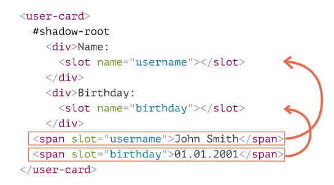
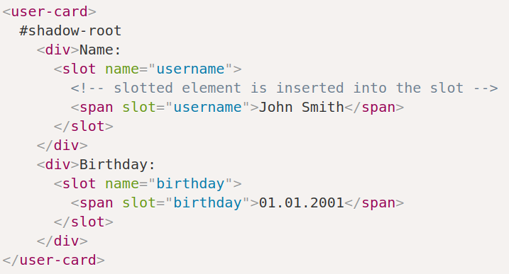

# Shadow DOM slots, Composition, Template element 

- [Shadow DOM slots, Composition, Template element](#shadow-dom-slots-composition-template-element)
  - [Template Element](#template-element)
  - [Shadow DOM slots](#shadow-dom-slots)
    - [Synopsis](#synopsis)
    - [Intro](#intro)
    - [Slot fallback content](#slot-fallback-content)
    - [Default slot: first unnamed](#default-slot-first-unnamed)
    - [Example: custom menu](#example-custom-menu)
    - [Updating slots](#updating-slots)
    - [Slot API](#slot-api)

***


## Template Element

A built-in `template` element serves as a storage for HTML markup templates. The browser ignores its contents but we can access and use it in JavaScript, to create other elements. 

The content becomes interactive: `scripts` run, `<video autoplay>` plays etc, when inserted into the document.

Access its content via the `content` property to insert it into the `DOM`. 

Usually, if we try to put `tr` inside, say, a `div`, the browser detects the invalid DOM structure and “fixes” it, adds `table` around. That’s not what we want. On the other hand, `template` keeps exactly what we place there.


```html
<template id="tmp">
    <script> console.log('yo') </script>

    <div>Div</div>
</template>

<script>
    document.body.append(tmp.content)   // only one Div and console.log
    document.body.append(tmp.content)
</script>
```

But this way we'll only be able to use our template once (as appending it over and over will just move it to the other place). To use it multiple times, **we have to insert** its **clone** each time.

```html
<template id="tmp">
    <script> console.log('yo') </script>

    <div>Div</div>
</template>

<script>
    document.body.append(tmp.content.cloneNode(true))   // two Divs
    document.body.append(tmp.content.cloneNode(true))   // and two console.logs
</script>
```

Now everything's fine. 

***


## Shadow DOM slots

### Synopsis

Usually, if an element has `shadow DOM`, then its `light DOM` is not displayed. **`Slots` allow to show elements from light DOM in specified places of `shadow DOM`.**

There are two kinds of slots:

- **Named slots**: `<slot name="X">...</slot>` – gets light children with the `slot="X"` attribute.
- **Default slot**: the first `<slot>` **without a name** (subsequent unnamed slots are ignored) – gets unslotted light children.
- If there are many elements for the same slot – they are appended one after another.
- The **content of `<slot>`** element is used as a **fallback**. It’s shown if there are no light children for the slot.

The process of rendering slotted elements inside their slots is called “composition”. The result is called a **“flattened DOM”**.

Composition does not really move nodes, from JavaScript point of view the DOM is still same.

JavaScript can access slots using methods:

- `slot.assignedNodes/Elements()` – returns nodes/elements inside the slot.
- `node.assignedSlot` – the reverse meethod, returns slot by a node.

If we’d like to know what we’re showing, we can track slot contents using:

- `slotchange` event – triggers the first time a slot is filled, and on any add/remove/replace operation of the slotted element, but not its children. The slot is `event.target`.
- `MutationObserver` to go deeper into slot content, watch changes inside it.

***


### Intro

Shadow DOM supports `<slots>` elements that can be automatically filled with the content from light DOM. This allows us to create custom elements with insertable content, like `select` with `options`. 

**They only exist inside shadow DOM (inside the class)! You put regular elements with the `slot="somename"` attribute inside the custom element!** 

In the shadow DOM, `<slot name="X">` defines an “insertion point”, a place where elements with an **attribute `slot="X"`** are rendered.


```html
<user-card>
    <span slot="username">Maximus</span>
    <span slot="birthday">01.01.1200</span>
</user-card>

<script>
    class UserCard extends HTMLElement {
        connectedCallback(){
            const shadow = this.attachShadow({ mode: 'closed' })
            shadow.innerHTML = `<div>Name:
                <slot name="username"></slot>
            </div>
            <div>Birthday:
                <slot name="birthday"></slot>
            </div>`
        }
    }

    customElements.define('user-card', UserCard)
</script>
```




This is how looks in the end:



**NB**: Only top-level children (direct children of the shadow host) may have `slot="…"` attribute! For nested elements it’s ignored.

```html
<user-card>
    <span slot="username">John Smith</span>
    <div>
        <!-- invalid slot, must be direct child of user-card -->
        <span slot="birthday">01.01.2001</span>
    </div>
</user-card>
```

***

If there are multiple elements in light DOM with the same slot name, they are appended into the slot, one after another

```html
<user-card>
    <span slot="username">John</span>
    <span slot="username">Smith</span>
</user-card>
```


***


### Slot fallback content

Anything we put inside a `slot` element becomes its fallback - the default content. The browser shows it if there’s no corresponding filler in light DOM.

```html
<div>
    // "Anonymous" will be rendered if there's no `slot="username" in light DOM
    <slot name="username">Anonymous</slot>  
</div>
```

***


### Default slot: first unnamed

The **first `<slot>`** in shadow DOM that **doesn’t have a `name`** is a “default” slot that will get **all nodes** from light DOM that aren’t slotted elsewhere.

```html
<user-card>
    <div>Ya plakat' ne budu</div>             <!-- here -->

    <span slot="username">Maximus</span>
    <span slot="birthday">01.01.1199</span>
    
	  <!-- here -->
</user-card>

<!-- What's happening now? We used `slots` in shadow DOM and now we expect elements with `slot` attributes to be present in light DOM inside our custom element. As for the default `slot`, it will be any element without the mathing `slot` attribute -->

<script>
    class UserCard extends HTMLElement {
        connectedCallback(){
            const shadow = this.attachShadow({ mode: 'closed' })
            shadow.innerHTML = `<div>Name:
                <slot name="username"></slot>
            </div>
            <div>Birthday:
                <slot name="birthday"></slot>
            </div>
            <fieldset>
                <legend>Other information</legend>

                <slot><slot>

            </fieldset`
        }
    }

    customElements.define('user-card', UserCard)
</script>
```

As you can see, several nodes are insered one after another perfectly.

***


### Example: custom menu

```html
<custom-menu>
    <span slot="title">Taxi drivers</span>
    <li slot="item">Axel</li>
    <li slot="item">Dori</li>
    <li slot="item">Gass</li>
</custom-menu>

<template id="tmp-custom-menu">
    <style>
        ul {
            list-style: none;
            margin: 0;
        }

        /* Non-selectable text */
        slot[name="title"] {
            -moz-user-select: none;
            -webkit-user-select: none;
            -ms-user-select: none;
            user-select: none;
        }

        /* Append this class to hide the items */
        .closed {
            display: none;
        }

        /* Selects any element placed inside a slot */
        ::slotted([slot="title"]) {
            cursor: pointer;
            font-weight: bold;
        }
    </style>
    <div class="menu">
        <label>
            <slot name="title"></slot>
            <ul>
                <slot name="item"></slot>
            </ul>
        </label>
    </div>
</template>

<script>

    class CustomMenu extends HTMLElement {
        connectedCallback(){
            const shadow = this.attachShadow({ mode: 'closed' })

            shadow.append(document.getElementById('tmp-custom-menu').content.cloneNode(true))

            shadow.querySelector('slot[name="title"]').onclick = () => {
                shadow.querySelector('.menu ul').classList.toggle('closed')
            }
        }
    }

    customElements.define('custom-menu', CustomMenu)
</script>
```

***


### Updating slots

The browser monitors slots and updates the rendering if slotted elements are changed. The `slotchange` event is responsible for this. 

**It only triggers when slots themselves are changed - new elements added or the old ones removed**. Changing the nested (inside slots) elements' content doesn't trigger it!
```html
<custom-menu id="menu">
    <span slot="title">Taxi drivers</span>
</custom-menu>
```

```javascript
// inside the class

// shadowRoot can't have event listeners so we use add them to the nested 
shadow.children[1].addEventListener('slotchange', e => {
    console.log(e.target)


// `slotchange` triggered from outside

// doesn't trigger the event
setTimeout(() => {
    document.getElementById('menu').querySelector('[slot="title"]').textContent = 'Vegetables'
}, 1000)

// triggers the event
setTimeout(() => {
    document.getElementById('menu').insertAdjacentHTML('beforeend', `<li slot="item">Potato</li>"`)
}, 2000)
```

**Explanation**: now we have the same full-describing template as before, but we only assign the "title" slot into it from the `html`. The `item` slots we add later, via JS.

There are two slotchange events here:

- At initialization: `slotchange`: title triggers immediately, as the slot="title" from the light DOM gets into the corresponding slot.
- After 2 seconds: `slotchange`: item triggers, when a new `<li slot="item">` is added.

***


### Slot API

- `node.assignedSlot` - returns the `slot` element the node is assigned to.

- `slot.assignedNodes({ flatten: true/false })` - DOM nodes, assigned to the slot. Default to `false`, if `true` - returns nested `slots`in case of nested components and the fallback content if no node assigned.

- `slot.assignedElements({ flatten: true/false })` - the same as above but only Elements, not nodes.

These methods are useful when we need not just show the slotted content, but also track it in JavaScript.

Example: we want to know what items does `custom-menu` have every time they are changed.

```html
<custom-menu id="menu">
    <span slot="title">Vegetables</span>
</custom-menu>
```

```javascript
// Listener inside the class
shadow.children[1].addEventListener('slotchange', e => {
    // console.log("Assigned Elements: ", .textContent)
    const elements = Array.prototype.map.call(e.target.assignedElements(), item => item)

    const vegetablesInTheList = elements.map(item => item.textContent)
    console.log("Assigned Elements: ", vegetablesInTheList)
    
    console.log("Assigned slots: ", elements.map(item => item.assignedSlot))
})

// Add items to the slots
setTimeout(() => {
    document.getElementById('menu').insertAdjacentHTML('beforeend', `<li slot="item">Potato</li>"`)
}, 1000)
setTimeout(() => {
    document.getElementById('menu').insertAdjacentHTML('beforeend', `<li slot="item">Tomato</li>"`)
}, 2000)
```


***