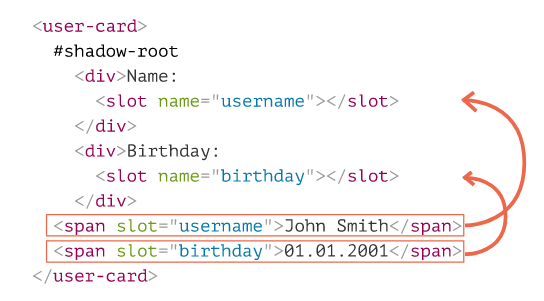
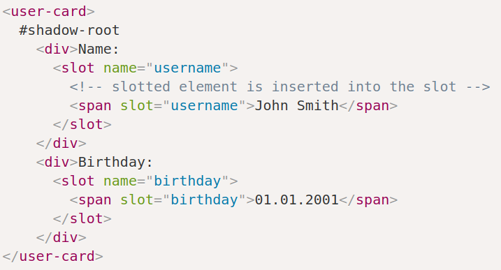
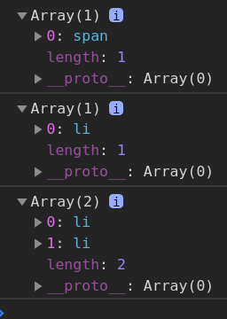

# Shadow DOM. Slots, Composition, Template element 

- [Shadow DOM. Slots, Composition, Template element](#shadow-dom-slots-composition-template-element)
  - [Template Element](#template-element)
  - [Shadow DOM slots](#shadow-dom-slots)
    - [Example: custom menu](#example-custom-menu)
    - [Updating slots](#updating-slots)
    - [Slot API](#slot-api)

***


## Template Element

HTML `template` element serves as a storage for HTML markup templates. The browser ignores its contents but we can access and use it in JavaScript, to create other elements. 

The content becomes interactive: `scripts` run, `<video autoplay>` plays etc, when inserted into the document.

Access its content via the `content` property to insert it into the `DOM`. 

Usually, if we try to put `tr` inside, say, a `div`, the browser detects the invalid DOM structure and “fixes” it, adds `table` around. That’s not what we want. On the other hand, `template` keeps exactly what we place there.


```html
<template id="tmp">
    <script> console.log('kuku') </script>
    <div>Div</div>
</template>

<script>
    // this will run the inner script and render `div`
    document.body.append(tmp.content)
    // nothing happens the second time as we just moved the same element
    document.body.append(tmp.content)
</script>
```

To use be able to use it multiple times, **we have to insert** its **clone** each time (as `append()` only moves the same element).

```html
<template id="tmp">
    <script> console.log('kuku') </script>
    <div>Div</div>
</template>

<script>
    // this will run the inner script and render `div`
    document.body.append(tmp.content.cloneNode(true))
    // this will too
    document.body.append(tmp.content.cloneNode(true))
</script>
```

***


## Shadow DOM slots

Usually, if an element has `shadow DOM`, then its `light DOM` (descendent elements) is not displayed. `Slots` allow to show elements from light DOM in specified places of `shadow DOM`.

```html
<custom-element>
	<!-- No `slot="title"`, fallback will be used! -->
	<div slot="content">Inserted content #1</div>
	<div slot="content">Inserted content #2</div>

	<!-- These will go to the first default slot -->
	<strong>Slot-less strong element</strong>
	<em>Slot-less emphasized element</em>
</custom-element>

<script>

	customElements.define('custom-element', class extends HTMLElement {
		connectedCallback(){
			const shadow = this.attachShadow({ mode: 'open' })

			shadow.innerHTML = `<div>
				<h3>
					<slot name="title">Fallback Title</slot>
				</h3>

				<p>
					<slot name="content">Fallback Content</slot>
				</p>
				
				<slot></slot>
				<slot></slot>
			</div>`
		}
	})
</script>
```

There are two kinds of slots:

- **Named slots**: `<slot name="X">...</slot>` – gets the custom element children with the `slot="X"` attribute, one after another.
- **Default slot**: the **first** (subsequent are ignored) `<slot><slot>` **without** the `name` attribute  – gets all the light DOM descendents of the custom element that don't have the `slot` attribute.
  
TextContent of `<slot>...</slot>` element is used as a **fallback**. It’s shown if there are no light children for the slot. 

If there are multiple elements in light DOM with the same slot name, they are appended into the slot, one after another

***

The process of rendering slotted elements inside their slots is called “composition”. The result is called **“flattened DOM”**.

Composition does not really move nodes, from JavaScript point of view the DOM is still the same.


***

JS can access slots using methods:

- `slot.assignedNodes/Elements()` – returns nodes/elements inside the slot.
- `node.assignedSlot` – the reverse meethod, returns slot by a node.

We can track the slot contents using:

- `slotchange` event – triggers the first time a slot is filled, and on any add/remove/replace operation of the slotted element, but not its children. The slot is `event.target`.
- `MutationObserver` to go deeper into the slot content, watch changes inside it.

***

Another example:



This is how looks in the end:



**NB**: Only top-level children (direct children of the shadow host) may have `slot="…"` attribute! For nested elements it’s ignored.

```html
<user-card>
    <span slot="username">John Smith</span>
    <div>
        <!-- invalid slot, must be direct child of user-card -->
        <span slot="birthday">01.01.2001</span>
    </div>
</user-card>
```

***


### Example: custom menu

```html
<custom-menu>
    <span slot="title">Taxi drivers</span>
    <li slot="item">Axel</li>
    <li slot="item">Dori</li>
    <li slot="item">Gass</li>
</custom-menu>

<template id="tmp-custom-menu">
    <style>
        ul {
            list-style: none;
            margin: 0;
        }

        /* Non-selectable text */
        slot[name="title"] {
            -moz-user-select: none;
            -webkit-user-select: none;
            -ms-user-select: none;
            user-select: none;
        }

        /* Append this class to hide the items */
        .closed {
            display: none;
        }

        /* Selects any element placed inside a slot */
        ::slotted([slot="title"]) {
            cursor: pointer;
            font-weight: bold;
        }
    </style>
    <div class="menu">
        <label>
            <slot name="title"></slot>
            <ul>
                <slot name="item"></slot>
            </ul>
        </label>
    </div>
</template>

<script>

    class CustomMenu extends HTMLElement {
        connectedCallback(){
            const shadow = this.attachShadow({ mode: 'closed' })

            shadow.append(document.getElementById('tmp-custom-menu').content.cloneNode(true))

            shadow.querySelector('slot[name="title"]').onclick = () => {
                shadow.querySelector('.menu ul').classList.toggle('closed')
            }
        }
    }

    customElements.define('custom-menu', CustomMenu)
</script>
```

***


### Updating slots

The browser monitors slots and updates the rendering if slotted elements are changed. The `slotchange` event is responsible for this. 

**It only triggers when slots themselves are changed - new elements added or the old ones removed**. Changing the nested (inside slots) elements' content doesn't trigger it!
```html
<custom-menu id="menu">
    <span slot="title">Taxi drivers</span>
</custom-menu>
```

```javascript
// inside the class

// shadowRoot can't have event listeners so we add them to the inner container
shadow.children[1].addEventListener('slotchange', e => {
    console.log(e.target)


// `slotchange` triggered from outside

// doesn't trigger the event
setTimeout(() => {
    document.getElementById('menu').querySelector('[slot="title"]').textContent = 'Vegetables'
}, 1000)

// triggers the event
setTimeout(() => {
    document.getElementById('menu').insertAdjacentHTML('beforeend', `<li slot="item">Potato</li>"`)
}, 2000)
```

**Explanation**: now we have the same full-describing template as before, but we only assign the "title" slot into it from the `html`. The `item` slots we add later, via JS.

There are two slotchange events here:

- At initialization: `slotchange`: title triggers immediately, as the slot="title" from the light DOM gets into the corresponding slot.
- After 2 seconds: `slotchange`: item triggers, when a new `<li slot="item">` is added.

***


### Slot API

- `node.assignedSlot` - returns the `slot` element the node is assigned to.

- `slot.assignedNodes({ flatten: true/false })` - DOM nodes, assigned to the slot. Default to `false`, if `true` - returns nested `slots`in case of nested components and the fallback content if no node assigned.

- `slot.assignedElements({ flatten: true/false })` - the same as above but only Elements, not nodes.

These methods are useful when we need not just show the slotted content, but also track it in JavaScript.

Example: we want to know what items does `custom-menu` have every time they are changed.

```html
<custom-menu id="menu">
    <span slot="title">Vegetables</span>
</custom-menu>
```

```javascript
// Listener inside the class
shadow.children[1].addEventListener('slotchange', e => {
    // console.log("Assigned Elements: ", .textContent)
    const elements = Array.prototype.map.call(e.target.assignedElements(), item => item)

    const vegetablesInTheList = elements.map(item => item.textContent)
    console.log("Assigned Elements: ", vegetablesInTheList)
    
    console.log("Assigned slots: ", elements.map(item => item.assignedSlot))
})

// Add items to the slots
setTimeout(() => {
    document.getElementById('menu').insertAdjacentHTML('beforeend', `<li slot="item">Potato</li>"`)
}, 1000)
setTimeout(() => {
    document.getElementById('menu').insertAdjacentHTML('beforeend', `<li slot="item">Tomato</li>"`)
}, 2000)
```

