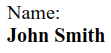

# Shadow DOM Styles and Events

- [Shadow DOM Styles and Events](#shadow-dom-styles-and-events)
  - [Styling](#styling)
    - [`:host`, `:host(selector)` and `:host-context(selector)`](#host-hostselector-and-host-contextselector)
    - [`::slotted(selector)`](#slottedselector)
    - [Custom CSS properties, `--*`](#custom-css-properties---)
  - [Events](#events)

***


Shadow DOM may include both `<style>` and `<link rel="stylesheet" href="…">` elements. In the latter case, stylesheets are HTTP-cached, so they are not redownloaded for multiple components that use the same template.

As a general rule, local styles work only inside the shadow tree, and document styles work outside of it. But there are few exceptions.

## Styling

### `:host`, `:host(selector)` and `:host-context(selector)`

`:host` selects the shadow host (element containing the shadow tree) - our custom element basically. 

`:host(selector)` selects the shadow host if the selector matches. 

`:host-context(selector)` is the same as previous but applies also if the ancestors match the selector. 

```html
<body class="dark-theme">
	<custom-dialog>
		Not centered!
	</custom-dialog>
	
	<custom-dialog centered>
		Centered!
	</custom-dialog>

	<template id="tmpl">
		<style>
            /* Common for the element */
			:host {
				display: inline-block;
				border: 1px solid red;
				padding: 10px;
			}

            /* If the element has the selector */
			:host([centered]){
				position: fixed;
				left: 50%;
				top: 50%;
				transform: translate(-50%, -50%);
				display: inline-block;
				border: 1px solid red;
				padding: 10px;
			}
            
            /* If the element or any of the ancestors have the selector */
			:host-context(.dark-theme){
				color: white;
				background: #333;
			}
		</style>
		
		<slot></slot>
	</template>
	
	<script>
		customElements.define('custom-dialog', class extends HTMLElement {
			connectedCallback() {
				this.attachShadow({
					mode: 'open'
				}).append(tmpl.content.cloneNode(true));
			}
		});
	</script>
</body>
```

In terms of cascading, the **document styles** has **precedence** over the `:host` local styles. So you can set the default styles for your custom element inside the element in `:host` and if you ever want to override them - you can easily do this from the outside setting styles for your `<custom-element>`.

***


### `::slotted(selector)`

Slotted elements come from `light DOM`, so they use document styles. **Local styles do not affect** them after they are inserted to the slots.

```html
<style>
    span {
        font-weight: bold
    }
</style>

<user-card>
    <div slot="username">
        <span>John Smith</span>
    </div>
</user-card>

<script>
    customElements.define('user-card', class extends HTMLElement {
        connectedCallback() {
            this.attachShadow({
                mode: 'open'
            });
            this.shadowRoot.innerHTML = `
      <style>
      span { background: red; }
      </style>
      Name: <slot name="username"></slot>
    `;
        }
    });
</script>
```



Styling `span` inside shadow DOM **won't work** for `span`-s passed to slots from the outside. 

We can set styles to the `slot` elements themselves and hope that they will be inherited by the inserted element. But not all properties are getting inherited. 

The better solution is to use `::slotted(selector)` pseudo-element. It matches the elements that go into `slots` (i.e. have the `slot="..."` attribute) but not their children. The element should match the `selector`.

There are 2 restrictions:

1. `::slotted` can’t descend any further into the slot. These selectors are invalid: `::slotted(div span) {}`, `::slotted(div) p {`
2. `::slotted` can only be used in CSS. We can’t use it in `querySelector`.

```html
<user-card>
    <div slot="username">
        <div>
            John Smith
        </div>
</user-card>

<script>
    customElements.define('user-card', class extends HTMLElement {
        connectedCallback() {
            this.attachShadow({
                mode: 'open'
            })
            this.shadowRoot.innerHTML = `
            <style>
                ::slotted(.highlighted){
                    background: orange;
                }
            </style>
            
            <slot id="container"></slot>`

            container.onmouseover = e => {
                const target = e.target.closest('[slot]')
			    if(target){
                    target.classList.add('highlighted')
                }
            }

            container.onmouseout = e => {
                const target = e.target.closest('[slot]')
			    if(target){
                    target.classList.remove('highlighted')
                }
            }
        }
    })
</script>
```

***


### Custom CSS properties, `--*`

Property names that are prefixed with `--`, like `--example-name`, represent custom properties that contain a value that can be used in other declarations using the `var()` function.

Custom properties are scoped to the element(s) they are declared on, and participate in the cascade:

```html
<!DOCTYPE html>
<style>
    :root {
        --first-color: #488cff;
        --second-color: #ffff8c;
    }

    #div {
        background-color: var(--first-color);
        color: var(--second-color);
    }
</style>

<div id="div">
    Div Text Content
</div>
```

**Custom CSS properties exist on all levels, both in light and shadow.**

E.g., in shadow DOM we can use "--user-card-field-color" CSS variable to style fields, and the outer document can set its value.

In Shadow DOM:

```html
<style>
    .field {
        color: var(--user-card-field-color, black);
        /* if --user-card-field-color is not defined, use black color */
    }
</style>
<div class="field">
    Name: <slot name="username"></slot>
</div>
<div class="field">
    Birthday: <slot name="birthday"></slot>
</div>
```

In Light DOM:

```css
user-card {
  --user-card-field-color: green;
}
```

***


## Events

Event targets differ depending on where does event trigger: 

1. Inside Shadow DOM, target is the actual `e.target` element of the **shadow root**.
2. In **light DOM** the target is the **host**.


```html
<user-card></user-card>

<script>
customElements.define('user-card', class extends HTMLElement {
    connectedCallback() {
        this.attachShadow({mode: 'open'})
        this.shadowRoot.innerHTML = `<p>
                <button>Click me</button>
            </p>`
        this.shadowRoot.firstElementChild.onclick =
        e => alert("Inner target: " + e.target.tagName)
        // Inner taget: BUTTON
    }
})

document.onclick =
    e => alert("Outer target: " + e.target.tagName)
    // Outer target: USER-CARD
</script>
```

Retargeting **does not occur** if the event occurs **on a slotted element**, that physically lives in **light DOM**.

```html
<user-card id="userCard">
    <span slot="username">John Smith</span>
    <!-- click here will always show `e.target == span` -->
</user-card>
```

***

Bubbling works fine from the deepest slotted elements up to the `window`. The full path can be obtained from `event.composedPath()`

If the shadow tree was created with `{ mode: 'closed' }`, then the composed path starts from the **host**: `<user-card>` and upwards.

The `event.composed` property is responsible for the allowance of the events to bubble through the shadow-light boundary. If it's `true` (for the most of events), than they **can bubble** to light DOM.

When we **dispatch custom events**, we need to **set** both `bubbles` and `composed` properties to `true` for it to bubble up and out of the component.

```javascript
inner.dispatchEvent(new CustomEvent('test', {
    bubbles: true,
    composed: true,
    detail: "composed"
}))
```