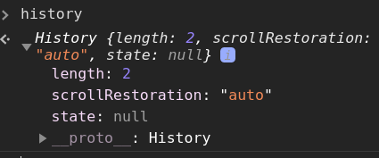
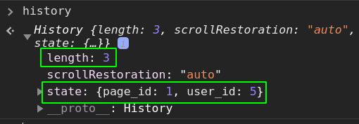
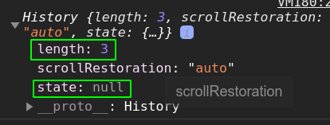
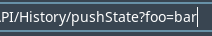

# History API

- [History API](#history-api)
	- [Sources](#sources)
	- [Intro](#intro)
	- [Properties](#properties)
		- [`length`](#length)
		- [`scrollRestoration`](#scrollrestoration)
		- [`state`](#state)
	- [Methods](#methods)
		- [`history.go ()`](#historygo-)
		- [`history.back ()`](#historyback-)
		- [`history.forth ()`](#historyforth-)
		- [`history.pushState (state, title, url)`](#historypushstate-state-title-url)
		- [`history.replaceState (state, title, url)`](#historyreplacestate-state-title-url)

***

## Sources

1. https://developer.mozilla.org/en-US/docs/Web/API/History_API

***

## Intro

The DOM `window.history` (=== `history`) object provides access to the navigation history and lets you travel it back and forth.

***


## Properties

### `length`

RO; returns the number of elements in the session history (1 for a loaded in a New Tab page).

### `scrollRestoration`

Set whether the scroll position will be saved after page reloads (`'auto'`) or not (`'manual'`).

### `state`

An object with the saved data for this history entry. 

***


## Methods

### `history.go ()`

**Asynchronously** (listen for the `window.popstate` event) loads a page from the session history, identified by its relative location to the current page.

If you specify an **out-of-bounds** value (for instance, specifying **-1** when there are no previously-visited pages in the session history), this method **silently has no effect**.

```js
// 1 page backward 
history.go(-1)

// 2 pages forward
history.go(2)

// Reload the current page
history.go(0)
history.go()
```

***

### `history.back ()`

An alias for `history.go(-1)`

### `history.forth ()`

An alias for `history.go(1)`

***

### `history.pushState (state, title, url)`

Adds an entry to the browser's session history stack **and switches to it**.

Params:

- `state` - an object in which we can store some data to use with the current history entry (after we switch between them): document's scroll position, the values of form inputs, etc.
- `title` - supposed to be a title of the page but in fact is ignored by browsers
- `url` - the new history entry's URL (the last piece of the path after the last `/`); must be of the same origin as the current URL

**Example 1**

1. At the start we have 2 entries (Blank page in the New Tab and the current actual MDN tab I'm on right now):

```js
console.log(history)
```




2. Call `pushState`:

```js
const state = { 'page_id': 1, 'user_id': 5 }
const title = ''
const url = 'hello-world.html'

history.pushState(state, title, url)
console.log(history)
```




3. The previous history entry doesn't have the saved data:

```js
history.back()
console.log(history)
```





**Example 2**: change a query parameters without reloading

Before:  


```js
const url = new URL(window.location)
url.searchParams.set('foo', 'bar')
window.history.pushState({}, '', url)
```

After:



***

### `history.replaceState (state, title, url)`

The same as `pushState` but updates the current state instead of adding the new one and switching to it. 