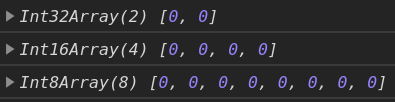
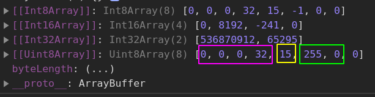
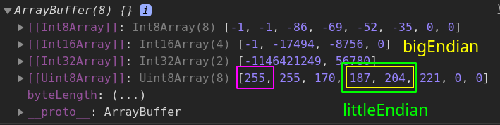

- [ArrayBuffer](#arraybuffer)
  - [Static Properties and Methods](#static-properties-and-methods)
    - [`isView()`](#isview)
    - [`slice()`](#slice)
  - [Instance Properties and Methods](#instance-properties-and-methods)
    - [`buffer.byteLength`](#bufferbytelength)
    - [`buffer.slice(begin, end)`](#bufferslicebegin-end)
- [Typed Array](#typed-array)
  - [Static Methods and Properties](#static-methods-and-properties)
    - [`TypedArray.of(elements)`](#typedarrayofelements)
    - [`TypedArray.from(source, [, mapFn[, thisArg]])`](#typedarrayfromsource--mapfn-thisarg)
    - [`TypedArray.name`](#typedarrayname)
  - [Instance Properties](#instance-properties)
    - [`buffer`](#buffer)
    - [`length`](#length)
    - [`byteLength`](#bytelength)
  - [Instance Methods](#instance-methods)
- [DataView](#dataview)
  - [Constructor](#constructor)
  - [Setting and Getting Value](#setting-and-getting-value)

---

# ArrayBuffer

The `ArrayBuffer` object is used to represent a generic, **fixed-length raw binary data** buffer.

It is an array of bytes, often referred to in other languages as a "byte array".You cannot directly manipulate the contents of an `ArrayBuffer`; instead, you create one of the **TypedArray** objects or a `DataView` object which represents the buffer in a specific format, and use that to read and write the contents of the buffer.

Here we create a 8-byte buffer with diffrent views referring to the buffer:

```js
const arraybuffer = new ArrayBuffer(8)
const i32 = new Int32Array(arraybuffer)
console.log(i32)
const i16 = new Int16Array(arraybuffer)
console.log(i16)
const i8 = new Int8Array(arraybuffer)
console.log(i8)
```



Why so? `ArrayBuffer(8)` basically produces `[00 00 00 00 00 00 00 00]`.

Then we create a view `Int32Array` that treats data as 32-bit === 4-byte words: `[00 00 00 00 | 00 00 00 00]`.

`Int16Array` treats that binary data as 2-byte words: `[00 00 | 00 00 | 00 00 | 00 00]`.

---

## Static Properties and Methods

### `isView()`

Determines whether the passed value is one of the `ArrayBuffer` views, such as a **TypedArray** object or a `DataView`.

```js
ArrayBuffer.isView() // false
ArrayBuffer.isView([]) // false
ArrayBuffer.isView({}) // false
ArrayBuffer.isView(null) // false
ArrayBuffer.isView(undefined) // false
ArrayBuffer.isView(new ArrayBuffer(10)) // false

ArrayBuffer.isView(new Uint8Array()) // true
ArrayBuffer.isView(new Float32Array()) // true
ArrayBuffer.isView(new Int8Array(10).subarray(0, 3)) // true

const buffer = new ArrayBuffer(2)
ArrayBuffer.isView(new DataView(buffer)) // true
```

---

### `slice()`

Returns a new `ArrayBuffer` whose content is a copy of this ArrayBuffer's bytes from the beginning inclusive up to end exclusive.

```js
const buffer = new ArrayBuffer(8)
const ui32 = new Uint8Array(buffer)
ui32[1] = 255 // set the value of [1]-byte
console.log(ui32)
/* Uint8Array(8) [
  0, 255, 0, 0,
  0,   0, 0, 0
] */
console.log(ui32.slice(1, 4)) // takes [1], [2], [3] bytes
// Uint8Array(3) [ 255, 0, 0 ]
console.log(ui32.slice(6)) // the last 2 bytes
// Uint8Array(2) [ 0, 0 ]
```

---

## Instance Properties and Methods

### `buffer.byteLength`

The byte length which is set up during the creation and cannot be changed.

```js
const buffer = new ArrayBuffer(3)
console.log(buffer.byteLength) // 3
```

### `buffer.slice(begin, end)`

Returns a new buffer from the elements of the initial one.

```js
const buffer = new ArrayBuffer(6)

// Create a view
let ui16 = new Uint16Array(buffer)

// fill with random numbers
ui16 = ui16.map((item) => Math.floor(Math.random() * 65536))
console.log(ui16)
// Uint16Array(3) [64529, 11413, 3654]

// slice
console.log(ui16.slice(1)) // from [1] to the end
// Uint16Array(2) [11413, 3654]
console.log(ui16.slice(0, 2)) // from [0] to [2] (exclusively)
// Uint16Array(2) [64529, 11413]
```

---

# Typed Array

A TypedArray object describes an array-like view of a **binary data** buffer. There is **no** type named TypedArray. Instead, we use a number of constructors to translate binary data into different **views**.

Example:

```js
// Signed array of 8 words, 16 bits === 2 bytes each
// Default values === 0, available values range is [-32768, 32767]
let typedArray = new Int16Array(8)
typedArray[0] = 32767 // max available value
typedArray[1] = -32768 // min avaliable value
console.log(typedArray) // [32767, -32768, 0, 0, 0, 0, 0, 0]

// Unsigned array of 4 words, 16 bits === 2 bytes each
// Default values === 0, available values range is [0, 65535]
typedArray = new Uint16Array(4)
typedArray[0] = 65535 // max available value
typedArray[2] = 567 // arbitrary value
console.log(typedArray) // [65535, 0, 567, 0]

// Float array of 4 words, 64 bits === 8 bytes each
typedArray = new Float64Array(4)
typedArray[1] = 2561.1234566789
console.log(typedArray) // [0, 2561.1234566789, 0, 0]
```

When creating an instance of a TypedArray (e.g. Int8Array), an `ArrayBuffer` is created internally in memory. If an `ArrayBuffer` object is given as constructor argument, then it's used instead.

---

The constructor of **TypedArray** can accept different params:

- length (in words)
- typedArray (converts one into another of the same length)
- object (the same as using `TypedArray.from()`)
- buffer

---

## Static Methods and Properties

### `TypedArray.of(elements)`

Creates a new typed array from an arbitrary number of arguments. Resembles `Array.of()`.

If the element is out of range of the given size (e.g. 16 bit below) - it just gets cut out.

```js
const int16 = Int16Array.of('10', '20', '30', '40', '50')
console.log(int16) // [10, 20, 30, 40, 50]
```

---

### `TypedArray.from(source, [, mapFn[, thisArg]])`

Creates a new typed array from an array-like or iterable object. Resembles `Array.from()`.

```js
let typedArray = Int8Array.from([0, 127, -128, 4])
console.log(typedArray) // [0, 127, -128, 4]

typedArray = Int8Array.from('12364')
console.log(typedArray) // [1, 2, 3, 6, 4]
```

---

### `TypedArray.name`

Returns a string representing the constructor name.

```js
console.log(Uint8Array.name) // Uint8Array
```

---

## Instance Properties

### `buffer`

A getter for the `ArrayBuffer` used by TypedArrays.

```js
const buffer = new ArrayBuffer(8)
const uint16 = new Uint16Array(buffer)
console.log(uint16.buffer)
```


Remember that if no `ArrayBuffer` is specified, it's still created internally:

```js
const uint16 = new Uint16Array(2)
console.log(uint16.buffer)
```


---

### `length`

The **word** length of a TypedArray.

```js
const typedArray = new Int32Array(4)
console.log(typedArray.length) // 4

const typedArray = new Int32Array(new ArrayBuffer(8))
console.log(typedArray.length) // 2 -> 2 words * 4 bytes each = 8 bytes
```

---

### `byteLength`

The **byte** length of a TypedArray.

```js
const typedArray = new Int32Array(4)
console.log(typedArray.byteLength) // 16 -> 4 words * 4 bytes each = 16 bytes
```

---

## Instance Methods

They are mostly the same as for regular `Array`-s, including: `forEach`, `map`, `filter`, `some,` `every`, `slice`, `sort`, `keys`, `values`, `entries`, `toString,` `toLocaleString`, etc.

---

# DataView

A low-level interface for reading and writing multiple number types in a binary `ArrayBuffer`, without having to care about the platform's **endianness**.

## Constructor

`new DataView(buffer [, byteOffset [, byteLength]])`

```js
const buffer = new ArrayBuffer(8)
const dataview = new DataView(buffer)
```

---

## Setting and Getting Value

You can set values using any types of words. Default is **Big-endian** (the most significant byte is the rightmost) but setting **Little-endian** (the most significant byte is the leftmost) is possible via the 3rd optional param (set it `true`).

`dataview.setUint32 (offset, value[, littleEndian])`

`dataview.getInt32 (byteOffset [, littleEndian])`

Other views are available as well.

Set:

```js
const buffer = new ArrayBuffer(8)
const view = new DataView(buffer)
view.setUint32(0, 32)
view.setUint8(4, 15)
view.setInt16(5, 255, true)

console.log(buffer)
console.log(view.getUint16(0))
```



Get:

```js
const buffer = new ArrayBuffer(8)
const view = new DataView(buffer)

view.setUint16(0, 0xffff)
view.setInt32(2, 0xaabbccdd)

console.log(view.getUint8(0)) // 255
console.log(view.getUint16(3)) // 48076 === BBCC
console.log(view.getUint16(3, true)) // 52411 === CCBB

console.log(buffer)
```


