# Bootstrap

- [Bootstrap](#bootstrap)
  - [Install and Run](#install-and-run)
  - [Features](#features)
  - [Containers](#containers)
  - [Grid](#grid)
  - [Text/Typography](#texttypography)
  - [Colors](#colors)
  - [Tables](#tables)
  - [Images](#images)
  - [Alerts](#alerts)
  - [Buttons](#buttons)
  - [Badges](#badges)
  - [Progress Bars](#progress-bars)
  - [Spinner](#spinner)
  - [Pagination](#pagination)
  - [Lists](#lists)
  - [Cards](#cards)
  - [Dropdowns](#dropdowns)
  - [Collapsible](#collapsible)
  - [Nav](#nav)
  - [Navigation Bar](#navigation-bar)
  - [Forms](#forms)
  - [Inputs](#inputs)
    - [`col`](#col)
    - [`row`](#row)

***

Go to this site and fine the latest links/downloads: https://getbootstrap.com/docs/

***

## Install and Run

Copy-paste the **stylesheet** `<link>` into your `<head>` before all other stylesheets to load our CSS.

```html
<link rel="stylesheet" href="https://stackpath.bootstrapcdn.com/bootstrap/4.5.2/css/bootstrap.min.css" integrity="sha384-JcKb8q3iqJ61gNV9KGb8thSsNjpSL0n8PARn9HuZOnIxN0hoP+VmmDGMN5t9UJ0Z" crossorigin="anonymous">
```

Optionally add these **scripts** to the end of the `<body>` to extend the functionality of Bootstrap:

```html
<script src="https://code.jquery.com/jquery-3.5.1.slim.min.js" integrity="sha384-DfXdz2htPH0lsSSs5nCTpuj/zy4C+OGpamoFVy38MVBnE+IbbVYUew+OrCXaRkfj" crossorigin="anonymous"></script>
<script src="https://cdn.jsdelivr.net/npm/popper.js@1.16.1/dist/umd/popper.min.js" integrity="sha384-9/reFTGAW83EW2RDu2S0VKaIzap3H66lZH81PoYlFhbGU+6BZp6G7niu735Sk7lN" crossorigin="anonymous"></script>
<script src="https://stackpath.bootstrapcdn.com/bootstrap/4.5.2/js/bootstrap.min.js" integrity="sha384-B4gt1jrGC7Jh4AgTPSdUtOBvfO8shuf57BaghqFfPlYxofvL8/KUEfYiJOMMV+rV" crossorigin="anonymous"></script>
```

***


## Features

- Important globals: Bootstrap sets up some **global** styles that mostly do **normalization**.
- Bootstrap uses **mobile first** principle.
- Box-sizing is set to **border-box**. On the rare occasion you need to override it, use something like the following: `.selector-for-some-widget { box-sizing: content-box; }` (might be needed for Google Maps and Google Search).

***


## Containers

Bootstrap requires a containing element to wrap site contents.

3 types of containers:

- `.container` - responsive, with **fixed** `max-width` on each breakppoint
- `.container-fluid` - a **full width** container
- `.container-{breakpoint}` - full width **until** a certain breakpoint, after which they get `max-width` as regular `.container`

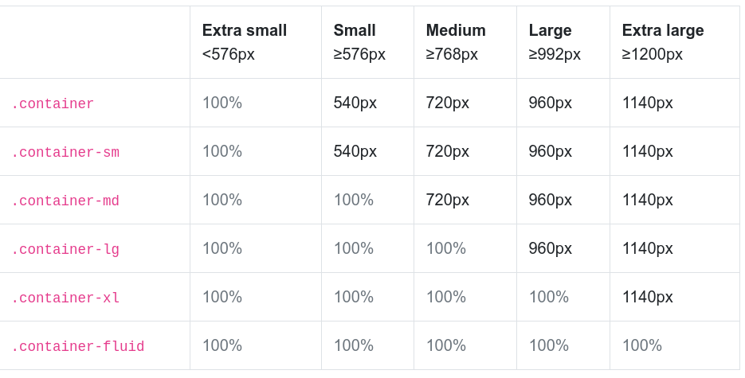

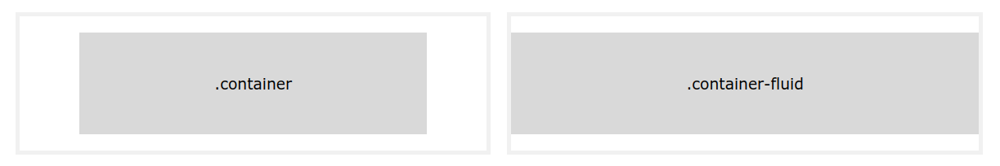

Resize window to see the effect:

```html
<div class="container-sm border">.container-sm - 100% wide until small breakpoint</div>
<div class="container-md mt-3 border">.container-md - 100% wide until medium breakpoint</div>
<div class="container-lg mt-3 border">.container-lg - 100% wide until large breakpoint</div>
<div class="container-xl mt-3 border">.container-xl - 100% wide until extra large breakpoint</div>
```

***


## Grid

Bootstrap’s grid system uses a series of **containers**, **rows**, and **columns** to layout and align content. It allows up to 12 columns across the page.

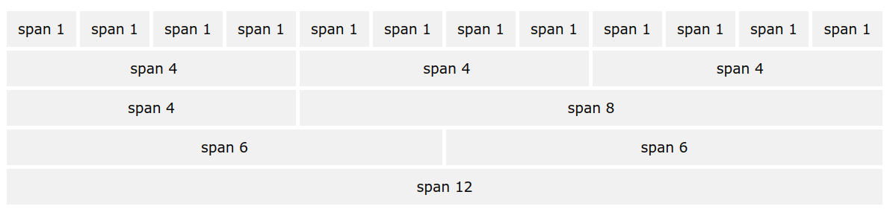

Bootstrap's grid system is responsive, and the columns will re-arrange depending on the screen size. 

All columns within a row will have **equal width** unless the opposite is explicitly set.


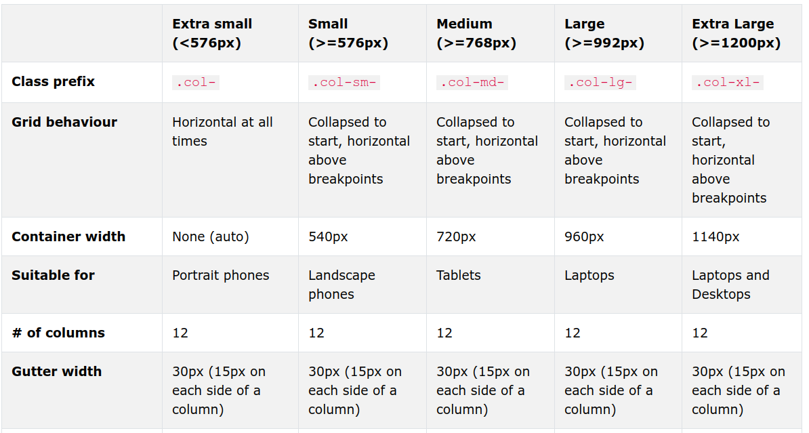

***

Three equal columns:

```html
<div class="container">
  <div class="row">
    <div class="col">
      One of three columns
    </div>
    <div class="col">
      One of three columns
    </div>
    <div class="col">
      One of three columns
    </div>
  </div>
</div>
```


***

Two unequal columns: 

```html
<div class="container">
  <div class="row">
    <div class="col-sm-4">.col-sm-4</div>
    <div class="col-sm-8">.col-sm-8</div>
  </div>
</div>
```


***


## Text/Typography

Bootstrap 4 uses a default **font-size** of 16px, and its line-height is 1.5.

The default **font-family** is "Helvetica Neue", Helvetica, Arial, sans-serif.

In addition, all `<p>` elements have margin-top: 0 and margin-bottom: 1rem (16px by default).

Some classes: 

- `.font-weight-bold`
- `.font-italic`
- `.lead` - larger text
- `.lead` - smaller text
- `.text-left`, `.text-center`, `.text-right` - aligned text
- `.text-nowrap` - doesn't wrap to the next line
- `.text-justify`
  
***


## Colors

Bootstrap 4 has some contextual classes that can be used to provide "meaning through **colors**".

`.text-muted, .text-primary, .text-success, .text-info, .text-warning, .text-danger, .text-secondary, .text-white, .text-dark, .text-body (default body color/often black) and .text-light`

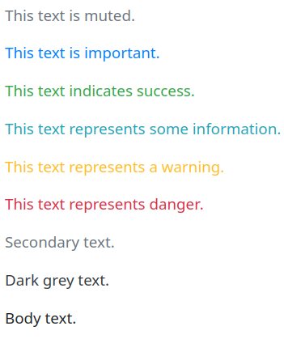

The classes for **background** colors are: `.bg-primary, .bg-success, .bg-info, .bg-warning, .bg-danger, .bg-secondary, .bg-dark and .bg-light`. 

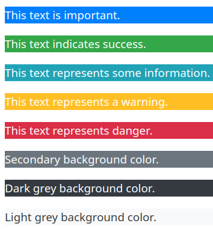

***


## Tables

`.table, .table-striped, .table-bordered, .table-hover, .table-dark, .table-borderless` - use this classes for `<table>` for styling. You can mix them (just always start with `.table`):

```html
<div class="container">
  <h2>Hoverable Dark Table</h2>
  <p>The .table-hover class adds a hover effect (grey background color) on table rows:</p>            
  <table class="table table-dark table-hover">
    <thead>
      <tr>
        <th>Firstname</th>
        <th>Lastname</th>
        <th>Email</th>
      </tr>
    </thead>
    <tbody>
      <tr>
        <td>John</td>
        <td>Doe</td>
        <td>john@example.com</td>
      </tr>
      <tr>
        <td>Mary</td>
        <td>Moe</td>
        <td>mary@example.com</td>
      </tr>
      <tr>
        <td>July</td>
        <td>Dooley</td>
        <td>july@example.com</td>
      </tr>
    </tbody>
  </table>
</div>
```

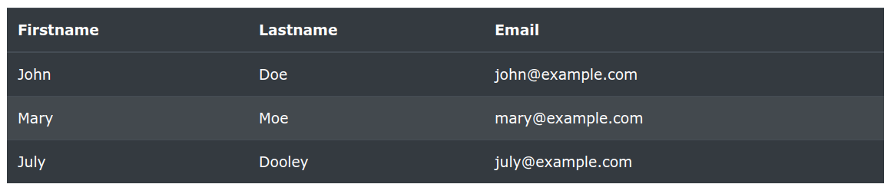

***

You can apply `.table-success`, `.table-warning` and other colors to `tr`-s of the table to paint it:

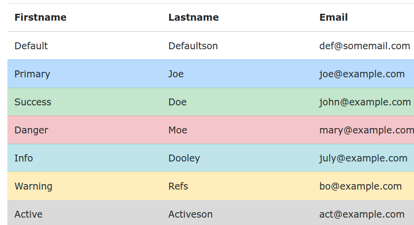

***

`.thead-dark, .thead-light` classes to `thead` elements:

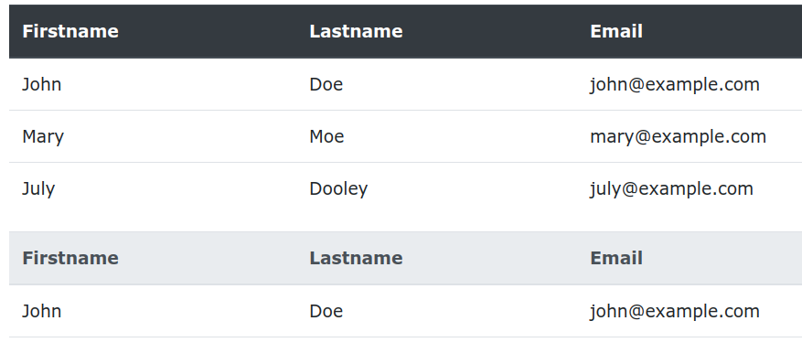

***

`.table-sm` makes the table smaller by cutting cell padding in half

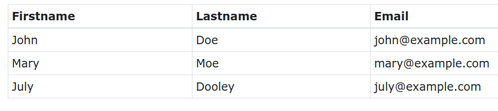

***

`.table-responsive` adds scrollbar to the table when needed (otherwise you'll get scrollbar on the page).

***


## Images

`.rounded, .rounded-circle, .img-thumbnail` to re-shape it. 

`.img-fluid` to make it agapt for the width.

Use `clas="mx-auto d-block"` to center image. 

***


## Alerts

Add `.alert` to div, then add specifics: `.alert-success, .alert-info, .alert-warning, .alert-danger, .alert-primary, .alert-secondary, .alert-light, .alert-dark`

To style links, add `.alert-link` to any links inside. 

To close alert message, add `alert-dismissible` to to container. Then add `class="close"` and `data-dismiss="alert"` to a link or a button element.

```html
<div class="container">
  <h2>Animated Alerts</h2>
  <p>The .fade and .show classes adds a fading effect when closing the alert message.</p>
  <div class="alert alert-success alert-dismissible fade show">
    <button type="button" class="close" data-dismiss="alert">&times;</button>
    <strong>Success!</strong> This alert box could indicate a successful or positive action.
  </div>
  <div class="alert alert-info alert-dismissible fade show">
    <button type="button" class="close" data-dismiss="alert">&times;</button>
    <strong>Info!</strong> This alert box could indicate a neutral informative change or action.
  </div>
  <div class="alert alert-warning alert-dismissible fade show">
    <button type="button" class="close" data-dismiss="alert">&times;</button>
    <strong>Warning!</strong> This alert box could indicate a warning that might need attention.
  </div>
  <div class="alert alert-danger alert-dismissible fade show">
    <button type="button" class="close" data-dismiss="alert">&times;</button>
    <strong>Danger!</strong> This alert box could indicate a dangerous or potentially negative action.
  </div>
  <div class="alert alert-primary alert-dismissible fade show">
    <button type="button" class="close" data-dismiss="alert">&times;</button>
    <strong>Primary!</strong> Indicates an important action.
  </div>
  <div class="alert alert-secondary alert-dismissible fade show">
    <button type="button" class="close" data-dismiss="alert">&times;</button>
    <strong>Secondary!</strong> Indicates a slightly less important action.
  </div>
  <div class="alert alert-dark alert-dismissible fade show">
    <button type="button" class="close" data-dismiss="alert">&times;</button>
    <strong>Dark!</strong> Dark grey alert.
  </div>
  <div class="alert alert-light alert-dismissible fade show">
    <button type="button" class="close" data-dismiss="alert">&times;</button>
    <strong>Light!</strong> Light grey alert.
  </div>
</div>
```

This only works if you applied the **Bootstrap scripts**.

***


## Buttons

```html
<button type="button" class="btn">Basic</button>
<button type="button" class="btn btn-primary">Primary</button>
<button type="button" class="btn btn-secondary">Secondary</button>
<button type="button" class="btn btn-success">Success</button>
<button type="button" class="btn btn-info">Info</button>
<button type="button" class="btn btn-warning">Warning</button>
<button type="button" class="btn btn-danger">Danger</button>
<button type="button" class="btn btn-dark">Dark</button>
<button type="button" class="btn btn-light">Light</button>
<button type="button" class="btn btn-link">Link</button>
```

The button classes can be used on `<a>`, `<button>`, or `<input>` elements:

```html
<a href="#" class="btn btn-info" role="button">Link Button</a>
<button type="button" class="btn btn-info">Button</button>
<input type="button" class="btn btn-info" value="Input Button">
<input type="submit" class="btn btn-info" value="Submit Button">
```

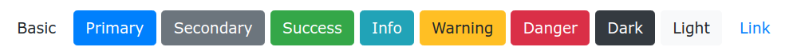

***

Outlines:

```html
<button type="button" class="btn btn-outline-primary">Primary</button>
<button type="button" class="btn btn-outline-secondary">Secondary</button>
<button type="button" class="btn btn-outline-success">Success</button>
<button type="button" class="btn btn-outline-info">Info</button>
<button type="button" class="btn btn-outline-warning">Warning</button>
<button type="button" class="btn btn-outline-danger">Danger</button>
<button type="button" class="btn btn-outline-dark">Dark</button>
<button type="button" class="btn btn-outline-light text-dark">Light</button>
```

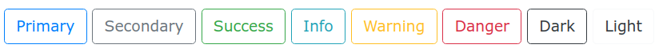

***

Sizes:

```html
<button type="button" class="btn btn-primary btn-lg">Large</button>
<button type="button" class="btn btn-primary">Default</button>
<button type="button" class="btn btn-primary btn-sm">Small</button>
```

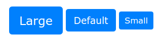

***

Block-level Buttons (full width): 

```html
<button type="button" class="btn btn-primary btn-block">Button 1</button>
<button type="button" class="btn btn-success btn-block">Button 2</button>
```

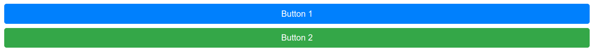

***

The class `.active` makes a button appear pressed.

***

Button Groups: `.btn-group, .btn-group-vertical`

```html
<div class="btn-group">
  <button type="button" class="btn btn-primary">Apple</button>
  <button type="button" class="btn btn-primary">Samsung</button>
  <button type="button" class="btn btn-primary">Sony</button>
</div><div class="btn-group">
  <button type="button" class="btn btn-primary">Apple</button>
  <button type="button" class="btn btn-primary">Samsung</button>
  <button type="button" class="btn btn-primary">Sony</button>
</div>
```


***


## Badges

Add additional emphasis on something. Badges scale to match the size of the parent element. `.badge-pill` to make them round

```html
<div class="container">
  <h2>Badges</h2>
  <h1>Example heading <span class="badge badge-primary">New</span></h1>
  <h2>Example heading <span class="badge badge-secondary">New</span></h2>
  <h3>Example heading <span class="badge badge-warning">New</span></h3>
  <h4>Example heading <span class="badge badge-success">New</span></h4>
  <h5>Example heading <span class="badge badge-dark">New</span></h5>
  <h6>Example heading <span class="badge badge-danger">New</span></h6>
</div>
```

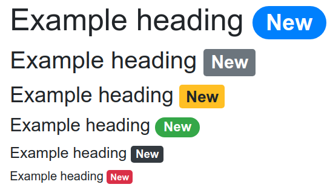

A badge inside a button:

```html
<button type="button" class="btn btn-primary">
  Messages <span class="badge badge-light">4</span>
</button>
```

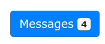

***


## Progress Bars

The default height is 16px. If you change it, you should also set the **same height** for the progress container.

```html
<div class="container">
  <h2>Progress Bar Height</h2>
  <p>The height of the progress bar is 1rem (16px) by default. Use the CSS height property to change the height:</p> 
  <div class="progress" style="height:10px">
    <div class="progress-bar" style="width:40%;height:10px"></div>
  </div>
  <br>
  <div class="progress" style="height:20px">
    <div class="progress-bar" style="width:50%;height:20px"></div>
  </div>
  <br>
  <div class="progress" style="height:30px">
    <div class="progress-bar" style="width:60%;height:30px">60%</div>
  </div>
</div>
```

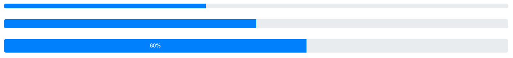

***

Use `.bg-success` and other colors. Use `.progress-bar-striped` for sctipes.

```html
<div class="progress">
  <div class="progress-bar progress-bar-striped" style="width:30%"></div>
</div>
<br>
<div class="progress">
  <div class="progress-bar bg-success progress-bar-striped" style="width:40%"></div>
</div>
<br>
<div class="progress">
  <div class="progress-bar bg-info progress-bar-striped" style="width:50%"></div>
</div>
<br>
<div class="progress">
  <div class="progress-bar bg-warning progress-bar-striped" style="width:60%"></div>
</div>
<br>
<div class="progress">
  <div class="progress-bar bg-danger progress-bar-striped" style="width:70%"></div>
</div>
```

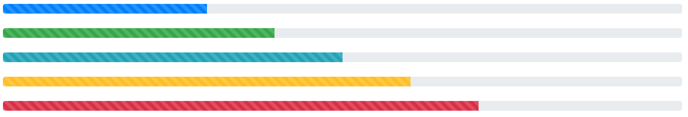

***

Animation: `.progress-bar-striped .progress-bar-animated`

```html
<div class="progress">
  <div class="progress-bar progress-bar-striped progress-bar-animated" style="width:40%"></div>
</div>
```

Multiple Progress Bars - inside one `.progress` container.

```html
<div class="progress">
  <div class="progress-bar bg-success" style="width:40%">
    Free Space
  </div>
  <div class="progress-bar bg-warning" style="width:10%">
    Warning
  </div>
  <div class="progress-bar bg-danger" style="width:20%">
    Danger
  </div>
</div>
```

***


## Spinner

`.spinner-border, .spinner-grow`, .spinner-border-sm`

```html
<div class="spinner-border text-muted"></div>
<div class="spinner-border text-primary"></div>
<div class="spinner-border text-success"></div>
<div class="spinner-border text-info"></div>
<div class="spinner-border text-warning"></div>
<div class="spinner-grow text-danger"></div>
<div class="spinner-grow text-secondary"></div>
<div class="spinner-grow text-dark"></div>
<div class="spinner-grow text-light"></div>
```


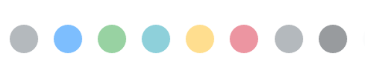

***

Spjinner buttons:

```html
<button class="btn btn-primary">
  <span class="spinner-border spinner-border-sm"></span>
</button>

<button class="btn btn-primary">
  <span class="spinner-border spinner-border-sm"></span>
  Loading..
</button>

<button class="btn btn-primary" disabled>
  <span class="spinner-border spinner-border-sm"></span>
  Loading..
</button>

<button class="btn btn-primary" disabled>
  <span class="spinner-grow spinner-grow-sm"></span>
  Loading..
</button>
```

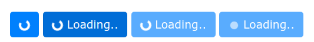

***


## Pagination

`.pagination, .pagination-sm, .pagination-lg` on the list and then `.page-link` on `li`-s.

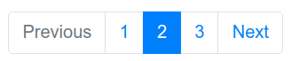

With disabled button and active (current) button.

```html
<ul class="pagination justify-content-center">
  <li class="page-item disabled"><a class="page-link" href="#">Previous</a></li>
  <li class="page-item"><a class="page-link" href="#">1</a></li>
  <li class="page-item active"><a class="page-link" href="#">2</a></li>
  <li class="page-item"><a class="page-link" href="#">3</a></li>
  <li class="page-item"><a class="page-link" href="#">Next</a></li>
  </ul>
```

***

**Breadcrumbs**

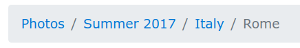

```html
<ul class="breadcrumb">
  <li class="breadcrumb-item"><a href="#">Photos</a></li>
  <li class="breadcrumb-item"><a href="#">Summer 2017</a></li>
  <li class="breadcrumb-item"><a href="#">Italy</a></li>
  <li class="breadcrumb-item active">Rome</li>
</ul>
```

***


## Lists

`.list-group, .list-group-horizontal, .list-group-item, .list-group-item-success` and so on.

```html
<ul class="list-group">
  <li class="list-group-item active">Active item</li>
  <li class="list-group-item">Second item</li>
  <li class="list-group-item disabled">Third item</li>
</ul>
```

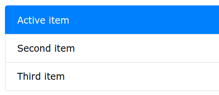

***

With links and div instead of the list:

```html
<div class="list-group">
  <a href="#" class="list-group-item list-group-item-action">Action item</a>
  <a href="#" class="list-group-item list-group-item-action list-group-item-success">Success item</a>
  <a href="#" class="list-group-item list-group-item-action list-group-item-secondary">Secondary item</a>
  <a href="#" class="list-group-item list-group-item-action list-group-item-info">Info item</a>
  <a href="#" class="list-group-item list-group-item-action list-group-item-warning">Warning item</a>
  <a href="#" class="list-group-item list-group-item-action list-group-item-danger">Danger item</a>
  <a href="#" class="list-group-item list-group-item-action list-group-item-primary">Primary item</a>
  <a href="#" class="list-group-item list-group-item-action list-group-item-dark">Dark item</a>
  <a href="#" class="list-group-item list-group-item-action list-group-item-light">Light item</a>
</div>
```

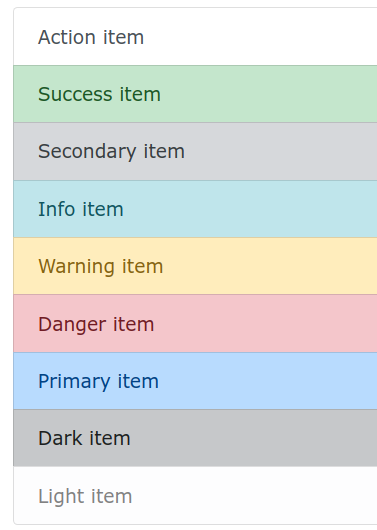

***

With badges:

```html
<ul class="list-group">
  <li class="list-group-item d-flex justify-content-between align-items-center">
    Inbox
    <span class="badge badge-primary badge-pill">12</span>
  </li>
  <li class="list-group-item d-flex justify-content-between align-items-center">
    Ads
    <span class="badge badge-primary badge-pill">50</span>
  </li>
  <li class="list-group-item d-flex justify-content-between align-items-center">
    Junk
    <span class="badge badge-primary badge-pill">99</span>
  </li>
</ul>
```

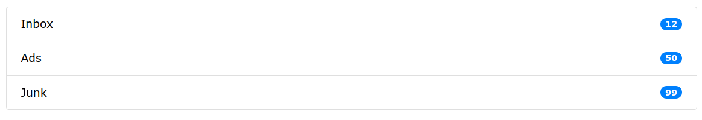

***


## Cards 

Bordered box with some padding around its content. It includes options for headers, footers, content, colors, etc.


```html
<div class="card" style="width:400px">
  
  <div class="card-body">
    <h4 class="card-title">John Doe</h4>
    <p class="card-text">Some example text.</p>
    <a href="#" class="btn btn-primary">See Profile</a>
  </div>
</div>
```

`.stretched-link` will make the whole card act as a link.

`.card-img-overlay` to make image a background and text - a foreground.

***

`.card-columns, .card-deck, .card-group` will group them in different ways.

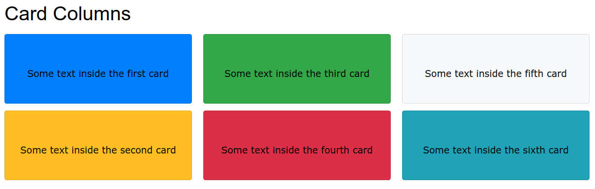

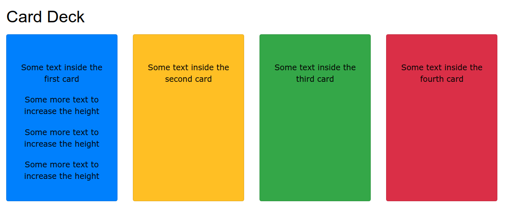

```html  <div class="card-deck">
  <div class="card bg-primary">
    <div class="card-body text-center">
      <p class="card-text">Some text inside the first card</p>
      <p class="card-text">Some more text to increase the height</p>
      <p class="card-text">Some more text to increase the height</p>
      <p class="card-text">Some more text to increase the height</p>
    </div>
  </div>
  <div class="card bg-warning">
    <div class="card-body text-center">
      <p class="card-text">Some text inside the second card</p>
    </div>
  </div>
  <div class="card bg-success">
    <div class="card-body text-center">
      <p class="card-text">Some text inside the third card</p>
    </div>
  </div>
  <div class="card bg-danger">
    <div class="card-body text-center">
      <p class="card-text">Some text inside the fourth card</p>
    </div>
  </div>  
</div>
```

***


## Dropdowns

```html
<div class="dropdown">
  <button type="button" class="btn btn-primary dropdown-toggle" data-toggle="dropdown">
    Dropdown button
  </button>
  <div class="dropdown-menu">
    <h5 class="dropdown-header">Dropdown header</h5>
    <a class="dropdown-item" href="#">Link 1</a>
    <a class="dropdown-item" href="#">Link 2</a>
    <a class="dropdown-item" href="#">Link 3</a>
    <h5 class="dropdown-header">Dropdown header</h5>
    <a class="dropdown-item" href="#">Another link</a>
  </div>
</div>
```

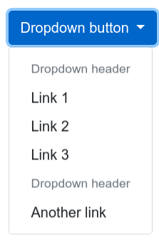

`.dropdown-menu-left, dropdown-menu-right, .dropright, .dropleft, .dropup` classes position dropdowns in different ways. 

***

Button Groups with Dropdowns

```html
<div class="btn-group">
  <button type="button" class="btn btn-primary">Apple</button>
  <button type="button" class="btn btn-primary">Samsung</button>
  <div class="btn-group">
    <button type="button" class="btn btn-primary dropdown-toggle" data-toggle="dropdown">
    Sony
    </button>
    <div class="dropdown-menu">
      <a class="dropdown-item" href="#">Tablet</a>
      <a class="dropdown-item" href="#">Smartphone</a>
    </div>
  </div>
</div>
```

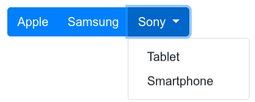

***


## Collapsible

Spoiler

```html
<button data-toggle="collapse" data-target="#demo">Collapsible</button>

<div id="demo" class="collapse">
Lorem ipsum dolor text....
</div>
```

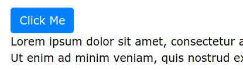

```html
<div id="accordion">
  <div class="card">
    <div class="card-header">
      <a class="card-link" data-toggle="collapse" href="#collapseOne">
        Collapsible Group Item #1
      </a>
    </div>
    <div id="collapseOne" class="collapse show" data-parent="#accordion">
      <div class="card-body">
        Lorem ipsum dolor sit amet, consectetur adipisicing elit, sed do eiusmod tempor incididunt ut labore et dolore magna aliqua. Ut enim ad minim veniam, quis nostrud exercitation ullamco laboris nisi ut aliquip ex ea commodo consequat.
      </div>
    </div>
  </div>
  <div class="card">
    <div class="card-header">
      <a class="collapsed card-link" data-toggle="collapse" href="#collapseTwo">
      Collapsible Group Item #2
    </a>
    </div>
    <div id="collapseTwo" class="collapse" data-parent="#accordion">
      <div class="card-body">
        Lorem ipsum dolor sit amet, consectetur adipisicing elit, sed do eiusmod tempor incididunt ut labore et dolore magna aliqua. Ut enim ad minim veniam, quis nostrud exercitation ullamco laboris nisi ut aliquip ex ea commodo consequat.
      </div>
    </div>
  </div>
  <div class="card">
    <div class="card-header">
      <a class="collapsed card-link" data-toggle="collapse" href="#collapseThree">
        Collapsible Group Item #3
      </a>
    </div>
    <div id="collapseThree" class="collapse" data-parent="#accordion">
      <div class="card-body">
        Lorem ipsum dolor sit amet, consectetur adipisicing elit, sed do eiusmod tempor incididunt ut labore et dolore magna aliqua. Ut enim ad minim veniam, quis nostrud exercitation ullamco laboris nisi ut aliquip ex ea commodo consequat.
      </div>
    </div>
  </div>
</div>
```

`data-parent="#accordion"` makes only one active element possible at the time.

***


## Nav

`.nav` for `<ul>`, `.nav-item` for `<li>`, `.nav-link` for `<a>`

`flex-column` for `<ul>` to make it **vertical**

```html
<ul class="nav justify-content-end">
  <li class="nav-item">
    <a class="nav-link" href="#">Link</a>
  </li>
  <li class="nav-item">
    <a class="nav-link" href="#">Link</a>
  </li>
  <li class="nav-item">
    <a class="nav-link" href="#">Link</a>
  </li>
  <li class="nav-item">
    <a class="nav-link disabled" href="#">Disabled</a>
  </li>
</ul>
```

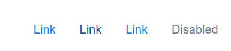

Add `.nav-tabs` or `.nav-pills` for more styling. Add `.nav-justified` for **equal width**

```html
<ul class="nav nav-tabs">
  <li class="nav-item">
    <a class="nav-link active" href="#">Active</a>
  </li>
  <li class="nav-item">
    <a class="nav-link" href="#">Link</a>
  </li>
  <li class="nav-item">
    <a class="nav-link" href="#">Link</a>
  </li>
  <li class="nav-item">
    <a class="nav-link disabled" href="#">Disabled</a>
  </li>
</ul>
```

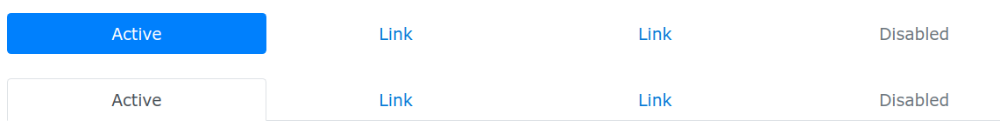

**Toggleable / Dynamic Tabs**

```html
<ul class="nav nav-tabs" role="tablist">
  <li class="nav-item">
    <a class="nav-link active" data-toggle="tab" href="#home">Home</a>
  </li>
  <li class="nav-item">
    <a class="nav-link" data-toggle="tab" href="#menu1">Menu 1</a>
  </li>
  <li class="nav-item">
    <a class="nav-link" data-toggle="tab" href="#menu2">Menu 2</a>
  </li>
</ul>

<!-- Tab panes -->
<div class="tab-content">
  <div id="home" class="container tab-pane active"><br>
    <h3>HOME</h3>
    <p>Lorem ipsum dolor sit amet, consectetur adipisicing elit, sed do eiusmod tempor incididunt ut labore et dolore magna aliqua.</p>
  </div>
  <div id="menu1" class="container tab-pane fade"><br>
    <h3>Menu 1</h3>
    <p>Ut enim ad minim veniam, quis nostrud exercitation ullamco laboris nisi ut aliquip ex ea commodo consequat.</p>
  </div>
  <div id="menu2" class="container tab-pane fade"><br>
    <h3>Menu 2</h3>
    <p>Sed ut perspiciatis unde omnis iste natus error sit voluptatem accusantium doloremque laudantium, totam rem aperiam.</p>
  </div>
</div>
```

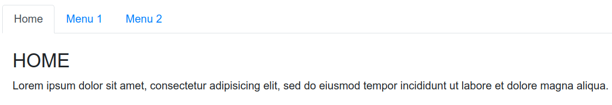

***


## Navigation Bar

`.fixed-top, .fixed-bottom` to make it sticky.

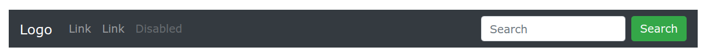

```html
<nav class="navbar navbar-expand-lg navbar-dark bg-dark" style="margin:24px 0;">
  <a class="navbar-brand" href="javascript:void(0)">Logo</a>
  <button class="navbar-toggler navbar-toggler-right" type="button" data-toggle="collapse" data-target="#navb">
    <span class="navbar-toggler-icon"></span>
  </button>

  <div class="collapse navbar-collapse" id="navb">
    <ul class="navbar-nav mr-auto">
      <li class="nav-item">
        <a class="nav-link" href="javascript:void(0)">Link</a>
      </li>
      <li class="nav-item">
        <a class="nav-link" href="javascript:void(0)">Link</a>
      </li>
      <li class="nav-item">
        <a class="nav-link disabled" href="javascript:void(0)">Disabled</a>
      </li>
    </ul>
    <form class="form-inline my-2 my-lg-0">
      <input class="form-control mr-sm-2" type="text" placeholder="Search">
      <button class="btn btn-success my-2 my-sm-0" type="button">Search</button>
    </form>
  </div>
</nav>
```

**Collapsing** The Navigation Bar. Use a button with `class="navbar-toggler"`, `data-toggle="collapse"` and `data-target="#thetarget"`. Then wrap the navbar content (links, etc) inside a div element with `class="collapse navbar-collapse"`, followed by an id that matches the `data-target` of the button: `"thetarget"`.

```html
<nav class="navbar navbar-expand-md bg-dark navbar-dark">
  <a class="navbar-brand" href="#">Navbar</a>
  <button class="navbar-toggler" type="button" data-toggle="collapse" data-target="#collapsibleNavbar">
    <span class="navbar-toggler-icon"></span>
  </button>
  <div class="collapse navbar-collapse" id="collapsibleNavbar">
    <ul class="navbar-nav">
      <li class="nav-item">
        <a class="nav-link" href="#">Link</a>
      </li>
      <li class="nav-item">
        <a class="nav-link" href="#">Link</a>
      </li>
      <li class="nav-item">
        <a class="nav-link" href="#">Link</a>
      </li>    
    </ul>
  </div>  
</nav>
```

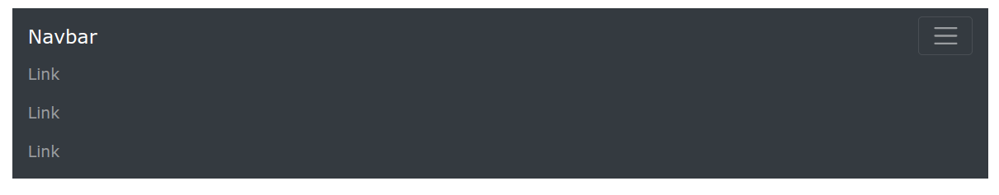

***


## Forms

Form controls automatically receive some global styling with Bootstrap. All textual `<input>`, `<textarea>`, and `<select>` elements with class `.form-control` have a **width of 100%**.

Bootstrap provides two types of form layouts:

- Stacked (full-width) form
- Inline form

```html
<form action="/action_page.php">
  <div class="form-group">
    <label for="email">Email:</label>
    <input type="email" class="form-control" id="email" placeholder="Enter email" name="email">
  </div>
  <div class="form-group">
    <label for="pwd">Password:</label>
    <input type="password" class="form-control" id="pwd" placeholder="Enter password" name="pswd">
  </div>
  <div class="form-group form-check">
    <label class="form-check-label">
      <input class="form-check-input" type="checkbox" name="remember"> Remember me
    </label>
  </div>
  <button type="submit" class="btn btn-primary">Submit</button>
</form>
```

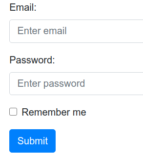

***

**Validation**

Add `.was-validated` or `.needs-validation` to the form to check it before of after submitting the form.

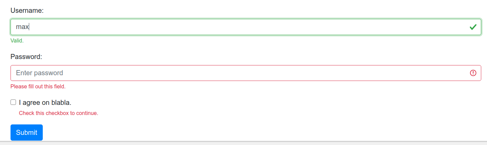

```html
<form action="/action_page.php" class="was-validated">
  <div class="form-group">
    <label for="uname">Username:</label>
    <input type="text" class="form-control" id="uname" placeholder="Enter username" name="uname" required>
    <div class="valid-feedback">Valid.</div>
    <div class="invalid-feedback">Please fill out this field.</div>
  </div>
  <div class="form-group">
    <label for="pwd">Password:</label>
    <input type="password" class="form-control" id="pwd" placeholder="Enter password" name="pswd" required>
    <div class="valid-feedback">Valid.</div>
    <div class="invalid-feedback">Please fill out this field.</div>
  </div>
  <div class="form-group form-check">
    <label class="form-check-label">
      <input class="form-check-input" type="checkbox" name="remember" required> I agree on blabla.
      <div class="valid-feedback">Valid.</div>
      <div class="invalid-feedback">Check this checkbox to continue.</div>
    </label>
  </div>
  <button type="submit" class="btn btn-primary">Submit</button>
</form>
```

***


## Inputs

`class="form-check"` ensures proper margins for labels and checkboxes.

```html

```


### `col`

`col-xl` column will try to take:

- 100% width until 720px
- most of the line until 960px
- most of the line until 1240px
- most of the line until 1500px
- rearrange into the row with another columns after 1500px

`col-lg` column will try to take:

- 100% width until 720px
- most of the line until 960px
- most of the line until 1240px
- rearrange into the row with another columns after 1240px

`col-md` column will try to take:

- 100% width until 720px
- most of the line until 960px
- rearrange into the row with another columns after 960px

`col-sm` column will try to take:

- 100% width until 720px
- rearrange into the row with another columns after 720px

`col` will try to:

- rearrange into the row with another columns as soon as possible

***

### `row`

`row-xl` will try to:

- 100% width 

