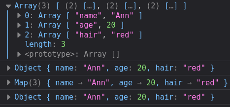

# JS New Features

- [JS New Features](#js-new-features)
	- [ES 2019](#es-2019)
		- [`Array.flat (depth = 1)`](#arrayflat-depth--1)
		- [`Array.flatMap (cb)`](#arrayflatmap-cb)
		- [`Object.entries (obj)` | `Object.fromEntries (iterable)`](#objectentries-obj--objectfromentries-iterable)
		- [Optioal `catch` binding](#optioal-catch-binding)
		- [`fn.toString()`](#fntostring)
		- [`Symbol.description`](#symboldescription)
		- [Array.Sort Stability](#arraysort-stability)

---

## ES 2019

### `Array.flat (depth = 1)`

Flattens nested arrays into one:

```js
const arr = [1, 2, 3, [4, 5, 6, [7, 8, 9]]]
arr.flat() // [1, 2, 3, 4, 5, 6, Array(3)]
arr.flat(Infinity) // [1, 2, 3, 4, 5, 6, 7, 8, 9]
```

---

### `Array.flatMap (cb)`

`arr.map()` + `arr.flat(1)` but a little more efficient. Depth is non-changeable.

---

### `Object.entries (obj)` | `Object.fromEntries (iterable)`

Transforms a list of key-value pairs into an object - and vice versa.

```js
const obj = {
	name: 'Ann',
	age: 20,
	hair: 'red'
}

const iterable = Object.entries(obj)
console.log(iterable)
// [ "name", "Ann" ]
​// [ "age", 20 ]
// [ "hair", "red" ]

/* Array */

const fromEntries = Object.fromEntries(iterable)
console.log(fromEntries)
// { name: "Ann", age: 20, hair: "red" }

/* Map */

const map = new Map(itarable)
console.log(map)

const fromMap = Object.fromEntries(map)
console.log(fromMap)
```



---

### Optioal `catch` binding

Providing `err` param is optional now.

```js
try {
	throw new Error('error')
} catch {
	console.log('No params for catch')
}
```

---

### `fn.toString()`

Returns a string representation of the function body, including spaces and comments.

```js
const fn = () => {
	// indented comment
	console.log('ku')
}

console.log(fn.toString())
/* 
() => {
    // indented comment
	console.log('ku')
}
*/
```

### `Symbol.description`

Optional string description of a Symbol.

```js
const sym = Symbol('My Symbol')

console.log(sym) // Symbol("My Symbol")
console.log(sym.description) // My Symbol
```

---

### Array.Sort Stability

Now all major browsers use stable sorting algorithms. This means, elements with the same value of the comparable entity will retain their initial sorting order.

---
