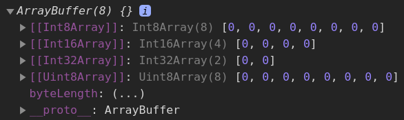

- [Typed Array](#typed-array)
	- [Static Methods](#static-methods)
	- [Instance Properties](#instance-properties)
	- [Instance Methods](#instance-methods)
- [ArrayBuffer](#arraybuffer)
	- [Static Properties and Methods](#static-properties-and-methods)
	- [Instance Properties and Methods](#instance-properties-and-methods)

***

# Typed Array

A TypedArray object describes an array-like view of a **binary data** buffer. There is **no** type named TypedArray. Instead, we use a number of constructors to translate binary data into different **views**.

Example:

```js
// signed array of 8 words, 16 bits == 2 bytes each
// default values == 0, available values range is [-32768, 32767]
let typedArray = new Int16Array(8)
typedArray[0] = 32767		// max available value
typedArray[1] = -32768		// min avaliable value
console.log(typedArray)
// [32767, -32768, 0, 0, 0, 0, 0, 0]


// unsigned array of 4 words, 16 bits == 2 bytes each
// default values == 0, available values range is [-32768, 32767]
typedArray = new Uint16Array(4)
typedArray[0] = 65535		// max available value
typedArray[2] = 567			// arbitrary value
console.log(typedArray)
// [65535, 0, 567, 0]


// float array of 4 words, 64 bits = 8 bytes each
typedArray = new Float64Array(4)
typedArray[1] = 2561.1234566789
console.log(typedArray)
// [0, 2561.1234566789, 0, 0]
```

When creating an instance of a TypedArray (e.g. Int8Array), an **array buffer is created internally** in memory or, if an `ArrayBuffer` object is given as constructor argument, then this is used instead.

***

The constructor of **TypedArray** can accept different params: 

- length (in words)
- typedArray (converts one into another of the same length)
- object (the same as using `TypedArray.from()`)
- buffer

***


## Static Methods

1. `TypedArray.of(elementsN)` - creates a new typed array from a variable number of arguments. This method is nearly the same as `Array.of()`.

```js
const uint16 = new Int16Array
uint16 = Int16Array.of('10', '20', '30', '40', '50')
console.log(uint16)
// [10, 20, 30, 40, 50]
```

2. `TypedArray.from(source, [, mapFn[, thisArg]])` - creates a new typed array from an array-like or iterable object. This method is nearly the same as `Array.from()`.

```js
let typedArray = Int8Array.from([0, 127, -128, 4])
console.log(typedArray)
// [0, 127, -128, 4]

typedArray = Int8Array.from('12364')
console.log(typedArray)
// [1, 2, 3, 6, 4]
```

***


## Instance Properties

1. `buffer` - getter for the `ArrayBuffer` used by the **TypedArray**.

```js
const buffer = new ArrayBuffer(8)
const uint16 = new Uint16Array(buffer)
console.log(uint16.buffer)
```



Remember that if no `ArrayBuffer` specified, it's still created internally:

```js
const uint16 = new Uint16Array(2)
console.log(uint16.buffer)
```


***

2. `length` - length (in words) of a typed array.

```js
const typedArray = new Int32Array(4)
console.log(typedArray.length)		// 4

const typedArray = new Int32Array(new ArrayBuffer(8))
console.log(typedArray.length)		// 2 -> 2 words of 4 bytes each = 8 bytes
```

***

3. `byteLength` - length (in bytes) of a typed array.

```js
const typedArray = new Int32Array(4)
console.log(typedArray.byteLength)		// 16 -> 4 words + 4 bytes each = 16 bytes
```

***


## Instance Methods

Are mostly the same as for regular `Array`-s, including: `forEach`, `map`, `filter`, `some,` `every`, `slice`, `sort`, `keys`, `values`, `entries`, `toString,` `toLocaleString`, etc.

***


# ArrayBuffer

The `ArrayBuffer` object is used to represent a generic, **fixed-length raw binary data** buffer.

It is an array of bytes, often referred to in other languages as a "byte array".You cannot directly manipulate the contents of an `ArrayBuffer`; instead, you create one of the **typed array** objects or a `DataView` object which represents the buffer in a specific format, and use that to read and write the contents of the buffer.

Here we create a 8-byte buffer with diffrent views referring to the buffer:

```js
const arraybuffer = new ArrayBuffer(8)
const i32 = new Int32Array(arraybuffer)
console.log(i32)
const i16 = new Int16Array(arraybuffer)
console.log(i16)
const i8 = new Int8Array(arraybuffer)
console.log(i8)
```


Why so? `ArrayBuffer(8)` basically produces `[00 00 00 00 00 00 00 00]`. 

Then we create a view `Int32Array` that treats data as 32-bit == 4-byte words: `[00 00 00 00 | 00 00 00 00]`.

`Int16Array` treats that binary data as 2-byte words: `[00 00 | 00 00 | 00 00 | 00 00]`.

***


## Static Properties and Methods

1. `isView()` - determines whether the passed value is one of the `ArrayBuffer` views, such as **typed array** objects or a `DataView`.

```js
ArrayBuffer.isView();                    // false              
ArrayBuffer.isView([]);                  // false
ArrayBuffer.isView({});                  // false
ArrayBuffer.isView(null);                // false
ArrayBuffer.isView(undefined);           // false
ArrayBuffer.isView(new ArrayBuffer(10)); // false
 
ArrayBuffer.isView(new Uint8Array());    // true
ArrayBuffer.isView(new Float32Array());  // true
ArrayBuffer.isView(new Int8Array(10).subarray(0, 3)); // true

const buffer = new ArrayBuffer(2);
const dv = new DataView(buffer);
ArrayBuffer.isView(dv); // true
```

***

2. `slice()` - returns a new `ArrayBuffer` whose contents are a copy of this ArrayBuffer's bytes from begin, inclusive, up to end, exclusive.

```js
const buffer = new ArrayBuffer(8)
const i32 = new Uint8Array(buffer)
i32[1] = 255	// set the value of [1]-byte
console.log(i32)
/* Uint8Array(8) [
  0, 255, 0, 0,
  0,   0, 0, 0
] */
console.log(i32.slice(1, 4))	// takes [1], [2], [3] bytes 
// Uint8Array(3) [ 255, 0, 0 ]
console.log(i32.slice(6))	// the last 2 bytes
// Uint8Array(2) [ 0, 0 ]
```

***


## Instance Properties and Methods

1. `buffer.byteLength` - length in bytes, set up during the creation and cannot be changed. 

```js
const buffer = new ArrayBuffer(3)
console.log(buffer.byteLength)	// 3
```

2. `buffer.slice(begin, end)` - returns a new buffer from the elements of the initial one.

```js
const buffer = new ArrayBuffer(6)

// create a view
let i16 = new Uint16Array(buffer)

// fill with random numbers
i16 = i16.map(item => Math.floor(Math.random() * 65536))
console.log(i16)
// Uint16Array(3) [64529, 11413, 3654]

// slice
console.log(i16.slice(1))	// from [1] to the end
// Uint16Array(2) [11413, 3654]
console.log(i16.slice(0, 2))	// from [0] to [2] (exclusively)
// Uint16Array(2) [64529, 11413]
```