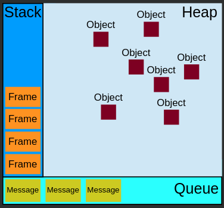
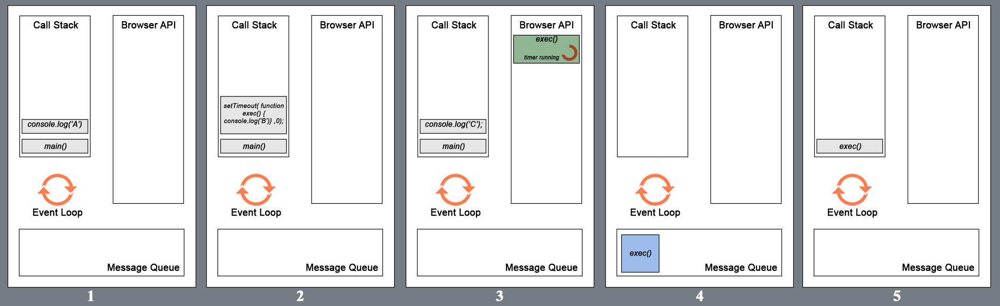

# Event Loop



***


## Queue

**FIFO**: first in, first out.

The best analogy - a store with only one cashier.

`Messages` (tasks) are getting added to the `queue` and **run to completion**. The next task doest not start executing until the previous one finished and left the `queue`. 

***


## Stack

**FILO**: first in - last out.

The best analogy - a toy pyramid. 

Stack represents the only execution thread present in JS. When a function executs, expressions from the function get into stack, execute and then pop out. When the stack is completely empty, the `queue` proceeds to the next task. 

***

Example: 

```javascript
function main() {
	console.log('A')
	setTimeout(function exec() {
		console.log('B')
	}, 0)
	console.log('C')
}

main()
// Output
// A
// C
// B
```



1. `main` is added to the **macrotask queue**. It begins to execute. 
2. `main`is added to the **stack** as `frame` #1. No other **macrotasks** will be executed before the **stack** is empty again. 
3. `console.log('A')` is added to the **stack** as `framt` #2, then executed and removed from the **stack**.
4. `setTimeout` with the `exec` callback is added to the **stack** as `frame` #2. The browser API is used to delay the callback, after which the `frame` is removed from the **stack**. 
5. `console.log('C')` is added to the **stack** as `frame` #2, then executed and removed from the **stack**.
6. As 0 s (actually 0.000004 s) passed, the `exec` callback is added to the **queue** and will be executed as soon as possible.
7. The last expression of the `main` finished execution, so the `main` itself is removed from the stack. The **stack is empty** once again.
8. `exec` begins execution, becoming `frame` #1 in the **stack**.

***


## Heap

Objects are allocated in heap - a large mostly unstructured region of memory. 

***


## Macrotasks and microtasks

The `queue` is actually more complex. It consists of three separate queues: 

1. the **macrotask** queue: 
   - loaded scripts, 
   - browser events, 
   - functions, 
   - network requests,  
2. the **microtask** queue: 
   - the loop iterations,
   - the `promise` hanlders (`then`, `catch`, `finally`),
   - `MutationObserver`
3. the **render** queue (changes on the page).

***

The **event loop algorithm** is the following:

1. Execute the oldest **macrotask** from the macrotask queue. 
2. Execute **the whole microtask queue** if any. 
3. Execute **the whole render queue** if any. 
4. Repeat. 

***

Example:

```javascript
new Promise((resolve => {				// macrotask (fn)
	resolve(console.log('macrotask'))
}))
// Remember: zero callbacks as here are not actually zero but 0.000004 or similar. Thus, this callback will have to wait for synchronous tasks below if any.
.then(() => {							// macrotask (fn)
    for(let i = 0; i <= 1000000000; i++){	// added to the microtask queue
	    if(i === 0) {			
			document.body.innerHTML = ''	// added to the render queue
		}
        if(i === 1000000000) console.log('the microtask queue finished')
    }
})

console.log('sync task')	// sync macrotask

run()						// the same

function run(){
	console.log('run')
}
```

1. The **macrotask** (`promise`) is executed.
2. Async **microtask** chain of `then()` handlers is planned but as it's async, zero delay actually becomes 0.000004 s or similar. The other **sync macrotasks** get priority and run first. 
3. The rest of **macrotasks** are finished.
4. The **microtasks** queue (`then`) begins and works to completion. Render of changes is planned but waits the end of the **microtask** queue. 
5. As the **microtask** queue finished, the **render** queue gets to render the changes - the page disappears.

If you relocate the render changes outside of the function - nothing will change, it will still run after the **microtask** queue. 

***

Example: 

```javascript
setTimeout(() => alert("timeout"))		// 4

new Promise((resolve, reject) => {		// 1
	alert('executor function')
	resolve()
})
	.then(() => alert("then1"))			// 3.1
	.then(() => alert("then2"))			// 3.2
	.then(() => alert("then3"))			// 3.3
	// any number of mictorask handlers... 

alert("code")							// 2
```

The result: 

1. `setTimeout` planns the callback but zero delay turns into 0.000004 s and lets the other sync functions forward. 
2. `Promise` including the `alert` - sync **macrotask**.
3. `alert("code")`	- sync **macrotask**.
4. All the promise handlers one after another - the **microtask queue**.
5. The `setTimeout` handler as this is another **macrotask**.

***

Example:

```javascript
const s = new Date().getSeconds();

setTimeout(function () {
	// prints out "2", meaning that the callback is not called immediately after 500 milliseconds.
	console.log("Ran after " + (new Date().getSeconds() - s) + " seconds");
}, 500)

while (true) {
	if (new Date().getSeconds() - s >= 2) {
		console.log("Good, looped for 2 seconds")
		break;
	}
}
```

1. Save the current seconds to the variable, (let's say `47`).
2. `setTimeout` starts the 500 ms countdown. In 500 ms the callback will be added to the **macrotask** queue for execution. 
3. The `loop` starts - the **microtask** queue. It runs to completion. 
4. In 500 ms the setTimeout `callback` is added to the **macrotask** queue. But it cannot start executing since the previous task isn't finished (the **microtask** queue - the loop).
5. In another 1500 ms the **microtask** queue (the loop) ends. 
6. The **macrotask** `callback` finally gets processed. Because of the delay it returns the `2 s` result.

***

To add a new **macrotask** use `setTimeout(fn)`. Useful to break large tasks on the smaller ones to let microtasks and rendering changes in between. 

To add a new **microtask** use `queueMicrotask(fn)`. Useful to guarantee the context didn't change and no new data arrived during the execution of the mictorasks. 

To perform more complex calculations use `Web Workers` - they have their own event loops and can work in parallel with the main loop in the browser. 

***

