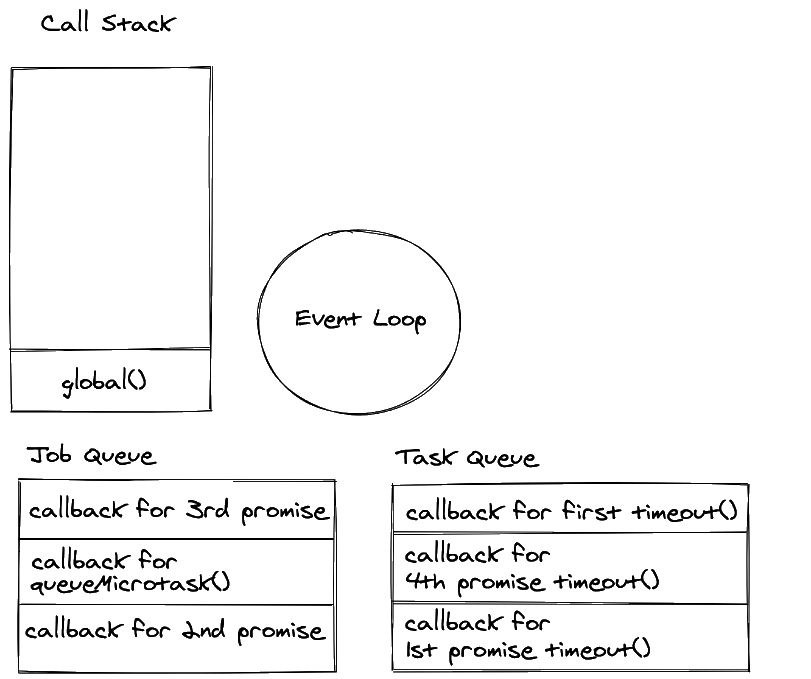

# Event Loop

- [Event Loop](#event-loop)
	- [Sources](#sources)
	- [Terms](#terms)
		- [Heap](#heap)
		- [Queues](#queues)
		- [Stack](#stack)
	- [Full picture](#full-picture)
		- [Example](#example)

***

## Sources 

1. https://careersjs.com/magazine/javascript-job-queue-microtask/
2. https://developer.mozilla.org/en-US/docs/Web/JavaScript/EventLoop
3. https://javascript.info/event-loop
4. https://frarizzi.science/journal/web-engineering/browser-rendering-queue-in-depth - rendering queue (not covered in this lesson)

***


## Terms


### Heap

Objects are allocated in the Heap - a large mostly unstructured region of memory. 

***


### Queues

There are 2 separate queues based on the **FIFO** principle (first in, first out) in JS:

1. The Message Queue (aka the Task / **Macro**task Queue). It stores the majority of callbacks: from events, timers, network connections, etc.
2. The Jobs Queue (aka the **Micro**task Queue). It stores Promise callbacks (thens) and other microtasks.

Examples of **macrotasks**:

- When an external script `<script src="...">` loads, the task is to execute it.
- When a user moves their mouse, the task is to dispatch mousemove event and execute handlers.
- When the time is due for a scheduled `setTimeout`, the task is to run its callback.
- …and so on.

Tasks are set – the engine handles them – then waits for more tasks (while sleeping and consuming close to zero CPU).

**All microtasks** from the Jobs Queue are executed until the Job Queue is empty **after each message execution from the Macrotask Queue**. Again: 

1. **One** function from the Macrotask Queue executed.
2. **All** functions in the Microtask Queue executed.
3. Repeat 1-2 until there's no pending tasks of any kind anymore. 

It is possible for the code in the **Microtask Queue** to schedule more callbacks. These will **not be deferred** until future iterations but will instead run in the **current iteration**, meaning it is possible to **starve** your program by creating an endless loop of Job Queue callbacks. So be careful adding new microtasks!

***


### Stack

The FILO (first in - last out) queue. The best analogy - a toy pyramid. 

Stack represents the only execution thread present in JS. When a function executs, expressions from the function get into the Stack, execute and then pop out. When the Stack is **completely empty**, only then the Queue proceeds to the next task. 

***

Example: 

```javascript
main()

function main() {
	setTimeout(function exec() {
		console.log('B')
	}, 0)

	queueMicrotask(() => {
  	console.log('micro')
	})
  
	console.log('A')
}
```

Output:

```
A
micro
B
```

CHANGE THIS


1. `main` is added to the **macrotask queue**. It begins to execute. 
2. `main`is added to the **stack** as `frame` #1. No other **macrotasks** will be executed before the **stack** is empty again. 
3. `console.log('A')` is added to the **stack** as `framt` #2, then executed and removed from the **stack**.
4. `setTimeout` with the `exec` callback is added to the **stack** as `frame` #2. The browser API is used to delay the callback, after which the `frame` is removed from the **stack**. 
5. `console.log('C')` is added to the **stack** as `frame` #2, then executed and removed from the **stack**.
6. As 0 s (actually 0.000004 s) passed, the `exec` callback is added to the **queue** and will be executed as soon as possible.
7. The last expression of the `main` finished execution, so the `main` itself is removed from the stack. The **stack is empty** once again.
8. `exec` begins execution, becoming `frame` #1 in the **stack**.


***


## Full picture

The Event Loop concept is very simple. There’s an endless loop, where the JavaScript engine waits for tasks, executes them and then sleeps, waiting for more tasks. **It doesn't work all the time** - only when there're tasks! 

The best analogy - a roller coaster. People wait in line. Every few minutes the cart returns, takes another group of people (another function from the Macrotask Queue) and goes on for another ride. But as soon as people with VIP tickets arrive (the Microtask Queue), they take a ride without waiting in line **as soon as the cart arrives** (the current task is finished and the Stack is empty). After all VIPs are satisfied, the common line continues. And the loop works to the last passanger. Then it goes dormant until new tasks arrive. 

The general algorithm of the engine (not the actual code, consider it a **pseudo code**!):

```js
// These 2 arrays and object are filled from somewhere else
let tasks, 
	microtasks,
	renderQueue,
	stack

function eventLoop(){
	// While there are tasks of any kind
	while(tasks.length || microtasks.length){
		// Execute all microtasks if any
		if(microtasks.length){
			runMicrotasks()
		}

		// Execute ONE macrotask to completion if any
		if(tasks.length){
			runTask(tasks[0])
			// Remove the finished task from the Message Queue
			tasks.shift()
		}

		// Render changes if any
		if(renderQueue.length){
			renderAllChanges()
		}
	}
}

function runMicrotasks(){
	// Remember: the Microtask Queue DOES allow adding new functions to itself to be executed right away, on the current Microtask Queue run
	while(microtasks.length){
		runTask(microtasks[0])
		microtasks.shift()
	}
}

function runTask(task){
	if(stack.isEmpty){
		addToStack()
	} else {
		stack.addEventListener('emptyAgain', addToStack)
		stack.removeEventListener('emptyAgain', addToStack)
	}

	function addToStack(){
		stack.add(task)
	}
}
```

While there are tasks:

1. Execute them, starting with the oldest task.
2. Execute all microtasks from the Microtask Queue between different macrotasks.
3. Render changes if any.
4. To execute any taks, it is placed to the Stack and **runs to completion**. This means that until the Stack is empty again, no further tasks of any kind will be touched. 
5. Repeat paragraphs 1-4 until there're no more tasks. Go to sleep after that until new tasks arrive. 

The JavaScript engine **does nothing most of the time**, it only runs if a script/handler/event activates.

***


Example:

```javascript
new Promise((resolve => {				// macrotask (fn)
	resolve(console.log('macrotask'))
}))
// Remember: zero callbacks as here are not actually zero but 0.000004 or similar. Thus, this callback will have to wait for synchronous tasks below if any.
.then(() => {							// macrotask (fn)
    for(let i = 0; i <= 1000000000; i++){	// added to the microtask queue
	    if(i === 0) {			
			document.body.innerHTML = ''	// added to the render queue
		}
        if(i === 1000000000) console.log('the microtask queue finished')
    }
})

console.log('sync task')	// sync macrotask

run()						// the same

function run(){
	console.log('run')
}
```

1. The **macrotask** (`promise`) is executed.
2. Async **microtask** chain of `then()` handlers is planned but as it's async, zero delay actually becomes 0.000004 s or similar. The other **sync macrotasks** get priority and run first. 
3. The rest of **macrotasks** are finished.
4. The **microtasks** queue (`then`) begins and works to completion. Render of changes is planned but waits the end of the **microtask** queue. 
5. As the **microtask** queue finished, the **render** queue gets to render the changes - the page disappears.

If you relocate the render changes outside of the function - nothing will change, it will still run after the **microtask** queue. 

***

Example: 

```javascript
setTimeout(() => alert("timeout"))		// 4

new Promise((resolve, reject) => {		// 1
	alert('executor function')
	resolve()
})
	.then(() => alert("then1"))			// 3.1
	.then(() => alert("then2"))			// 3.2
	.then(() => alert("then3"))			// 3.3
	// any number of mictorask handlers... 

alert("code")							// 2
```

The result: 

1. `setTimeout` planns the callback but zero delay turns into 0.000004 s and lets the other sync functions forward. 
2. `Promise` including the `alert` - sync **macrotask**.
3. `alert("code")`	- sync **macrotask**.
4. All the promise handlers one after another - the **microtask queue**.
5. The `setTimeout` handler as this is another **macrotask**.

***

Example:

```javascript
const s = new Date().getSeconds();

setTimeout(function () {
	// prints out "2", meaning that the callback is not called immediately after 500 milliseconds.
	console.log("Ran after " + (new Date().getSeconds() - s) + " seconds");
}, 500)

while (true) {
	if (new Date().getSeconds() - s >= 2) {
		console.log("Good, looped for 2 seconds")
		break;
	}
}
```

1. Save the current seconds to the variable, (let's say `47`).
2. `setTimeout` starts the 500 ms countdown. In 500 ms the callback will be added to the **macrotask** queue for execution. 
3. The `loop` starts - the **microtask** queue. It runs to completion. 
4. In 500 ms the setTimeout `callback` is added to the **macrotask** queue. But it cannot start executing since the previous task isn't finished (the **microtask** queue - the loop).
5. In another 1500 ms the **microtask** queue (the loop) ends. 
6. The **macrotask** `callback` finally gets processed. Because of the delay it returns the `2 s` result.

***

To add a new **macrotask** use `setTimeout(fn)`. Useful to break large tasks on the smaller ones to let microtasks and rendering changes in between. 

To add a new **microtask** use `queueMicrotask(fn)`. Useful to guarantee the context didn't change and no new data arrived during the execution of the mictorasks. 

To perform more complex calculations use `Web Workers` - they have their own event loops and can work in parallel with the main loop in the browser. 

***

### Example

```js
setTimeout(() => {
  console.log('first timeout')
})

firstFunction()
secondFunction()
console.log('first console log')

function firstFunction() {
  thirdFunction()

  const firstResponse = Promise.resolve('1st Promise')
  const secondResponse = Promise.resolve('2nd Promise')

  setTimeout(() => {
    firstResponse.then(res=> {
      console.log(res)
    })
  })

  secondResponse.then(res=> {
    console.log(res)
  })
}

function thirdFunction() {
  const thirdResponse = Promise.resolve('3rd Promise')
  const fourthResponse = Promise.resolve('4th Promise')

  thirdResponse.then(res=> {
    console.log(res)
  })

  queueMicrotask(() => {
    console.log('Hello from the microtask queue')
  })

  setTimeout(() => {
    fourthResponse.then(res=> {
      console.log(res)
    })
  })
}

function secondFunction() {
  let i = 0
  let start = Date.now()

  for (let j = 0; j < 5.e9; j++) {
    i++
  }
  console.log("Loop done in " + (Date.now() - start) + 'ms')
}
```

Output:

```
# Sync code

Loop done in 5865ms
first console log


# Async Job Queue

3rd Promise
Hello from the microtask queue
2nd Promise


# Async Message Queue

first timeout
4th Promise
1st Promise
```

1. Sync code runs first. 
   1. `setTimeout` is set.
   2. `firstFunction` runs. It immediately calls the `thirdFunction`
      1. `thirdFunction` runs. Promises are resolved and `then`-s` are planned as callbacks in their corresponding queues. 
   3. Back to the `firstFunction`. Promises are resolved and `then`-s` are planned as callbacks in their corresponding queues. 
   4. `secondFunction` runs. It **blocks** execution for several seconds while the loop is running **synchronously** inside. Then it produces the first output. 
   5. Sync `first console log` it printed. The **sync code is finished**, all callbacks are set to their queues.
2. Now it's time for **async** callbacks.
   1. The Job Queue runs all stored callbacks in the FIFO order.
   2. The Message Queue runs all stored callbacks in the FIFO order.

