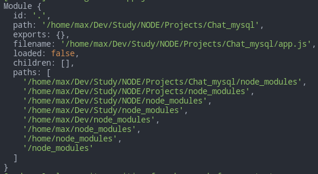

# Modules

- [Modules](#modules)
  - [Local Server](#local-server)
  - [Intro](#intro)
  - [Module features](#module-features)
  - [Export default](#export-default)
  - [Dymanic imports](#dymanic-imports)
- [Modules in Node.js](#modules-in-nodejs)

---

## Local Server

Install the `Live Server` extension and use it in this lesson.

The alternative is to use Python: type in the terminal in the project folder:

```python
python3 -m http.server 5500
```

Then in the browser run `localhost:5500` to access your page.

---

## Intro

We can split our code into different files and use `import` and `export` to connect them.

**Always `import` starting with `./` or `/` and put extension `.js` at the end!**

```html
<!-- index.html -->
<script src="script.js" type="module"></script>
```

```javascript
// sayHi.js
export function sayHi(user) {
	return `Hello, ${user}`
}

export const number = 42
```

The `import` directive loads the module by the path `./sayHi.js` as an object

```javascript
{
	sayHi: function,
	number: 42
}
```

and then we use desctructuring to assing variables with the data.

```javascript
// script.js
import { sayHi, number } from './sayhi.js'
alert(sayHi('Vlad'))
```

---

## Module features

Modules have several differences from regular scripts.

Modules always `'use strict'` by default.

---

Each module has its own top-level scope. Top-level variables and functions from a module are not seen in other scripts.

```javascript
// user.js
const user = 'max'

// hello.js
alert(user) // ReferenceError
```

```html
<!-- index.html -->
<script type="module" src="user.js"></script>
<script type="module" src="hello.js"></script>
```

Modules are expected to export what they want to be accessible from the outside and import what they need. So we should import user.js into hello.js and get the required functionality from it instead of relying on global variables.

```javascript
//user.js
export const user = 'max'

// hello.js
import { user } from './user.js'
alert(user)
```

```html
<!-- index.html -->
<script src="hello.js" type="module"></script>
```

If we really need to make a window-level global variable, we can explicitly assign it to `window` and access as `window.user`, but it's discouraged.

---

If the same module is imported into multiple other places, its code is executed only the first time, then exports are given to all importers.

```javascript
// alert.js
alert("Module is evaluated!")

/* Import the same module from different files */

// 1.js
import `./alert.js`		// Module is evaluated!

// 2.js
import `./alert.js`		// (shows nothing)
```

---

Objects are passed by reference. Means the same object will be used by all importers and any changes will be visible for all modules that have the object.

```javascript
// admin.js
const admin = {}

function sayHi(user) {
	alert(`Ready to serve, ${user}`)
}

export { admin, sayHi }

// init.js
import { admin } from './admin.js'

admin.name = 'Maximux'

import { admin, sayHi } from './admin.js'

alert(`admin.name = ${admin.name}`) // admin.name = 'Maximux"
sayHi(admin.name) // Ready to serve, Maximux
```

```html
<!-- index.html -->
<script src="init.js" type="module"></script>
<script src="script.js" type="module"></script>
```

---

In a module, top-level `this` is `undefined`. In non-module scripts `this` is a globel object.

```html
<script>
	alert(this) // window
</script>

<script type="module">
	alert(this) // undefined
</script>
```

---

Module scripts have `defer` be default. In other words:

- `<script type="module" src="...">` loads **in parallel** with other resources, **never blocks** and **waits** until HTML is fully loaded and **after** then runs. This can have a side-effect of the user seeing HTML before deferred scripts processed it. It can be wise to place some kind of a **loading indicator** until then.
- relative order of scripts is maintained: **scripts** that **go first** in the document, **execute first**.

---

The `async` attribute works on inline scripts. We can use it for scripts that don't rely on html (counters, analytics, etc.).

```html
<!-- all dependencies are fetched (analytics.js), and the script runs -->
<!-- doesn't wait for the document or other <script> tags -->
<script async type="module">
	import { counter } from './analytics.js'
	counter.count()
</script>
```

---

We can use `as` to import under different names.

```javascript
// main.js
import { sayHi as hi, sayBye as bye } from './say.js'

hi('John') // Hello, John!
bye('John') // Bye, John!
```

The same for export. Also we can use `*` to import all variables exported from a module into one object.

```javascript
// say.js
export { sayHi as hi, sayBye as bye }

// main.js
import * as say from './say.js'

say.hi('John') // Hello, John!
say.bye('John') // Bye, John!
```

---

## Export default

| Named export              | Default export                    |
| ------------------------- | --------------------------------- |
| `export class User {...}` | `export default class User {...}` |
| `import {User} from ...`  | `import User from ...`            |

In practice, there are mainly two kinds of modules.

1. Modules that contain a **library**, pack of functions, like `say.js` above.
2. Modules that declare a **single entity**, e.g. a module user.js exports only class User.

Mostly, the second approach is preferred, so that every “thing” resides in its own module.

Modules provide special `export default` syntax to make the “one thing per module” way look better.

There may be **only one** default export per file.

```javascript
// user.js
export default class User {
	// just add "default"
	constructor(name) {
		this.name = name
	}
}
```

Then import it without curly braces:

```javascript
// main.js
import User from './user.js' // not {User}, just User

new User('John')
```

The default exported entity can have no name. The name is given during the import.

```javascript
export default class {
	constructor(){ ... }
}
```

```javascript
import Anything from './class.js' // works
import TheOther from './class.js' // works too
```

Although it's usually better not to use the default export and always use explicit names to avoid confusion.

---

Module loaded from the outher origin, requires the server to set the `Access-Control-Allow-Origin` header.

---

## Dymanic imports

We can use `import(module)` to load a module dynamically from any part of the code (unlike the regular import which can only be on the top). Calling it returns a `promise` that resolves into a module object that contains all its exports.

```javascript
import('./path.js')
	.then((obj) => console.log(obj))
	.catch((err) => console.warn(err))
```

Dynamic imports **work in regular scripts**, they don’t require `script type="module"`.

```javascript
export function hi() {
	alert(`Hello`)
}

export function bye() {
	alert(`Bye`)
}

export default function () {
	alert('Module loaded (export default)!')
}
```

```html
<!DOCTYPE html>
<script>
	async function load() {
		const { hi, bye, default: def } = await import('./say.js') // you can't use the variable name `default`
		hi()
		bye()
		def()
	}
</script>

<button onclick="load()">Click me</button>
```

**NB**: `import()` is not a function! It looks similar, but we can't `call/apply` it or copy it to a variable.

---

# Modules in Node.js

https://stackabuse.com/how-to-use-module-exports-in-node-js/

In Node, we use `module.exports` object that the current module returns when it is `required` in another program or module.

```js
console.log(module)
```



To export a variable, we simply attack it as a property of `module.exports`:

```js
module.exports.temperature = temp
```
