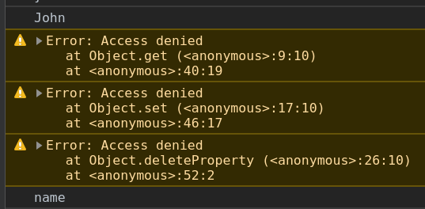
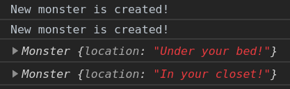
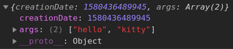
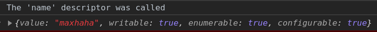
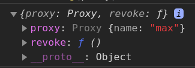
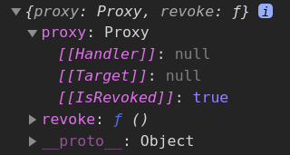

# Proxy

- [Proxy](#proxy)
  - [Intro](#intro)
  - [Methods (traps)](#methods-traps)
    - [`get`](#get)
    - [`set`](#set)
    - [`ownKeys`, `getOwnPropertyDescriptor`](#ownkeys-getownpropertydescriptor)
    - [`deleteProperty`](#deleteproperty)
    - [`has`](#has)
    - [`apply`](#apply)
    - [`construct`](#construct)
    - [`defineProperty`](#defineproperty)
    - [`getOwnPropertyDescriptor`](#getownpropertydescriptor)
  - [Reflect](#reflect)
  - [Revocable proxy](#revocable-proxy)
  - [Practice](#practice)
    - [Error on reading non-existant property](#error-on-reading-non-existant-property)
    - [Accessing arrays with negative indices [-1]](#accessing-arrays-with-negative-indices--1)
    - [Observable](#observable)
    - [Setting an event listener on an object to track its change](#setting-an-event-listener-on-an-object-to-track-its-change)

---

## Intro

A `Proxy` object is a wrapper around another object that can perform some checks or changes. Kinda a setter/getter functionality for objects. For example, we can use it to `dispatchEvent`-s to track the change of the value of some variables!

```javascript
const proxy = new Proxy(target, handler)
```

- `target` – is an **object** to wrap, can be anything, including functions.
- `handler` – proxy configuration: an **object** with “traps”, methods that intercept operations. – e.g. get trap for reading a property of target, set trap for writing a property into target, and so on. `this` is always bound to the handler.

```javascript
const target = {} // empty object
const proxy = new Proxy(target, {}) // empty handler, no restrictions

proxy.age = 20 // added prop to proxy
console.log(target) // {age: 20} -> target got new prop from the proxy
```

Proxy is a special “exotic object”. It doesn’t have own properties. With an empty handler it transparently forwards operations to target.

| Internal              | Method Handler Method    | Triggers when…                                                                                |
| --------------------- | ------------------------ | --------------------------------------------------------------------------------------------- |
| [[Get]]               | get                      | reading a property                                                                            |
| [[Set]]               | set                      | writing to a property                                                                         |
| [[HasProperty]]       | has                      | in operator                                                                                   |
| [[Delete]]            | deleteProperty           | delete operator                                                                               |
| [[Call]]              | apply                    | function call                                                                                 |
| [[Construct]]         | construct                | new operator                                                                                  |
| [[GetPrototypeOf]]    | getPrototypeOf           | Object.getPrototypeOf                                                                         |
| [[SetPrototypeOf]]    | setPrototypeOf           | Object.setPrototypeOf                                                                         |
| [[IsExtensible]]      | isExtensible             | Object.isExtensible                                                                           |
| [[PreventExtensions]] | preventExtensions        | Object.preventExtensions                                                                      |
| [[DefineOwnProperty]] | defineProperty           | Object.defineProperty, Object.defineProperties                                                |
| [[GetOwnProperty]]    | getOwnPropertyDescriptor | Object.getOwnPropertyDescriptor, for..in, Object.keys/values/entries                          |
| [[OwnPropertyKeys]]   | ownKeys                  | Object.getOwnPropertyNames, Object.getOwnPropertySymbols, for..in, Object/keys/values/entries |

---

## Methods (traps)

### `get`

```javascript
let monster = {
	secret: 'easily scared',
	eyeCount: 4
}

const handler = {
	get(target, prop, receiver) {
		if (prop === 'secret') {
			return `${target.secret.slice(0, 4)}... shhhh!`
		} else {
			return target[prop]
		}
	}
}

monster = new Proxy(monster, handler)

// console.log(monster.eyeCount)	// 4
// console.log(monster.secret)		// easi... shhhh!

for (const key in monster) {
	console.log(`${key}: ${monster[key]}`)
}

// secret: easi... shhhh!
// eyeCount: 4
```

---

The following code traps getting a property value.

```javascript
const p = new Proxy(
	{},
	{
		get(target, prop) {
			return `You called ${prop} property`
		}
	}
)

console.log(p.asdf) // You called asdf property
```

We trapped any prop request with no problem (even the props that don't exist).

---

If the property is non-writable and non-configurable, if cannot return any other value other than it actually has.

```javascript
const obj = {}

Object.defineProperty(obj, 'a', {
	configurable: false,
	writable: false,
	value: 10
})

const p = new Proxy(obj, {
	get(target, prop) {
		return 20
	}
})

console.log(p.a) // TypeError... read-only and non-configurable data property on the proxy target but the proxy did not return its actual value (expected '10' but got '20')
```

---

There always must be at least theoretical possibility to set the value the same as returned.

```javascript
const obj = {}

Object.defineProperty(obj, 'a', {
	configurable: true, // now true
	writable: false,
	value: 10
})

const p = new Proxy(obj, {
	get(target, prop) {
		return 20
	}
})

console.log(p.a) // 20 -> no errors
```

---

Let's make the dictionary object that returns the word without translation instead of `undefined` if it has no such entry.

```javascript
let dictionary = {
	hello: 'hola'
}

dictionary = new Proxy(dictionary, {
	get(target, prop) {
		if (prop in target) {
			return target[prop]
		}
		return prop
	}
})

console.log(dictionary.hello) // hola
console.log(dictionary.bye) // bye -> not `undefined, good
```

---

**NB**: You shouldn't use the target object after you created its proxy, this is a mess! It's better to just override the initial object completely.

---

### `set`

The `set(target, property, value, receiver)` trap **must** return `true` if setting is successful, and `false` otherwise (triggers TypeError).

Let's make an array that only accepts numbers.

```javascript
let numbers = []

numbers = new Proxy(numbers, {
	set(target, property, value) {
		if (typeof value === 'number') {
			target[property] = value
			return true
		} else {
			return false
		}
	}
})

numbers[0] = 1
numbers.push(2)
numbers.push(3)

console.log(numbers) // {0: 1, 1: 2, 2: 3}
console.log(numbers.length) // 3

// numbers.push('text')		// TypeError
```

Please note: the built-in functionality of arrays is still working! Values are added by push. The length property auto-increases when values are added. Our proxy doesn’t break anything.

---

### `ownKeys`, `getOwnPropertyDescriptor`

These methods are used for iteration.

`Object.keys`, `for..in` loop and most other methods that iterate over object properties use **`[[OwnPropertyKeys]]` internal method (intercepted by `ownKeys` trap) to get a list of properties.**

Such methods differ in details:

- `Object.getOwnPropertyNames(obj)` returns non-symbol keys.
- `Object.getOwnPropertySymbols(obj)` returns symbol keys.
- `Object.keys/values()` returns non-symbol keys/values _with enumerable flag_.
- `for..in` loops over non-symbol keys _with enumerable flag,_ and also prototype keys.

**But all of them start with that list.**

Let's make an object that filters the properties starting with `_` when iterating over its properties.

```javascript
let user = {
	name: 'John',
	age: 20,
	_password: `****`
}

user = new Proxy(user, {
	ownKeys(target) {
		// called once to get a list of properties
		return Object.keys(target).filter((item) => !item.startsWith('_'))
	}
})

for (const key in user) {
	console.log(key) // name, age -> no password!
}

console.log(Object.keys(user)) // ["name", "age"]
console.log(Object.values(user)) // ["John", 20]
```

If properties doesn't have `enumerable` flag (e.g. if they don't exist in the object), they won't be listed.

```javascript
let user = {}

user = new Proxy(user, {
	ownKeys(target) {
		return [`1`, `2`, `3`] // return an array of some keys
	}
})

console.log(Object.keys(user)) // [] -> empty
```

No `enumerable` flag for the keys, so didn't work. Let's add it:

```javascript
let user = {}

user = new Proxy(user, {
	ownKeys(target) {
		// called once to get a list of properties
		return ['a', 'b', 'c']
	},

	getOwnPropertyDescriptor(target, prop) {
		// called for every property
		return {
			enumerable: true,
			configurable: true
			/* ...other flags, probable "value:..." */
		}
	}
})

console.log(Object.keys(user)) // a, b, c
```

---

### `deleteProperty`

We can make **really** protected properties using proxies, preventing any kind of access to the props starting with `_`.

We’ll need the traps:

- `get` to `throw` an error when reading such property,
- `set` to `throw` an error when writing,
- `deleteProperty` to `throw` an error when deleting,
- `ownKeys` to exclude properties starting with \_ from `for..in` and methods like `Object.keys()`.

```javascript
let user = {
	name: 'John',
	_password: 'secret'
}

user = new Proxy(user, {
	get(target, prop) {
		if (prop.startsWith('_')) {
			throw new Error('Access denied')
		} else {
			// return target[prop]	// not enough, we lose `this`!

			let value = target[prop]
			if (typeof value === 'function') {
				return value.bind(target) // we bind the `user` object for the method to have access to its other props via `this`
			}
			return value // or just simple property
		}
	},

	set(target, prop, value) {
		if (prop.startsWith('_')) {
			throw new Error('Access denied')
		} else {
			target[prop] = value
			return true // done forget!
		}
	},

	deleteProperty(target, prop) {
		// a trap for `delete` operator
		if (prop.startsWith('_')) {
			throw new Error('Access denied')
		} else {
			delete target[prop]
			return true // dont' forget!
		}
	},

	ownKeys(target) {
		return Object.keys(target).filter((item) => !item.startsWith('_'))
	}
})

try {
	console.log(user.name)
	console.log(user._password)
} catch (err) {
	console.warn(err)
}

try {
	user._password = 'newpass'
} catch (err) {
	console.warn(err)
}

try {
	delete user._password
} catch (err) {
	console.warn(err)
}

for (const key in user) {
	console.log(key) // no `_password`, filtered!
}
```



---

### `has`

The `handler.has()` method is a trap for the `in` operator. Should return `true` of `false` obviously.

```javascript
let range = {
	from: 1,
	to: 10
}

range = new Proxy(range, {
	has(target, prop) {
		return prop >= target.from && prop <= target.to
	}
})

console.log(5 in range) // true
console.log(15 in range) // false
console.log('0' in range) // false
```

---

### `apply`

The `apply (target, thisArg, args)` trap handles calling a `proxy` as `function`.

Classic `delay` decorator:

```javascript
function delay(func, ms) {
	return function (...args) {
		setTimeout(() => func.apply(this, args), ms)
	}
}

function sayHi(name) {
	console.log(`Hi, ${name}`)
}

const hi = delay(sayHi, 1000)

hi('max') // Hi, max -> in 1 s
```

But a wrapper function does not forward property read/write operations or anything else. After the wrapping, the access is lost to properties of the original functions, such as name, length and others:

```javascript
console.log(sayHi.length) // 1 -> function length is the arguments count in its declaration

sayHi = delay(sayHi, 3000)

console.log(sayHi.length) // 0 -> in the wrapper declaration, there are zero arguments
console.log(sayHi.name) // "" -> the wrapper doesn't have the name
```

Proxy is much more powerful, as it forwards everything to the target object. We use the `apply(target, thisArg, args)` trap for this.

```javascript
function delay(func, ms) {
	return new Proxy(func, {
		apply(target, thisArg, args) {
			setTimeout(() => target.apply(thisArg, args), ms)
		}
	})
}

function sayHi(name) {
	console.log(`Hi, ${name}`)
}

sayHi = delay(sayHi, 1000)

sayHi('max') // Hi, max -> in 1 s

console.log(sayHi.length) // 1
console.log(sayHi.name) // sayHi
```

The result is the same, but now not only calls, but all operations on the proxy are forwarded to the original function. So we don't lose anything.

---

### `construct`

The `construct(target, args, newTarget)` is a trap for the `new` operator. **Should return an object** (or TypeError). In order to work, the target itself should has the internal `[[construct]]` method - be callable with the `new` keyword, e.g. by being a `function` (or TypeError).

```javascript
function Monster(location) {
	this.location = location
}

Monster = new Proxy(Monster, {
	construct(target, args) {
		console.log(`New monster is created!`)
		return new target(...args) // we return an object using `new`
	}
})

let monster1 = new Monster('Under your bed!')
let monster2 = new Monster('In your closet!')

console.log(monster1)
console.log(monster2)
```



---

We can also use an empty function as a target. A function that returns a list of its arguments for example:

```javascript
const Func = new Proxy(function () {}, {
	construct(target, args) {
		return {
			// `construct` should return an object, we can do it explicitly
			creationDate: Date.now(),
			args
		}
	}
})

console.log(new Func('hello', 'kitty'))
```



---

### `defineProperty`

`handler.defineProperty(target, property, descriptor)` is a trap for `Object.defineProperty()`. Must return `true` if the property was successfully defined.

```javascript
let handler = {
	defineProperty(target, prop, descriptor) {
		console.log(`Someone tries to  define a property`)
		Object.defineProperty(target, prop, descriptor)
		return true
	}
}

let obj = new Proxy({}, handler)

Object.defineProperty(obj, 'age', {
	value: 20
})
```

The `descriptor` should be a valid descriptor with the firlds `value`, `writable`, etc, the others will be ignored.

---

### `getOwnPropertyDescriptor`

The `handler.getOwnPropertyDescriptor(target, prop)` method is a trap for `Object.getOwnPropertyDescriptor()`.

```javascript
let user = {
	name: 'max'
}

user = new Proxy(user, {
	getOwnPropertyDescriptor(target, prop) {
		console.log(`The '${prop}' descriptor was called`)
		let descr = Object.getOwnPropertyDescriptor(target, prop)
		if (descr.value) descr.value += 'haha'
		return descr
	}
})

Object.getOwnPropertyDescriptor(user, 'name')
```



---

## Reflect

`Reflect` is a built-in object that simplifies creation of `Proxy`. It provides `static` methods for interceptable JS operations. They have the same names as the `Proxy` methods. If a trap wants to forward the call to the object, it’s enough to call `Reflect.method` with the same arguments.

```javascript
let user = {
	name: 'max'
}

user = new Proxy(user, {
	get(target, prop) {
		console.log('Get operation')
		return Reflect.get(target, prop)
	},

	set(target, prop) {
		console.log('Set operation')
		return Reflect.set(target, prop)
	}
})

user.age = 22 // Set operation
console.log(user.age) // Get operation
```

So it basically means: continue the operation normally. Previously we had to manually perform the actions. And it is better in one way more: it keeps the correct `this`.

```javascript
let user = {
	_name: 'Guest',
	get name() {
		return this._name
	}
}

let userProxy = new Proxy(user, {
	get(target, prop, receiver) {
		return target[prop] // (*) target = user
	}
})

let admin = {
	__proto__: userProxy,
	_name: 'Admin'
}

// Expected: Admin
alert(admin.name) // outputs: Guest (?!?)
```

In the example above we got the incorrect result because `this === user` in the prototype chain that returns the answer. To fix this problem we can use the last parameter - the `receiver`.

```javascript
let user = {
	_name: 'Guest',
	get name() {
		return this._name
	}
}

let userProxy = new Proxy(user, {
	get(target, prop, receiver) {
		// receiver = admin
		return Reflect.get(target, prop, receiver) // (*)

		// we can use even shorter syntax - it'll work:
		// return Reflect.get(...arguments)
	}
})

let admin = {
	__proto__: userProxy,
	_name: 'Admin'
}

alert(admin.name) // Admin
```

Now receiver that keeps a reference to the correct this (that is admin), is passed to the getter using Reflect.get in the line (\*).

For special objects like `Map`, `Set` or the class that uses private fields, some tweaks may be needed in the handler for it to have the access to the correct object:

```javascript
// ... function
let value = Reflect.get(...arguments)
return typeof value == 'function' ? value.bind(target) : value
```

---

## Revocable proxy

Revocable `proxy` can be disabled. We simply return a function (kinda `reject`) to be called when we need to terminate the `proxy`.

`Proxy.revocable()` returns an object with 2 fields:

1. `proxy` contains the proxy object itself.
2. `revoke` is a method to terminate the `proxy`.

```javascript
let user = {
	name: 'max'
}

user = Proxy.revocable(user, {
	get(target, prop) {
		console.log('We get value')
		Reflect.get(...args)
	}
})

console.log(user)
```



A call to `revoke()` removes all internal references to the target object from the proxy, so they are no more connected. The target object can be garbage-collected after that.

```javascript
user.revoke()

console.log(user)
```



---

We can use `WeakMap` for convenient storing.

```javascript
let revokes = new WeakMap()

let user = {
	name: 'max'
}

let { proxy: proxyUser, revoke } = Proxy.revocable(user, {})

revokes.set(proxyUser, revoke)

// now we can work with our `proxy` object as usual. And when we don't need it anymore, we simply revoke it

console.log(proxyUser.name) // max

revokes.get(proxyUser)() // revokes.get(proxy) returns a function

console.log(proxyUser.name) // TypeError
```

---

## Practice

### Error on reading non-existant property

https://javascript.info/proxy#error-on-reading-non-existant-property

`Throw` an error when trying to read a non-existant property instead of returning `undefined`.

```javascript
function wrap(target) {
	return new Proxy(target, {
		get(target, prop, receiver) {
			if (prop in target) {
				return Reflect.get(...arguments)
			}
			throw new Error('No such property!')
		}
	})
}

let obj = wrap({ name: 'max' })

console.log(obj.name) // max
console.log(obj.omg) // Error
```

---

### Accessing arrays with negative indices [-1]

https://javascript.info/proxy#accessing-array-1

Implement the possibility to access arrays with negative indices starting with the end

```javascript
const advancedArray = {
	get(target, prop, receiver) {
		if (prop < 0) {
			prop = +prop + target.length
		}
		return Reflect.get(...arguments)
	}
}

let array = ['a', 'b', 'c']

array = new Proxy(array, advancedArray)

console.log(array[-1]) // 'c', the last element
console.log(array[-2]) // 'b', one step from the end
console.log(array[-3]) // 'a', two steps from the end
```

---

### Observable

https://javascript.info/proxy#observable

```javascript
function makeObservable(target) {
	let setHandlers = Symbol('"Set" handlers') // we could use a regular string prop but Symbol makes the prop invisible for loops which is nice as this is an utility property

	target[setHandlers] = []

	target.observe = function (func) {
		this[setHandlers].push(func)
	}

	return new Proxy(target, {
		set(target, prop, value, receiver) {
			let success = Reflect.set(...arguments) // returns boolean

			if (success) {
				target[setHandlers].forEach((item) => item.call(target, prop, value))
			}

			return success
		}
	})
}

let user = {}
user = makeObservable(user)

user.observe((key, value) => console.log(`SET ${key} = ${value}`))
user.name = 'john'

console.log(user)
```

---

### Setting an event listener on an object to track its change

```javascript
document.body.addEventListener('lol', () => {
	alert(obj.field)
})

let obj = {
	field: ''
}

obj = new Proxy(obj, {
	set(target, prop, value) {
		target[prop] = value
		if (prop === 'field') {
			document.body.dispatchEvent(new Event('lol'))
		}
		return true
	}
})

console.log(obj)

obj.field = 'yo' // alert('yo')
obj.field = 'mazafaka' // alert('mazafaka')
```
