# Regular Expressions

- [Regular Expressions](#regular-expressions)
  - [Intro](#intro)
  - [Symbol classes:](#symbol-classes)
  - [Flags](#flags)
  - [Methods](#methods)
    - [`str.match(regexp)`](#strmatchregexp)
    - [`str.matchAll(regexp)`](#strmatchallregexp)
    - [`str.split(regexp|substr, limit)`](#strsplitregexpsubstr-limit)
    - [`str.search(regexp)`](#strsearchregexp)
    - [`str.replace(str|regexp, str|func)`](#strreplacestrregexp-strfunc)
    - [`regexp.test(str)`](#regexpteststr)
    - [`regexp.exec(str)`](#regexpexecstr)
  - [Unicode `/u` and `\p{...}`](#unicode-u-and-p)
  - [Anchors: string start `^` and end `$`](#anchors-string-start--and-end-)
    - [Multiline mode `/m`](#multiline-mode-m)
  - [Word boundary `\b`](#word-boundary-b)
  - [Escaping `\`](#escaping-)
  - [Sets and ranges `[...]`](#sets-and-ranges-)
  - [Quantifiers `{1,5}`](#quantifiers-15)
    - [Shorthands for Quantifiers `+`, `*`, `?`](#shorthands-for-quantifiers---)
  - [Greedy and Lazy quantifiers `*?`, `{1,}?`](#greedy-and-lazy-quantifiers--1)
  - [Capturing groups `(...)`](#capturing-groups-)
    - [Parentheses groups](#parentheses-groups)
    - [Backreferences in pattern `\1`, `?<name>`](#backreferences-in-pattern-1-name)
  - [Alternation `|`](#alternation-)
  - [Lookaround](#lookaround)
    - [Lookahead `X(?=Y)`, `X(?!Y)`](#lookahead-xy-xy)
    - [Lookbehind `(?<=Y)X`, `(?<!Y)X`](#lookbehind-yx-yx)
  - [Practice](#practice)
    - [Filter only digits](#filter-only-digits)
    - [Find the time](#find-the-time)
    - [Ellipsis](#ellipsis)
    - [HTML colors](#html-colors)
    - [Find all HTML comments](#find-all-html-comments)
    - [Find all HTML tags](#find-all-html-tags)
    - [Find all numbers](#find-all-numbers)
    - [Check MAC-address](#check-mac-address)
    - [Parse an expression](#parse-an-expression)
    - [BB-tags](#bb-tags)
    - [Find full tag](#find-full-tag)
    - [Non-negative integers](#non-negative-integers)

---

## Intro

`RegExp` is a powerful tool for searching and filtering text.

There're 2 ways of defining RegExp:

```js
// digit + space + symbol of a word (e.g. '1 a')

// 1st way
const reg1 = /\d\s\w/gi

// 2nd way
const reg2 = new RegExp('dsw', 'gi')
```

`new RegExp` lets us pass variables and create `regexp` on the fly.

---

## Symbol classes:

- `\d` - digit
- `\s` - space
- `\w` - LATIN letter || digit || \_
- `\D` - NOT a digit
- `\S` - NOT a space
- `\W` - NOT a word character
- `.` - any symbol except `\n` (use `[\s\S]` or `[^]` for literally any character - it says "a space or not a space character")

Examples (if not `/g/` flag is installed, the first match will be returned):

```js
// digit, space, not a digit
console.log('HK-47 is the best companion!'.match(/\d\s\D/)) // ['7 i']
// word symbol * 4, not a word symbol
console.log('HK-47 is the best companion!'.match(/\w\w\w\w\W/)) // ['best ']
// any symbol, space, word symbol * 3
console.log('HK-47 is the best companion!'.match(/.\s\w\w\w/)) // ['s the']
```

---

## Flags

- `g` - global
- `i` - case-insensitive
- `m` - multiline
- `s` - dot `.` will include new line character
- `u` - unicode support
- `y` - search on the position

Add these flags after the ending **slash `/`**: `/abc/gi`

```js
// any symbol, word symbol, any symbol, space - global
console.log('HK-47 is the best companion!'.match(/.\w.\s/g)) // ["-47 ", "the ", "est "]
// h, k, any symbol * 3 - global, case-insensitive
console.log('HK-47 is the best companion!'.match(/hk.../gi)) // ["HK-47"]
```

---

## Methods

### `str.match(regexp)`

Returns an **array** with the result depending on **whether** the `/g/` flag is used:

1. Yes - returns an array of matches.
2. No - returns an array with the first match and **additional properties**:
   1. **groups**: `undefined` or an object of named capturing groups
   2. **index**: position of the match
   3. **input**: full string where you searched

If regexp is a **non-RegExp** object, it is implicitly converted to a RegExp by using `new RegExp(regexp)`.

If **no matches** - `return null`.

```js
const str = 'apple, orange, 42'
const reg = /\d\d/i

console.log(str.match(reg))
```

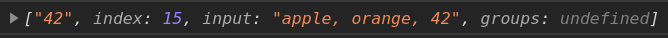

---

### `str.matchAll(regexp)`

New upgraded version of `match`. Always used with **`/g/`**. Returns **iterable object** with verbose results.

If **no matches** - returns empty iterator.

```js
const str = 'apple15, or33ange, 42'
const reg = /\d\d/gi
const result = str.matchAll(reg)

// we can gather its values into an array
const arr = [...result]
console.log(arr) // Array of 3 Arrays

// or we loop over it using `for..or`, just remember: it's only iterable once!
```

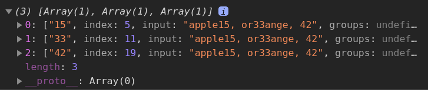

Why **iterable** instead of an array? For optimization as every next value (array) is evaluated only when referred, so if we loop over 100 matches, we can break after 3 and the rest will never be evaluated.

---

### `str.split(regexp|substr, limit)`

Splits the string into array using regexp as a delimiter.

```js
const str = '700-54-32'
const reg = '-'

str.split(reg) // ["700", "54", "32"]
```

```js
const str = `700,  54, 		32`
const reg = /,\s*/

str.split(reg) // ["700", "54", "32"]
```

---

### `str.search(regexp)`

Returns the position of the match. Only finds the **first** match. Use other means to find all the matches.

---

### `str.replace(str|regexp, str|func)`

Common and useful method for searching and replacing.

When the first argument of replace is a string, it only replaces the first match!

```js
// replace a dash by a colon
console.log('12-34-56'.replace('-', ':')) // 12:34-56
console.log('12-34-56'.replace(/-/g, ':')) // 12:34:56
```

---

Replacement can be done using **parentheses groups**, refer to them using `$1, $2, ... ` as their numbers.

```js
const str = 'John Bull'
const reg = /(\w+) (\w+)/

console.log(str.replace(reg, 'New string: $2, $1!'))
// New string: Bull, John!
```

---

### `regexp.test(str)`

Return `true/false` depending on whether there's a match in the string or not.

If there's the `/g/` flag, further calls to `test(str)` will resume searching `str` starting from `lastIndex`. The `lastIndex` property will continue to increase each time `test()` returns `true`.

```js
const str = 'More about JavaScript at https://javascript.info'
const reg = /javascript/gi

let result

while ((result = reg.test(str))) {
	console.log(result)
	console.dir(`lastIndex: ${reg.lastIndex}`)
}
```

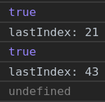

In the end, `result === false` and `reg.lastIndex === 0`.

---

### `regexp.exec(str)`

1. No `/g/` flag === `str.match(regexp)`
2. The `/g/` flag is present: returns the **first match** and saves the position **immediately after it** in the property `regexp.lastIndex`. You need to loop over it to get all the matches.

---

**No /g/** :

```js
const str = 'More about JavaScript at https://javascript.info'
const reg = /javascript/i

console.log(reg.exec(str)) // array with data
console.log(reg.lastIndex) // 0
```

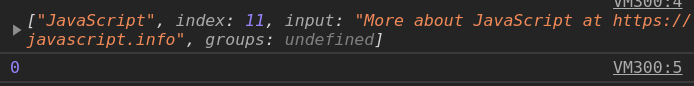

---

**There is /g/** :

```js
const str = 'More about JavaScript at https://javascript.info'
const reg = /javascript/gi

console.log(reg.exec(str)) // array with data
console.log(reg.lastIndex) // 21
```

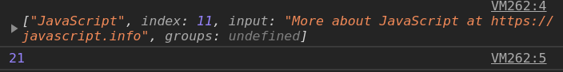

---

**To get all the matches**, we need to loop over `exec` until it returns `null`.

```js
const str = 'More about JavaScript at https://javascript.info'
const reg = /javascript/gi

let result

while ((result = reg.exec(str))) {
	console.log(result)
	console.dir(reg.lastIndex)
}
```

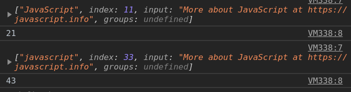

In the end, when there's no matches, `result === null` and `reg.lastIndex === 0`.

---

Because `test` and `exec` both use `lastIndex` to define from where to start, this can lead to unexpected results when called multiple times:

```js
const str = 'More about JavaScript at https://javascript.info'
const reg = /javascript/gi

console.log(reg.test(str)) // true
console.log(reg.test(str)) // true
console.log(reg.test(str)) // false
```

```js
const str = 'More about JavaScript at https://javascript.info'
const reg = /javascript/gi

console.log(reg.exec(str)) // array, index == 11
console.log(reg.exec(str)) // array, index == 33
console.log(reg.exec(str)) // null
```

Either set `reg.lastIndex = 0` explicitly or use other methods (like `match`) to get consistent results with each call.

---

## Unicode `/u` and `\p{...}`

JS uses 1- or 2-byte Unicode. Some characters didn't have a place in the 65k list of utf16.

Some languages treat 4-bytes symbols incorrectly, thinking it's 2 of 2-bytes symbols. To fix this in `regexp`, use the `/u` flag.

When we add flag `/u`, we can also use `\p{}` notation for `\p{Letter}` or `\p{L}`, `\p{Number}` or `\p{N}`, etc.

```js
let str = 'A ბ ㄱ' // a string with utf32 letters
console.log(str.match(/\p{L}/gu)) // ["A", "ბ", "ㄱ"]
console.log(str.match(/\p{L}/gu)) // null (no matches, as there's no flag "u")

str = `Hello Привет 你好 123_456`
console.log(str.match(/\p{sc=Han}/gu)) // 你,好 - Chinese hieroglyphs

str = `Prices: $2, €1, ¥9`
console.log(str.match(/\p{Sc}\d/gu)) // currency
```

---

## Anchors: string start `^` and end `$`

`/^abc/` - string starts with 'a'

`/abc$/` - string ends with 'c'

These anchors don't work anywhere except their places: at the beginning and the end of the string.

```js
let str = 'I love Mary'

console.log(/mary/i.test(str)) // true
console.log(/^mary/i.test(str)) // false
console.log(/mary$/i.test(str)) // true

str = 'Mary is beautiful. I love her'
console.log(/^mary/i.test(str)) // true
```

Test for **full match** using both `^` and `$` with anything you need between them:

```js
console.log(/^bet$/.test('bet')) // true
console.log(/^bet$/.test('1xbet')) // false
console.log(/^bet$/.test('bet bet')) // false
```

---

### Multiline mode `/m`

**Only affects the behavior of `^` and `$`.**

In the multiline mode they match not only at the beginning and the end of the string, but also at start/end of each line.

```js
const str = `1st place: Winnie
2nd place: Piglet
3rd place: Eeyore`

// only the beginnind and the end of the string
console.log(str.match(/^\d/g)) // ["1"]
// the beginning and the end of each line
console.log(str.match(/^\d/gm)) // ["1", "2", "3"]
```

---

## Word boundary `\b`

Word boundary lies:

- at the beginning of the string
- at the end of the string
- between a word character `\w` and **not** a word character `\W`

As it tests for `\w` and `\W`, it only works for **latin alphabet**.

```js
console.log('Hello, Java'.match(/\bjava\b/gi)) // ["Java"]
console.log('Hello, JavaScript'.match(/\bjava\b/gi)) // null

// works with digits as well
console.log('(057)755-65-75'.match(/\b\d\d\d\b/g)) // ["057", "755"]
```

---

Use **`\B` (no boundary)** to find a pattern inside another word:

```js
console.log(
	...'My grandmother rocks, and everybody loves her!'.matchAll(/\Band\B/g)
)
// the only match is inside another word
```

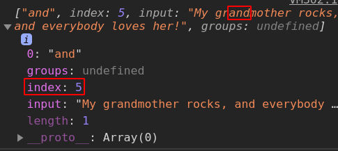

---

## Escaping `\`

Backslash **`\`** is used for **reversing** the character's special meaning and makes them work as regular symbols **or** vise versa - make regular symbols work in a special way.

List of special symbols need escaping to be treated literally: `[ \ ^ $ . | ? * + ( )`

```js
// stop 'dot' working as 'any symbol'
console.log('Chapter 5.1: 55x55'.match(/\d\.\d/g)) // ["5.1"]
// without escaping
console.log('Chapter 5.1: 55x55'.match(/\d.\d/g)) // ["5.1", "5x5"]
```

```js
console.log('(057)-700-44-55'.match(/\(\d\d\d\)/g)) // ["(057)"]
```

`/` needs escaping when used in the `/\//` notation and doesn't need when used in `new RegExp('/')`.

But in `new RegExp` we need to **double** backslash everything we want to bachslash.

```js
console.log(new RegExp('d').test('HK-47')) // false
console.log(new RegExp('\\d').test('HK-47')) // true
```

This is due to strings don't have special meanings for `\d` or `\z`, they only know `\n', `\t` and so on, so they assume this to be a mistake and remove single backslash.

---

## Sets and ranges `[...]`

Square brackets say "search any character among given". Adding **caret `^`** at the beginning **inverts** the pattern.

`[abc]` tests positive for any of 'a', 'b' or 'c'.

`[^abc]` tests positive for anything **except** 'a', 'b' or 'c'.

```js
console.log('Let the cat eat'.match(/[ae]t/g)) // ["et", "at", "at"]
```

Can also contain **ranges**: `[a-z]`, `[A-Z]`, `[0-9]`, etc.

```js
console.log('Exception 0xAF'.match(/x[0-9A-F][0-9A-F]/g)) // xAF)
```

Here `[0-9A-F]` has two ranges: it searches for a character that is either a digit from 0 to 9 or a letter from A to F.

If we’d like to look for lowercase letters as well, we can add the range `a-f`: `[0-9A-Fa-f]`. Or add the flag `i`.

---

Character classes are **shorthands** for certain character sets

- `\d` – is the same as `[0-9]`
- `\w` – is the same as `[a-zA-Z0-9_]`
- `\s` – is the same as `[\t\n\v\f\r ]`
- for non-latin alphabets, we can simply select entities we want: `[а-я]`
- `[^0-9]` == `[^\d]` == `\D`

---

All characters are treated literally **unless** they have some special meaning specifically for **square brackets**.

```js
// No need to escape
console.log('1 + 2 - 3'.match(/[-().^+]/g)) // [+, -]

// but you can still escape them with no harm:
console.log('1 + 2 - 3'.match(/[\-\(\)\.\^\+]/g)) // [+, -]
```

---

## Quantifiers `{1,5}`

Quantifier are appended to a character || a character class || a [...] set, and specify **how many** we need.

- The exact count: `{5}` - 5 times
- The range: `{1,5}` - from 1 to 5 times
- Greater or equal than: `{1,}` - 1+ times

```js
// 5 digits
console.log("I'm 12345 years old".match(/\d{5}/g)) // [12345]
// 3-5 digits
console.log("I'm not 12, but 1234 years old".match(/\d{3,5}/)) // [1234]
// 2 digits - can be found 2 times without repeating characters
console.log("I'm 12345 years old".match(/\d{2}/g)) // [12, 34]
```

Task: get all the number groups from a string: `+7(903)-123-45-67`

```js
console.log('+7(903)-123-45-67'.match(/\d{1,}/g)) // ["7", "903", "123", "45", "67"]
```

---

### Shorthands for Quantifiers `+`, `*`, `?`

- **`+`** == `{1,}` - "one or more"
- **`*`** == `{0,}` - "zero or more"
- **`?`** == `{0,1}` - makes the symbol optional

```js
console.log('100 10 1'.match(/\d0*/g)) // [100, 10, 1]
console.log('100 10 1'.match(/\d0+/g)) // [100, 10]
console.log('Should I write color or colour?'.match(/colou?r/g)) // ["color", "colour"]
```

More examples:

```js
// only decimal numbers
console.log('0 1 12.345 7890'.match(/\d+\.\d+/g)) // ["12.345"]

// opening or closing HTML tag without attributes
console.log('<h1>Hi!</h1>'.match(/<\/?[a-z][a-z0-9]*>/gi)) // ["<h1>", "</h1>"]
```

---

## Greedy and Lazy quantifiers `*?`, `{1,}?`

By default, `RegExp` works in the greedy mode.

- **Greedy** quantifiers will repeat **maximum** number of times.
- **Lazy** ones will repeat **minimum** number of times.

To make quantifier **lazy**, use **quotation mark `?`** after a quantifier.

```js
// greedy will take as much as it can
console.log('12345'.match(/\d{1,}/g)) // 12345
// lazy will take the minimum it should
console.log('12345'.match(/\d{1,}?/g)) // ["1", "2", "3", "4", "5"]

// get both words in double quotes
console.log('a "witch" and her "broom" is one'.match(/".+?"/g)) // [""witch"", ""broom""]

// alternative w/o lazy quantifiers - "double quote + not a double quote 1+ times + double quote"
console.log('a "witch" and her "broom" is one'.match(/"[^"]+"/g)) // [""witch"", ""broom""]

// get '123 4'
console.log('123 456'.match(/\d+ \d+?/g)) // ["123 4"]
```

Sometimes we can't solve our tasks relying on lazy quantifiers:

```js
const str1 = '...<a href="link1" class="wrong">... <p style="" class="doc">...'
const str2 =
	'...<a href="link1" class="doc">... <a href="link2" class="doc">...'
const reg = /<a href="[^"]*" class="doc">/g
const badReg = /<a href=".*?" class="doc">/g // this lazy quantifier won't always work!

console.log(str1.match(reg))
console.log(str2.match(reg))

console.log(str1.match(badReg)) // not what we need!
console.log(str2.match(badReg))
```

---

## Capturing groups `(...)`

We can put a pattern inside **parentheses `()`** to apply quantifiers to them and see them as separate items in the result array.

**Example**: get the "gogogo" pattern with an arbitrary number of "go" inside:

```js
// wrong
console.log('Gogogo now!'.match(/go+/gi)) // ["Go", "go", "go"]
// right
console.log('Gogogo now!'.match(/(go)+/gi)) // ["Gogogo"]
```

**Example**: domain

```js
console.log('https://my-site.com.ua'.match(/([\w-]+\.)+\w+/gi)) // ["my-site.com.ua"]
```

**Example**: email

```js
console.log(
	'Please @mail me to max.bar-cool@my-site.com.ua. Thank you!'.match(
		/[-\w.]+@([\w-]+\.)+\w+/gi
	)
) // ["max.bar-cool@my-site.com.ua"]
```

---

### Parentheses groups

You can refer to different **parentheses groups** by their indices when `str.match(reg)` is used without `/g/`.

- `[0]` - full match
- `[1]`, `[2]`, etc. - parentheses groups from left to right (by the opening parenthesis)

Example: get both tag and its content:

```js
const result = `<h1>Hello, world!</h1>`.match(/<([a-z]\w*?)>/i)

console.log(result)
console.log(result[0]) // `<h1>` - full match
console.log(result[1]) // `h1` - the first parentheses group
```

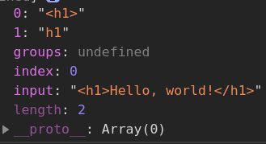

---

Example: get tag and all of its parts:

```js
console.log(
	'Chech this tag <span class="myclass" id="myid">, dude'.match(
		/<([a-z][\w-]*)\s*([^>]*)>/i
	)
)
```

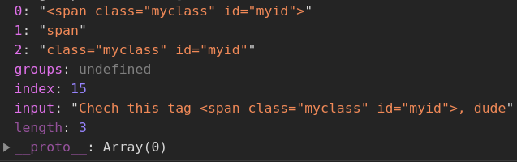

---

**Optional** groups (with `?`) are always referred in the match, even if their content is going to be `undefined` due to not being present in the match.

---

**Named groups** for easier referencing is made putting `?<name>`immediately after the opening parenthesis.

```js
console.log(
	'2019-04-30'.match(/(?<year>[0-9]{4})-(?<month>[0-9]{2})-(?<day>[0-9]{2})/)
)
```

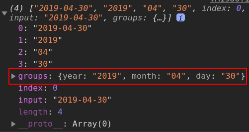

Several dates:

```js
const iter = '2019-04-30, 2020-01-01'.matchAll(
	/(?<year>[0-9]{4})-(?<month>[0-9]{2})-(?<day>[0-9]{2})/g
)

console.log(...iter)
```

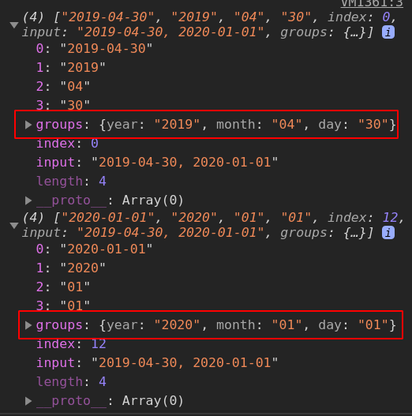

---

`str.replace(reg, replacement)` uses parentheses groups for replacement. See the [str.replace()](#strreplacestrregexp-strfunc) chapter for details.

---

Sometimes we need parentheses groups but don't want them in the resulting array. To **exclude** them, add **`?:`** at the beginning.

```js
console.log('Gogogo John!'.match(/(?:go)+ (\w+)/i))
```

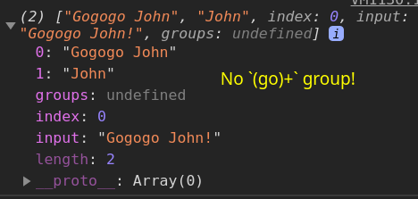

---

### Backreferences in pattern `\1`, `?<name>`

We can reference brackets groups by their number or names:

```js
console.log('adda abceec'.match(/([abc])([de])\2\1/g)) // ["adda", "ceec"]
```

Here we search for the first mathing character from the first group (`[abc]`) - it's `a`. It is remembered under the name `\1`. Then we get a match in the second group (`[de]`) - it happends to be `d` and gets remembered as `\2`. Then we refer to these names whenever we want.

We can also give them names to refer to them later using `\k<name>`

```js
console.log(`He said: "She's the one!".`.match(/(?<quote>['"])(.*?)\k<quote>/g)) // "She's the one!"
```

---

## Alternation `|`

Logical **OR**, gives the possibility to choose not between separate characters but between expressions:

```js
// find programming languages: Java JavaScript PHP C++ C
console.log('Java JavaScript PHP C++ C'.match(/java(script)?|php|c(\+\+)?/gi))
// ["Java", "JavaScript", "PHP", "C++", "C"]

console.log(
	'First HTML appeared, then CSS, then JavaScript'.match(
		/html|css|java(script)?/gi
	)
)
// ["HTML", "CSS", "JavaScript"]

// correct time in the 24h format
console.log(
	'00:00 10:10 23:59 25:99 1:2'.match(
		/(?<hours>[01]\d|2[0-3]):(?<minutes>[0-5]\d)/g
	)
)
// ["00:00", "10:10", "23:59"]
```

---

## Lookaround

### Lookahead `X(?=Y)`, `X(?!Y)`

Sometimes we need to find only those matches for a pattern that are followed or preceeded by another pattern.

The syntax is: `X(?=Y)(?=Z)...`, it means "look for `X`, but match only if immediately followed by `Y` immediately followed by `Z`".

```js
console.log(
	"1 turkey costs 30€. It's 2 times more than a year ago.".match(/\d+(?=€)/g)
)
// ["30"]
```

When we look for `X(?=Y)`, the regular expression engine finds `X` and then checks if there’s `Y` immediately after it. If it’s not so, then the potential match is skipped, and the search continues.

**Negative lookahead**: `X(?!Y)` means "search `X`, but only if **not** followed by `Y`".

---

### Lookbehind `(?<=Y)X`, `(?<!Y)X`

Positive: `(?<=Y)X` - matches `X`, but only if there’s `Y` before it.

Negative: `(?<!Y)X` - matches `X`, but only if there’s no `Y` before it.

```js
console.log('1 turkey costs $30'.match(/(?<=\$)\d+/))
// 30 (skipped the sole number)
console.log('1 turkey costs $30'.match(/(?<!\$)\d+/))
// 1 (skipped the price)
```

---

## Practice

### Filter only digits

```javascript
// first way - simply finlter only digits
const str = "+7(903)-123-45-67".match(/\d/g	)
// ["7", "9", "0", "3", "1", "2", "3", "4", "5", "6", "7"]
console.log(str.join(''))	// 79031234567

// second way - replace non-digits with an empty string
console.log(str.replace(/\D/g, '')	// 79031234567
```

---

### Find the time

https://javascript.info/regexp-character-sets-and-ranges#find-the-time-as-hh-mm-or-hh-mm

**Complete** solution:

```js
console.log(
	'00:00 10:10 23:59 25:99 1:2'.match(
		/(?<hours>[01]\d|2[0-3]):(?<minutes>[0-5]\d)/g
	)
)
// ["00:00", "10:10", "23:59"]
```

---

### Ellipsis

https://javascript.info/regexp-quantifiers#how-to-find-an-ellipsis

```js
console.log('Hello!... How goes?.....'.match(/\.{3,}/g)) // ["...", "....."]
```

---

### HTML colors

https://javascript.info/regexp-groups#find-color-in-the-format-abc-or-abcdef

```js
console.log(
	'color: #3f3; background-color:#AA00ef bad-colors:f#fddee #12345678'.match(
		/#([0-9A-F]{3}){1,2}\b/gi
	)
) // ["#3f3", "#AA00ef"]
```

---

### Find all HTML comments

https://javascript.info/regexp-greedy-and-lazy#find-html-comments

```js
const reg = /<!--.*?-->/gs // watch for the `/s` flag!
const str = `... <!-- My -- comment
 test --> ..  <!----> ..
`
console.log(str.match(reg))
```

---

### Find all HTML tags

https://javascript.info/regexp-greedy-and-lazy#find-html-tags

```js
const reg = /<\/?[^<>]+>/g
const str = `<> <a href="/"> <input type="radio" checked> <b>`
console.log(str.match(reg))
```

---

### Find all numbers

https://javascript.info/regexp-groups#find-all-numbers

```js
console.log(
	'-1.5 0 2 -123.4.'.match(
		/(?<sign>-?)(?<integer>\d+)(?:\.(?<fractional>\d+))?/g
	)
) // [-1.5, 0, 2, -123.4]
```

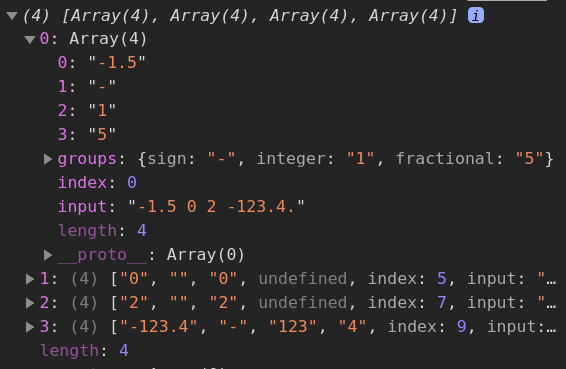

---

### Check MAC-address

https://javascript.info/regexp-groups#check-mac-address

```js
const regexp = /[a-f0-9]{2}(:[a-f0-9]{2}){5}/i

console.log(regexp.test('01:32:54:67:89:AB')) // true
console.log(regexp.test('0132546789AB')) // false (no colons)
console.log(regexp.test('01:32:54:67:89')) // false (5 numbers, must be 6)
console.log(regexp.test('01:32:54:67:89:ZZ')) // false (ZZ ad the end)
```

---

### Parse an expression

https://javascript.info/regexp-groups#parse-an-expression

```js
function parse(str) {
	const result = str.match(
		/\s*((-?)(\d+)(?:\.(\d+))?)\s*(?<operator>[-+*/])\s*((-?)(\d+)(?:\.(\d+))?)\s*/
	)
	return [result[1], result[5], result[6]]
}

let [a, op, b] = parse('1.2 * 3.4')

console.log(a) // 1.2
console.log(op) // *
console.log(b) // 3.4
```

---

### BB-tags

https://javascript.info/regexp-alternation#find-bbtag-pairs

```js
console.log(
	'..[url][b]http://google.com[/b][/url]..'.match(
		/(\[(?<tag>url|b|quote)\]).*?\[\/\k<tag>\]/gis
	)
)
// [url][b]http://google.com[/b][/url]
```

---

### Find full tag

https://javascript.info/regexp-alternation#find-the-full-tag

```js
console.log('<style> <styler> <style test="...">'.match(/<style(\s[^>]*)?>/g))
// ["<style>", "<style test="...">"]
```

---

### Non-negative integers

https://javascript.info/regexp-lookahead-lookbehind#find-non-negative-integers

```js
console.log('0 12 -5 123 -18'.match(/(?<!-)(?<!\d)\d+/g))
// ["0", "12", "123", "8"]
```
