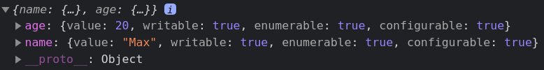

# Descriptors and Accessors

- [Descriptors and Accessors](#descriptors-and-accessors)
	- [Links](#links)
	- [Utility methods](#utility-methods)
		- [`Object.getOwnPropertyDescriptors (obj)`](#objectgetownpropertydescriptors-obj)
		- [`Object.defineProperties (obj, props)`](#objectdefineproperties-obj-props)
	- [Getters and Setters](#getters-and-setters)

---

## Links

1. [Learn](https://learn.javascript.ru/property-accessors)
2. [MDN set](https://developer.mozilla.org/en-US/docs/Web/JavaScript/Reference/Functions/set)

---

## Utility methods

Let's learn some methods that will help us with this topic.

### `Object.getOwnPropertyDescriptors (obj)`

1. [MDN](https://developer.mozilla.org/en-US/docs/Web/JavaScript/Reference/Global_Objects/Object/getOwnPropertyDescriptor)

Returns an object describing properties of the given object. There's also a singular `getOwnPropertyDescriptor` version.

```js
const user = {
	name: 'Max',
	age: 20
}

const descriptors = Object.getOwnPropertyDescriptors(user)
// And a singular version
// const descriptor = Object.getOwnPropertyDescriptor(user, 'age')

console.log(descriptors)
```



Descriptor is an object with 1 value field and 3 flags:

- `value: any`
- `writable: boolean` - is it allowed to rewrite the value?
- `enumerable: boolean` - will this property appear during the iteration (`for..in`, `...`) ?
- `configurable: boolean` - is it allowed to change these 4 fields using `setProperty`? Also, is it deletable using the `delete` operator?

---

### `Object.defineProperties (obj, props)`

1. [MDN](https://developer.mozilla.org/en-US/docs/Web/JavaScript/Reference/Global_Objects/Object/defineProperties)

You can set new properties and descriptors on objects. There's also a singular `defineProperty` version.

**NB**: the **props** argument is exactly the object returned by `Object.getOwnPropertyDescriptors` method, **not just key-values**.

Default values of 3 descriptor flags (`enumerable`, `writable`, `configurable`) are **different** depending on how the property was defined:

- Using `defineProperty / defineProperties`: 3 descriptor flags **default to `false`**
- Using the usual declarative way (`const user = { ... }` or `user.age = 20`): 3 descriptor flags **default to `true`**

```js
const user = { name: 'Max' }

Object.defineProperties(user, {
	age: {
		value: 20,
		enumerable: true,
		writable: true,
		configurable: true
	},
	sex: {
		value: 'male'
	}
})

console.log(user)

for (const key in user) {
	console.log(key)
}
// `name, age` but no `sex` :(

// We can still read it directly
console.log(user.sex) // male

// But we cannot change it since it's non-writable
user.sex = 'female'
console.log(user.sex) // still `male`

// We can change `age` with no problem, though, because it's `writable: true`
user.age = 22
console.log(user.age)

// And since `sex` is non-configurable, we cannot modify its descriptor to make it `enumerable` or `writable`
Object.defineProperty(user, 'sex', {
	enumerable: true,
	writable: true,
	configurable: true
})
// TypeError: can't redefine non-configurable property
```

---

## Getters and Setters

Getters and Setters (also called Accessors) - are hidden functions under the usual properties.

You can work with such an Accessor property as usual (without parantheses). But inside they are bound to handlers that are called during reading or writing to these properties.

- Getters:
  - Receive 0 arguments
  - Return some value that will be returned when we try to read our Accessor property
- Setters:
  - Receive 1 argument (value to set)
  - Set the processed value for storage. Aren't expected to return anything.
- Accessors in general:
  - You can have a Getter, a Setter or both. Skipping Setter means the value cannot be changed, skipping Getter means the value cannot be read.
  - More than 1 Getter or Setter is forbidden.
  - Having an Accessor (`get`/`set`) and a Data (`value`) property of the same name is forbidden.

```js
const user = {
	name: 'John',
	surname: 'Smith',

	get fullName() {
		return this.name + ' ' + this.surname
	},
	set fullName(value) {
		;[this.name, this.surname] = value.split(' ')
	}
}

console.log(user.fullName) // John Smith
user.fullName = 'Max Bar'
console.log(user.fullName) // Max Bar
```

They can also be set using `defineProperty`:

```js
const user = {
	name: 'John',
	surname: 'Smith'
}

Object.defineProperty(user, 'fullName', {
	get() {
		return `${this.name} ${this.surname}`
	},
	set(value) {
		;[this.name, this.surname] = value.split(' ')
	}
})

console.log(user.fullName) // John Smith
```

---

Remember that your property can't be an Accessor and a Data property at the same time:

```js
Object.defineProperty(user, 'fullName', {
	get() {
		return `${this.name} ${this.surname}`
	},
	set(value) {
		;[this.name, this.surname] = value.split(' ')
	},
	writable: true	// TypeError
	value: 'John Smith' // TypeError
})
```

---

We can use accessors to make more complex properties:

```js
const user = {
	get name() {
		return this._name
	},
	set name(value) {
		if (value.length < 4) {
			console.log('Too short name')
			return
		}
		this._name = value
	}
}

user.name = 'Max' // `Too short name`
user.name = 'Maxim'
console.log(user.name) // `Maxim`

// We can still access `_name` after it's set ...
console.log(user._name) // `Maxim`
// ... but there's a convention not to do that
```

---

We can forbid changing `_name` declaratively (but it's still be possible using `defineProperty` as we left this way open):

```js
const user = {}

Object.defineProperties(user, {
	_name: {
		configurable: true // to allow to define properties in setter, the rest of flags should be false
	},
	name: {
		enumerable: true,
		get() {
			return this._name
		},
		set(value) {
			Object.defineProperty(this, '_name', {
				value
			})
		}
	}
})

user._name = 'Max' // Didn't work
console.log(user.name) // undefined

user.name = 'Max' // Worked
console.log(user.name) // 'Max'
```

---

We can use accessors to change a Data property to an Accessor.

E.g. we want to provide a birthdate instead of age. But we don't want to break the existing age functionality.

```js
class User {
	constructor({ name, birthday }) {
		this.name = name
		this.birthday = birthday
	}
}

Object.defineProperty(User.prototype, 'age', {
	get() {
		// we have only getter, no setter, so it's impossible to change 'age' directly
		const start = new Date(1970, 0, 1)
		const fullAge = Date.now() - this.birthday // in ms
		const msSinceStart = fullAge - start
		return new Date(msSinceStart).getFullYear() - start.getFullYear() // Not precise, needs correction for leap years, otherwise 1 day mistake is possible. Use existing solutions in the real project
	},
	configurable: true
})

const max = new User({ name: 'John', birthday: new Date(1992, 10, 18) })
console.log(max.age) // 28
```

So we can still get `age` - even if it's not there directly.

---

A **lazy** getter calculates its value once and then just reads it without further calculation (useful for resources economy in case if the value is not expected to change).

```js
const user = {
	get id() {
		const id = Math.floor(Math.random() * 100 + 1)

		// In the 1st call, our prop is redefined to simply store our value and being unable to change it. The subsequent calls will just read it as a regular property
		Object.defineProperty(this, 'id', {
			value: id
		})

		return id
	}
}

// Values are the same as our prop is only generated once
console.log(user.id)
console.log(user.id)
```
